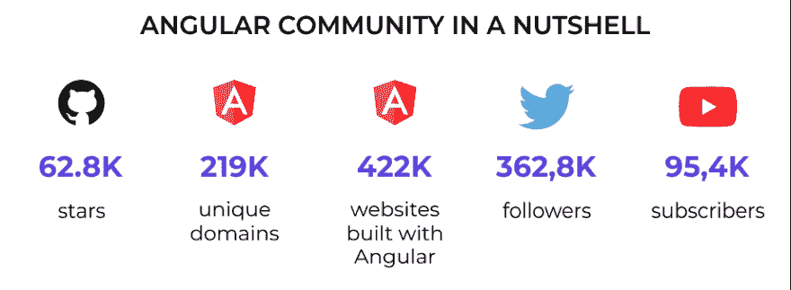

# 下一个 Web 开发项目需要 Angular 的主要原因

> 原文：<https://javascript.plainenglish.io/top-reasons-why-you-need-angular-for-your-next-web-development-project-fd5ccea68f23?source=collection_archive---------3----------------------->

## **2022 年的一个 web 开发项目，为什么选择 Angular？**

在这样一个不确定的时代，企业迅速关闭，跨国公司裁员，经济在劫难逃——一个这样的数字平台正在见证比以往任何时候都更迅猛的增长。

因此，无论您是一家初创企业还是领先企业，都在努力创建一个超高效的数字存在，那么您最关心的是了解您需要什么技术来创建一个具有所有这些尖端功能的健壮应用程序…

在所有这些技术中有**角** …

不管你相不相信，Angular 仍然是前端 JavaScript 框架世界中最成熟的名字。你不需要相信我们的话，这里有一瞥 Angular 的受欢迎程度..

([Image Source](https://res.cloudinary.com/practicaldev/image/fetch/s--9Zu-g3nG--/c_limit%2Cf_auto%2Cfl_progressive%2Cq_auto%2Cw_880/https://2muchcoffee.com/blog/content/images/2020/07/Angular-versions-over-time---Angular-Community-in-a-nutshell.png))

根据最新的调查报告，Angular 在 Github 上拥有 78.7k 颗星星，219k 个唯一域名，362,8k 名 Twitter 粉丝和 95.4k 名 Youtube 订户。庞大的统计数据足以清楚地理解 Angular 在 web 开发中的受欢迎程度和全球接受程度。

此外，[有 4128933 个网站使用 AngularJS](https://trends.builtwith.com/javascript/Angular-JS) ，其中 1207123 个网站处于活跃状态。

但其中一个核心问题是，是什么让 Angular 如此受许多 web 开发人员的喜爱、满意和喜爱。

*这个博客将解释一切，从基线概念到 2022 年选择 Angular 进行 web 开发的原因…*

## **了解 Angular 及其从 Angular1 到 Angular12 的历程**

Angular 以 web 开发而闻名于世，但是如果您是这个框架的新手，并且想知道它将如何帮助您构建一个成功的健壮的解决方案，那么这里是 Angular 的基线。

Angular 是谷歌早在 2009 年创建的最受欢迎的前端框架，用于开发高响应性的网页和应用程序。基于 JavaScript 的 TypeScript 编程语言，它易于使用，提供了高度的灵活性，简化了整个开发过程，并且支持 JavaScript 的最新标准(ES6)。多年来，它已经从 Angular.js 1 改进到 Angular 12，并通过其引人注目的功能(包括 RESTful API 处理、依赖注入、AJAX 处理、模块化、双向绑定等)成为创建交互式动态单页面应用程序(spa)的最佳工具。

应用程序开发人员可以使用 HTML 作为模板语言，甚至可以扩展 HTML 语法来轻松传达应用程序的组件。另外，你不需要依赖第三方库，用 Angular 构建一个动态应用。如果您仍然想知道为什么 web 开发对 Angular 的需求越来越大，那么您需要看一下从 Angular.js 1 到 Angular 12 的历程，它是如何逐年更新并增强社区能力的。

*   *angular . js1(2010 年推出):介绍这个框架*
*   *Angular 2(2016 年推出):引入 Javascript*
*   *Angular 4(2016 年 12 月推出):减少束尺寸*
*   *Angular 5(2017 年推出):提高*效率的附加功能
*   *Angular 6(2018 年 5 月推出):引入广泛的功能选择，完善框架*
*   *Angular 7(2018 年推出):虚拟滚动、拖拽、应用性能*
*   *Angular 9(2020 年推出):默认 Agular Ivy 编译器*
*   *Angular 11(2020 年推出):增强更快构建和加载的能力*
*   *Angular 12(2021 年推出):增加款式改进*

简而言之，所有这些改进使得这个框架比以往任何时候都更加强大。而专业开发人员可以很容易理解利用这种结构框架的价值，因为它与其他现有的开发框架没有什么不同。但是在你雇佣一家 [**网络开发公司**](https://www.xicom.biz/services/web-development/) 来启动你的项目之前，你的首要问题必须是“为什么使用 Angular 进行网络开发？与其到处检查，不如看看它受欢迎背后的某些原因，这些原因使它成为 web 应用程序开发的首选..

[Image Source](https://w3techs.com/technologies/details/js-angularjs)

以下是 2022 年下一个开发项目应该选择 Angular 的原因…

# 为什么要选择 Angular Framework 来开发下一个 Web 开发项目？

现在，您已经对 Angular 及其主要亮点有了基本的了解，您一定很想知道它是如何为企业提供一个优秀的开发项目选择的。让我们深入探讨一下选择 Angular 框架进行 web 开发的原因。

## **简单学习、评估和测试角度能力**

Angular framework 基于 JavaScript 的 TypeScript 编程语言，即使具备 JavaScript、HTML 和 CSS 的基础知识，人们也可以轻松学会。由于它简单易学，因此，它为开发人员进入 web 开发项目提供了更多的机会。

Angular 的不同属性实际上有助于开发人员编写更简洁的代码，并降低导致不必要的发布延迟和提高开发成本的风险。此外，一致的编码可以使您的站点更易于使用，并允许开发人员使用模板和预定义的代码片段。

由于 Angular Framework 基于以相同样式开始的组件，因此，所有组件都是相互独立的小界面元素，并为您提供了几个好处，包括:

*   **简化测试:**这些组件相互独立，使得单元测试更加容易、快速和简单。
*   **提高代码的可读性:**对于正在进行的项目中的新开发人员来说，代码的一致性使得代码阅读变得简单得多。这总体上提高了开发的生产率和开发效率。

## **自动同步与双向数据绑定**

与其他提供单向数据绑定的框架不同，Angular 框架提供双向数据绑定，当模型中的数据发生变化时，它会自动更新视图，反之亦然。当你 [**雇佣一个网络开发人员**](https://www.xicom.biz/offerings/hire-web-developers/) 时，你就不需要担心跟踪所有的变量，因为 Angular 会自动处理它。每当数据发生变化或修改时，模型和视图都会自动实时更新。

这个特性使得 Angular 成为构建大型应用程序的绝佳选择，因为双向数据绑定减少了手工管理所有变量状态的需要，并提高了开发效率。

## **Bug 修复和测试企业级 Web 应用**

在这个技术驱动的时代，成千上万的替代品一个接一个地出现，没有人希望被困在一个有漏洞的网络应用程序或网站上。无论你是一家初创企业还是领先企业，在开发强大的解决方案时，应用性能都是最重要的优先事项之一。

Angular 具有企业级测试特性，这使它成为大型高性能项目的良好选择。有了最新版本的 Angular framework，开发人员可以解决编译器中的问题，修复 bug 等等。他们所需要的就是按照 TESTBED 命令来修复错误。

选择 Angular 来开发交互式网页是一个有价值的决定，特别是当你有截止日期或者你需要更快地推广你的应用时。

## **简化的 MVC(模型-视图-控制器)模式**

由于 Angular 框架嵌入了原始的 MVC 软件架构设置，因此，您可以更容易地使用网络应用程序。相反，要求开发人员将应用程序分成不同的 MVC 组件，并构建一个可以进一步统一的代码，Angular 将模型与视图分开，并处理各种数据绑定。

无论应用程序开发需求有多复杂，Angular 仍然是软件开发公司的首选框架，因为它消除了不必要的代码需求。它包含了简化的 MVC 架构，这无疑使代码编写变得容易。总之，这使得它成为开发大型项目的合适选择，因为它大大简化了开发过程，加快了应用程序测试。

## **通过快速加载增强应用性能**

理想情况下，一个网页应该在 3 秒钟内加载，大多数知名网页甚至在不到 2 秒钟内加载。重要的是你在应用程序中使用了什么组件，以及你用什么技术来构建它。但是从应用程序所有者的角度来说，他们总是关注应用程序的性能，而 Angular 基本上是通过记住应用程序的性能来设计的。

其快速高效的功能使其成为高流量和面向公众的网站的绝佳选择。此外，Angular 的性能优化使其成为开发人员的理想选择。

## **默认常春藤渲染器**

IVY Renderer 功能于 2018 年与 Angular 6 一起提供，作为高度优化的捆绑包大小和更快的组件加载。该功能会自动将应用程序的模板和组件翻译成 JavaScript 代码。此外，有了 Ivy Renderer，企业可以获得无与伦比的代码调试和用户友好的应用程序体验。

由于这个特性使得 Angular 更容易访问，并通过减少文件大小来设置实例，因此，这个框架似乎是一个功能丰富的应用程序开发平台。

## **由谷歌支持，卓越的社区支持**

开发网页最大的问题是选择有前途的技术。Angular 最惊人的特点是，它得到了谷歌的支持，确保了对 Angular 的长期支持，并能够进一步扩大生态系统。

在谷歌的支持下，Angular 被认为是应用程序开发人员最可靠和最支持的框架。在你想到 [**雇佣移动应用开发者**](https://www.xicom.biz/offerings/hire-mobile-developers/) 之前，你需要明白谷歌提供的网络工具包允许开发者创建独特且用户友好的网页，最终为企业增加价值。

其次，它拥有来自核心开发团队两个部门以及那些执行一些修复或建议改进的人的优秀社区支持。

除此之外，对于 Angular 开发者来说，市场上有很多在线指南和资源。这反映出，在这个社区的支持下，工程师可以轻松地处理生产。

总而言之，这就是 Angular 成为 web 应用程序开发首选的几个主要原因。了解了这些原因后，你们中的许多人想知道使用 Angular 框架到底能构建什么，或者什么时候会用到它？

# **什么时候应该用 Angular 框架，谁用 Angular？**

毫无疑问，这个框架具有广泛的特性和兼容性，可以用于开发大量可供选择的开发项目。然而，在你 [**雇佣一个 web 应用开发者**](https://www.xicom.biz/offerings/hire-web-developers/) 之前，你们中的许多人都想知道什么时候应该使用 Angular，以及用这个框架可以处理什么类型的开发项目。在你做任何决定或陷入困境之前，你需要先睹为快。这是你疑惑的答案…

**企业 Web 应用开发**

随着数字化的日益繁荣，全球企业都希望拥有一个强大的企业 web 应用程序，为他们的业务增加竞争优势。但另一方面，它的开发时间、成本和 app 的性能是最大的担忧。但是 Angular 将是 web 应用程序开发的完美选择。

使用 Angular 开发应用程序是高度优化的，以客户为中心，以业务为中心，这反过来有助于促进业务增长。

> **为企业带来的利益:**

*   轻松的应用维护
*   代码一致性和可重用性
*   导航功能的改进
*   自动完成
*   快速重装和高性能
*   易于测试和修复错误

**渐进式网络应用开发(PWA)**

想象一下你在一个没有网络连接的地方。如果尽管有一个包罗万象的应用程序，听起来足够好，但你仍然无法在离线时使用它，该怎么办？换句话说，如果你失去连接，你的应用程序将面临严重的停顿…

为了升级这个问题，渐进式 web 应用程序开发是现代社会的新趋势。凭借在无网络区域提供流畅用户体验的能力，PWA 采用了现有的浏览器技术，并使您的网页能够在同一设备上工作。基本上，它利用服务工作者，他们就像代理一样截取网络请求，缓存响应，并使其在离线模式下也能工作。

现在的中心问题是谁已经使用这个框架进行应用程序开发了？

## **用 AngularJs 框架搭建的热门 app 有哪些？**

而来自世界各地的许多组织已经认识到这一框架的生产特性，并构建了一个确保出色用户体验的应用程序。因此，使用这个框架，这里有几个流行的应用程序，确保高；y 响应和互动网页:

*   网飞
*   贝宝
*   自由记者
*   向上工作
*   油管（国外视频网站）
*   iStock
*   乐高牌塑料锁定式积木

***如果你也对 Angular 的出色功能印象深刻，并准备构建一个应用程序，但不确定它的成本，那么你可以向专家预订一个免费的咨询时段。***

# **结论**

希望这篇博客指南已经向您详细解释了为什么 Angular 框架在编码领域如此受欢迎。凭借其出色的特性，Angular 无疑是未来该框架的完美选择，但通过雇佣一家 [**web 应用程序开发公司**](https://www.xicom.biz/services/web-development/) ，您可以利用该框架的特性和兼容性，构建一个响应迅速、质量无与伦比的网页。无论你是一家初创公司还是领先的企业家，使用 Angular 创建企业级应用程序都是一个值得的决定，特别是对于前端开发，因为它提供了出色的稳定性。

=====================================

*更多内容看* [***说白了。*** *报名参加我们的*](http://plainenglish.io/)*[***免费每周简讯***](http://newsletter.plainenglish.io/) ***。*** *在我们的**[***社区不和谐***](https://discord.gg/GtDtUAvyhW) ***中获得独家写作机会和建议。*****