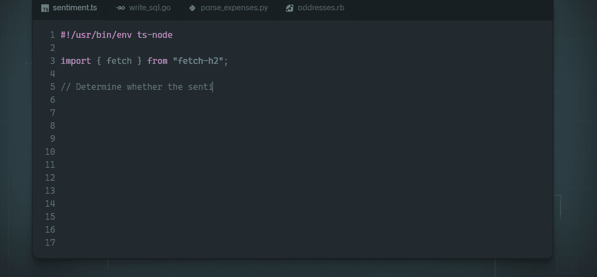
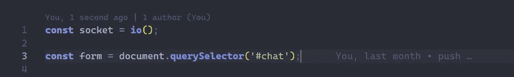
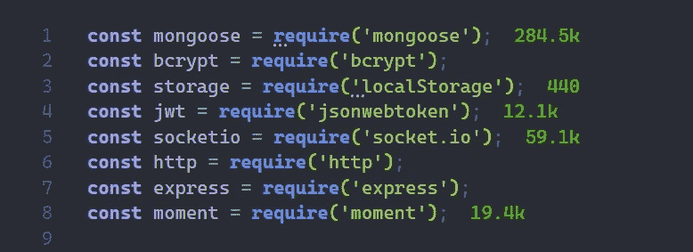
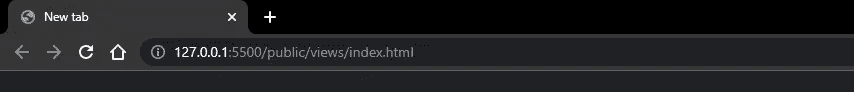
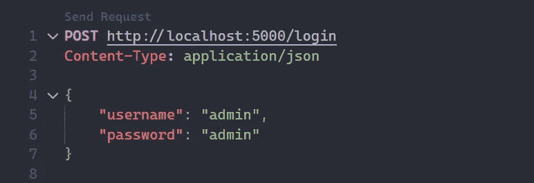
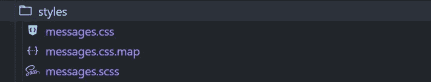

# 2022 年顶级 VS 代码扩展

> 原文：<https://javascript.plainenglish.io/top-vs-code-extensions-in-2022-e2c617033857?source=collection_archive---------3----------------------->

## VS 代码

## 您作为开发人员在 2022 年可以使用的最有用的 VS 代码扩展列表


Photo by [Mohammad Rahmani](https://unsplash.com/@afgprogrammer?utm_source=medium&utm_medium=referral) on [Unsplash](https://unsplash.com?utm_source=medium&utm_medium=referral)

VS 代码市场中有扩展功能，可以提高和加快您的工作效率。它们充满了快捷方式、弹出文本、主题、图标、实时服务器等等，所以这些对正确使用它们的开发者有很大帮助。考虑到这些关键点，我列出了 VS 代码中最有用的扩展。

## [#1 GitHub 副驾驶](https://marketplace.visualstudio.com/items?itemName=GitHub.copilot)

GitHub Copilot 是一种人工智能，它将帮助您的代码更加正确和精确。Copilot 可以为您编写代码范围、功能、条件，几乎所有的内容都只基于一行注释。



examples of what can GitHub Copilot generate

虽然 GitHub Copilot 现在是免费的，但是你必须和成千上万的其他开发者一起加入等待名单才能进入。在技术预览期间，访问仅限于一小部分测试人员。我已经等了 3 个月才进去，但是其他人可能会比我快得多。

Copilot 甚至可以用来代替您编写一个完整的项目，但是软件的创建是为了帮助您完成代码或者让您体验新的解决方案。所以，我建议只把它作为一个辅助工具。

## [#2 Git 镜头](https://marketplace.visualstudio.com/items?itemName=eamodio.gitlens)

顾名思义，Git lens 是对使用 Git 将代码提交/推入第三方网站的项目的扩展。这个扩展简单地告诉了每个文件的顶部和每一行最后一次提交是什么时候在这里执行的，以及关于提交的一些其他信息(提交是什么时候进行的，提交到哪个分支和提交名称)。



git lens showing commit information

提交历史也是这个扩展可以很容易做到的事情，在浏览它的时候，你可以比较各个提交，非常清楚地看到它们之间的变化。

## [#3 进口成本](https://marketplace.visualstudio.com/items?itemName=wix.vscode-import-cost)

导入成本是一个非常简单的文本扩展，它只有一项工作——它会让您知道导入的模块占用了多少空间。您可以为这个扩展创建您自己的配色方案，例如，存储范围，其中一个模块将被视为非常小、中等和巨大，并有相应的颜色。您也可以选择要显示的捆大小类型-`minified`、`compressed` 或`both`。



compressed bundle size of node.js packages

## [#4 Live 服务器](https://marketplace.visualstudio.com/items?itemName=ritwickdey.LiveServer)

Live server 是前端开发的一个扩展，它可以创建一个 live server，每当您对项目目录进行更改时，它都会重新启动，并刷新网站以立即看到这些更改。

你所要做的就是在你的根 HTML 文件上右击你的目录，选择`Open with Live Server`或者在那个文件中按下`Alt+L Alt+O`。之后，扩展将在端口 5500 上打开一个本地主机服务器，其内容在`http://127.0.0.1:5500`上。包括主机端口在内的一切都可以在扩展设置中更改。



localhost on port 5500 with its content

## [#5 Quokka.js](https://marketplace.visualstudio.com/items?itemName=WallabyJs.quokka-vscode)

js 是一个用于快速 JavaScript/TypeScript 原型化、调试和测试的生产力提升工具。Quokka 可以显示来自变量、`console.log`或来自 IDE 中的函数的值，就在启动器旁边，这可以极大地改善和加快开发过程。可悲的是，Quokka 在一段时间后就不能免费使用这项功能了，你必须为他们的专业版付费。


quokka.js example

## [#6 休息客户端](https://marketplace.visualstudio.com/items?itemName=humao.rest-client)

REST client 是一个扩展，允许您向端点发送带有内容类型、授权或其他类型数据的定制请求，并从请求中获取信息。这个扩展正在慢慢取代像 Postman 这样的网站工具。为了发送请求，您必须在您的项目目录中创建一个以`.rest`结尾的文件。这些请求的语法如下，例如`{request-type} {destination}`:

```
**POST** http://localhost:5000/login
```

然后，您可以通过键入`Content-Type: application/json`来添加内容类型。如果您想在请求中发送任何数据，您需要在请求和数据之间留出一行空间，并使用数据创建一个 JSON 对象，下面是完整请求的一个示例:



example of a REST request

之后你所要做的就是按下`send request`，请求将在 IDE 的另一个窗口中执行。

## [#7 实时 sass 编译器](https://marketplace.visualstudio.com/items?itemName=ritwickdey.live-sass)

Live sass 编译器是 SCSS 语言的一个相当简单的扩展，它将获取以`.scss`结尾的已创建文件，并将它们转录成一个普通的`.css`文件。安装完软件包后，工具栏上会出现一个新按钮，上面写着`Watch sass`，如果你点击它，转录就会开始。



project’s directory with one .scss file transcripted into a .css file

## **结论**

我之前给你展示的所有扩展都是你在 2022 年作为一个开发者可能在 VS 代码中使用的最有用的工具，希望你会在你的开发之旅中明智地使用它们。

*更多内容请看*[***plain English . io***](https://plainenglish.io/)*。报名参加我们的* [***免费周报***](http://newsletter.plainenglish.io/) *。关注我们关于*[***Twitter***](https://twitter.com/inPlainEngHQ)*和*[***LinkedIn***](https://www.linkedin.com/company/inplainenglish/)*。加入我们的* [***社区不和谐***](https://discord.gg/GtDtUAvyhW) *。*