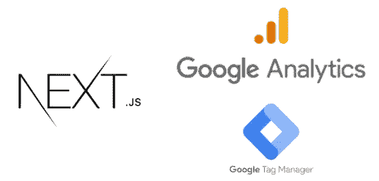
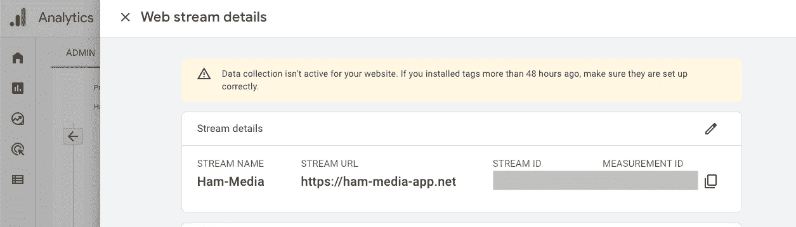
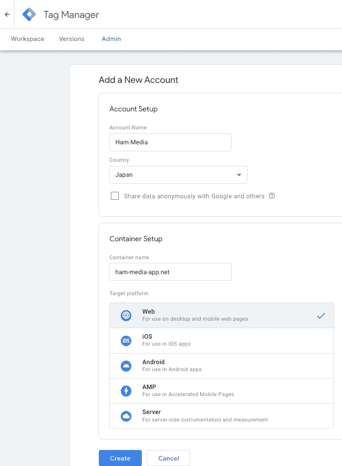
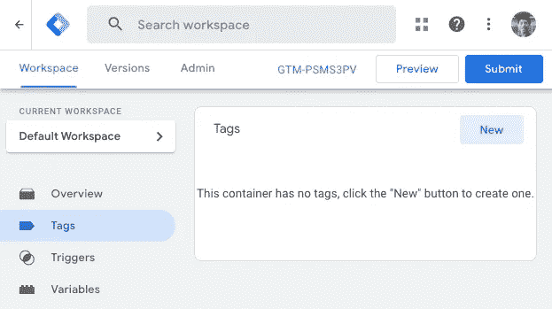
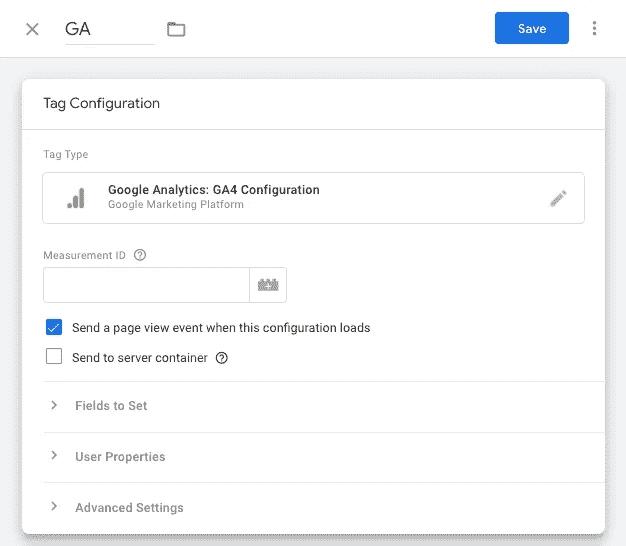
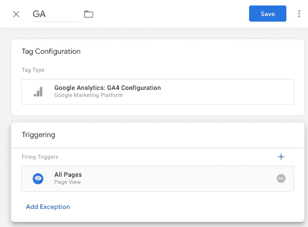
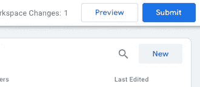
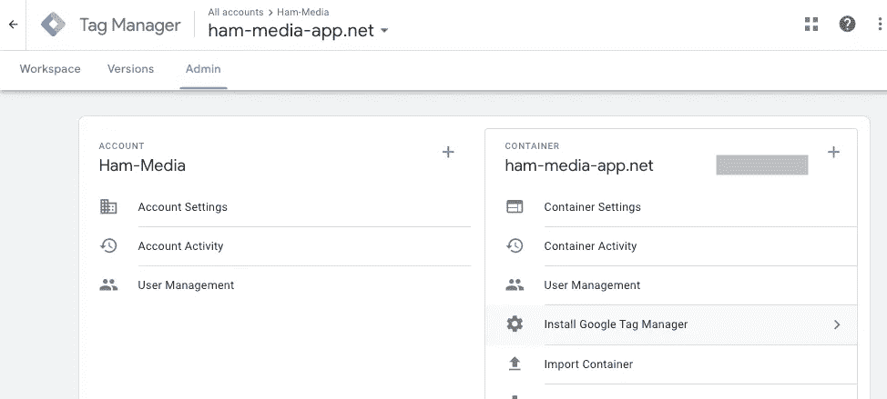
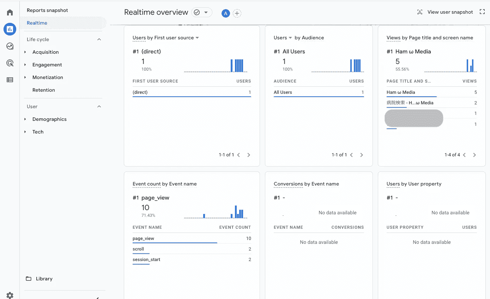

# 使用谷歌分析和谷歌标签管理器跟踪 Next.js 的页面视图

> 原文：<https://javascript.plainenglish.io/track-page-view-of-next-js-with-google-analytic-and-google-tag-manager-a8e1e9d04651?source=collection_archive---------2----------------------->

## 关于如何设置 Next.js，Google Analytics & Google Tag Manager 的教程。



The combination of GA and GTM simplifies Next.js page view tracking

为了提高网站速度和逻辑，谷歌分析(GA)已经使用了很长时间。然而，由于单页面应用程序(SPA)在初始加载时只发送一个请求，GA 无法正确跟踪页面浏览量。为了正确跟踪所有的页面视图，我们需要一个额外的设置，这很耗时…

但是，有了 Next.js、GA、Google Tag Manager (GTM)，只有我们需要做正常的设置。所以这篇文章解释了如何设置 Next.js 和 GA 以及 GTM。

# 谷歌分析和谷歌标签管理器

首先，让我们澄清 GA 和 GTM。

*   GA 是一个创建页面活动报告的分析工具。例如，GA 跟踪页面浏览量，以及用户在页面上停留的时间。为了跟踪数据，我们需要在网站上嵌入标签。它向 GA 发送请求并创建报告。意思是定制 GA 就是定制 tag 而已。
*   GTM 是一个标签管理器。我们唯一要做的就是定义标签在 GTM 控制台上触发的规则。有了 GTM，我们不需要改变实际代码来嵌入标签。

有些人可能意识到为什么需要 GTM 来正确跟踪页面。因为 SPA 页面转换是通过浏览器上的历史更改完成的，而无需向服务器发送请求，所以我们可以定义一个规则，让标签在历史更改时触发！

# 设置

到目前为止，我们已经理解了跟踪页面浏览量的逻辑。我们来实施吧。

1.  创建 GA 帐户
2.  创建 GTM 帐户和规则
3.  用代码片段安装 GTM

## 创建 GA 帐户

要建立 GTM，我们需要 GA `MEASUREMENT ID`。所以要先设置 GA。要设置 GA， [Google 官方文档](https://support.google.com/analytics/answer/9304153?hl=en&ref_topic=9303319#zippy=%2Cweb)是最好的选择。所以请跟着做，弄个`MEASUREMENT ID`。



GA measurement id

`https://ham-media-app.net`是我这边的项目域。请用您的域名替换它。

## 创建 GTM 帐户和规则

请到 [GTM 控制台](https://tagmanager.google.com/#/home)创建一个 GTM 账户，如下所示:



GTM account setup

`Account Name`可能是任何事情。对于`Container name`，我们应该指定主机地址。好了，我们现在已经在 GTM 中创建了一个帐户。🎉

从这里开始，让我们创建一个规则，在发生页面转换时跟踪页面视图。转到`Tags`并按下`New`。



为了跟踪页面浏览量，我们需要一个 GA。所以，`Tag Configuration`应该在下面。对于`Measurement ID`，请填写您在 GA 设置中获得的`MEASUREMENT ID`。



而`Triggering`就是`All Pages`。



我们可以在 GTM 中创建第一个规则！别忘了按下 GTM 控制台右上方的`Submit`来发布。



## 用代码片段安装 GTM

正如 [GTM 的官方文档](https://support.google.com/tagmanager/answer/6103696?hl=en)所说，我们应该放置 2 种类型的代码片段。

1.  `<script>`标签在`<head>`
2.  `<noscript>`标签在`<body>`上面

代码片段可以在 GTM 控制台中找到。请打开`Admin`标签和`install Google Tag Manager`。



因为`<script>` snippet 有一个 GTM 的初始化脚本，所以必须在浏览器中执行。此外，它必须包含在所有网页上。因此`<script>`片段应该放在`_app.tsx`中，如下所示:

```
// pages/_app.tsx
import GoogleTagManger from "../components/GoogleTagManager";
import { GOOGLE_TAG_MANAGER_ID } from "../libs/googleTagManager";const App: FC = ({ Component, pageProps }) => 
  <>
    <GoogleTagManger />
    <Component {...pageProps} />
  </>// components/GoogleTagManager.tsx
import Script from 'next/script';type Props = {
  containerId?: string;
};const GoogleTagManager: FC<Props> = ({ containerId }) =>
  containerId ? (
   <Script
    id="googleTagManager"
    strategy="afterInteractive"
    dangerouslySetInnerHTML={{
      __html: `
      (function(w,d,s,l,i){w[l]=w[l]||[];w[l].push({'gtm.start':
      new Date().getTime(),event:'gtm.js'});var
      f=d.getElementsByTagName(s)[0],
      j=d.createElement(s),dl=l!='dataLayer'?'&l='+l:'';j.async=true;j.src=
      'https://www.googletagmanager.com/gtm.js
      id='+i+dl;f.parentNode.insertBefore(j,f);
      })(window,document,'script','dataLayer', '${containerId}');
      `,
    }}
  />) : null;export { GoogleTagManager };// libs/googleTagManager.ts
export const GOOGLE_TAG_MANAGER_ID = process.env["NEXT_PUBLIC_GOOGLE_TAG_MANAGER_ID"];
```

第二个代码段必须紧接在所有页面的`<Body>`标签之后。所以我们可以像下面这样使用 Next.js 的[自定义文档](https://nextjs.org/docs/advanced-features/custom-document)功能:

```
// pages/_document.tsx
import { Html, Head, Main, NextScript } from 'next/document';
import { GOOGLE_TAG_MANAGER_ID } from "../libs/googleTagManager";const Document = () => (
  <Html>
    <Head />
    <body>
      <noscript>
        <iframe
          src={`https://www.googletagmanager.com/ns.html?id=${GOOGLE_TAG_MANAGER_ID}`}
          height="0"
          width="0"
          title="googleTagManagerNoScript"
          style={{
            display: 'none',
            visibility: 'hidden',
          }}
        />
      </noscript>
      <Main />
      <NextScript />
    </body>
  </Html>
);export default Document;
```

如果设置正确，让我们检查一下！实际上，我的网站既有静态生成页面(面向最终用户)，也有客户端渲染页面(面向内部管理)。并且两种类型页面的浏览量都被成功跟踪如下:🎉



本文解释了如何使用 GA 和 GTM 跟踪 Next.js 应用程序的页面视图。因为 GTM 可以设置历史变化触发器，所以无需任何定制就可以跟踪页面视图！

# 参考

*   [Next.js](https://nextjs.org/)
*   [谷歌标签管理器](https://marketingplatform.google.com/about/tag-manager/)
*   [谷歌分析](https://marketingplatform.google.com/about/analytics/)

*更多内容请看*[***plain English . io***](https://plainenglish.io/)*。报名参加我们的* [***免费周报***](http://newsletter.plainenglish.io/) *。关注我们关于*[***Twitter***](https://twitter.com/inPlainEngHQ)*和*[***LinkedIn***](https://www.linkedin.com/company/inplainenglish/)*。查看我们的* [***社区不和谐***](https://discord.gg/GtDtUAvyhW) *加入我们的* [***人才集体***](https://inplainenglish.pallet.com/talent/welcome) *。*