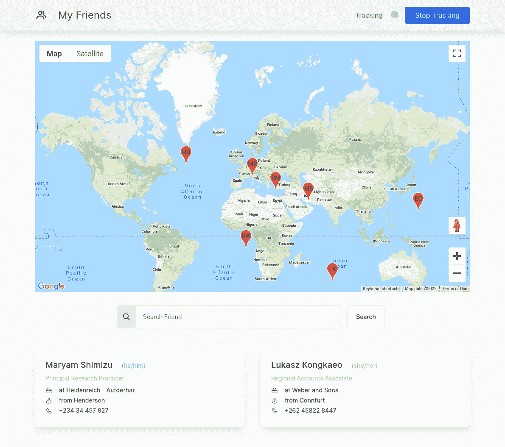

# 使用 Angular 在谷歌地图上追踪您的朋友

> 原文：<https://javascript.plainenglish.io/track-your-friends-on-google-map-with-angular-9e8dd9f17f1b?source=collection_archive---------8----------------------->

*使用谷歌的 JavaScript map SDK 在谷歌地图上显示朋友的地理位置，无需任何第三方包装库。*



Angular 社区提供了几个谷歌地图和开放的街道地图包装器，其中一个来自 Angular 的内部团队。然而，在本文中，我将演示如何使用 Google 提供的原始库，即 [Maps Javascript API](https://developers.google.com/maps/documentation/javascript/examples) 。所以，让我们开始吧！

# 假后端

为了获得朋友的地理位置，我们将利用一个使用 Express 构建的假后端。当然，如果你有一个合适的地理定位源，你可以在任何时候用你的真实数据切换后端。

## 后端:步骤 1

初始化 Express server 项目。您可以简单地从`npm init -y`开始，它将创建节点项目。接下来，安装所需的依赖项:

```
npm i express @ngneat/falso cors
```

修改`package.json`的脚本部分。这个命令将启动我们的服务器。

```
"scripts": {
  "start": "node server.js"
}
```

## 后端:步骤 2

现在在项目根目录下创建一个空的`server.js`文件，并编写逻辑来制作假数据:

因为为了简单起见，我们不使用任何数据库，所以我们的后端生成一些`friend`对象，并将它们写入一个 JSON 文件。之后，一个区间函数遍历这些`friend`对象，每隔 5 秒稍微改变位置属性，以模拟朋友在地图上的移动。后端也有非常简单的搜索和分页功能。

为了测试 API，使用`npm start`启动服务器，并使用浏览器或 postman 客户端向`http://localhost:3000/friends`发送请求。如果你收到如下的回复，那么一切都解决了！

```
HTTP/1.1 200 OK
X-Powered-By: Express
Access-Control-Allow-Origin: *
Content-Type: application/json; charset=utf-8
Content-Length: 2192
ETag: W/"890-/evxYHyMzivStHl52PNaAaZTmX4"
Date: Sun, 30 Jan 2022 04:25:47 GMT
Connection: close[
  {
    "firstName": "Abdul",
    "lastName": "Andreev",
    "city": "West Lucy",
    "phone": "+49(877)22 72",
    "gender": "male",
    "jobTitle": "Corporate Analyst",
    "company": "Jenkins - Turcotte",
    "location": {
      "lat": 14.857,
      "lng": -180.431
    }
  },
// ... more entries 
]
```

# 前端

既然我们的后端已经完成，让我们把重点放在前端。为此，我们使用 Angular v13.2.0 和 TailwindCSS。我假设你对 Angular 有一些了解，所以我将跳过一些常见的任务，比如如何创建项目、组件、服务等等。如果你是 Angular 的新手，请事先遵循官方的入门指南。

## 前端:步骤 1(设置)

使用您喜欢的方法生成角度项目；通常通过 ng CLI 命令`ng new <project-name>`。搭建完成后，安装更多必需的依赖项:

```
npm i [@googlemaps/js-api-loader](http://twitter.com/googlemaps/js-api-loader) [@googlemaps/markerclusterer](http://twitter.com/googlemaps/markerclusterer) tailwindcss
```

和开发依赖关系:

```
npm i -D [@types/google](http://twitter.com/types/google).maps [@types/supercluster](http://twitter.com/types/supercluster)
```

为了消除一些编译错误，需要修改`tsconfig.ts` & `tsconfig.app.ts`文件，如下所示:

```
// tsconfig.ts
"compilerOptions": {
  ...
  "allowSyntheticDefaultImports": true
}// tsconfig.app.ts
"compilerOptions": {
  ...
  "types": ["google.maps"]
}
```

另外，在[正式文档](https://tailwindcss.com/docs/guides/angular)之后添加一个`tailwind.config.js`文件和 tailwind 指令到全局样式。

## 前端:步骤 2(模型和服务)

添加`Friend`接口。*(提醒:我跳过了有棱角的建筑的东西，你可以随意构造)*。

```
export interface **Friend** {
  firstName: string;
  lastName: string;
  city: string;
  phone: string;
  gender: 'male' | 'female';
  jobTitle: string;
  company: string;
  location: { 
    lat: number; 
    lng: number 
  };
}
```

要从后端接收朋友对象，请创建一个 API 服务:

## 前端:步骤 3(组件)

是时候创建页面组件了。我将自己限制在本文的范围之内，不打算深入讨论创建每个子组件的细节。从命名方案来看，这些应该是不言自明的。但是你可以从我附在文章末尾的 [Github 库](https://github.com/touhidrahman/friends-tracker)中找到参考。

注意我们在控制器中使用了`BehaviorSubject`模式。这给了我们更多的灵活性和反应能力。

> 在接下来的教程中，我将对此进行解释和补充👆模式，并将向您展示编写组件和状态的另一种方式，将您的角度应用提升到下一个级别。😉敬请期待！

当我们第一次加载组件时，我们检查是否有任何针对`{ search, page }`的查询参数。如果是，我们把它传递给各自的主体，这样状态就可以改变。您可以看到，`init()`方法中的流监视着`search` & `page`主题，每当其中一个有新值时，它就切换映射以从 API 中检索朋友。

```
// simplified
combineLatest({
  search: this.search.asObservable(),
  page:   this.page.asObservable(),
}).pipe(
  switchMap(({page, search}) => getFriends(page, search))
).subscribe((friends) => this.friends.next(friends))
```

需要注意的重要事情是`poll()`方法。如果我们选择继续轮询(意味着——`polling`主题包含`true`值),那么 end-stream 返回一个 RxJS `interval`流，每 5 秒钟滴答一次。如果我们不想轮询，它只是发送一个空流。

```
const interval$ = this.polling.asObservable()
  .pipe(switchMap(
    (isPolling) => isPolling ? interval(5000) : EMPTY
  ));
```

把这个流作为一个源，我们现在可以使用`switchMap`操作符不断地获取朋友:

```
// simplified
interval$.pipe(
  switchMap(() =>
    this.api.getFriends(this.search.value, this.page.value)
  )
).subscribe((friends) => this.friends.next(friends));
```

## 前端:步骤 4(谷歌地图组件)

卡片、搜索、导航条和跟踪状态组件都很简单，你可以从它们的名字中猜到。也可以在回购看一下[。然而，朋友地图组件是一个需要解释的组件。](https://github.com/touhidrahman/friends-tracker)

我们需要一些构建模块来显示地图:

*   来自`@googlemaps/js-api-loader`库的地图加载器功能。这个加载器函数需要`GoogleApiKey`来实例化。
*   模板中的一个`div` HTML 元素将被地图加载器提供的 iframe 替换。在控制器中，我们使用`document.getElementById('mapDivId').`来获取元素
*   我们使用 loader 函数和`mapDivElement`创建的一个`google.maps.Map`对象实例。
*   包含对朋友标记的引用的数组。类型来自包`google.maps.Marker[]`。我们需要将每个标记指向`map`实例，以便它们实际上是可见的。是用`marker.setMap(map)`方法做的。如果没有设置地图，它们将保持不可见。
*   从`@googlemaps/markerclusterer`包加载的 MarkerClusterer 类引用，当两个或更多的朋友在同一区域时显示分组标记。

每当`friends`输入改变时，我们移除现有标记，清除标记聚类，并从新接收的朋友列表生成新的标记/聚类。

# 运行应用程序

使用`node server.js`命令启动后端服务器。在另一个 CLI 窗口中，用`ng serve`启动 angular 项目。前往网址为`http://localhost:4200`的浏览器，你会在下面看到一张地图和朋友列表。

# 结论

我希望您喜欢将典型的 javascript 库集成到 angular 应用程序中。请随时评论改进和您的意见。

示例代码的 Github 存储库:

[](https://github.com/touhidrahman/friends-tracker) [## GitHub-touhidrahman/朋友-跟踪器

### 这个项目演示了在 Angular 应用程序中使用 Google Maps Javascript API。

github.com](https://github.com/touhidrahman/friends-tracker) 

*更多内容看* [***说白了就是***](http://plainenglish.io/) *。报名参加我们的* [***免费周报***](http://newsletter.plainenglish.io/) *。在我们的* [***社区不和谐***](https://discord.gg/GtDtUAvyhW) *获得独家获取写作机会和建议。*