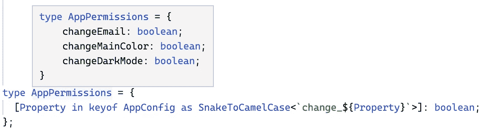
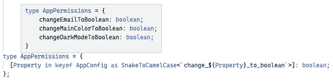

# 在 TypeScript 中将映射类型从 Snake_ 转换为 CamelCase

> 原文：<https://javascript.plainenglish.io/transform-mapped-types-from-snake-to-camelcase-in-typescript-472a2a4843b9?source=collection_archive---------4----------------------->

## 重新映射类型脚本映射类型

Photo by [Meg Jerrard](https://unsplash.com/@mappingmegantravel?utm_source=medium&utm_medium=referral) on [Unsplash](https://unsplash.com?utm_source=medium&utm_medium=referral)

上周，我发表了我的系列文章[“具有代码挑战的高级打字稿”](/advanced-typescript-with-code-challenges-mapped-types-6825c7fc984a)。在其中，我看了一下**映射类型**。一位读者的问题让我写了这篇文章来更深入地探讨这个话题。他的问题是:

> 我想问一下大家是否知道一种方法可以把一个类型而不是“changeemail”重新映射到“changeEmail”。坦克。

因此，让我们从最近文章中的例子开始。如果你想了解更多关于[映射类型](/advanced-typescript-with-code-challenges-mapped-types-6825c7fc984a)，你可以在这里找到文章[。](/advanced-typescript-with-code-challenges-mapped-types-6825c7fc984a)

我们有一个`AppConfig`类型，看起来像这样:

现在，我们想从`AppConfig`中动态创建一个`AppPermissions`类型，看起来应该是这样的:

为此，我们通过`as`使用键重映射来遍历我们的`AppConfig`类型的键，并将它们的值改为`boolean`:

Key Re-mapping via **as**

您可以看到，我们成功地创建了一个权限类型，而没有复制任何代码:

Key Re-mapping via **as**

现在，回到问题:**我们怎样才能让钥匙成为驼色？**

我花了一段时间才想出解决办法。大概还有不同的更好的解决方案，[这里](https://www.typescriptlang.org/play?ts=4.4.4#code/C4TwDgpgBAgmYGED2A7AZgSwOZQLxQG8AoKKCAWwEMMAbALigGdgAnDFLAbhKiveRpIWDZmw7dSAE0osA1gFkkkiAwBGSJDQiUU3AL7cioSFADKKSrIgAVJAkrkINe4wgAeANIQQZAB7AIFElGJlZ2LAA+PCgvHwh-QOCoAAMAEgJ2NAgWKAAxDBZmAAUZYD0AfXTM7LyC5gAZCGAAlj0q9Br6ymLSvWSeAH4U9PzC4BKWMvSAVXhsgGNu91GGppaItoJzSxs7BycXdy6eyY3+0gZYwyNwaDgwIuzyDEZGDFQQ-GJSAG0iliQkEmPnYUCsICQaFg8GQ6GwUG6ZgsVls9kcziWbmS8wAFjosBBKgR-oDsqA+hEALpqDRaHT6ThAA)是我的:

Key re-mapping to camelCase

分析新的`AppPermissions`类型表明，我们成功地将属性键重新映射到了 camelCase:

Snake to camelCase re-mapping

诚然，这看起来非常复杂。理解一切的先决条件是您已经理解了四个 TypeScript 特性:

*   [**条件类型**](/advanced-typescript-with-code-challenges-conditional-types-8dd4e63818a5)
*   [**推断式**](/advanced-typescript-with-code-challenges-infer-keyword-5ef686d77a3c)
*   [**仿制药**](https://medium.com/@mariusbongarts/advanced-typescript-generics-1b30d6b5dd49)
*   [**模板文字类型**](https://medium.com/@mariusbongarts/advanced-typescript-with-code-challenges-template-literal-types-479f56496daa)

让我们更深入地看看解决方案。我们创建了一个名为`SnakeToCamelCase`的新助手类型，将属性的键从 snake 重新映射到 camelCase。为了使我们映射类型的键在 snake_case 中，我们在我们的`as`重映射中的``change`和`${Property}``之间放了一个`_`。现在，我们来分析一下助手类型`SnakeToCamelCase`:

首先，我们将类型泛型化，并将其约束为类型`string`。之后，我们使用[条件类型](/advanced-typescript-with-code-challenges-conditional-types-8dd4e63818a5)来检查`Key`是否遵循 **snake_case** 约定。如果`Key`没有，我们就返回它。如果关键是扩展一个 **snake_case** 结构，我们推断三件事:`FirstPart`、`FirstLetter`和`LastPart`。理解`infer`关键字对于理解正在发生的事情是至关重要的。[这里](/advanced-typescript-with-code-challenges-infer-keyword-5ef686d77a3c)是一篇关于它的文章。

现在，已经推断出所有我们需要的类型，我们使用字符串[模板文字类型](https://medium.com/@mariusbongarts/advanced-typescript-with-code-challenges-template-literal-types-479f56496daa)将它们放在一起进行`as`重映射。我们照原样使用`FirstPart`，并使用内置的实用程序类型`Uppercase`将我们的字母`FirstLetter`转换到`_`之后。然后，我们使用我们的`SnakeToCamelCase<Key extends string>`类型递归地转换`LastPart`。

递归调用注意到我们也在转换带有多个`_`的 snake_case 键。例如，如果我们希望我们的属性键是这样的``change_${Property}_to_boolean``:

我们可以看到它成功地映射了键，遵循了 camelCase 约定:

Multiple ‘_’ in property

如果您对更高级的 TypeScript 特性感兴趣，请查看我的其他文章:

# 最后的想法

我总是乐于回答问题，并乐于接受批评。请随时联系我😊通过 [LinkedIn](https://www.linkedin.com/in/marius-bongarts-6b3638171/) 联系我，在 [Twitter](https://twitter.com/MariusBongarts) 关注我，或者[订阅](https://medium.com/subscribe/@mariusbongarts)通过电子邮件获取我的故事。

[**这里是无限制访问介质**](https://medium.com/@mariusbongarts/membership) **上所有内容的链接。如果你使用此链接注册，我将免费为你赚一小笔钱。**

 [## 通过我的推荐链接加入 Medium-Marius bong arts

### 作为一个媒体会员，你的会员费的一部分会给你阅读的作家，你可以完全接触到每一个故事…

medium.com](https://medium.com/@mariusbongarts/membership) 

# 关于作者

我是埃森哲软件工程分析师宋。最驱动我的是我想创造一些可能对他人有帮助并改变他人生活的东西的冲动。

比如你是否厌倦了浏览自己的历史来寻找前几天看到的信息？我的[**Web Highlights Chrome Extension**](https://chrome.google.com/webstore/detail/web-highlights-%20-bookmark/hldjnlbobkdkghfidgoecgmklcemanhm)覆盖了你，并将通过以结构化和高效的方式组织你的研究来提高你的生产力。就像你在书和文章上做的那样，突出显示任何网页或 PDF 上的文本。你的精彩片段会直接同步到 web-highlights.com 的网络应用上，你可以在任何地方找到它们。

 [## Web 亮点— PDF 和 Web 荧光笔

### 在每个网站或 PDF 上创建亮点、书签、标签和文件夹。以结构化的方式组织您的想法和研究…

chrome.google.com](https://chrome.google.com/webstore/detail/web-highlights-pdf-web-hi/hldjnlbobkdkghfidgoecgmklcemanhm) 

## 进一步阅读

 [## 具有代码挑战的高级类型脚本:映射类型

### 学习高级的 TypeScript 特性，并将它们应用到实际的代码练习中。

javascript.plainenglish.io](/advanced-typescript-with-code-challenges-mapped-types-6825c7fc984a)  [## 我的第一个 9.99 美元之旅与我的副业

### Chrome 扩展带来的被动收入

medium.com](https://medium.com/@mariusbongarts/my-journey-to-the-first-9-99-with-my-side-project-3edc13dd1f2d)  [## Web 组件会取代前端框架吗？

### 它们是为解决不同的问题而构建的。

javascript.plainenglish.io](/will-web-components-replace-frontend-frameworks-535891d779ba) 

*更多内容请看*[***plain English . io***](https://plainenglish.io/)*。报名参加我们的* [***免费周报***](http://newsletter.plainenglish.io/) *。关注我们关于*[***Twitter***](https://twitter.com/inPlainEngHQ)*和*[***LinkedIn***](https://www.linkedin.com/company/inplainenglish/)*。查看我们的* [***社区不和谐***](https://discord.gg/GtDtUAvyhW) *加入我们的* [***人才集体***](https://inplainenglish.pallet.com/talent/welcome) *。*