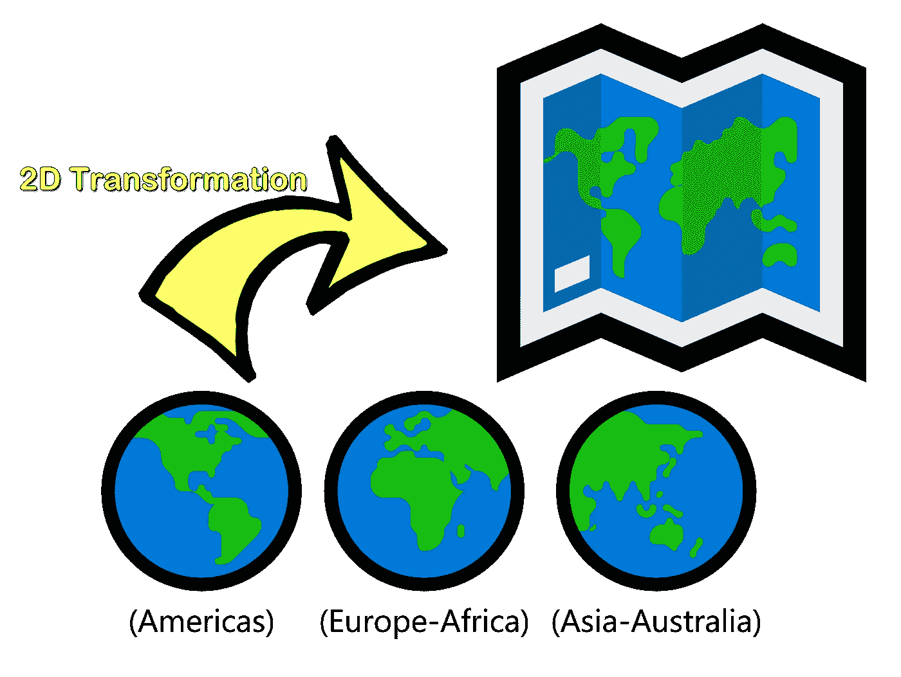
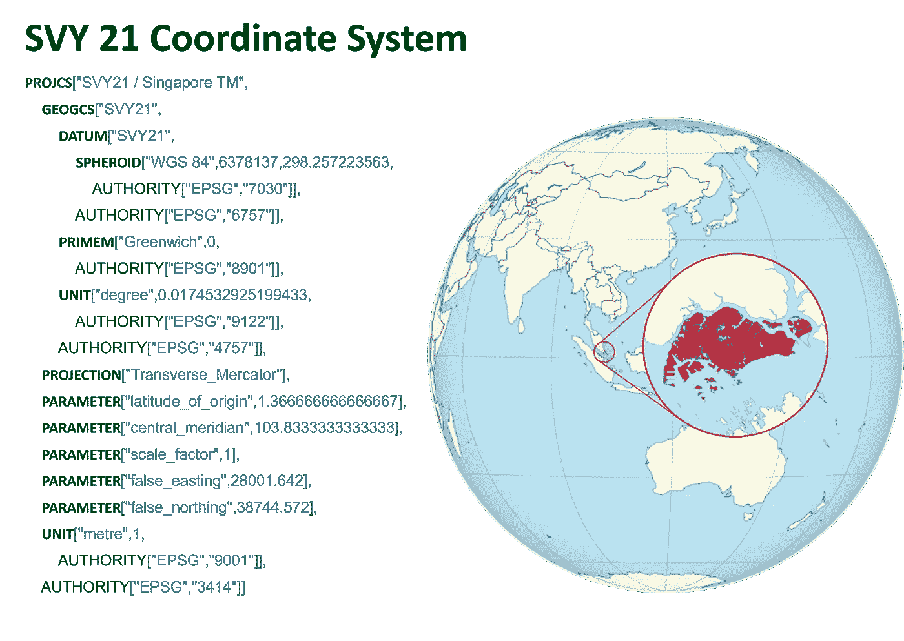
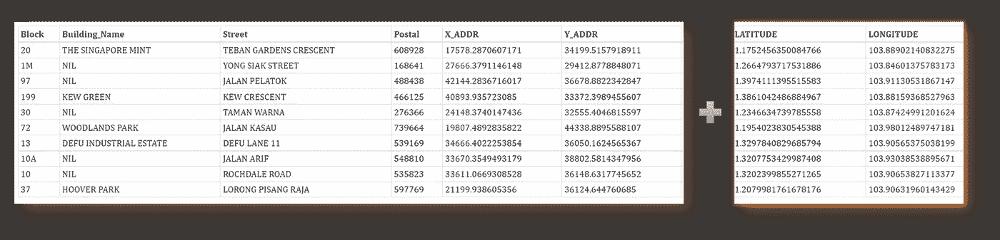
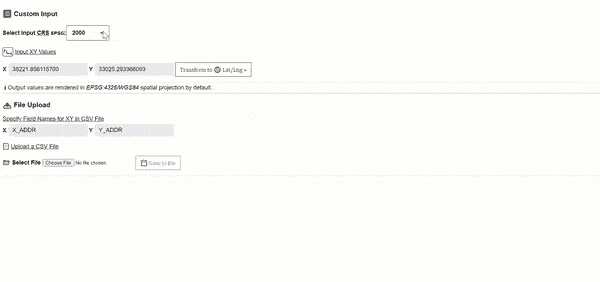

# 如何用 Proj4.js 将 XY 坐标转换为 LatLng 值

> 原文：<https://javascript.plainenglish.io/transforming-xy-coordinates-to-latlng-values-with-proj4-js-d91a6139ba90?source=collection_archive---------13----------------------->

## 包括 XY 到 LatLng 转换器工具的代码实现

当涉及到处理地理空间数据集时，每个 Geo 开发人员应该做的主要检查之一是了解 Geo 坐标是在哪个[坐标参考系统(CRS)](https://datacarpentry.org/organization-geospatial/03-crs/) 中呈现的。

## CRS 的简要背景

由于地球具有球形模型而非平坦表面，因此根据 XY 坐标位于地球的哪个部分，将应用不同的空间投影和数学计算来转换显示在 2D 地图上的值:



Illustration by Author | At different parts of the Earth’s spherical model, XY values at Americas, Europe and Asia-Australia would be rendered in unique CRS

虽然在线实用程序如 [EPSG.io](https://epsg.io/transform) 可用于一次性转换，但在现实世界的用例中，更多情况下不需要**批处理**。*此外，在* ***处理机密数据集*** *的情况下，离线处理它们总是比上传到任何公共在线平台更具战略性。*

> 幸运的是，JavaScript 库 [Proj4.js](https://github.com/proj4js/proj4js) 是专门为这个功能构建的。

## 使用案例演示:新加坡

例如，新加坡这个国家位于东南亚大陆。对于新加坡的任何一对 XY 值，它都遵循一个 [**SVY 21 坐标系**](https://epsg.io/3414) 进行变换。



Illustration by Author | The Well Known Text (WKT) representation of geometry above provides the values to define Singapore’s spatial projection in [Proj4.js](https://github.com/proj4js/proj4js)

> ***解释:****XY 值的数据源会正确定义其 WKT。在随后的示例中，由于 XY 值列表是从* [*新加坡土地管理局(SLA)的地图服务提供商 Onemap*](https://www.sla.gov.sg/geospatial-development-and-services/onemap) *和 SLA 规定的官方 2D CRS 为*[*svy 21*](http://50.57.85.98/crs_4757/SVY21.html)*中检索的，因此在*[*epsg . io*](https://epsg.io/)*中搜索将呈现其投影系统的 WKT 文档(包括在上图中)。*

因此，这转化为 [Proj4.js](https://github.com/proj4js/proj4js) 中的以下实现:

```
proj4.defs('EPSG:3414': '+proj=tmerc +lat_0=1.366666666666667 +lon_0=103.8333333333333 +k=1 +x_0=28001.642 +y_0=38744.572 +ellps=WGS84 +units=m +no_defs');
```

*   投影["Traverse_Mercator"] `proj=tmerc`
*   参数["原点纬度"] `lat_0=1.366666666666667`
*   参数[“中央子午线”] `lon_0=103.8333333333333`
*   参数["比例因子"] `k=1`
*   参数["false_easting"] `x_0=28001.64`
*   参数["false_northing"] `y_0=38744.572`
*   椭球体[“WGS 84”]`ellps=WGS84`**(Spherioid =椭球体)**
*   单位[“米”] `units=m`

以下代码片段返回包含一对**【Lat，Lng】**的数组:

```
var fromProj = proj4.defs('EPSG:3414');
var toProf = proj4.defs('EPSG:4326');
proj4(fromProj, toProf, [x, y]) // [lat, lng]
```

为了适应不同的坐标参考系统(CRS)，定义列表已被编译在:[proj 4-list](https://github.com/josueggh/proj4-list)**(GitHub 用户的鸣谢:**[**Josueggh**](https://github.com/josueggh)**)**

## 注意:在我的 GitHub: [proj4_list.js](https://gist.github.com/incubated-geek-cc/4a105a65ebc62321c8fb7cc9ccb98153) 中有一个投影*(不包括未定义的值和空条目)*的合并版本

# 构建将 XY 转换为 LatLng 的浏览器工具

## 导入以下 JavaScript 插件

```
<script src='proj4.js'></script><!-- proj4 plugin -->
<script src='proj4_list.js'></script><!-- object of crs list -->
<script src='json2csv.js'></script><!-- plugin for data export-->
```

假设输入数据格式是 CSV 文件，则在 HTML 页面上呈现一个简单的用户界面，供用户上传包含两个单独列中的 XY 值的数据文件，以输出附加了两个附加列的 CSV 文件，这两个附加列是由 [Proj4.js](https://github.com/proj4js/proj4js) 计算的**“纬度”**和**“经度”**



Illustration by Author | A sample output by the tool which appends columns — [LATITUDE] & [LONGITUDE] to the input csv data

## 综上所述，XY to LatLng 浏览器工具的最终版本如下:



Screencapture by Author | List of crs options are rendered in a dropdown list. EPSG of coordinates is 3414 (note that the dropdown list is sorted)

## 注意:要运行该工具，只需双击 HTML 文件并在任何支持 JavaScript 的浏览器中显示它。(不需要设置服务器)

## 要获得完整的源代码，请随意从我的 GitHub 获取回购协议，网址:[xy-to-lat LNG-converter](https://github.com/incubated-geek-cc/xy-to-latlng-convertor)或在这里试用！

现在你知道了！非常感谢你坚持到这篇文章的结尾！❤希望你觉得这个指南很有用，如果你想了解更多 GIS、数据分析& Web 应用相关的内容，请随时[关注我的 Medium](https://medium.com/@geek-cc) 。会非常感激—😀

[](https://geek-cc.medium.com/membership) [## 通过我的推荐链接加入灵媒——李思欣·崔

### 获得李思欣·崔和其他作家在媒体上的所有帖子！😃您的会员费直接…

geek-cc.medium.com](https://geek-cc.medium.com/membership) 

*更多内容请看*[***plain English . io***](http://plainenglish.io/)*。报名参加我们的* [***免费周报***](http://newsletter.plainenglish.io/) *。在我们的* [***社区***](https://discord.gg/GtDtUAvyhW) *获得独家获得写作机会和建议。*