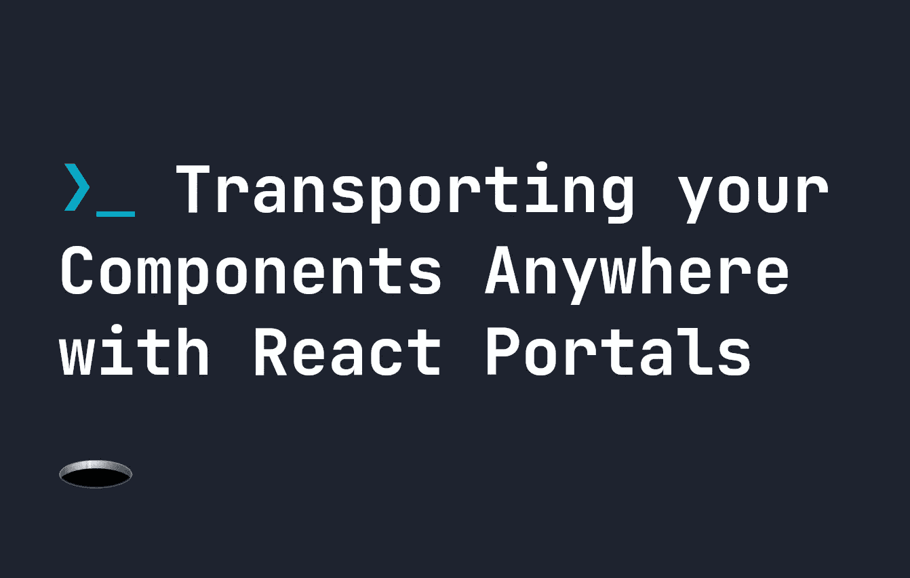
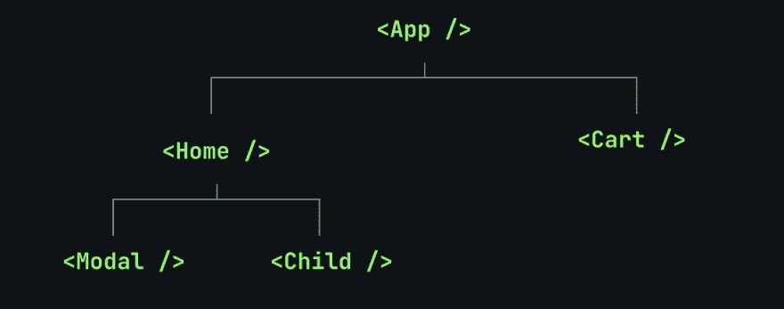
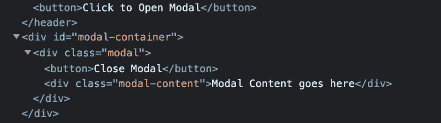

# 使用 React Portals 将您的组件运送到任何地方

> 原文：<https://javascript.plainenglish.io/transporting-your-components-anywhere-with-react-portals-f7e3ed7a7a8c?source=collection_archive---------7----------------------->

## React 中的门户为我们提供了一种在代码中的任何地方传输 DOM 元素的有用方法——这是一个关于 React 门户如何工作的教程



当我们在 React 中创建组件时，通常它们存在于组件树中。这基本上没问题，但是有时我们希望组件的某些部分出现在组件树之外，或者完全不同的地方。当我们创建模态弹出窗口时，这是一个常见的需求，它需要在所有其他组件之上。我们可能会在一个组件中创建它们，但最终我们会希望它们高于一切，将它们嵌套在许多组件中会导致问题，因为它们的`z-index`会低于它们所在的位置:



为了解决这个问题，我们可以使用`createPortal`将**模态从它自己的组件中转移到模板的另一部分。这允许我们把组件放在任何我们想要的地方，比如 HTML 树的底部，在`body`标签内，或者在另一个元素内。即使元素存在于组件树中，`createPortal`也给了我们把它放在任何我们喜欢的地方的能力。**

# 使用 React 门户

为了向您展示门户是如何工作的，考虑在我们的`App.js`文件中有以下基本的 React 代码。在这里，我们希望模态出现在所有东西的上面。因此，我们创建了一个名为`#modal-container`的`div`。这是我们希望所有模态最终进入的地方:

```
import logo from './logo.svg';
import './App.css';
import { useState } from 'react'
import Modal from './components/Modal.js';function App() {
    const [isModalOpen, setIsModalOpen] = useState(false);
    return (
        <div className="App">
            <header className="App-header">
                
                <p>
                Edit <code>src/App.js</code> and save to reload.
                </p> <button onClick={() => setIsModalOpen(!isModalOpen)}>
                    Click to Open Modal
                </button>
                <Modal modalState={isModalOpen} onClickEvent={() => setIsModalOpen(!isModalOpen)}>
                    This is Modal Content!
                </Modal>
            </header>
            <div id="modal-container"></div>
        </div>
    );
}export default App;
```

在`App.js`内部，我导入了一个名为`Modal`的组件。这是我们的模态组件，它会在用户点击按钮时弹出。只要使用`setIsModalOpen()`将`isModalOpen`设置为真，就会出现模态。否则，它会消失。

我还使用了一点 CSS 来确保我们的模态确实出现在所有其他事物之上:

```
#modal-container {
    position: absolute;
    top: 0;
    left: 0;
    width: 100%;
    z-index: 9999;
    height: 100%;
    pointer-events: none;
}.modal {
    position: absolute;
    top: 200px;
    background: white;
    border-radius: 4px;
    left: calc(50% - 100px);
    width: 200px;
}
```

# 创建我们的门户

创建一个 potal 非常简单——有一个函数，`createPortal()`。我们没有在 React 中返回一些 DOM，而是返回了`Portal`。`createPortal()`接受两个参数——我们想要返回的 DOM 元素——在本例中是模态的——和我们想要将 DOM 元素传送到的 DOM 元素。所以我们的第二个参数是`document.getElementById('modal-container')`，因为我们想把所有的模态放入`#modal-container`:

```
import { createPortal } from 'react-dom';function Modal({modalState, onClickEvent}) { if(!modalState) return null; return (
        createPortal(
            <div className="modal">
                <button onClick={onClickEvent}>Close Modal</button>
                <div className="modal-content">Modal Content goes here</div>
            </div>, 
            document.getElementById('modal-container')
        )
    );
};export default Modal;
```

尽管我们将 DOM 元素传送到了`modal-container`，但它的行为仍然像普通的 React 子元素一样。因为门户仍然存在于 React 树中，所以像元素所在的上下文这样的特性仍然起作用。

还应该注意的是，虽然我们在同一个文件中有`modal-container`和`Modal`，但是你可以将 DOM 元素传送到 React 代码中的任意位置**。因此，您可以将其传送到 DOM 中完全不同的子组件、元素或父组件。它非常强大和有用——所以要明智地使用它。**

让我们回头看看我们的`App.js` HTML:

```
<!-- .... -->
    <button onClick={() => setIsModalOpen(!isModalOpen)}>
        Click to Open Modal
    </button>
    <Modal modalState={isModalOpen} onClickEvent={() => setIsModalOpen(!isModalOpen)}>
        This is Modal Content!
    </Modal>
</header>
<div id="modal-container"></div>
```

现在，即使`Modal`位于我们的标题中，每当我们使用按钮打开模态时，它也会出现在`#modal-container`中:



# 结论

门户是 React 中一个非常强大的工具。它们是解决基于组件的系统的主要问题的有效方法——在所有其他元素之上传输某些元素。因此，我希望您喜欢这个 React 门户指南。如果你正在学习 React，我建议你先掌握 JavaScript——这可以通过我的完整的 [JavaScript 手册](https://fjolt.com/series/learn-javascript)来实现。

祝你愉快。

*更多内容看* [***说白了。报名参加我们的***](https://plainenglish.io/) **[***免费周报***](http://newsletter.plainenglish.io/) *。关注我们关于* [***推特***](https://twitter.com/inPlainEngHQ) ，[***LinkedIn***](https://www.linkedin.com/company/inplainenglish/)*，*[***YouTube***](https://www.youtube.com/channel/UCtipWUghju290NWcn8jhyAw)*，以及* [***不和***](https://discord.gg/GtDtUAvyhW) *。对增长黑客感兴趣？检查* [***电路***](https://circuit.ooo/) *。***