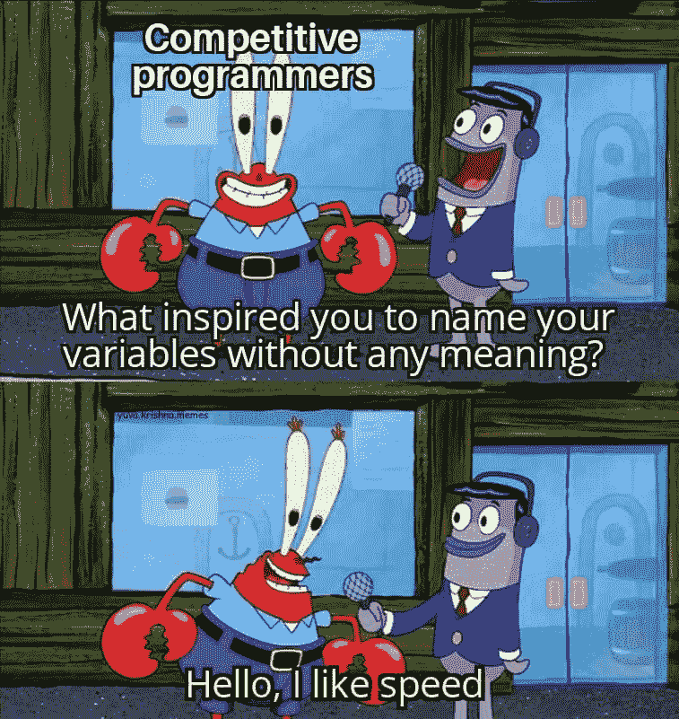
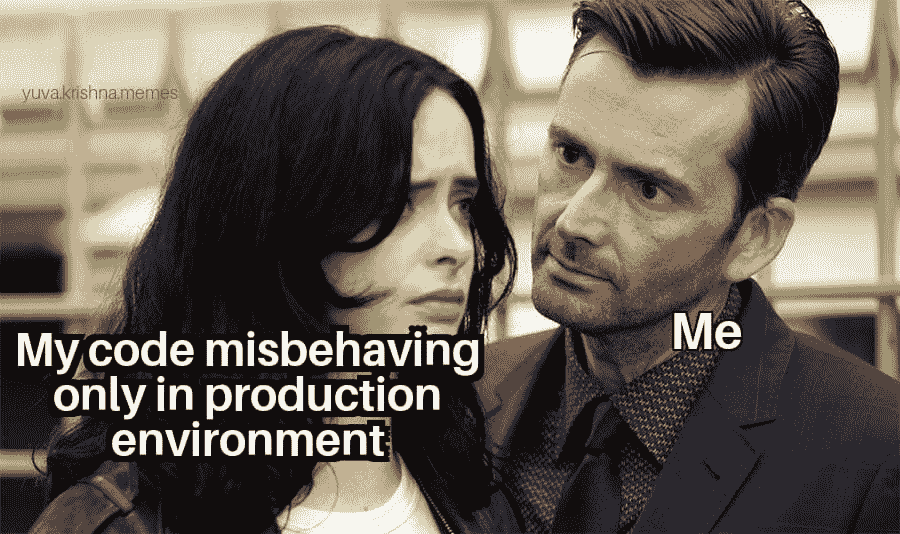
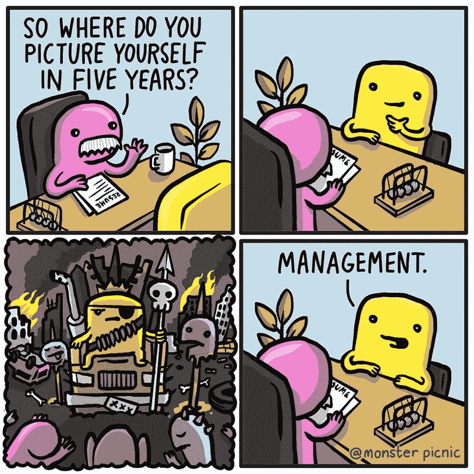
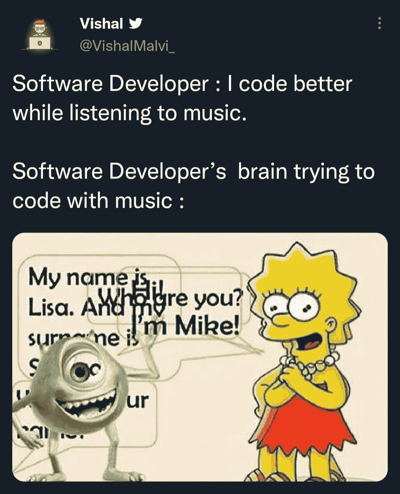
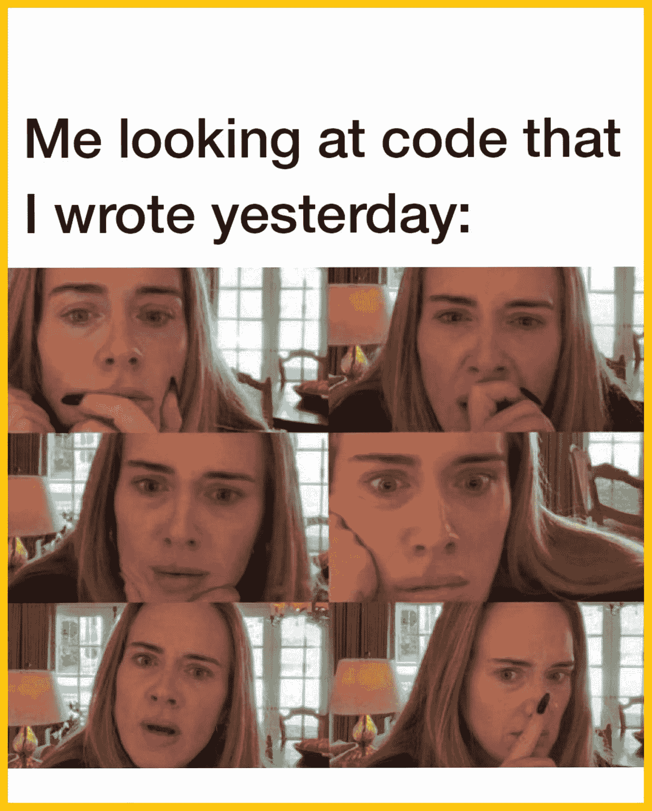
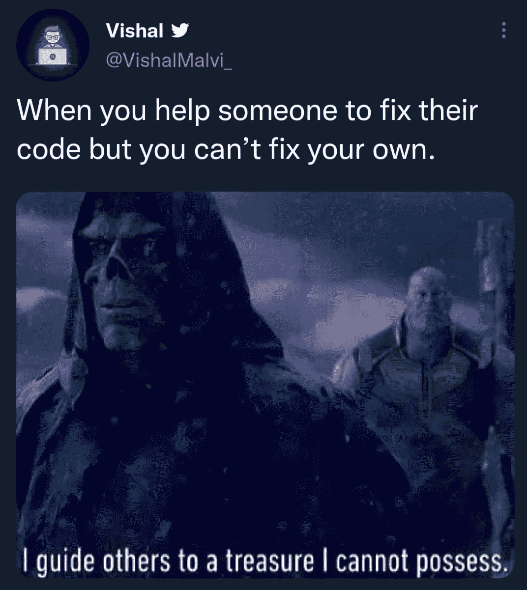
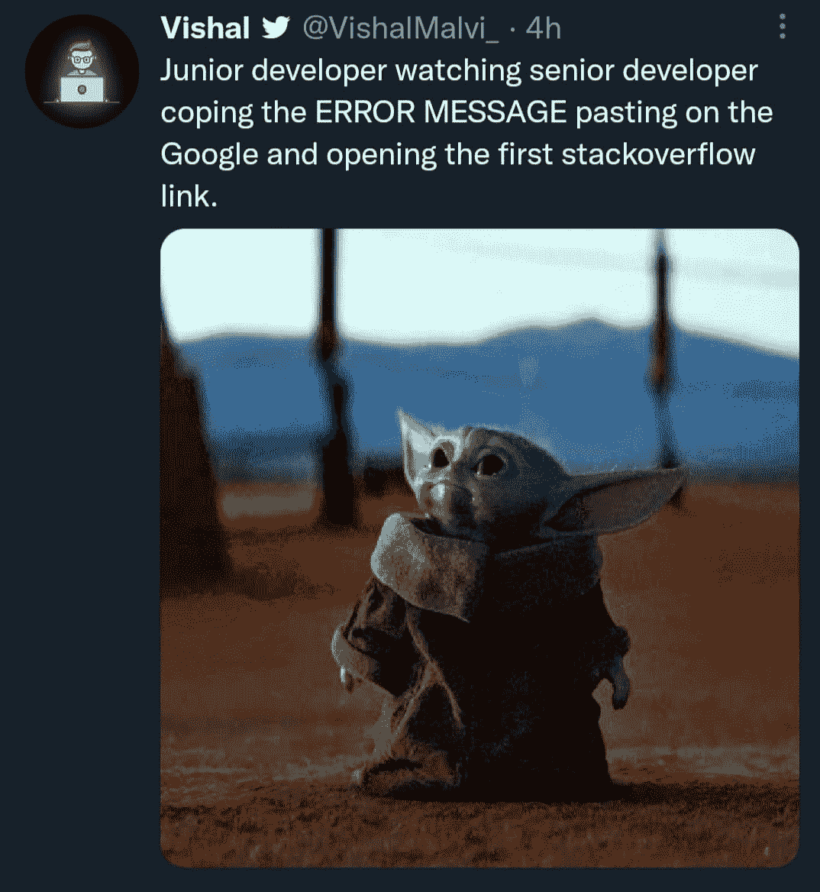
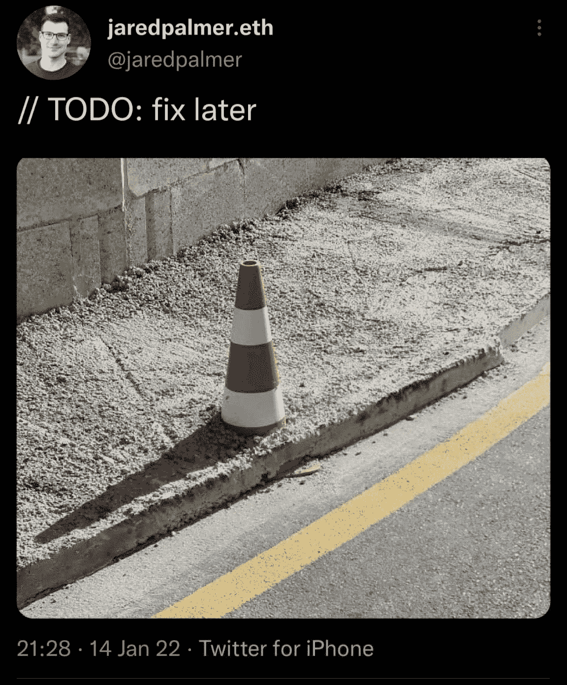
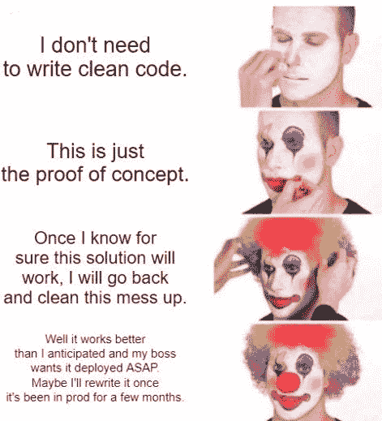
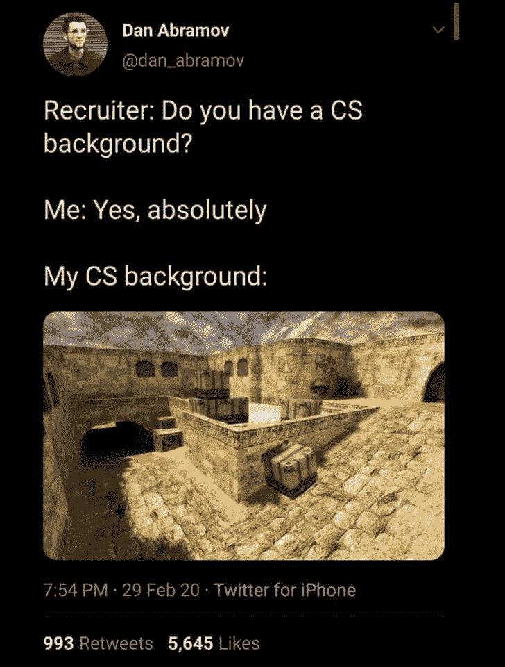

# 二月份流行的节目笑话

> 原文：<https://javascript.plainenglish.io/trending-programming-jokes-in-february-3dc390a7f4d4?source=collection_archive---------4----------------------->

## 最佳笑话汇编

Photo by [chaitanya pillala](https://unsplash.com/@chaiclikz?utm_source=medium&utm_medium=referral) on [Unsplash](https://unsplash.com?utm_source=medium&utm_medium=referral)

新的一年，新的开始。作为你的微笑专家，我又想出了一篇文章，汇集了我在社交媒体上发现的流行节目笑话。

这些笑话的用意是让你发笑，纠正你的情绪。因为:

# “笑声是人机最好的刷新按钮”

让我们沉浸在笑声中…

# 涵盖整个 GIT 的完美词汇

Picture Credit: [https://www.facebook.com/yuva.krishna.memes](https://www.facebook.com/yuva.krishna.memes)

# 完美的理由…

Picture Credit: [https://www.facebook.com/yuva.krishna.memes](https://www.facebook.com/yuva.krishna.memes)

# 我的代码实际上是什么样子的…

Picture Credit: [https://www.facebook.com/yuva.krishna.memes](https://www.facebook.com/yuva.krishna.memes)

# 为什么...为什么是现在？

Picture Credit: [https://www.facebook.com/yuva.krishna.memes](https://www.facebook.com/yuva.krishna.memes)

# 5 年后。肯定想当经理避免编码… LOL

Picture Credit: [https://www.facebook.com/yuva.krishna.memes](https://www.facebook.com/yuva.krishna.memes)

# 也许以后会有用…

Picture Credit:[https://www.facebook.com/groups/it.humor.and.memes](https://www.facebook.com/groups/it.humor.and.memes)

# 你戴着耳机编码吗？

Picture Credit: [https://www.facebook.com/groups/151139362111349](https://www.facebook.com/groups/151139362111349)

# 我实际上写了什么——为什么？

Picture Credit: [https://www.facebook.com/groups/151139362111349](https://www.facebook.com/groups/151139362111349)

# 我引导别人找到一个宝藏，我不占有它。

Picture Credit: [https://www.facebook.com/groups/151139362111349](https://www.facebook.com/groups/151139362111349)

# 那是技巧…

Picture Credit: [https://www.facebook.com/groups/151139362111349](https://www.facebook.com/groups/151139362111349)

# 稍后将修复它…

Picture Credit: [https://www.facebook.com/ooteensmemes](https://www.facebook.com/ooteensmemes)

# 经常发生。一旦它开始工作，我会重写…

Picture Credit:[https://www.facebook.com/javascript.shitposting](https://www.facebook.com/javascript.shitposting)

# CS 背景…

Picture Credit: [https://www.facebook.com/ProgrammersCreateLife](https://www.facebook.com/ProgrammersCreateLife)

# 希望你喜欢这篇文章。下周会带来新的汇编。

*更多内容请看*[***plain English . io***](http://plainenglish.io/)*。报名参加我们的* [***免费周报***](http://newsletter.plainenglish.io/) *。在我们的* [***社区***](https://discord.gg/GtDtUAvyhW) *获得独家获得写作机会和建议。*