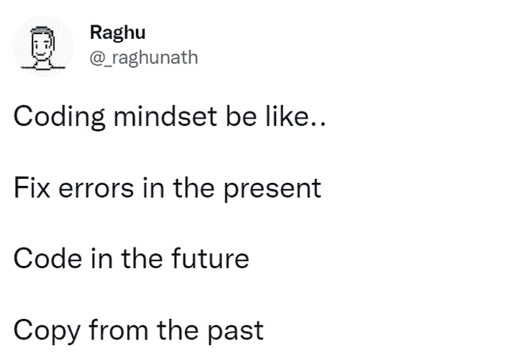
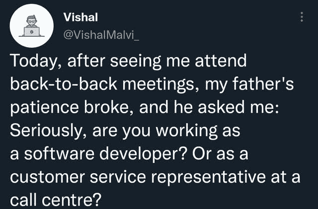
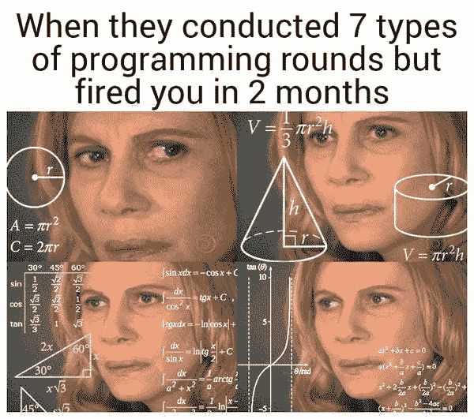
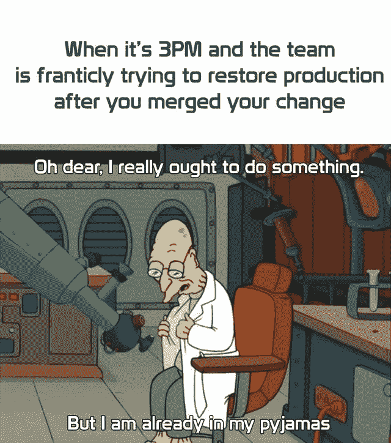
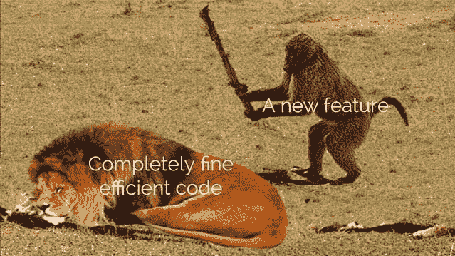
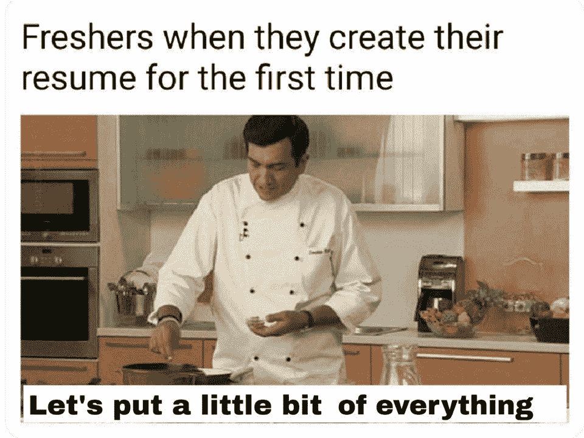

# 每个人都能联想到的趋势编程模因

> 原文：<https://javascript.plainenglish.io/trending-programming-memes-everyone-can-relate-to-1ee4863b8b42?source=collection_archive---------1----------------------->

互联网上流行的编程模因汇编

Photo by [Aleksandra Sapozhnikova](https://unsplash.com/@rruprrup?utm_source=medium&utm_medium=referral) on [Unsplash](https://unsplash.com?utm_source=medium&utm_medium=referral)

***模因与幸福有什么联系吗？*** 如果你是我喜欢的类型，那么你也可以在工作结束后检查你的手机。猜猜我在那边看到了什么？

我主要看 T4 视频、抖音和网络上发布的迷因。我不知道为什么，但它有助于**提神和减少工作压力**。这就是为什么我相信*笑声是人类最好的刷新按钮。*

在这篇文章中，我汇编了一些我在网上喜欢的模因。

# 编码思维…

Picture Credit:[https://www.reddit.com/r/ProgrammerHumor/](https://www.reddit.com/r/ProgrammerHumor/)

# 敏捷…

Picture Credit:[https://www.reddit.com/r/ProgrammerHumor/](https://www.reddit.com/r/ProgrammerHumor/)

# 不确定，它是如何工作的，但不要改变它…

Picture Credit:[https://www.reddit.com/r/ProgrammerHumor/](https://www.reddit.com/r/ProgrammerHumor/)

# 你有什么感觉？

Picture Credit:[https://programmerhumor.io/](https://programmerhumor.io/)

# 将以全新的思维和视角修复…

Picture Credit:[https://programmerhumor.io/](https://programmerhumor.io/)

# 为什么？为什么？

Picture Credit:[https://www.facebook.com/yuva.krishna.memes](https://www.facebook.com/yuva.krishna.memes)

# 当 QA 告诉我关于臭虫的事情时，我的第一句话是..它在我的机器里工作..

Picture Credit:[https://www.reddit.com/r/ProgrammerHumor/](https://www.reddit.com/r/ProgrammerHumor/)

# 我希望我能帮忙，但是…

Picture Credit:[https://www.reddit.com/r/ProgrammerHumor/](https://www.reddit.com/r/ProgrammerHumor/)

# 当你想到周五早点离开的时候…

# 当你触摸工作中的人时，你需要后悔…

[https://www.facebook.com/javascriptJS/photos/1602108066593458](https://www.facebook.com/javascriptJS/photos/1602108066593458)

# 只需添加您的简历，它将帮助您获得面试机会…

[https://www.facebook.com/yuva.krishna.memes/photos/a.105527467815845/299995221702401/](https://www.facebook.com/yuva.krishna.memes/photos/a.105527467815845/299995221702401/)

# 当实习生认真对待评论时…

[https://www.facebook.com/javascriptJS/photos/a.1387402908063976/2170533493084243/](https://www.facebook.com/javascriptJS/photos/a.1387402908063976/2170533493084243/)

# 如果你知道如何写“你好”这个词，你可以把它添加到你的简历中..

[https://www.reddit.com/r/ProgrammerHumor/comments/mnbgz1/knows_every_programming_language/](https://www.reddit.com/r/ProgrammerHumor/comments/mnbgz1/knows_every_programming_language/)

# 额外剂量…

# 他们嫉妒我的幸福

[https://www.reddit.com/r/ProgrammerHumor/comments/oiiwi3/there_goes_away_one_more_sunday/](https://www.reddit.com/r/ProgrammerHumor/comments/oiiwi3/there_goes_away_one_more_sunday/)

# 不是真的，但是让我们想想…

[https://www.reddit.com/r/ProgrammerHumor/comments/oinxee/the_truth_can_hurt_sometimes/](https://www.reddit.com/r/ProgrammerHumor/comments/oinxee/the_truth_can_hurt_sometimes/)

# 我到底做了什么来解决这个问题…也许什么都没有…

[https://www.reddit.com/r/ProgrammerHumor/comments/oimbw6/things_that_magically_work_but_you_dont_know_why/](https://www.reddit.com/r/ProgrammerHumor/comments/oimbw6/things_that_magically_work_but_you_dont_know_why/)

# 你需要学会交易…来处理 API

[https://www.reddit.com/r/ProgrammerHumor/comments/ohh9nv/200_ok/](https://www.reddit.com/r/ProgrammerHumor/comments/ohh9nv/200_ok/)

# 还有谁会无视警告，认为这样可以节省时间呢？

[https://www.reddit.com/r/ProgrammerHumor/comments/ofeexz/inner_peace/](https://www.reddit.com/r/ProgrammerHumor/comments/ofeexz/inner_peace/)

# 单元测试旨在增加覆盖率……(有时)

[https://www.reddit.com/r/ProgrammerHumor/](https://www.reddit.com/r/ProgrammerHumor/)

# 人工智能出错了

[https://www.reddit.com/r/ProgrammerHumor/comments/ojf2eu/ai/](https://www.reddit.com/r/ProgrammerHumor/comments/ojf2eu/ai/)

# 重新编辑…我怎么总是忘记？

[https://www.reddit.com/r/ProgrammerHumor/comments/ojdicf/it_happened_more_than_once/](https://www.reddit.com/r/ProgrammerHumor/comments/ojdicf/it_happened_more_than_once/)

# 一些噩梦…或者现实？

[https://www.monkeyuser.com/2019/great-expectations/?sc=true&dir=random](https://www.monkeyuser.com/2019/great-expectations/?sc=true&dir=random)

谢谢你的阅读…祝你有美好的一天…

*更多内容请看*[***plain English . io***](https://plainenglish.io/)*。报名参加我们的* [***免费周报***](http://newsletter.plainenglish.io/) *。关注我们关于*[***Twitter***](https://twitter.com/inPlainEngHQ)[***LinkedIn***](https://www.linkedin.com/company/inplainenglish/)*[***YouTube***](https://www.youtube.com/channel/UCtipWUghju290NWcn8jhyAw)*[***不和***](https://discord.gg/GtDtUAvyhW) *。对增长黑客感兴趣？检查* [***电路***](https://circuit.ooo/) *。***