# 互联网上的流行节目迷因

> 原文：<https://javascript.plainenglish.io/trending-programming-memes-on-the-internet-3d008a8dc64d?source=collection_archive---------3----------------------->

## 最佳编程笑话汇编。

Photo by [Priscilla Du Preez](https://unsplash.com/@priscilladupreez?utm_source=medium&utm_medium=referral) on [Unsplash](https://unsplash.com?utm_source=medium&utm_medium=referral)

你听说过这样一句话吗，“笑是减轻压力的最佳良药？”

但是怎么做呢？心情不好的时候怎么笑或者微笑？

今天，我试图整理一些我在互联网和社交媒体上发现的最好的与编程相关的**笑话/迷因**。这些笑话让我笑逐颜开，希望也能让你笑逐颜开。

> *我们走吧。准备好注射第一剂。*

# 当单元测试与场景无关时…

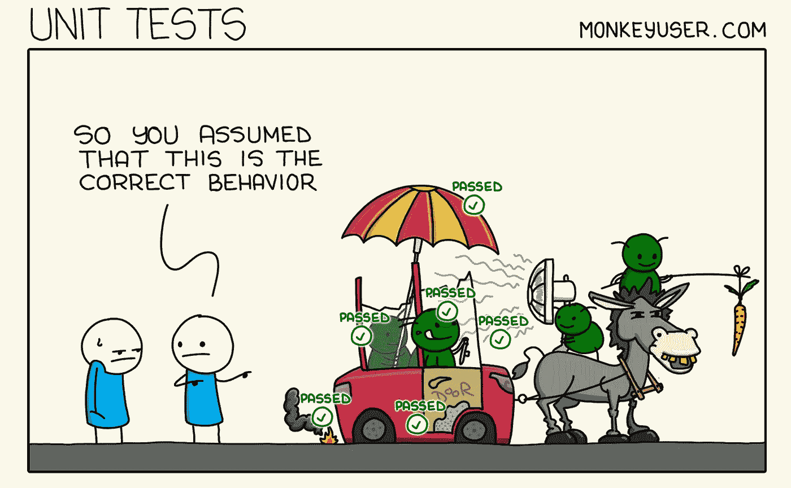

Picture Credit:[https://www.monkeyuser.com/](https://www.monkeyuser.com/)

# 多重人格…

Picture Credit:[https://www.facebook.com/yuva.krishna.memes](https://www.facebook.com/yuva.krishna.memes)

# 当您对该场景有一个解决方法，但没有人想更改 UI 时

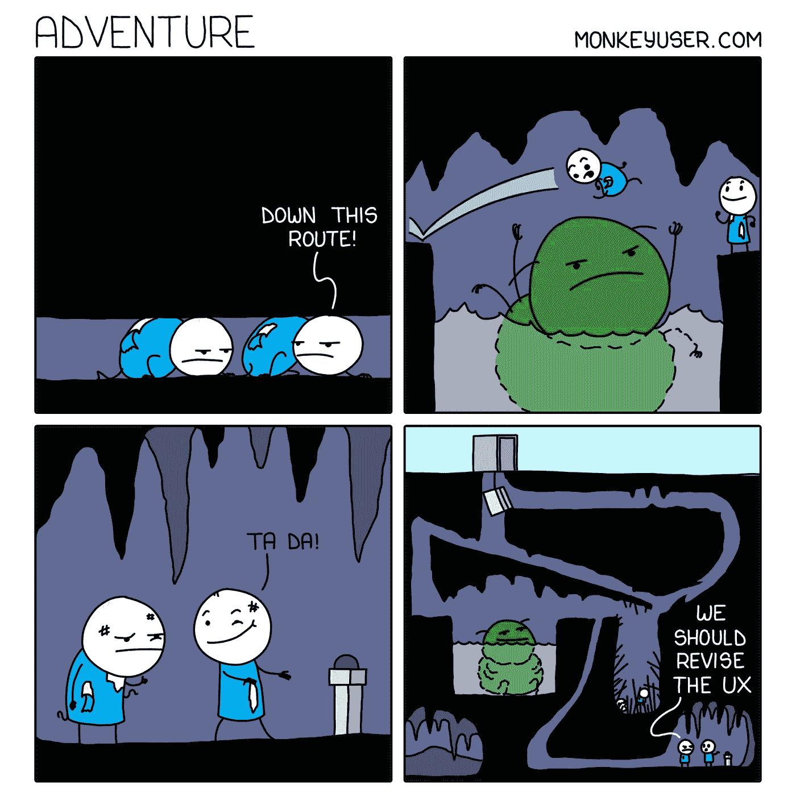

Picture Credit:[https://www.monkeyuser.com/](https://www.monkeyuser.com/)

# 当我们有了 console.log，为什么还要用 debug LOL…

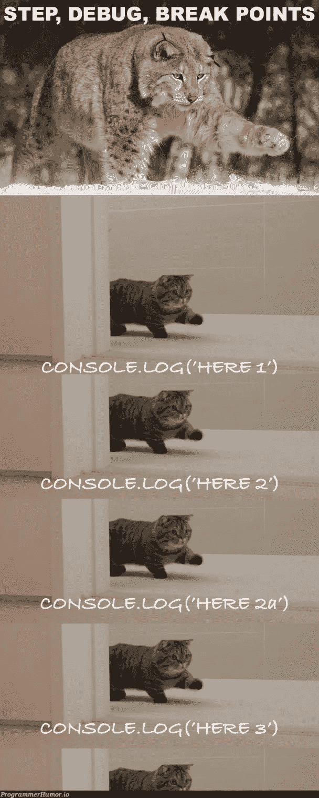

Picture Credit:[https://programmerhumor.io/](https://programmerhumor.io/)

# 编程很容易，我们一个晚上就能学会！怎么会？

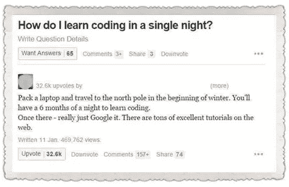

Picture Credit:[https://programmerhumor.io/](https://programmerhumor.io/)

# 当一些新的框架出现时…让我们添加到简历中..

Picture Credit:[https://programmerhumor.io/](https://programmerhumor.io/)

# 当我们有大量技术债务时…

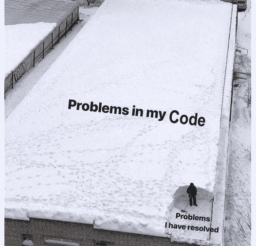

Picture Credit:[https://www.facebook.com/javascriptJS](https://www.facebook.com/javascriptJS)

# 当我们可以寻求复杂的解决方案时，为什么要以简单的方式去做呢？

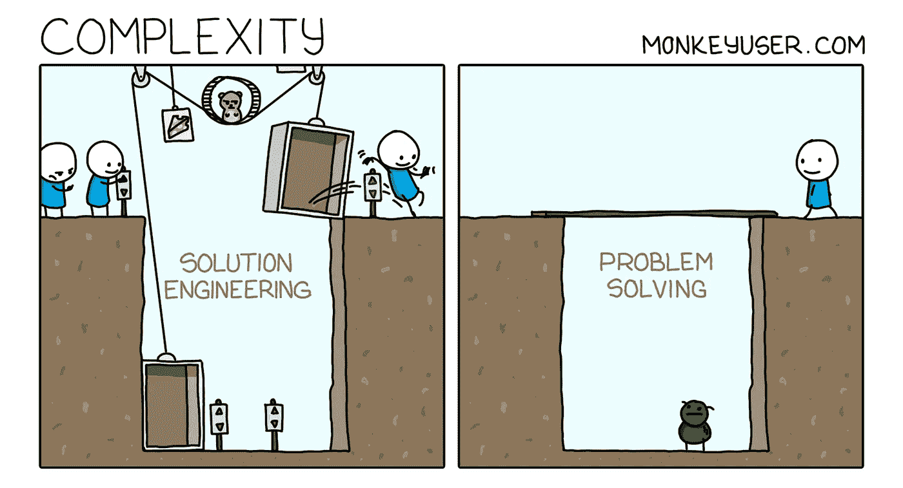

Picture Credit:[https://www.monkeyuser.com/](https://www.monkeyuser.com/)

# 把编译器想象成一个真人…

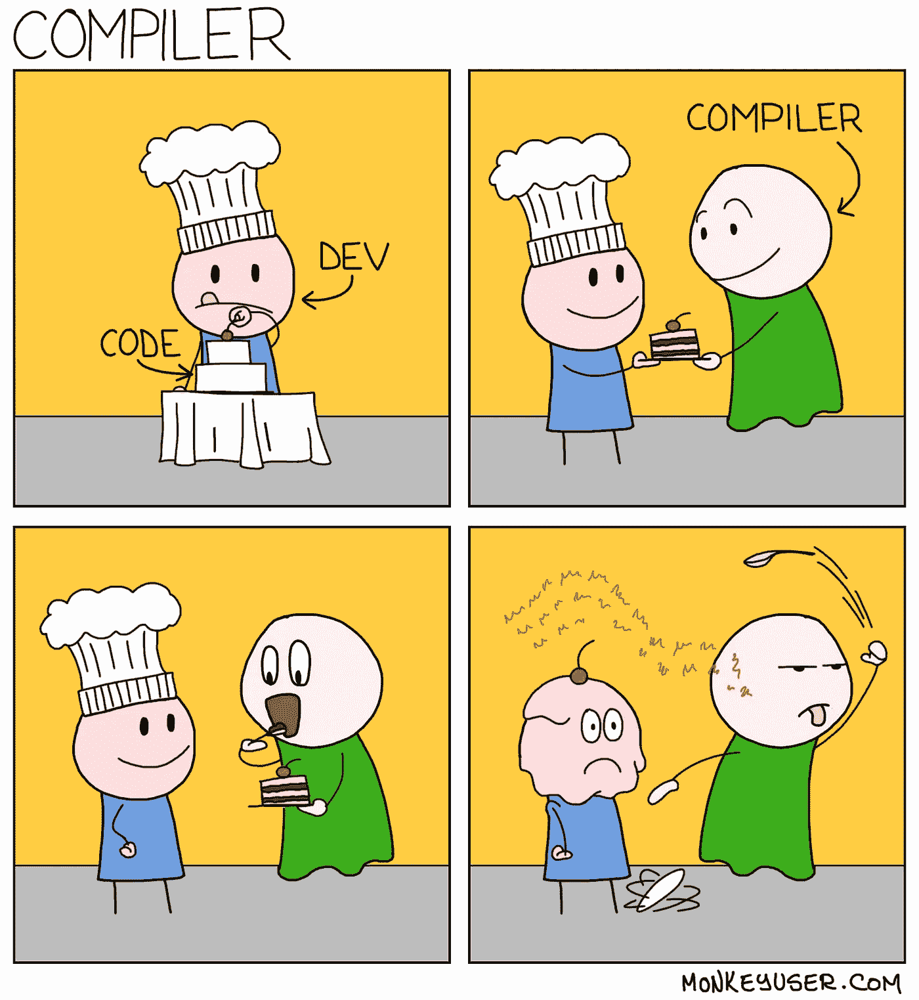

Picture Credit:[https://www.monkeyuser.com/](https://www.monkeyuser.com/)

# 当他们说我们只是做了一些小改动时…

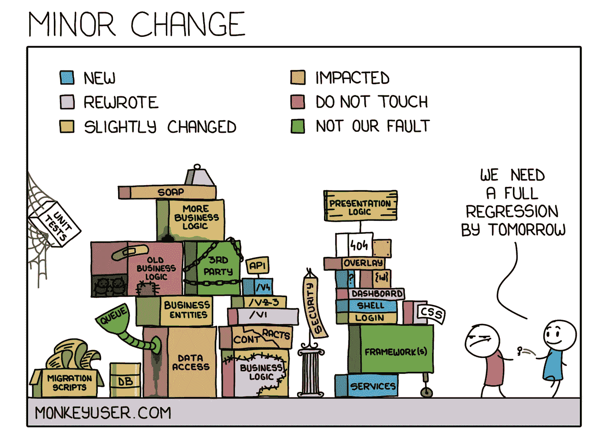

Picture Credit:[https://www.monkeyuser.com/](https://www.monkeyuser.com/)

# 条件可以帮助稳定我的代码…

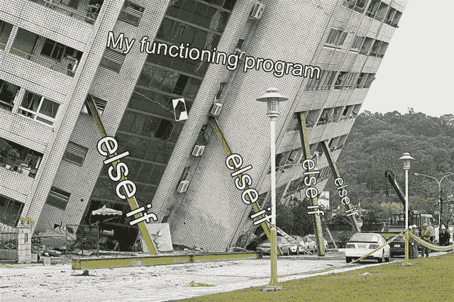

Picture Credit:[https://www.reddit.com/r/ProgrammerHumor/](https://www.reddit.com/r/ProgrammerHumor/)

# 事情每次都变了

Picture Credit:[https://www.reddit.com/r/ProgrammerHumor/](https://www.reddit.com/r/ProgrammerHumor/)

# 当你的 scrum 会议永不结束...

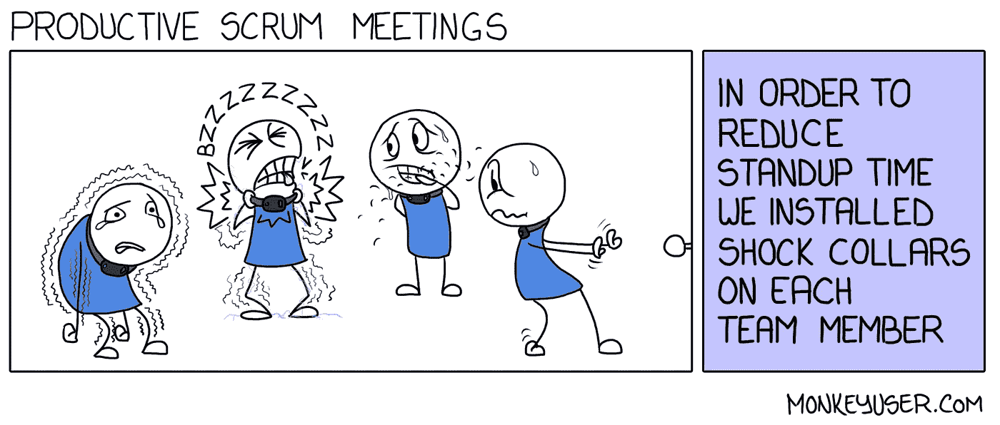

Picture Credit:[https://www.monkeyuser.com/](https://www.monkeyuser.com/)

# 当你不能解决 QA 提出的问题时

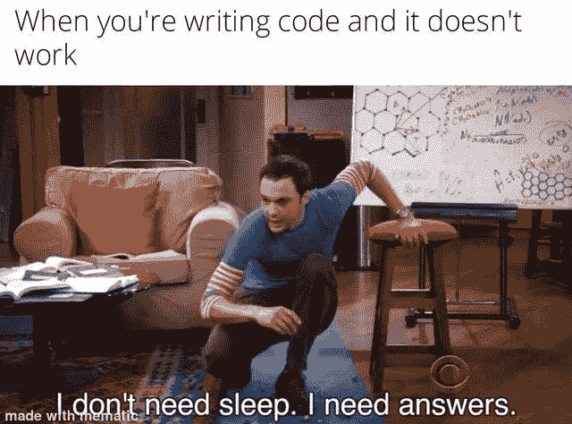

Picture Credit:[https://www.reddit.com/r/ProgrammerHumor](https://www.reddit.com/r/ProgrammerHumor/)

# 当你可以用现有的库解决问题时，为什么还要创建一个新的呢？

Picture Credit:[https://www.reddit.com/r/ProgrammerHumor](https://www.reddit.com/r/ProgrammerHumor/)

# 额外内容

# 描述现实最好的一个

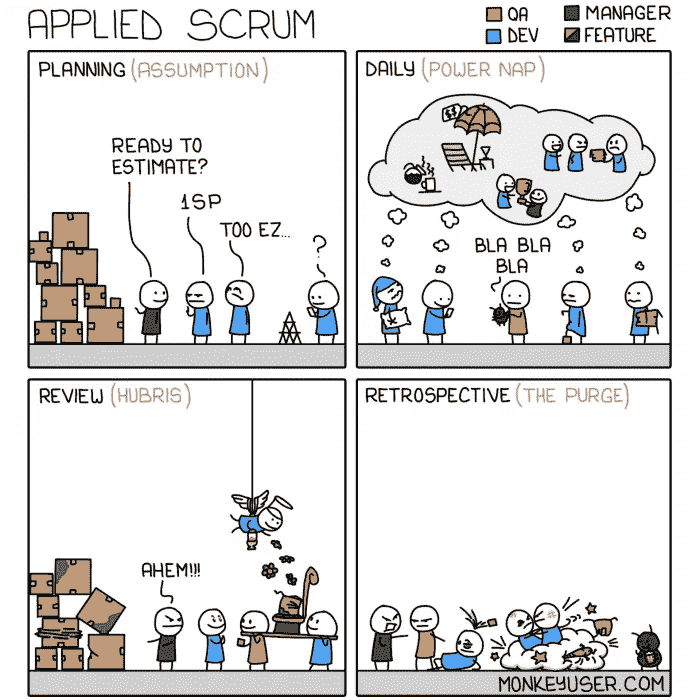

[https://www.monkeyuser.com/](https://www.monkeyuser.com/)

# 你的春天是如何开始的？

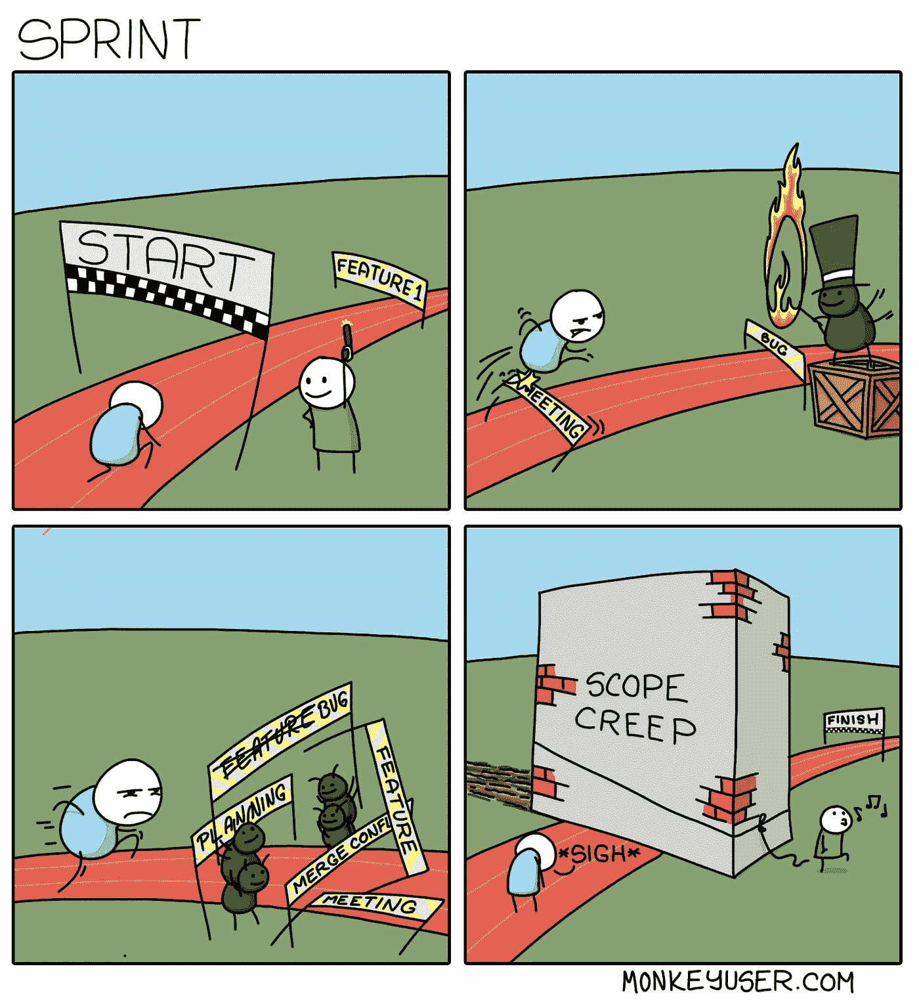

[https://www.monkeyuser.com/](https://www.monkeyuser.com/)

# 期望与现实

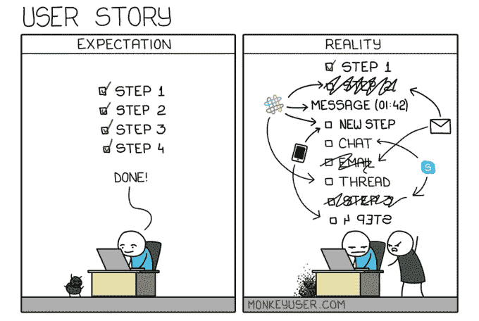

[https://www.monkeyuser.com/](https://www.monkeyuser.com/)

# 测试驱动的方法总是有效的。不在这里…

[https://www.monkeyuser.com/](https://www.monkeyuser.com/)

# 你属于哪一类？

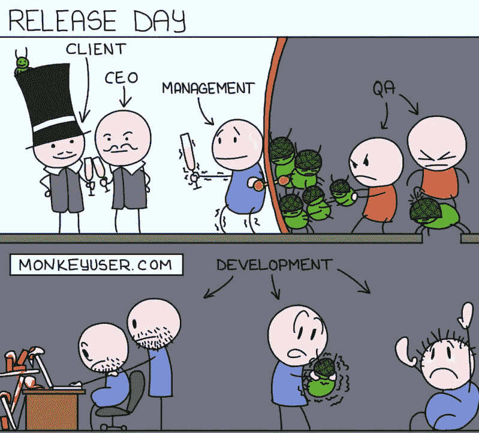

[https://www.monkeyuser.com/](https://www.monkeyuser.com/)

# 到处都是 JIRA 的票…

# 总是这样吗？

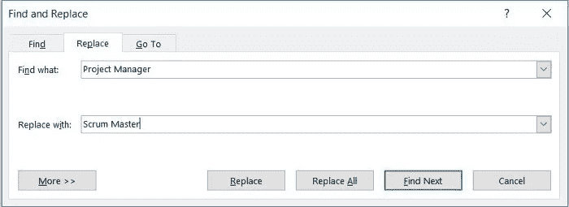

# 单口相声不能迟到…

# 你最喜欢的复古格式是哪一种？

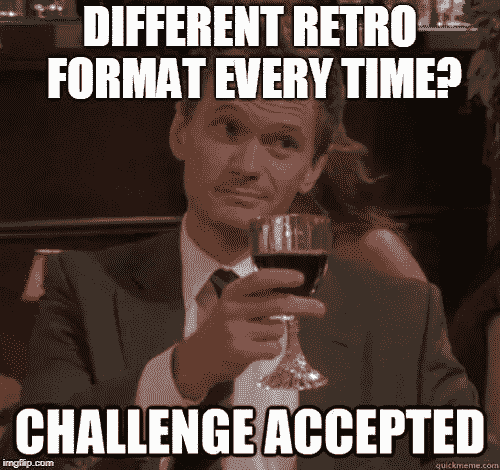

# 站着说话让你更有效率？

# 这是为业务团队准备的…

# 有几分真实。

# 不同的项目…不同的板…

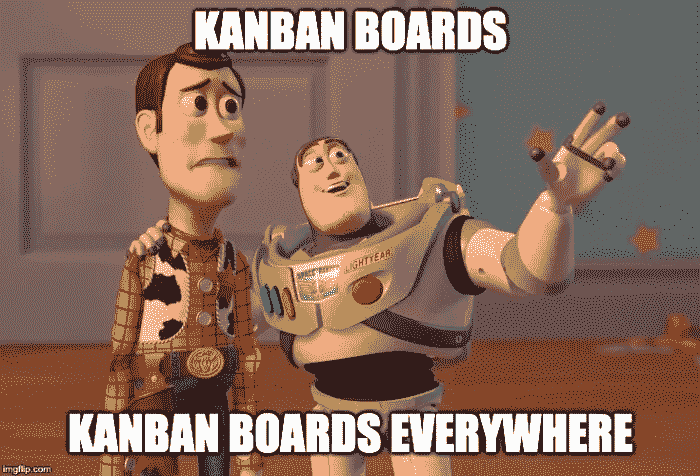

# 复杂的故事…更多的点…你仍然需要 2 个故事来刻录图表…

# 发生在 QA 和 dev 中

# 没有已知的阻止程序…

# 希望你玩得开心！

*更多内容看* [***说白了就是 io***](https://plainenglish.io/) *。报名参加我们的* [***免费周报***](http://newsletter.plainenglish.io/) *。关注我们关于* [***推特***](https://twitter.com/inPlainEngHQ) ， [***领英***](https://www.linkedin.com/company/inplainenglish/) *和* [***不和***](https://discord.gg/GtDtUAvyhW) ***。***