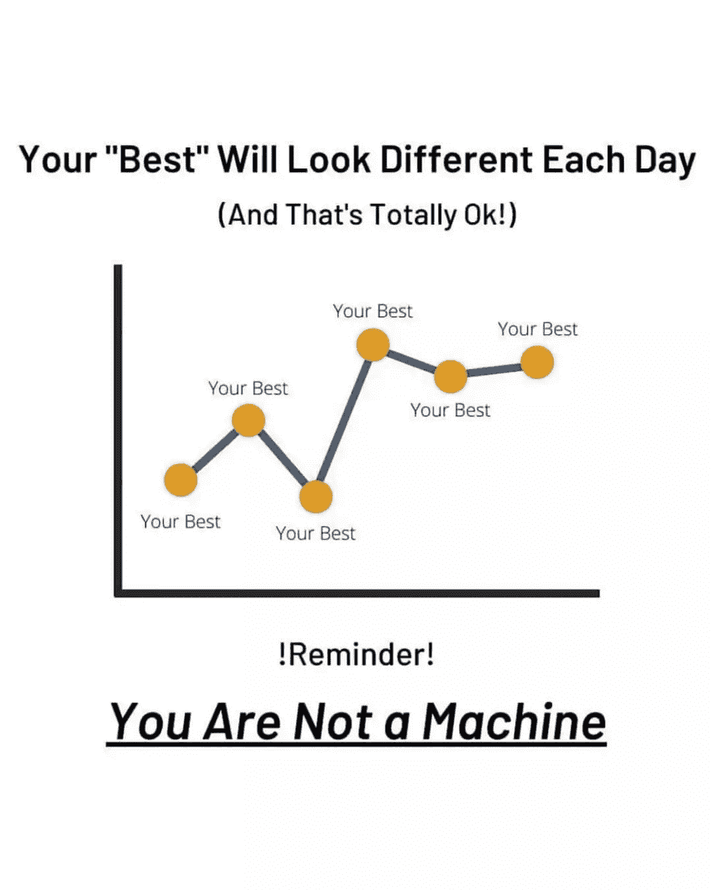

# 流行节目迷因来点亮你的心情

> 原文：<https://javascript.plainenglish.io/trending-programming-memes-to-lighten-up-your-mood-a3a1d45e45f6?source=collection_archive---------3----------------------->

## 医生为 IT 专业人士开出的幽默模因每日汇编。

Photo by [Lidya Nada](https://unsplash.com/@lidyanada?utm_source=medium&utm_medium=referral) on [Unsplash](https://unsplash.com?utm_source=medium&utm_medium=referral)

我们很多人都有打开脸书或 Instagram 开始新一天的习惯。像我这样的一些人喜欢在忙碌了一天后刷新我们的心情，或者只是让我们的脸上带着微笑。

在这里，我正在创建一个每日文章系列，可能需要 1-2 分钟来阅读，但保证会让你脸上带着微笑。

# 我们开始吧

# 当你从一个逻辑狂热起来，创造了另一个…

Picture Credit:[https://www.monkeyuser.com/](https://www.monkeyuser.com/)

# 你想要 100%单元测试的代码吗？我不会让你失望的…

Picture Credit: [https://programmerhumor.io/](https://programmerhumor.io/)

# 当合并失败，并且需要合并冲突时…

Picture Credit: [https://programmerhumor.io/](https://programmerhumor.io/)

# 当我们生活在智能感知时代时，这种情况经常发生...

Picture Credit: [https://programmerhumor.io/](https://programmerhumor.io/)

# 有人能分享一下他们的吗？对我来说，喝咖啡休息时间更…

Picture Credit: [https://programmerhumor.io/](https://programmerhumor.io/)

# 每个人都期待的成就…

Picture Credit: [https://programmerhumor.io/](https://programmerhumor.io/)

# 当什么都没想到的时候，我也会写一些类似的东西来增加评论的覆盖面...

Picture Credit: [https://programmerhumor.io/](https://programmerhumor.io/)

# 判断我的括号是否正确闭合的最好方法是…

Picture Credit:[https://www.reddit.com/r/ProgrammerHumor/](https://www.reddit.com/r/ProgrammerHumor/)

# 我是这里唯一懒惰的人吗？

Picture Credit: [https://programmerhumor.io/](https://programmerhumor.io/)

# 当你去 StackOverflow 发现和你一样的错误…

Picture Credit:[https://www.reddit.com/r/ProgrammerHumor/](https://www.reddit.com/r/ProgrammerHumor/)

# 经常发生，当他们问网站…

Picture Credit:[https://www.reddit.com/r/ProgrammerHumor/](https://www.reddit.com/r/ProgrammerHumor/)

# 你喜欢列表还是数组？

Picture Credit:[https://www.reddit.com/r/ProgrammerHumor/](https://www.reddit.com/r/ProgrammerHumor/)

# 是的，我们确实复制粘贴了代码…但是我们需要让示例代码为我们的场景工作…

Picture Credit:[https://www.reddit.com/r/ProgrammerHumor/](https://www.reddit.com/r/ProgrammerHumor/)

# 真的…

Picture Credit:[https://www.reddit.com/r/ProgrammerHumor/](https://www.reddit.com/r/ProgrammerHumor/)

# 又一个单元测试迷因…我太讨厌这个了…

Picture Credit:[https://www.reddit.com/r/ProgrammerHumor/](https://www.reddit.com/r/ProgrammerHumor/)

# 奖励内容:

# 不要试图问愚蠢的问题…这里的完美答案…

[https://programmerhumor.io/programming-memes/actual-photo-of-the-stackoverflow-hiring-process/](https://programmerhumor.io/programming-memes/actual-photo-of-the-stackoverflow-hiring-process/)

# 哇！新定义…满栈表示我已经满了… LOL

[https://programmerhumor.io/programming-memes/i-love-me-a-good-full-stack-of-pancakes-%f0%9f%a5%9e/](https://programmerhumor.io/programming-memes/i-love-me-a-good-full-stack-of-pancakes-%f0%9f%a5%9e/)

# 我们不知道我们到底想要什么……但我们希望尽快得到——客户

[https://programmerhumor.io/programming-memes/yes-now/](https://programmerhumor.io/programming-memes/yes-now/)

# 这个图像可以制造很多迷因…让我们用一个编程的…

[https://programmerhumor.io/programming-memes/legacy-code-comments/](https://programmerhumor.io/programming-memes/legacy-code-comments/)

# 让我们通过添加注释使我的代码更具可读性，哈哈…

[https://programmerhumor.io/programming-memes/more-like-commenting-whole-code/](https://programmerhumor.io/programming-memes/more-like-commenting-whole-code/)

# 我的代码是我做的研究…它正在工作，这就足够了…

[https://www.facebook.com/photo/?fbid=515368519672176&set=gm.2881890155411868](https://www.facebook.com/photo/?fbid=515368519672176&set=gm.2881890155411868)

# 让我们重构变量名和方法名…这就足够了，因为逻辑可以是相同的。

[https://www.facebook.com/photo/?fbid=912219536303209&set=gm.2881823462085204](https://www.facebook.com/photo/?fbid=912219536303209&set=gm.2881823462085204)

# 是啊。我也忘了办公室的衣服…

[https://www.facebook.com/javascriptJS/photos/2204497796354479/](https://www.facebook.com/javascriptJS/photos/2204497796354479/)

# 我爱你，我的朋友…你做得很好…

[https://www.facebook.com/ICT.LK99/photos/a.109557074287643/295998745643474/](https://www.facebook.com/ICT.LK99/photos/a.109557074287643/295998745643474/)

# 周五的一些动力？

[https://www.facebook.com/jokesvala/photos/a.2339158462775928/6317562231602178/](https://www.facebook.com/jokesvala/photos/a.2339158462775928/6317562231602178/)

# 说真的，不知何故这是真的…

[https://www.facebook.com/jokesvala/photos/a.2330223400336101/6283562938335441/](https://www.facebook.com/jokesvala/photos/a.2330223400336101/6283562938335441/)

# 祝你度过快乐的一天。

*更多内容看* [***说白了。报名参加我们的***](https://plainenglish.io/) **[***免费周报***](http://newsletter.plainenglish.io/) *。关注我们关于*[***Twitter***](https://twitter.com/inPlainEngHQ)*和*[***LinkedIn***](https://www.linkedin.com/company/inplainenglish/)*。加入我们的* [***社区***](https://discord.gg/GtDtUAvyhW) *。***