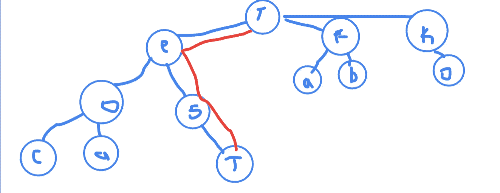
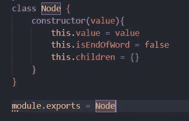
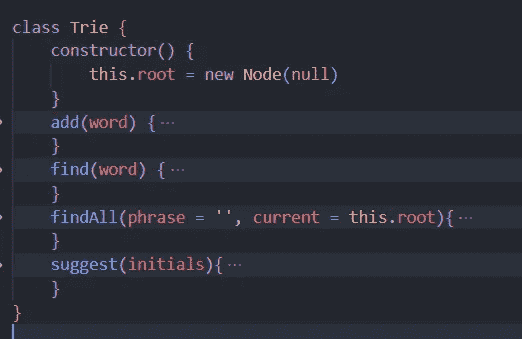
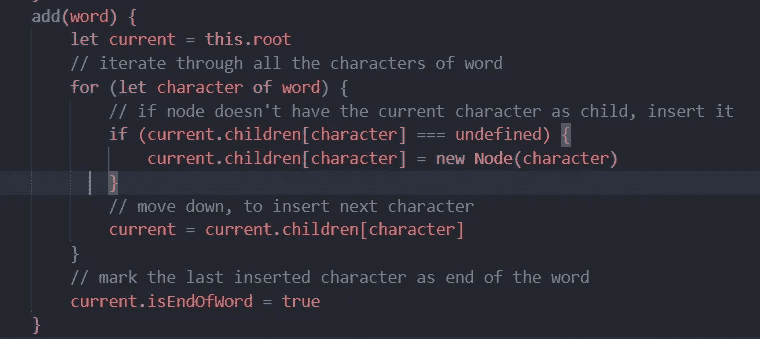
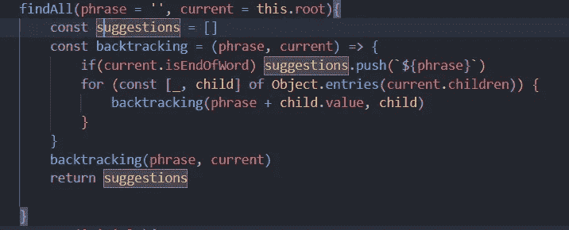
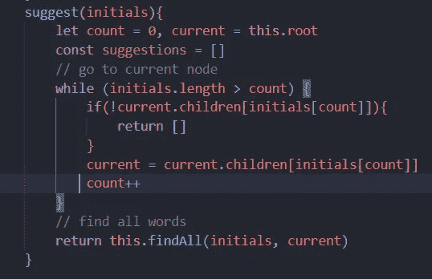
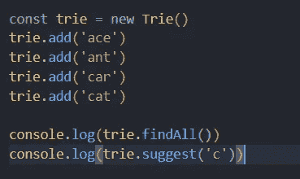

# Trie —用于自动完成的数据结构

> 原文：<https://javascript.plainenglish.io/trie-data-structure-for-your-autocomplete-79f9d37d3dde?source=collection_archive---------3----------------------->


Photo by [Kevin Crosby](https://unsplash.com/@kfcrosby?utm_source=medium&utm_medium=referral) on [Unsplash](https://unsplash.com?utm_source=medium&utm_medium=referral)

# 介绍

今天我们将关注一个特殊的数据结构，这是我几天前遇到的，它在处理自动完成和部分搜索时非常有效。数据结构的名称是`trie graph`阅读更多关于数据结构的信息[在这里](https://en.wikipedia.org/wiki/Trie)

## 用例

让我们来讨论一些实际的东西，它们是这种数据结构的衍生物

*   自动完成
*   预测文本
*   近似匹配

## 定义

数据结构的名字来源于短语**的过时拼写，我们搜索单个短语并找到它们的对应关系或我们正在寻找的实际输出**

数据将以树状的方式存储，其中我们将有一个节点连接到 26 个节点，每个节点将定义各自的英文字符。我们可以通过添加数字或任何其他字母或**特殊字符(空格、逗号)**系列作为节点来穷尽列表

例如，如果我们有任何数据集，我们正在寻找一个词来查找，下面是数据将被存储和查找的结构



Decision tree example for any string to find. Here “test”

## 时间和空间复杂性

线性搜索的传统时间复杂度是 O(c ),其中 c 是字符串中出现的字符总数

在我们的例子中，我们需要找到一些情况的复杂性

我们可以使用预取方式，预先创建所有 26 个节点，也可以在没有正确的值时进行创建

为了增加时间复杂度，将为 O(N ),其中 N 是单词中的总字符数。对于搜索，时间复杂度将是 O(N ),其中 N 是单词中的总字符数

因为我们总是描述每个字符上的节点的大小，所以现在寻找所有来自首字母的组合将与 O(N)相同

数据结构的空间复杂度是 O(m×n ),其中 m 是总字数，n 是平均/最高字数长度

# 编写数据结构

## 结节

在图中，每个元素都是一个节点类的实例，该节点类具有诸如`value`、`children`和`isEndOfWord`的属性

这就是 Node 类的样子，可爱又简单。我们将`children`保持为 Hashmap，它将通过内部的节点实例指向值



Node class for trie

## 特里

在节点之后，我们需要绘制一个包含方法和一组要处理的节点的类。在它的构造函数中，我们将保留可以指向 null 的节点的根，其余的我们将基于方法进行配置



Trie class

在构造函数中，我们有一个指向空值的根节点，基于方法，我们将更新堆栈

## 插入 Trie

要在 Trie 中插入一个单词，我们需要遍历根节点中的每个元素，然后转到我们想要添加子节点的节点，如果我们没有找到任何节点，那么我们将在运行时创建它



add-method for Trie

## 在 Trie 中查找所有项目

现在，我们已经完成了插入功能，我们可以通过创建 find 方法来检查是否添加了所有内容。在这里，我使用回溯和`isEndOfWord`键来检查我们是否在保持当前短语追加的同时对结尾做出了反应



find all method implementation

## 建议

在我们完成了添加和查找的基本操作后，我们现在可以建议一个方法来获取当前短语并返回下一个可能的条目



suggest method implementation

查找建议只需要 2 个步骤，第一步是到达选定的或当前的节点，并使用我们之前为新节点创建的 findAll 方法

## 测试

现在，我们已经了解了一切，让我们看看事情是否按预期进行。我们将一些条目添加到 Trie 中，然后用一个关键字获取所有后跟建议的条目



以下程序的输出将是

```
findAll - (4) ['ace', 'ant', 'car', 'cat']suggest - (2) ['car', 'cat']
```

# 结论

当你知道要搜索什么前缀时，数据结构是有用的。比如搜索`services`如果先知道`serv`会更好。一个常规的数组可以完成这项工作，但是数组的时间复杂度是(n×m ),因为我们需要将每个字符串与一个关键字进行匹配，然后返回建议

你可以在这里找到源代码[，我希望你能找到新的东西来学习。编码快乐！](https://github.com/Piyush-Use-Personal/trie-data-structure)

*更多内容请看*[***plain English . io***](https://plainenglish.io/)*。报名参加我们的* [***免费周报***](http://newsletter.plainenglish.io/) *。关注我们关于*[***Twitter***](https://twitter.com/inPlainEngHQ)[***LinkedIn***](https://www.linkedin.com/company/inplainenglish/)*[***YouTube***](https://www.youtube.com/channel/UCtipWUghju290NWcn8jhyAw)***，以及****[***不和***](https://discord.gg/GtDtUAvyhW) **