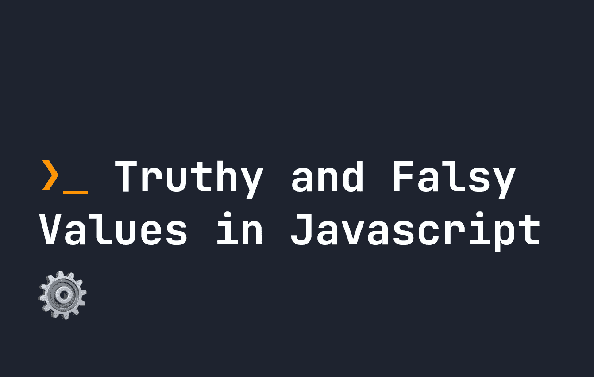

# JavaScript 中的真值和假值

> 原文：<https://javascript.plainenglish.io/truthy-and-falsy-values-in-javascript-b428549bd2fe?source=collection_archive---------21----------------------->

## 在 JavaScript 中，事情可能是真的，也可能是假的，但也可能是真的或假的。让我们看看它是如何工作的。



在 JavaScript 中，事物可以是`true`或`false`，但也可以是`truthy`或`falsy`。`truthy`和`falsy`的概念通常只在布尔上下文中被考虑，例如在`if..else`语句中，但是它们也影响 JavaScript 的其他部分——例如，从[逻辑 or 运算符](https://fjolt.com/article/javascript-logical-or)返回的内容。

# JavaScript 中 truthy 和 falsy 是什么意思？

在 JavaScript 中，如果某个东西可以转换成`false`，那么它就被认为是`falsy`。同理，一个东西如果不被认为是`falsy`，那么它就是`truthy`。虽然`falsy`可能看起来像一个模糊的陈述，但它实际上有一个具体的定义。以下数值被视为`falsy`:

*   `false`
*   `0`或`-0`或`0n`
*   任何空字符串，即`""`
*   `null`
*   `undefined`
*   `NaN`

同样，任何不等于这些的都被认为是`truthy`，例如:

*   任何物体，即`{}`或`[]`。
*   任何非零数字。
*   任何非空字符串。
*   任何非`null`、`undefined`或`NaN`值。

# 真理和谬误的使用

`truthy`和`falsy`值在 JavaScript 逻辑中有含义。比如布尔设置中任何可以转换为`truthy`的东西(比如`if..else`)都会转换为`true`，对于`falsy`语句也是如此。

例如，下面的`if`语句是`true`，仅仅因为`"1"`是`truthy`语句:

```
if("1") {
    console.log('ok');
}
```

如果语句改为说`if(0)`，它将返回 false，因为`0`是`falsy`。当你开始接触 JavaScript 时，你会发现到处都有对`truthy`和`falsy`的引用，所以现在熟悉一下这个概念是有好处的。

*更多内容看* [***说白了就是 io***](https://plainenglish.io/) *。报名参加我们的* [***免费周报***](http://newsletter.plainenglish.io/) *。关注我们关于*[***Twitter***](https://twitter.com/inPlainEngHQ)**和*[***LinkedIn***](https://www.linkedin.com/company/inplainenglish/)*。查看我们的* [***社区不和谐***](https://discord.gg/GtDtUAvyhW) *加入我们的* [***人才集体***](https://inplainenglish.pallet.com/talent/welcome) *。**