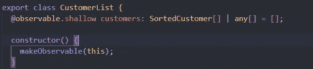
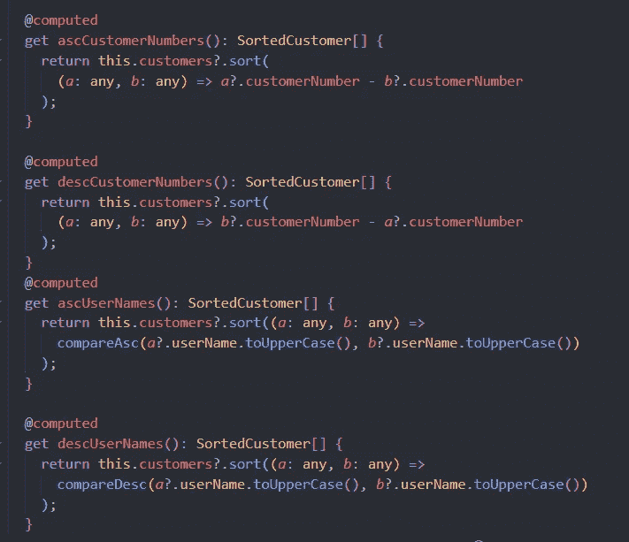

# 尝试使用 MobX 而不是 Redux 进行状态管理

> 原文：<https://javascript.plainenglish.io/try-mobx-instead-of-redux-for-your-state-management-2120d3239c6f?source=collection_archive---------13----------------------->

MobX 是一个久经考验的库，它通过透明地应用函数式反应式编程(TFRP)使状态管理变得简单和可伸缩。MobX 背后的理念很简单:

1.  直截了当:编写最少的、没有样板文件的代码，抓住你的意图。
2.  轻松实现最佳渲染:在运行时跟踪对数据的所有更改和使用，构建一个依赖树来捕获状态和输出之间的所有关系。
3.  架构自由:MobX 是非独立的，允许您在任何 UI 框架之外管理应用程序状态。

> 安装: **MobX 可以在任何 ES5 环境下工作，包括浏览器和 node . js**React 绑定有两种，mobx-react-lite 只支持功能组件，而 mobx-react 也支持基于类的组件。将适合您的用例的绑定附加到*纱线*或 *NPM* 命令: `$ yarn add mobx mobx-react`

> MobX 的要点:

***状态*** :状态就像保存一个值的电子表格单元格。将状态存储在您喜欢的任何数据结构中:普通对象、数组、类、循环数据结构或引用。这对 MobX 的运作来说无关紧要。只要确保所有想要随时间改变的属性都被标记为可观察的，这样 MobX 就可以跟踪它们。" @可观察"

***动作:*** 一个*动作*是改变*状态*的任何一段代码。用户事件、后端数据推送、预定事件等。动作就像用户在电子表格单元格中输入新值。建议您将任何改变 observable 的代码标记为一个[动作](https://mobx.js.org/actions.html)。这样，MobX 可以自动应用事务，轻松获得最佳性能。" @动作"

***推导:*** *任何能够从*态*中推导出来而没有任何进一步相互作用的东西都是推导。衍生以多种形式存在:*

*   *用户界面*
*   *导出数据*，如剩余待办事项的数量
*   *后端集成*，例如向服务器发送更改

MobX 区分了两种类型的派生:

*   ***反应*，状态改变时需要自动发生的副作用(命令式和反应式编程之间的桥梁)**

**当开始使用 MobX 时，人们倾向于过度使用反应。黄金法则是，如果您想基于当前状态创建一个值，请始终使用*。" @computed "***

> ******MobX 核心******

***属性、整个对象、数组、地图和集合都可以被观察到。使对象可观察的基础是使用 makeObservable 为每个属性指定一个注释。最重要的注释是:***

*   ******可观察的*** 定义了存储状态的可跟踪字段。***
*   ******动作*** 将方法标记为将修改状态的动作。***
*   ******computed*** 标记一个 getter，它将从状态中获取新的事实并缓存其输出。***

1.  ******make observable******

***它可以用来捕获*现有的*对象属性，并使它们可被观察到。任何 JavaScript 对象(包括类实例)都可以传入目标。通常 makeObservable 用在类的构造函数中，它的第一个参数是这样的。annotations 参数将注释[映射到每个成员。注意，当使用](https://mobx.js.org/observable-state.html#available-annotations)[装饰器](https://mobx.js.org/enabling-decorators.html)时，可以省略 annotations 参数。***

******

***推理规则:***

*   ***所有*拥有的*属性变得可观察。***
*   ***所有的 getters 都变成计算的。***
*   ***所有的设定者都变成了行动者。***
*   ***原型上的所有*功能变为自动动作。****
*   ***原型上的所有*发电机功能变为流量。(请注意，在某些 transpiler 配置中，生成器函数是不可检测的，如果 flow 没有按预期工作，请确保显式指定 flow。)****
*   ***overrides 参数中标记为 false 的成员将不会被注释。例如，将它用于标识符等只读字段。***

*****2*。可观察的******

***用法:可观察的(源，覆盖？，选项？)***

***可观察注释也可以作为一个函数来调用，以使整个对象立即可观察。源对象将被克隆，所有成员都将成为可观察的，类似于 makeAutoObservable 所做的。同样，可以提供覆盖映射来指定特定成员的注释。查看上面的代码块中的示例。***

******3。使用动作*更新状态*****

***用法:action *(注释)||* action(fn) || action(name，fn)***

***所有应用程序都有操作。动作是修改状态的任何一段代码。原则上，动作总是响应事件而发生。例如，一个按钮被点击，一些输入被改变，一个 WebSocket 消息到达，等等。***

******

******4。用计算机导出信息******

***用法:computed *(注释)||* computed(选项)*(注释)||* computed(fn，选项？)***

***计算值可用于从其他可观测值中获得信息。它们缓慢地进行计算，缓存它们的输出，并且只有在底层的某个可观察值发生变化时才重新计算。如果它们没有被任何东西观察到，它们就会完全中止。***

***从概念上讲，它们与电子表格中的公式非常相似，不可小觑。它们有助于减少您必须存储的状态数量，并且是高度优化的。尽可能使用它们。***

***计算值可以通过用 Computed 注释 JavaScript [getters](https://developer.mozilla.org/en-US/docs/Web/JavaScript/Reference/Functions/get) 来创建。使用 makeObservable 将 getter 声明为 computed。或者@computed 如果您希望所有 getters 都自动声明为 computed，您可以使用 makeAutoObservable、Observable 或 extendObservable。***

******

***The above example nicely demonstrates the benefits of a computed value, it acts as a caching point.***

> ***R ***eact 积分******

***用法:***

***从“mobx-react-lite”//或“mobx-react”导入{ observer }。***

***const my component = observer(props = > ReactElement)***

******

***or you can use useObserver Hook from mobx-react***

***observer HoC 自动为 React 组件订阅渲染过程中使用的任何可观察对象。因此，当相关的可观测量发生变化时，组件将自动重新呈现。它还确保组件在没有相关更改时不会重新呈现。因此，组件可访问但未实际读取的可观察对象不会导致重新呈现。***

***在实践中，这使得 MobX 应用程序开箱即可得到很好的优化，它们通常不需要任何额外的代码来防止过度渲染。***

> ******React 打字稿 App 中的用法******

***上面你已经看到了我们的 App.tsx，提到了，为什么我们用了 observer。我们还需要整个应用程序中状态管理的上下文。不要忘记在 tsConfig.json 文件的 compilerOptions 中添加-“allowSyntheticDefaultImports”:true、-。***

******

***index.ts***

***我们需要用商店包装我们的应用程序，以便在整个应用程序中使用商店的价值。***

******

***StoreContex.ts***

***从 react 导入 createContext 和 useContext。CustomerList 将来自我们的商店，这是我们使用 mobX 创建的。你也可以创建一个自定义挂钩来使用商店，如左图所示。***

> *****让我们创建自己的商店。首先从 mobX 导入必要的注释。然后创建一个可观察的商店。*****

***从“mobx”导入{ action，computed，makeObservable，observable }；***

******

***SortedCustomer 是一个界面，根据我们从服务器上获得的数据创建。***

> ******创建动作 Crud 操作******

******

***Read the Data***

******

***Create a new Data***

******

***Delete a data***

************

***Derivation from the existing state with computed annotation. It is good for caching.***

> ***我们已经创建了我们的存储、操作和计算值。但是我们如何在组件中使用它们呢？***

***从导入{ useStore }../context/StoreContex "；***

***在反应组分中:***

******

***usage of store***

***const customer list = use store()；然后我们可以使用像***customer list . get customers()***或***customer list . asccustomernumbers******

> ******优化 React 组件渲染:******

1.  ***使用许多小组件:observer 组件将跟踪它们使用的所有值，并在其中任何一个值发生变化时重新呈现。因此，组件越小，它们需要重新渲染的变化就越小。这意味着用户界面的更多部分有可能彼此独立地呈现。***
2.  ***在专用组件中呈现列表:在呈现大型集合时尤其如此。React 在呈现大型集合方面是出了名的糟糕，因为协调器必须在每次集合更改时评估由集合产生的组件。因此，建议使用只映射集合并呈现它的组件，而不呈现其他内容。***
3.  ***不要使用数组索引作为键:如果需要的话，为你的对象生成 id。***
4.  ***后期取消引用值:***

***较慢:<displayname name="{person.name}"></displayname>***

***更快:<displayname person="{person}"></displayname>***

***感谢耐心阅读。如果你给我反馈，我会很高兴。你可以从我的[user interface-MobX-Example GitHub 资源库](https://github.com/emrekrt1655/UserInterface-MobX-Example)中找到该项目的代码。***

****更多内容请看* [***说白了就是***](http://plainenglish.io/) *。报名参加我们的* [***免费每周简讯***](http://newsletter.plainenglish.io/) *。在我们的* [***社区***](https://discord.gg/GtDtUAvyhW) *获得独家获得写作机会和建议。****