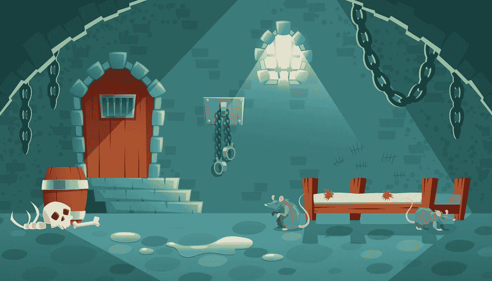
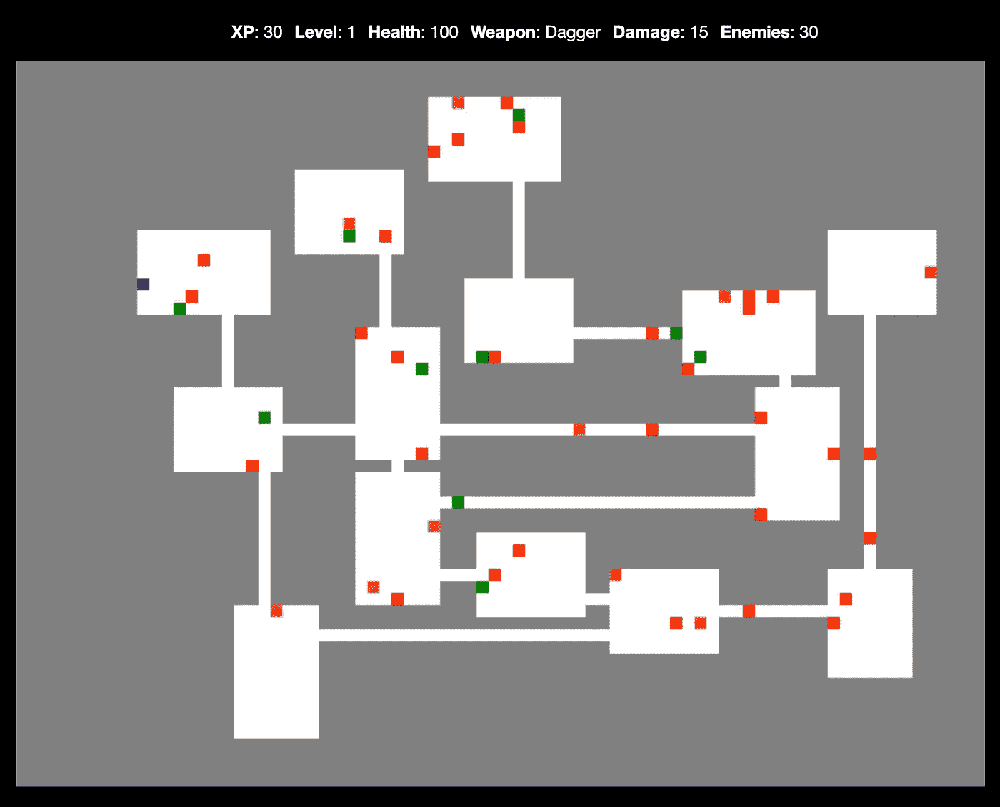
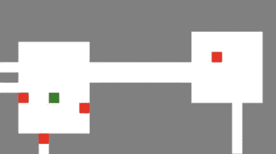
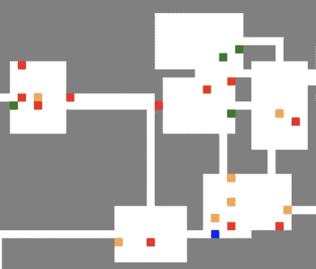

# 将段落放置在 JavaScript Roguelike 中

> 原文：<https://javascript.plainenglish.io/tuning-passage-placement-algorithm-in-a-javascript-roguelike-ae6273d9366f?source=collection_archive---------15----------------------->



Designed by [vectorpocket](https://www.freepik.com/vectorpocket) on [freepik](https://freepik.com)

在过去的一个月左右的时间里，我一直在开发实验性的 rogue likes——带有程序生成的地下城的 2D 冒险游戏。我的[初始游戏](/how-to-build-a-dungeon-crawler-game-with-javascript-57189bdd9f08)创建了看起来像洞穴的关卡，而最近的[游戏](/how-to-build-a-dungeon-crawler-game-with-javascript-57189bdd9f08)由狭窄通道连接的房间组成，如下图所示。



A roguelike with rooms connected by hallways.

拥有由算法生成的关卡的好处是你每次都会得到不同的关卡，这有助于保持游戏的新鲜感。也就是说，一个巨大的挑战是找出如何修复由于某种原因看起来关闭的地下城布局。

当我一次又一次刷新浏览器以查看算法产生的各种关卡设计时，一个突出的问题是不同宽度的段落的存在。虽然目的是使狭窄的通道有一个瓷砖的宽度，但由于多个通道彼此相邻，一些通道最终有两个或更多的瓷砖宽。



Paths of different widths.

让我澄清一下，我不反对宽度为两个、三个或四个瓷砖的通道——但是对于这个特定的游戏，我希望保持通道宽度一致。我还发现，当两条或多条路径被允许靠近时，它们可能会导致混乱的形成，如下图所示。



An example of a dungeon level that bothered me.

虽然上面的迷宫可能看起来很有趣，但不均匀的宽度加上道路和房间的融合导致了缺乏秩序，这让我感到困扰。

在看了许多这种看起来很奇怪的地牢之后，我决定增加一个限制条件，不允许两个通道长时间在一起。一个通道与另一个通道相邻有几块瓷砖可能没问题，但是我想避免让五块或更多的瓷砖在一起。

在这篇文章中，我们将研究一种方法来检查地下城中的新路径是否与现有路径相邻。

# 项目文件

虽然本文涵盖了一个更大的游戏项目的一部分，但是每个阶段都有自己的起始代码目录——所以您可以直接进入阶段 3，而无需任何前期工作。

要下载项目目录，可以去这个 [Git repo](https://github.com/nevkatz/js-roguelike-rooms) ，点击*代码*，点击*下载 ZIP。*或者，您可以从命令行克隆它:

```
git clone [https://github.com/nevkatz/js-roguelike-rooms.git](https://github.com/nevkatz/js-roguelike-rooms.git)
```

在下载的 repo 中，有一个`phase-3-separate-paths`目录，您可以使用以下布局在其中工作。

```
phase-3-separate-paths
  |
  *--index.html
  |
  *--css 
  |   |
  |   *--style.css
  |
  *--js 
      |
      *--script.js
      |
      *--game.js
      |
      *--**room.js**
      |
      *--**path.js**
```

在这个阶段 3 的目录中，前面阶段的所有方法都已经完成了，这将使您有时间完成手头的任务。

*   在包含`Room`类的`room.js`中，我们将添加两个方法——`placePathX`和`placePathY`。每个人都为一条不相邻的路径选择一个位置。
*   同样在`room.js`，我们会从`addPathVert`调用`placePathX`，从`addPathHoriz`调用`placePathY`。
*   在包含`Path`类的`path.js`中，我们将编写两个方法——`isAdjacentVert`和`isAdjacentHoriz`。每种方法都检查一条路径是否与另一条路径相邻五块或更多。

您还可以在`phase-4-corners`目录和`solutions`目录中预览完成的代码。

# 上层社会

我们将使用三个类:`Game`、`Room`和`Path`。虽然在[渲染室](/rendering-roguelike-rooms-with-javascript-8a2dc58f3b63)文章中详细讨论了它们，但是让我们在这里集中讨论最相关的属性。

## 比赛

`Game`类有一个名为`map`的 2D 数组，用来存储地下城的配置。例如，如果一个 4x3 的房间被添加到一个 6x5 的地图的中心，`map`数组将如下所示:

```
[[0,0,0,0,0,0],
 [0,1,1,1,1,0],
 [0,1,1,1,1,0],
 [0,1,1,1,1,0],
 [0,0,0,0,0,0]]
```

它还有一个存储`Room`对象的`rooms`数组。

## 房间

`Room`类有两个我们将使用的依赖于位置的属性:

*   `start`，存储房间左上角的`x`和`y`值的对象
*   `end`，存储房间右下角的`x`和`y`值的对象。

可以实例化一个`Room`类，并如下设置它的开始和结束属性:

```
let myRoom = new Room();myRoom.start = {x:1,y:1};
myRoom.end = {x:4,y:4};
```

## 房间邻居

room 类还有一个名为`neighbors`的数组属性，它存储它所连接的`Room`对象。我们检查这个数组，以确保我们没有两次连接同一个房间，如果出现新的连接，每个房间都会将另一个房间添加到它的`rooms`数组中，如下面的`addNeighbors`所示。

```
Room.prototype.addNeighbor = function(room) {
   this.neighbors.push(room);
   room.neighbors.push(this);
}
```

下面是你如何将它添加到主`Game`对象中。

```
myGame.rooms.push(myRoom);
```

## 小路

`Path`类也有`start`和`end`坐标。考虑一下下面有路径的小游戏地图。

```
[[0,0,0,0,0,0,0],
 [1,1,1,1,1,1,1],
 [0,0,0,0,0,0,0]]
```

您可以实例化这样的路径，并将其添加到游戏中，如下所示:

```
let myPath = new Path();myRoom.start = {x:0,y:1};
myRoom.end = {x:6,y:1};myGame.addPath(myPath);
```

该路径还有一个布尔属性`allowed`，以`false`开始，但是如果它能在地图上找到一个地方，就会被设置为`true`。

这些是本教程中每个类需要了解的主要方面。虽然我们将为`Path`和`Room`类编写方法，但是每个类的属性都是完整的。

# 到目前为止代码是如何工作的

在我们卷起袖子准备代码之前，让我们看看游戏是如何生成房间并连接它们的。

在我们的`script.js`文件中，我们有一个名为`generateMapRooms`的函数。在这里生成多个房间后，每个`Room`对象通过调用`findFacingRooms`方法搜索其正对面的房间，这在[添加段落](/connecting-rooms-in-a-javascript-roguelike-8e6212c54c9)文章中有详细介绍。

Generate map rooms.

如果一个房间与另一个房间相连，就会产生一连串的其他方法。下面是一张快速示意图，展示了通话顺序。

```
generateMapRooms
 |
 *--findFacingRooms
    |
    *--connectRoom
       |
       *--directConnect
          |
          *--addVertPath
          |
          OR
          |
          *--addHorizPath
```

下面是一个快速分类:

*   一个`Room`对象调用`findFacingRooms`方法来寻找它对面的房间。
*   如果一个`Room`对象找到一个面对的房间，它调用`connectRoom`，后者又调用`directConnect`。
*   `directConnect`方法连接彼此面对的房间。
*   如果一个房间在另一个房间的北面或南面，`directConnect`将调用`addVertPath`。
*   如果两个房间并排，`directConnect`会调用`addHorizPath`。

现在让我们跳过`connectRoom`和`directConnect`，看看添加路径是如何发生的。

## 添加垂直路径

在起始代码中，`addVertPath`方法使用一个叫做`placePath`的简单方法找到路径的`x`坐标，我们最终会替换它。

The initial addVertPath method.

正如您所看到的，在我们获得垂直路径的起点和终点之后，就调用了`placePath`方法。

```
path.start.y = Math.min(this.end.y,room.end.y) + 1;path.end.y = Math.max(this.start.y,room.start.y) - 1;**path = this.placePath(room, path, wall, 'x');**
```

## 处理成功

假设`placePath`已经将有效的`x`坐标添加到路径对象的`start`和`end`属性中，路径的`allowed`状态将被设置为`true`。

然后游戏可以通过调用`addPath`将路径添加到`map` 2D 数组中。由于`addNeighbor`调用，每个房间将另一个房间添加到它的`rooms`数组中。

```
if (path.allowed) { game.addPath(path); this.addNeighbor(room);
}
```

这就是`placePath`的作用——现在让我们看看它是如何工作的。

## 通过寻找平均值来放置路径

对于垂直路径，`placePath`的目标是找出水平放置的位置。

The placePath method.

为了确定位置，它使用一种叫做`possibleExits`的方法获得最低和最高可能的`x`值。

```
let {start, end} = this.possibleExits(room, axis, wall);
```

然后将路径的`x`坐标设为这两个值的平均值。

```
path.start[axis] = path.end[axis] = Math.round((start+end)/2);
```

然后，它通过将`allowed`设置为`true`来批准路径，并返回`path`对象。

```
path.allowed = true;return path;
```

`addHorizPath`方法也以同样的方式使用`placePath`来确定水平路径的`y`值。

代码审查到此结束——现在让我们编写一种放置路径的新方法。

# 更仔细地放置路径

`placePath`的问题是它没有考虑到其他路径的邻近性——所以现在我们将编写我们的第一个替换方法`placePathX`，它在决定在哪里放置新的垂直路径之前检查现有的邻近路径。

让我们使用下面的代码启动`placePathX`方法。

```
Room.prototype.placePathX = function(room,path,wall) {

   let {start, end} = this.possibleExits(room,'x',wall);
}
```

与`placePath`一样，`placePathX`的目标是为我们的垂直路径找到一个有效的`x`坐标，并使用`findPossibleExits`获得可能的最低和最高的`x`值。

但相似之处仅此而已。

如下图所示，`placePathX`不会找到最高和最低`x`坐标的平均值。相反，它遍历所有可能的`x`值，直到找到一个*而不是*使该路径与另一个路径相邻的值。继续添加下面的循环。

```
let {start, end} = this.possibleExits(room,'x',wall);for (var x = start; x <= end; ++x) { **if (!path.isAdjacentVert(x)) {** **// grab the first path that is not adjacent** **}**
}
```

正如你所看到的，它使用一种新的方法来检查一条路径是否与另一条路径相邻，我们将很快编写这种方法:`isAdjacentVert`。

一旦找到有效的`x`坐标，它就批准路径，设置路径的水平位置，跳出循环，然后返回！

```
let {start, end} = this.possibleExits(room,'x',wall);for (var x = start; x <= end; ++x) {if (!path.isAdjacentVert(x)) {
    **path.allowed = true;
    path.start.x = path.end.x = x;
    break;**
  }
}
**return path;**
```

下面是`addVertPath`调用的完整的`placePathX`方法。

The full placePathX method.

下面是放置垂直路径所需的方法调用的快速回顾。

```
directConnect
  |
  *--addVertPath
       |
       *--placePathX (just written)
            |
            *--possibleExits
                 |
               (loop through possible x values)
                 |
                 *--isAdjacentVert (up next)
```

## 检查相邻路径

现在我们已经有了方法调用的鸟瞰图，让我们再次深入代码，在`path.js`中编写`isAdjacentVert`。

一个路径对象使用这个方法来判断它是否在一个特定的`x`坐标上与另一个路径相邻。下面是完整的代码，然后是它的工作原理。

让我们一点一点地浏览这段代码。

一开始，我们将瓷砖的最大数量限制为五个。

```
const limit = 5;
```

然后，我们将`x`值设置为可选参数`testX`或路径的起始`x`坐标。

```
const x = testX || this.start.x;
```

由于有了`for...of [-1,1]`语句，我们检查了路径两次:一次检查左边的瓦片，一次检查右边的瓦片。

```
for (var diff of [-1, 1]) {
```

每次，我们初始化一个`consecutive`变量，它存储我们已经找到的连续图块的数量。

```
let consecutive = 0;
```

*   使用这个循环，我们沿着这条路走，检查左边或右边是否有地砖。

```
for (var y = this.start.y; y <= this.end.y; ++y) {if (game.map[y][x + diff] != WALL_CODE) {
```

*   如果是，则`consecutive`递增。

```
consecutive++;
```

*   如果`consecutive`等于瓦限，我们立即返回。

```
if (consecutive == limit) {
   return true;
}
```

如果墙砖打破了地砖的条纹，我们将`consecutive`重置为零。

```
consecutive = 0;
```

如果我们完成了循环，这意味着没有五个或更多瓷砖的相邻路径，所以我们返回`false`。

这就是我们如何测试一条路径是否与另一条路径垂直相邻。

现在`placePathX`有了它的`isAdjacentVert`助手，我们可以让它工作了。

在`addVertPath`中，让我们去掉这一行:

```
path = this.placePath(room, path, wall, 'x');
```

换成这个:

```
path = this.placePathX(room, path, wall);
```

下面是更新后的方法。

The revised addVertPath method.

# 处理水平路径

现在我们已经学习了如何添加一个垂直路径，看看你是否能自己编写下面的方法:

*   在`room.js`中写上`placePathY`
*   在`path.js`中写入`isAdjacentHoriz`
*   将`placePathY`换成`room.js`中的`addPathHoriz`

都准备好了吗？太好了，现在让我们看一下它们应该是什么样子。

## 绘制水平路径

下面是修改后的`addHorizPath`方法，用来添加水平路径。它的结构与`addVertPath`相同，但找到了路径起点和终点的`x`坐标。然后使用新的`placePathY`方法计算出将其放置在`y`轴上的位置。

The revised addHorizPath method.

## 放置水平路径

下面是`placePathY`，与`placePathX`类似，但调用了一个`isAdjacentHoriz`，是`isAdjacentVert`的新的水平对应物。

在这个方法中，现在是您获取和迭代的`y`坐标。

```
let {start, end} = this.possibleExits(room,'y', wall);for (var y = start; y <= end; ++y) { // if not adjacent to another path, 
  // set position, approve, and break out of loop
}
```

## 检查上下相邻的路径

方法以同样的方式检查我们路径上面和下面的路径。

# 测试您的工作

在这一点上，你调好的路径放置算法应该是工作的，所以这是一个伟大的时间来尝试它。下面是一个代码笔供你比较你的作品，当然，你也可以查看`phase-4-corners`和`solutions`版本进行比较。

The new version that uses the path placement algorithm.

如果你和我们一起更新了游戏，恭喜你！您已经完成了教程。如果你有兴趣更进一步，试试下一个关于如何连接对角房间的方法。

[](/javascript-roguelikes-connecting-diagonal-dungeon-rooms-using-corners-79f460f96615) [## 用 JavaScript 的 Roguelike 构建带角的段落

### 让我们用两条在拐角处相交的小路把对角交叉的房间连接起来。

javascript.plainenglish.io](/javascript-roguelikes-connecting-diagonal-dungeon-rooms-using-corners-79f460f96615) 

无论您是否阅读过这篇文章或者和我们一起编写过代码，我希望这篇文章能够增强您对如何调整过程化生成算法来改进游戏的理解。日安！

*更多内容请看*[***plain English . io***](https://plainenglish.io/)*。报名参加我们的* [***免费周报***](http://newsletter.plainenglish.io/) *。关注我们关于*[***Twitter***](https://twitter.com/inPlainEngHQ)*和*[***LinkedIn***](https://www.linkedin.com/company/inplainenglish/)*。加入我们的* [***社区不和谐***](https://discord.gg/GtDtUAvyhW) *。*

*最后，考虑注册*[***Medium***](https://medium.com/@nevkatz/membership)*无限制访问我以及其他作家的文章。*