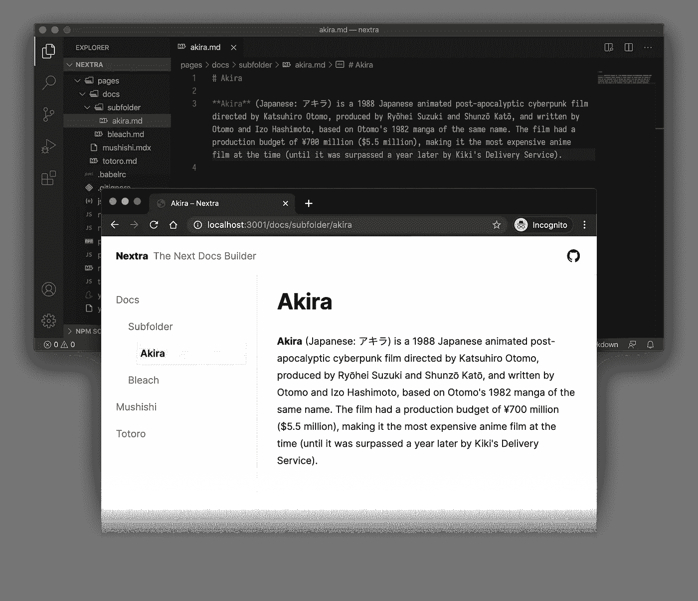
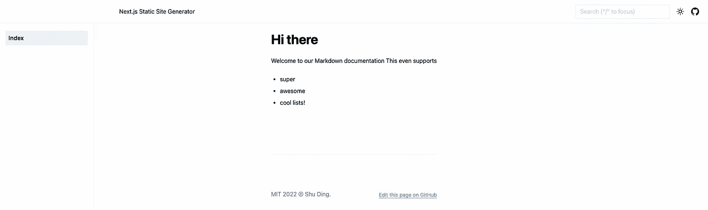

# 使用 Next.js 将 Markdown 转换为 Docs

> 原文：<https://javascript.plainenglish.io/turn-markdown-into-docs-with-next-js-10d414f215a9?source=collection_archive---------8----------------------->

如果您曾经做过更大的项目，您会知道编写和部署文档并不是最令人兴奋的部分。

在本教程中，我将向您展示如何使用 Nextra 将一个带有 markdown 页面的 Next.js 应用程序变成一个漂亮的文档页面！

您将学习如何构建和部署类似于您可以在[https://docs . lancero . app](https://docs.lancero.app/)上找到的文档！



# 我们的工具箱🧰

我们希望我们的设置尽可能简单，我们将使用的唯一东西是

*   Next.js
*   奈斯特拉

## Nextra 福利

使用 Nextra 很酷的一点是，最终，您只是在 Next.js 应用程序中编写常规的 markdown。
这意味着你可以开源你的文档，其他人也可以贡献你的文档。
对于开发者来说，这是一种易于使用的编写文档的方式，由于 GitHub 和 GitLab 等平台可以直接在浏览器中呈现 markdown，你甚至可以通过点击存储库来浏览文档。

# 入门指南👏🏻

让我们首先创建一个新的 Next.js 应用程序！

运行以下命令，并按照终端中的说明进行操作。

```
yarn create next-app
```

运行完成后，让我们添加依赖项！

```
yarn add next nextra react react-dom nextra-theme-docs
```

## 配置文件

要启动并运行 Nextra，我们需要配置 3 个文件。

在我们的`next.config.js`中，我们添加了以下设置。

之后，在 Next.js 应用程序的根目录下创建一个名为`theme.config.js`的新文件，并向其中添加以下内容。

The default theme.config.js from the Nextra documentation

设置完成后，剩下要做的就是导入 Nextra 提供的样式！找到你的`_app.js`文件，把下面的导入添加到顶部！

```
**import** 'nextra-theme-docs/style.css'
```

## 写一些文档

现在，Nextra 已经配置好了，任何`.md`或`.mdx`页面都会自动转换成页面。让我们试一试。

*   从页面文件夹中删除`index.js`
*   将`index.mdx`添加到页面文件夹。
*   添加以下降价内容！

```
**# Hi there** Welcome to our Markdown documentationThis even supports
- super
- awesome
- coollists!
```

完成所有这些更改后，您的文件夹结构应该如下所示。

```
📦 your-project
 ┣ 📂 pages
 ┃ ┣ 📜 _app.js
 ┃ ┗ 📜 index.mdx
 ┣ 📂 public
 ┣ 📜 .eslintrc.json
 ┣ 📜 .gitignore
 ┣ 📜 next.config.js
 ┣ 📜 package.json
 ┣ 📜 theme.config.js
 ┗ 📜 yarn.lock
```

用`yarn dev`启动你的 Next.js 开发服务器，看看华丽的结果吧！



The result of our first setup

# 让它成为你自己的🎨

我们在设置过程中创建的那个`theme.config.js`文件是让您的文档成为您自己的文档的地方。它允许你改变你的应用程序的几乎每个方面。从浏览器中显示的标题，到有人打开页面时导航栏的初始状态。

选项太多了，在这里写出来会占用太多空间。如果你想了解更多，你可以在 [Nextra 文档](https://nextra.vercel.app/themes/docs/configuration)上找到！

# 正在部署。🚀

Nextra 的酷之处在于，你甚至不需要任何奇怪的设置、构建工具或配置。因为它实际上只是一个简单的 Next.js 应用程序，所以你可以使用默认的 Next.js 配置添加 [Vercel](https://vercel.com/) 就可以了！

*更多内容看* [***说白了就是***](http://plainenglish.io/) *。报名参加我们的* [***免费周报***](http://newsletter.plainenglish.io/) *。在我们的* [***社区获得独家访问写作机会和建议***](https://discord.gg/GtDtUAvyhW) *。*