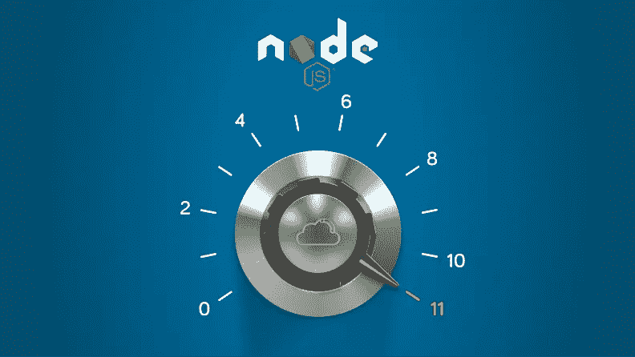
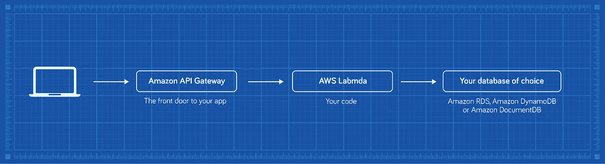
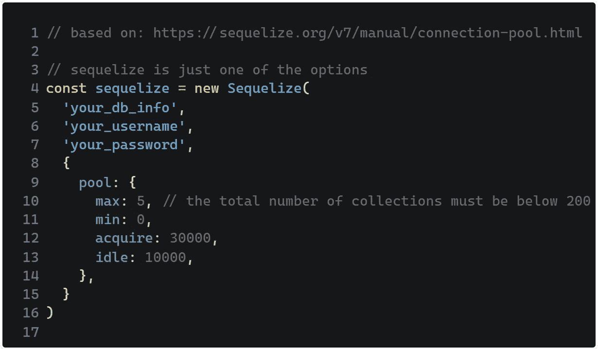
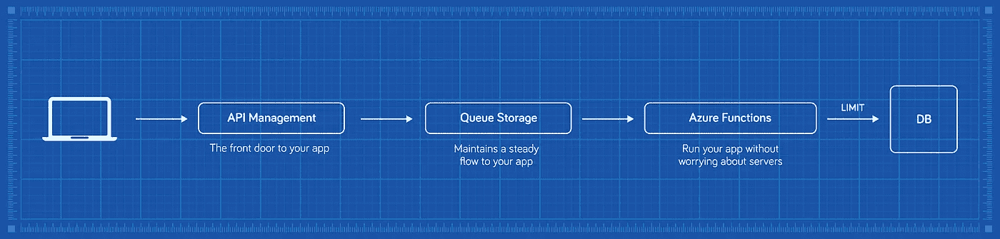

# 使用无服务器将 Node.js 应用增加到 11 个

> 原文：<https://javascript.plainenglish.io/turning-node-js-apps-up-to-eleven-with-serverless-12cdbbfb6ca9?source=collection_archive---------14----------------------->

**总结**

*   因为很多原因，Node.js 是云之王；
*   在不同的情况下，您可以选择几种无服务器设置；
*   从使用连接到数据库的 AWS Lambda 运行 Amazon API 网关到更复杂的工作流；
*   如果您需要个性化的解决方案，[请随时联系我们。](https://www.itmagination.com/contact)

JavaScript 是编程语言的鲁德尼·丹泽菲尔德— [*它没有得到任何尊重*](https://www.youtube.com/watch?v=ZCVR_ajL_Eo) 。

事实是，Node.js 打破了这种模式，使 JavaScript 成为顶级编程语言。构建在 Node.js 之上的新工具减轻了开发现代 web 应用程序的痛苦，如果您还没有加入 js 宣传行列，那么是时候加入了。

为什么？企业软件的特点是，除了企业规模之外，它几乎是为任何东西而构建的。Node.js 的真实情况是，它比 ASP.NET、ASP.NET Core 或 Spring 这些老用户有优势。首先，它对可用资源的利用比以前的热门应用好得多:ASP.NET、[ASP.NET 核心](https://www.youtube.com/watch?v=J-xqz_ZM9Wg)或 Spring 应用。Node 背后的思想是让它同时处理多个连接。这两个优势使它非常适合云计算世界。

当然，正如一些人会指出的那样，只要你继续投入更多的钱，你的旧应用程序会工作得很好；不管它们是如何建造的。不过，如果你想提高效率，我们可以为你提供一个解决方案。最近，无服务器方法风靡一时，而且有几个很好的理由。

首先，我们的应用程序变得更加可靠，因为它们共享的部分更少了。如果一切都停止为你工作，那么要么有一个大规模的灾难，或者你是一个坏运气的象征。其次，通过使用云提供商，您只需为您的服务实际工作的时间付费，而这些时间从来不是 100%的时间。最后，你不必维护或支付公司的服务器；姑且称之为“玛丽近藤编程”。扔掉那些不能点燃喜悦的东西。

# 无服务器

AWS、Azure 或 GCP 上可供你使用的服务数量可能会让你很快失去理智。幸运的是，我们已经请我们的云能力主管 [Maciej Gos](https://www.linkedin.com/in/maciejgos/) 将一切归结为您可以选择的可重用模式。

在决定了你的需求之后，构建一切并不比把复杂的拼图拼在一起复杂多少。如果您在本部分之后需要任何澄清，请随时[给我们打电话或发电子邮件](https://www.itmagination.com/contact) —我们将很乐意详细解释一切。

# 最低可行产品

如果你优先考虑快速迭代，并且不想为不必要的事情而烦恼，这就是你想要的选择。

设置简单明了，因此您的团队可以主要关注敏捷开发。当你的用户导航到你的 web 应用程序时，他们将通过 API 网关，这个网关就像是你的 Lambdas 的前门。从那里，他们将直接与数据库通信。在这种情况下，游戏的名称是简单，并且设置时间很短

当然，你可能很快会发现你的设置还不够，可能想要改进它，或者你已经有了一个拥有大量用户的产品。为了简单起见，我们牺牲了一些方面。让我们在下一节展示一个更完整的解决方案。

# 提高 MVP

你在上面看到的是一个比以前更全面的蓝图。这是你最终会转向的东西。所有额外花费的钱都用于使一切更可靠。

这里，在这个蓝图中，亚马逊简单队列服务(SQS)在应用程序代码之前。我们希望确保您的 web 应用程序的数据流不会过载。这个小小的改变使设置比原来更加可靠。

对您有好处的最后一件事是对同时连接到您的数据库的连接数进行限制。他们就像人类一样:我们可以同时做多少事情是有限度的。如果我们想一次做太多事情，我们会失败得很惨。

How to limit the number of concurrent (at the same time) connections to our database. JavaScript.

# 如果我为来自世界各地的客户服务呢？

在这种情况下，任何延迟，哪怕只有 10 毫秒，都是你的敌人。即使它们看起来不明显，减少它们会改善你的客户的整体感觉——这是白花钱！

为了实现这一点，我们可以在边缘运行我们的代码；这只是云架构师更贴近用户的一种奇特方式。Lambda@Edge 在响应时间方面的确很神奇。[如果你能把你的访问者等待你的页面加载的时间**只减少 10 毫秒**，那么你的**收入将会显著增加**——相当于必应工程师的年薪。](http://www.robotics.stanford.edu/users/ronnyk/2013%20controlledExperimentsAtScale.pdf)相比之下，**平均眨眼时间是 10 毫秒的 30 倍。**

# 摘要

云为我们提供了一种简单的方法来为您的服务创建架构，而无需担心您传统上必须关注的许多事情。更新您的服务器、雇佣专门的员工和电力成本只是不再让您头疼的几个方面。

此外，我们今天在蓝图上给你展示的内容基本上就足够了。如果您觉得需要个性化的云设计，请随时联系 ITMAGINATION 的云能力领导者 [Maciej Gos](https://www.linkedin.com/in/maciejgos/) 。

# 额外:为蓝色人群准备的东西

云提供商的问题在于，他们以不同的名义提供几乎相同的服务。因此，Azure 提供了与 AWS 类似的解决方案。如果微软的云是你的那杯茶，那么我们为你准备了额外的方案。这些服务在某种程度上做相同的工作，所以这里没有太多要说的。如果你理解了所有以前的蓝图，你也会理解这个。‍

# 阅读更多

这篇文章是探索全栈 JavaScript 开发系列文章的一部分，点击这里查看我们的其他文章:

[JavaScript、Node.js 和 TypeScript 在企业中的完整指南&初创公司](https://www.itmagination.com/ebooks/the-complete-guide-to-javascript-node-js-and-typescript-in-enterprises-startups)

[JavaScript、TypeScript 和 Node.js 的完整历史](https://www.itmagination.com/blog/the-complete-history-of-javascript-typescript-and-node-js)

[创业公司爱 Node.js 的 5 个理由](https://www.itmagination.com/blog/5-reasons-why-startups-love-node-js)[node . js 如何改变企业软件工程的世界](https://www.itmagination.com/blog/5-reasons-why-startups-love-node-js)

[久经考验的 JavaScript 框架—第 1 部分](https://www.itmagination.com/blog/5-reasons-why-startups-love-node-js) [久经考验的 JavaScript 框架—第 2 部分，Web3。](https://www.itmagination.com/blog/5-reasons-why-startups-love-node-js)

[久经考验的 JavaScript 框架——第 3 部分，数据科学。](https://www.itmagination.com/blog/5-reasons-why-startups-love-node-js)

*原载于***。**

**更多内容请看*[***plain English . io***](http://plainenglish.io/)*。报名参加我们的* [***免费周报***](http://newsletter.plainenglish.io/) *。在我们的* [***社区***](https://discord.gg/GtDtUAvyhW) *获得独家获得写作机会和建议。**