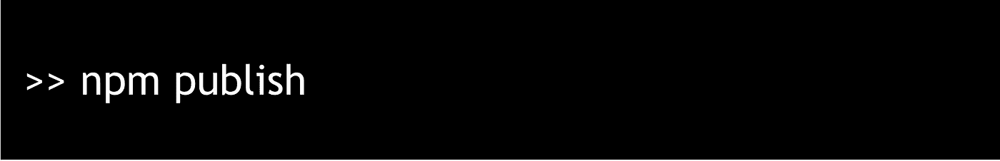

# 使用 React & Rollup 创建您自己的组件库

> 原文：<https://javascript.plainenglish.io/tutorial-create-your-own-component-library-with-react-and-rollup-b8978d885297?source=collection_archive---------1----------------------->

## 关于创建自己的组件库以更好地管理团队代码的教程。

作为一名软件工程师，我们喜欢使用组件，因为它们帮助我们快速编码，提高生产率，减少开发时间。我常用的一个库是 [Material UI](https://mui.com/material-ui/) 。但是你有没有想过它们是如何构建和维护的？

如果您的开发团队正在成长，并且您不希望您的 repo 中有成对的代码，那么您应该在代码变得难以管理之前尽早开始创建一个组件库。让我们找出方法。

## 一点介绍

嗨，我在 [mez.ink](https://mez.ink) 工作，


mez.ink

我在这里领导前端。我们提供 100K+微型网站，满足每月 1000 万的流量。我们使用的技术栈是 NextJS、React、GoLang、AWS 等等。

在前端，我们有不同的存储库为多个页面，如
-个人资料页面。
-静态网站和
-网络仪表盘。

上述每个存储库的规模都在快速增长，我们每周都在添加新的特性，管理可重用组件、它们的功能和风格指南是非常困难的。我们的很多设计在代码库中都是相似的，比如页眉、页脚、按钮等等。所以我们想出了一个主意，创建我们自己的组件库。

# 先决条件

你应该是一个前端开发，肯定知道

*   NPM
*   饭桶
*   反应

好了，让我们从创建一个名为 my-super-library 的目录开始，用下面的命令初始化这个项目


这将为您创建一个 package.json，包含项目名称和版本等。现在是时候为我们的库安装一些依赖项了。


# 创建组件

让我们创建一个带有几个导航链接和一个徽标的标题。我们将首先创建一个如图所示的文件夹结构


> 嗯，没有必要有如图所示的相同的文件夹结构，你也可以创建不同的结构。

好，让我们从一些开始，你可以简单地复制粘贴下面的代码到你的文件中，因为它是不言自明的

*   src/索引. ts

```
export * from './components';
```

*   src/components/index.ts

```
export { default as Header }  from './Header';
```

*   src/components/Header/index.ts

```
export { default } from './Header';
```

让我们为 Header 组件编写一些代码，我们将使用 react 和 emotion 来创建相同的组件。

为了保持简单，我创建了一个带有 logo 和一些链接的标题，为了样式，我使用了 css-in-js ( [emotion](https://emotion.sh) )

上面的代码非常简单，我们只是写了一些 CSS，并用 emotion 创建了一些样式化的组件。我们将在本文的后半部分讨论如何为模块库设置情感。

## 添加类型脚本

我们还没有在项目中初始化 typescript。让我们用一个简单的命令来完成它

```
npx tsc --init
```

这将在我们项目的根目录下创建一个`tsconfig.json`文件，它包含一些默认的 Typescript 规则。你可能不需要所有的选项，我正在分享我的`tsconfig`文件，你可以在你的项目中使用相同的选项，或者根据你的需要进行编辑。

如果您注意到第 20 行，这是可选的，如果您使用情感库进行样式设计，这是必需的，其余的规则非常常见，不言自明。

# 设置汇总

让我们将 [rollup](https://rollupjs.org/guide/en/) 添加到我们的项目中，如果你没有听说过它，这与 webpack 非常相似。这两个工具可以做相同的工作，但 webpack 用于捆绑应用程序，而 rollup 最适合捆绑库。这就是我选择易拉宝的原因。Rollup 也像 webpack 一样使用插件，对于这个项目，我们将使用一些插件进行捆绑。

*   @ [*汇总/插件-节点-解析*](https://www.npmjs.com/package/@rollup/plugin-node-resolve)
*   @ [*汇总/插件-类型脚本*](https://www.npmjs.com/package/@rollup/plugin-typescript)
*   @[*roll up/plugin-commonjs*](https://www.npmjs.com/package/@rollup/plugin-commonjs)
*   [*汇总-插件-dts*](https://www.npmjs.com/package/rollup-plugin-dts)
*   [*roll up-plugin-postcss*](https://www.npmjs.com/package/rollup-plugin-postcss)
*   [*roll up-plugin-terser*](https://www.npmjs.com/package/rollup-plugin-terser)
*   [*汇总-插件-对等-deps-外部*](https://www.npmjs.com/package/rollup-plugin-peer-deps-external)

有了它，让我们安装汇总和它的插件

```
npm install rollup @rollup/plugin-node-resolve @rollup/plugin-typescript @rollup/plugin-commonjs rollup-plugin-dts --save-dev
```

让我们在项目的根目录下创建一个`rollup.config.js`。我们将添加一些配置来捆绑我们的库。

在文件中，我们正在导入我们安装的插件。
我们还导入了`package.json`来引用变量以输出`cjs`和`esm`包。
`src/index.ts`是我们库的入口文件，它导出我们所有的组件。我们将为我们的用户创建`es6`和`commonjs`模块，这样他们可以选择最适合他们的。
我们在导出的阵列上有两个配置对象。

*   这首先定义了我们库的实际 Javascript 代码是如何生成的。(参考第 17 行)
*   第二个对象定义了我们的库类型是如何分布的，并使用了`dts`插件来实现。(参见第 42 行)

哦，我们没有在第 21 行和第 26 行提到的`package.json`中添加`main`和`module`键。所以我们的 package.json 看起来会像这样

这是我们在本教程中使用的`package.json`文件的样本。

需要记住的事情不多

*   “main”—commonjs 模块的输出路径
*   “模块”es6 模块的输出路径
*   “文件”——我们整个库的输出目录
*   “类型”——我们库的类型的位置
*   “脚本”——还定义了一个名为 *rollup* 的新脚本。这将运行带有-c 标志的汇总软件包，该标志表示“使用汇总配置文件”。所以运行这一个将是`npm run rollup`。

如果以上所有设置都已完成，我们可以通过运行
`npm run rollup`来构建库。如果一切都配置正确，rollup 将会正确运行，您将会看到在项目的根目录下创建了一个`dist`目录。

# **发布库**

库被创建，是时候发布和使用它了。为了发布，我们将使用 NPM 和 GitHub 来托管相同的内容。

在发布之前，让我们在 GitHub 上创建一个资源库，你可以给它起任何你喜欢的名字，我已经把它命名为`my-components`。
因为我们已经准备好了代码，所以请查看 GitHub 上关于如何在新的存储库中提交代码的说明。

现在，我们需要用以下更改来更新 package.json 文件

正如您所看到的，我们已经用我们选择的 repo 名称更新了名称，并且还添加了关于我们库所在位置的注册信息。
即使完成了所有这些步骤，我们仍然没有发布这个包。为此，我们需要在本地 NPM 中添加一些配置和设置。

## 的角色。npmrc 文件

我们需要对`.npmrc`文件做一些修改。它位于系统级，必须存在于主目录中，您可以通过`vi ~./npmrc`打开或创建它。下面是您需要粘贴到`.npmrc`中的代码

```
registry=https://registry.npmjs.org/
@YOUR_GITHUB_USERNAME:registry=https://npm.pkg.github.com/
//npm.pkg.github.com/:_authToken=YOUR_AUTH_TOKEN
```

请确保替换您的 _GITHUB_USERNAME 和 _AUTH_TOKEN。我们还没有创建身份验证令牌。创建一个非常简单，登录你的 Github 个人资料:进入设置->开发者设置->个人访问令牌，点击*生成令牌*。

给它一个与您的项目描述相匹配的名称。一旦创建，令牌将只显示一次。复制并保存在你的笔记或其他文件中。用生成的令牌替换 AUUTH_TOKEN。

一切就绪。现在，您可以运行下面的命令



耶，我们刚刚发布了我们库的第一个 0.0.1 版本。

为了确认这一点，你可以在 GitHub 的仪表盘上点击“packages ”,你可以查看你发布的所有包。

# 使用我们的图书馆

我们的图书馆是活的，现在我们想利用它。但是这里有一个问题，如果你的包是一个私有包，当人们试图安装它时，他们会得到一个 404 错误。
这些用户需要添加一个`~/.npmrc`文件，其中包含我们之前添加的相同信息。
但是如果它是一个公共包，只需使用基本命令就可以很容易地安装

`npm install @aatif/my-components --save`

现在转到您安装了这个库的项目，并可以开始使用我们的组件，如下所示


当你运行项目时，你会看到标题。

恭喜你！我们现在拥有了使用 TypeScript 创建和分发 React 组件库的所有工具！

我希望您已经很好地理解了创建和发布库。
*在下一篇文章中，我们将学习如何设计组件的样式，并利用故事书为库*创建一个有用的指南。

***如果你喜欢这样，一定要关注我的*** [***推特***](https://twitter.com/aatifbandey) ***！并订阅我的***[***Mezink***](https://mez.ink/aatif)***获取更多更新。***