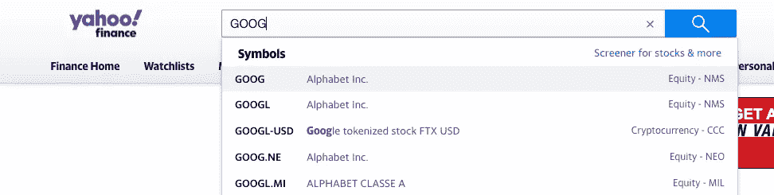
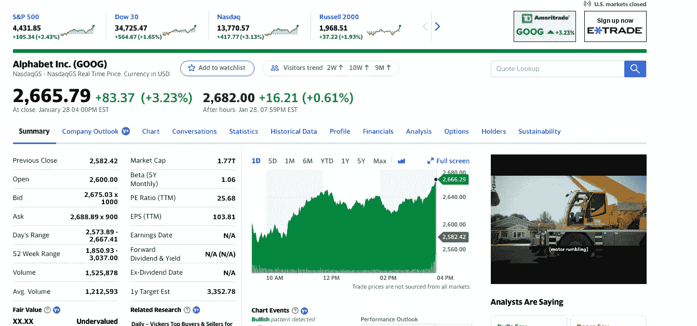
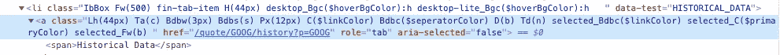
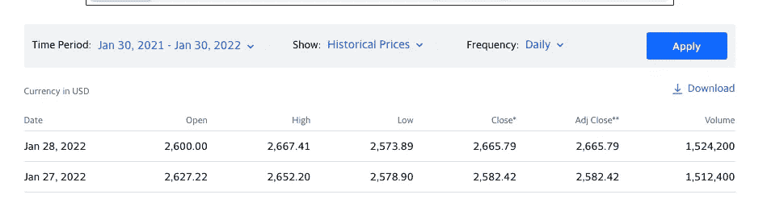

# 如何用 JavaScript 的剧作家创建你的第一个 Web 自动化

> 原文：<https://javascript.plainenglish.io/tutorial-how-to-create-your-first-web-automation-with-playwright-in-javascript-38026461a161?source=collection_archive---------1----------------------->

## 这是一个高层次的介绍，介绍了如何使用一个叫做剧作家的 JavaScript 库在 web 浏览器中创建自动化。

# 介绍

每天，世界变得更加自动化。从平凡的日常任务到复杂的制造过程，再到协调我们最大城市交通的路灯，自动化无处不在。虽然我可能有点偏见(为一家专注于自动化的公司工作)，但我真的相信所有行业的专业人员都应该寻求获得自动化省时任务所需的基本技术技能。它不仅让你成为雇主更有价值的资产，而且在自动化世界里，新的商业机会比比皆是。

本文从较高的层次介绍了如何使用名为剧作家的 JavaScript 库在 web 浏览器中创建自动化。

# 我们要做什么？

我们从简单的开始。本教程的最终产品将是导航到 Yahoo！为给定的[股票代码](https://www.investopedia.com/ask/answers/12/what-is-a-stock-ticker.asp)下载去年历史数据的 CSV 文件。

# 设置您的项目

首先，创建一个新目录:

```
mkdir first-web-automation
cd first-web-automation
```

其次，我们需要初始化我们的项目并安装剧作家:

```
yarn init
(answer prompts)
yarn add playwright
```

如果你不熟悉 NPM 脚本，它们是你可以在你的包中定义的脚本(仅仅是包含`package.json`的根文件夹)，使得你的代码更容易运行、测试和调试。现在让我们添加一个脚本来运行我们的项目。将这个片段添加到您的`package.json`中间`"license": ... and "dependencies": ...`

```
"scripts": {
    "start": "node main.js"
},
```

在这个`scripts`块中定义的任何脚本都可以运行:

```
yarn <script-name>
```

# 让我们写一些代码

让我们从最基本的开始，让剧作家打开一个网络浏览器。创建一个文件`main.js`，并在你的编辑器中打开它。让我们创建这个基本结构:

```
const { chromium } = require('playwright');void main().then(() => process.exit(0));async function main() {
    let browser = await chromium.launch({ headless: false });
    let page = await browser.newPage();
    await page.waitForTimeout(5000);
}
```

在我解释这段代码做什么之前，先保存文件，然后运行我们的`yarn start`命令。试着理解正在发生的事情。浏览器窗口应该出现 5 秒钟，然后关闭，节点进程应该退出。

启动 Chromium 浏览器的一个实例。传递选项`headless: false`会强制库打开浏览器的图形窗口。没有它，浏览器将在后台运行。`browser.newPage()`实际上告诉浏览器实例打开一个新页面。`page.waitForTimeout(5000)`只是告诉页面在函数结束和进程退出之前等待 5 秒钟(以毫秒为单位)。

`void main().then(() => process.exit(0))`是一种运行异步功能的方式，定义如下。当来自`main`的承诺完成时，流程将退出，成功退出代码为 0。

# 在浏览器中导航

现在让我们加快一点速度。我们现在可以用一个命令启动一个浏览器并打开一个页面。剧作家还提供了在互联网上导航的简单方法。在函数`main`中，删除对`waitForTimeout`的调用，并添加以下代码:

```
async function main() {
    ...
    await page.goto('https://finance.yahoo.com');
}
```

保存您的更改，并再次运行`yarn start`。你现在会看到浏览器导航到雅虎的主页！收盘前融资。最终，我们希望能够将股票代码作为参数传入并搜索该代码，但是现在，让我们将 GOOG 硬编码为要搜索的代码。但是我们如何搜索一个股票呢？

# 寻找最佳路径

你可能会想:“显然，我们只需要在页面顶部的搜索框中自动输入文本”。这不一定是不正确的，但也不是最佳的。让我们观察一下在搜索栏中搜索 GOOG 时浏览器的行为。



当你以 GOOG 作为搜索条件按下“Enter”时，请注意浏览器中的 URL 是如何变化的。网址从`[https://finance.yahoo.com](https://finance.yahoo.com)`变为`[https://finance.yahoo.com/](https://finance.yahoo.com/)quote/GOOG?p=GOOG&.tscrc=fin-srch`。这准确地告诉我们如何只使用 URL 和一些查询字符串参数直接导航到给定的 ticker。现在，我已经与其他几个 tickers 验证了这确实是一种模式，但在您的自动化代码中考虑这种模式之前，确保您完全掌握给定网站的搜索机制是一个好的做法。我们可以通过将`main()`更新为以下内容来说明这种情况:

```
async function main() {
    let ticker = 'GOOG';
    let browser = await chromium.launch({ headless: false });
    let page = await browser.newPage();
    let url = `https://finance.yahoo.com/quote/${ticker}?p=${ticker}&.tscrc=fin-srch`;
    await page.goto(url);
    await page.waitForTimeout(5000);
}
```

我们添加了一个`waitForTimeout`，这样在它关闭之前，我们有 5 秒钟的时间来理解自动化的最终状态。再次运行您的代码，看看会发生什么。这一次，它应该立即导航到 GOOG 网页:



很酷吧。FWIW，剧作家是一个实际上是为测试而构建的库，但它也倾向于成为一个伟大的通用自动化工具。

# 查找历史数据

列表中的下一步是让我们导航到这个页面的区域，在这里我们可以下载过去一年中 GOOG 的历史数据。如您所见，该页面上有一个名为“历史数据”的选项卡，这可能是我们想要查看的地方。

剧作家有一个`click`方法，允许我们指定一个 DOM 元素(网页的一个特定部分，在这里是一个链接/按钮)供浏览器实例点击。如果我们在自己的浏览器中打开此页面，右键单击“历史数据”，然后单击“检查”，浏览器开发人员工具将在右侧打开。



让我们使用一个选择器，它首先定位锚元素所在的`li`。尝试将以下代码添加到`main()`:

```
async function main() {
    ...
    let selector = 'li[data-test="HISTORICAL_DATA"] > a';
    await page.click(selector);
    await page.waitForTimeout(5000);
}
```

同样，我将`waitForTimeout`移到了函数的末尾，这样我们就可以处理所有发生的事情。假设我们每次做加法都会这样做。如您所见，`click()`方法将我们带到了历史数据选项卡。但是等等…你能想到一个更简单的方法吗？回想一下我们直接导航到 GOOG ticker 页面的方式。我们能再次使用查询参数吗？果然。让我们让`main()`函数看起来更好:

```
async function main() {
    let ticker = 'GOOG';
    let browser = await chromium.launch({ headless: false });
    let page = await browser.newPage();
    let url = `https://finance.yahoo.com/quote/${ticker}/history?p=${ticker}`;
    await page.goto(url);
    await page.waitForTimeout(5000);
}
```

我们本可以在搜索栏中放下搜索文本，点击“提交”按钮，然后点击“历史数据”选项卡，但是由于 HTTP 的工作方式，我们可以直接导航到我们正在寻找的历史数据。

# 用剧作家下载文件

谢天谢地(也是故意的)，雅虎！默认历史数据范围为过去一年，尽管使用剧作家也可以更改这些输入。可以看到，在主要内容区的右上角“历史数据”页面上有一个“下载”按钮:



为了使用剧作家下载文件，我们需要在点击按钮之前监听“下载”事件。让我们添加以下代码:

```
async function main() {
    ...
    let [download] = Promise.all([
        page.waitForEvent('download');
        page.locator(`a[download="${ticker}.csv"]`);
    ]);
    await download.saveAs('./data.csv');
}
```

运行这段代码后，您现在应该会看到一个文件，该文件出现在您的项目目录中，包含去年来自 GOOG 的所有历史数据。瞧啊。

# 参数化自动化

我承诺我们要做的最后一件事是允许我们为任何给定的股票自动运行这个程序。对于这样一个简单的脚本，允许参数传递的一个很好的方式是`argparse`库。它允许我们轻松地指定命令行参数，并在代码中使用它们。现在让我们通过运行以下命令来安装它:

```
yarn add argparse
```

让我们添加一个名为`ticker`的参数。最终的代码应该如下所示:

```
const { chromium } = require('playwright');
const { ArgumentParser } = require('argparse');let parser = new ArgumentParser();
parser.add_argument('--ticker', { type: String, required: true });const { ticker } = parser.parse_args();void main()
    .then(() => process.exit(0))
    .catch((err) => {
        console.error(err);
        process.exit(1);
    });async function main() {
    let browser = await chromium.launch({ headless: false });
    let page = await browser.newPage();
    let url = `https://finance.yahoo.com/quote/${ticker}/history?p=${ticker}`;
    await page.goto(url);
    let [download] = await Promise.all([
        page.waitForEvent('download');
        page.locator(`a[download="${ticker}.csv"]`).click();
    ]);
    await download.saveAs('./data.csv');
    await page.waitForTimeout(5000);
}
```

我们可以这样运行我们的最终产品:

```
yarn start --ticker GOOG
```

# 结尾部分

我真心希望你喜欢我的第一篇文章，并从中学习到一些东西。如果有任何不清楚的地方或者你被卡住了，请*在评论中联系*。

以下是一些有趣的方法，你可以扩展这个例子进行更多的练习:

*   以编程方式下载这个文件的更简单的方法是什么？提示:HTTP
*   允许按给定的日期范围进行搜索
*   对获得的数据进行分类，并提供一些有意义的输出

这里有一个到剧作家文档的链接。向剧作家社区大声呼吁一些顶尖的文件。

*更多内容看* [***说白了。报名参加我们的***](http://plainenglish.io/) **[***免费周报***](http://newsletter.plainenglish.io/) *。在我们的* [***社区获得独家访问写作机会和建议***](https://discord.gg/GtDtUAvyhW) *。***