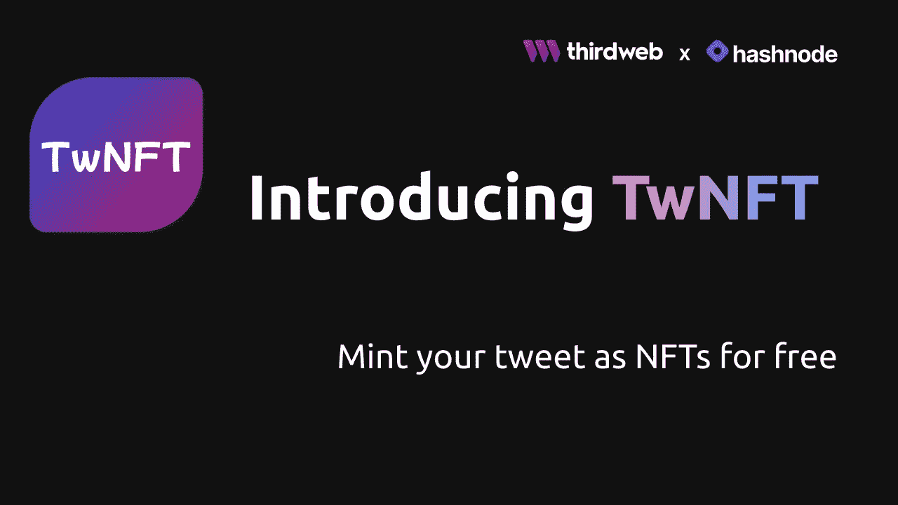
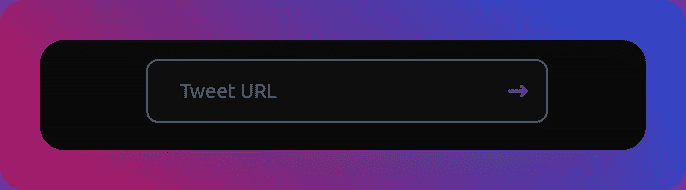
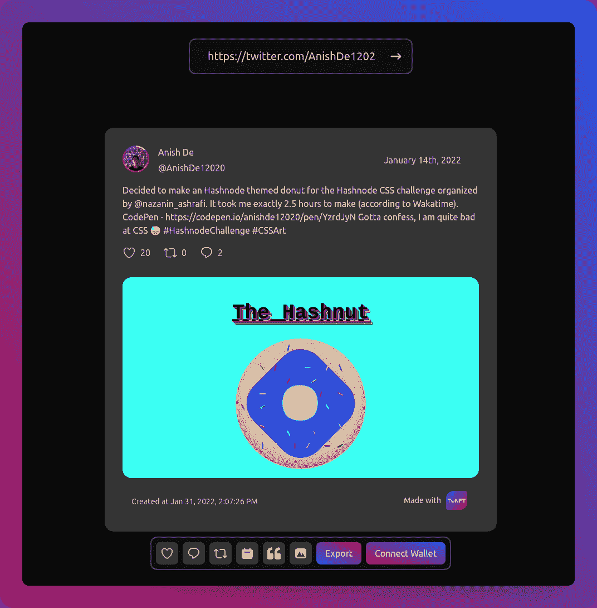
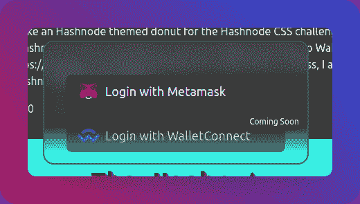
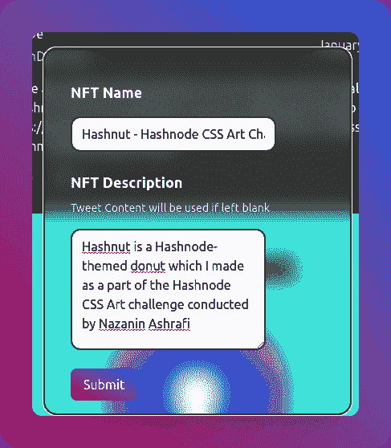
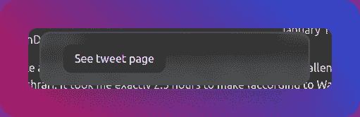
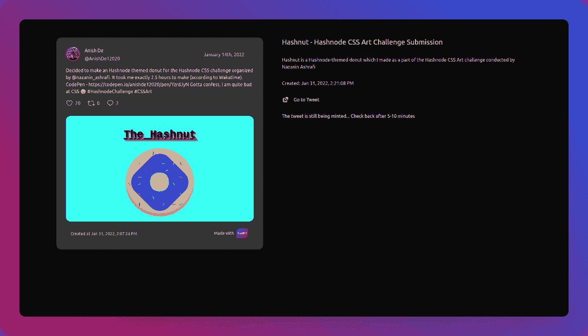
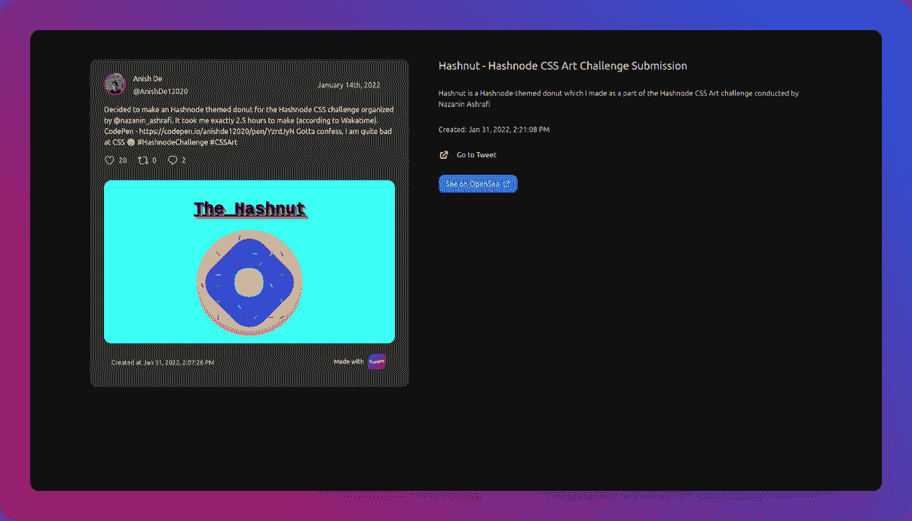

# TwNFT 简介——轻松免费地将您的 Tweets 制作成 NFT

> 原文：<https://javascript.plainenglish.io/twnft-mint-your-tweets-as-nfts-easily-and-for-free-849e1c0594e0?source=collection_archive---------10----------------------->

## TwNFT 是一个简单的 web 应用程序，可以让您轻松免费地创建 NFT。然后你可以对 NFT 做任何你想做的事情。

# 🤔什么是 TwNFT？

TwNFT 是一个简单的网络应用程序，它允许你免费将你的推文制作成**NFT**。

这是我为[第三届 web x Hashnode 黑客马拉松](https://townhall.hashnode.com/thirdweb-hackathon)提交的作品。

[现场演示](https://twnft.vercel.app/) / [GitHub 资源库](https://github.com/AnishDe12020/twnft)

# 🌐什么是 Thirdweb？

开始使用 web3 可能会很困难，尽管它是当今的热门话题。我们需要编写一个叫做智能契约的东西，它是在区块链上执行操作所必需的。为了在以太坊区块链上编写智能合约，我们需要学习一种新的编程语言，叫做 [Solidity](https://soliditylang.org/) 。

Thirdweb 为我们提供了由该领域专业人士撰写的智能合同。他们还为我们提供了 SDK，让我们可以轻松使用这些软件。这使得具有基本编程知识的人可以轻松地制作 web3 应用程序。Thirdweb 还负责将这些智能合同部署到区块链。

现在让我们回到 TwNFT。

# 💡这个想法是从哪里来的？

这个黑客马拉松早在 2022 年 1 月 5 日就宣布了，但我直到 1 月 18 日才得到一个确切的想法。那么它是从哪里来的呢？

我在 Chris Bongers 的一篇文章中看到了一个名为 GitNFT 的应用。GitNFT 让你把 git commits 当作 NFT，这时我想，“把 tweets 当作 NFT 怎么样？”。

我做了一些研究，没有发现任何应用程序这样做，所以这是一个黄金机会给我🤩

# 📚技术堆栈

我为 TwNFT 使用了哪些技术？

*   [next js]([https://nextjs.org/](https://nextjs.org/))为网站
*   造型用【TailwindCSS】([https://tailwindcss.com/](https://tailwindcss.com/))
*   用于 Twitter 认证和数据存储的[Firebase]([https://firebase.google.com/](https://firebase.google.com/))
*   部署前端的【威瑟】([https://vercel.com/](https://vercel.com/))
*   【快递】([https://www.npmjs.com/package/express](https://www.npmjs.com/package/express))为后端
*   [Heroku]([https://dashboard.heroku.com/apps](https://dashboard.heroku.com/apps))来部署后端

当然还有…

*   [third web]([https://thirdweb.com/](https://thirdweb.com/))用于 web3 认证和铸造 NFT

# twnft 是如何工作的？

人们需要首先登录 Twitter，然后输入他们想要发布的推文的 URL。在刻印之前，也可以自定义将要刻印的图像。人们需要给 NFT 指定一个名称，并可选地添加一个描述(否则，将使用 tweet 的内容)。

在铸造之前，我们有两个检查，以确保铸造 NFT 的人拥有该推文(这就是为什么他们被要求登录 Twitter ),以及该推文之前是否被铸造过。我们不允许多次发布同一条推文，这是为了确保每条 NFT 都是独一无二的。

现在让我们更深入地研究一下 web3 部分

## 使用 Thirdweb 更深入地了解 web3 身份验证

使用 Thirdweb 设置身份验证就像添加大约 10 行代码一样简单。我正在为这个应用程序使用`[@3rdweb/hooks](https://www.npmjs.com/package/@3rdweb/hooks)`包，这是一件轻而易举的事。`[@3rdweb/react](https://www.npmjs.com/package/@3rdweb/react)`包更容易实现，因为它也打包在 UI 中。然而，如果您想要一个定制的 UI(这正是我想要的)，那么 hooks 包是一个更好的选择。

请注意，您需要使用 [ReactJS](https://reactjs.org/) 来使用任何上述软件包。

回到代码，首先，你需要添加第三个 web 提供者到应用程序中

然后，就像使用任一包提供给我们的`useWeb3()`钩子来检索`connectWallet`函数一样简单。我们现在必须用 wallet 类型调用这个函数:

这里的`injected`是针对浏览器中注入的钱包。这在大多数情况下是[元掩码](https://metamask.io/)。

关于使用 Thirdweb 实现 web3 认证的详细指南，请查看他们的官方指南[。](https://thirdweb.com/portal/guides/sign-in-with-ethereum-using-thirdweb-connectwallet)

## 通过 Thirdweb 更深入地了解 NFT

我正在使用 [Thirdweb Typescript SDK](https://www.npmjs.com/package/@3rdweb/SDK) 在服务器端创建 NFT。出于安全原因，铸造应该在服务器端进行。

使用 Thirdweb SDK 进行创作非常容易。让我们看看它是如何工作的-

首先，我们用我们的私钥初始化 SDK。一定要保守这个秘密，因为任何有你私人钥匙的人都可以打开你的钱包。我在这里用它来初始化一个钱包。

接下来，我们初始化 NFT 模块，这将让我们铸造 NFT:

最后，我们异步调用`mintTo`函数:

这里的结果给了我们 NFT 的`tokenId`。`tokenId`是该集合中 NFT 的唯一标识符。

现在，就是这样。我们铸造了一个 NFT！

更详细的指南，你可以查看 Thirdweb 的[官方指南铸造 NFT](https://thirdweb.com/portal/guides/mint-nft-collection-using-typescript-sdk) 。

# ❓，这个 NFT 模块是什么？

Thirdweb 为我们提供了许多模块，NFT 收藏模块就是其中之一。它允许你在 NFT 系列中铸造一个 NFT，这就是我们刚刚做的！这个项目的官方收藏可以在 OpenSea [这里](https://testnets.opensea.io/collection/twnft)找到。

# 使用 TwNFT 的🖱️

首先，登录 Twitter，前往 [/mint](https://twnft.vercel.app/mint) 页面。

接下来，在顶部的文本框中输入你想要发布的推文的网址，然后点击箭头:

您现在应该可以看到 NFT 的预览，有点像这样:

单击选项栏上的按钮，随意定制图像:

接下来，点击“连接钱包”按钮并连接您的 Metamask 钱包。Walletconnect 支持即将推出。

你现在应该在选项栏上看到一个写着“薄荷 NFT”而不是“连接钱包”的按钮。单击该按钮将弹出这个模式，您可以在其中填写 NFT 的名称，并可以选择添加描述:

一段时间后，您应该可以选择转到 tweet 页面:

tweet 页面看起来有点像这样(第一次加载时，请给图片一些时间):

请注意，它显示 NFT 仍在铸造中，需要 5-10 分钟。5-10 分钟后再回来查看，这是页面应该看起来的样子:

NFT 现在在你的钱包里，你可以做任何事情，包括上市出售，出售，甚至转移到另一个钱包。

# 🖊️旁注

目前，TwNFT 正在 Rinkeby 测试网络上运行。这意味着所有制造的 NFT 将在测试网络上，而不是在主网络上。

然而，这在将来会发生变化。

# ✨结论

在过去的 13 天里，制作 TwNFT、消除 bug 和实现特性是一次伟大的旅程。很想知道进展如何😆

再见，祝你愉快😁🤞

# 🔗重要链接

-【tw NFT】([【https://twnft.vercel.app/】](https://twnft.vercel.app/))
-【tw NFT GitHub 资源库】([【https://github.com/AnishDe12020/twnft】)
-【tw NFT 后端 GitHub 资源库】(](https://github.com/AnishDe12020/twnft)[【https://github.com/AnishDe12020/twnft-backend](https://github.com/AnishDe12020/twnft-backend))
-【tw NFT OpenSea collection】([https://testnets.opensea.io/collection/twnft](https://testnets.opensea.io/collection/twnft))

*原发布于*[*https://blog . anishde . dev*](https://blog.anishde.dev/twnft-mint-your-tweets-as-nfts-easily-and-for-free)*。*

*更多内容看* [***说白了就是***](http://plainenglish.io/) *。报名参加我们的* [***免费周报***](http://newsletter.plainenglish.io/) *。在我们的* [***社区***](https://discord.gg/GtDtUAvyhW) *获得独家获得写作机会和建议。*