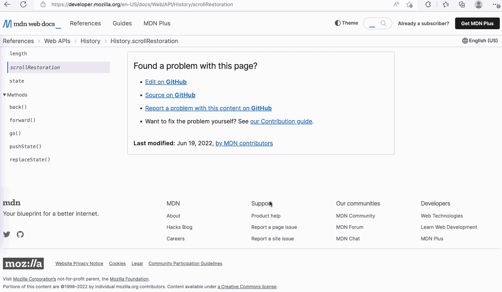
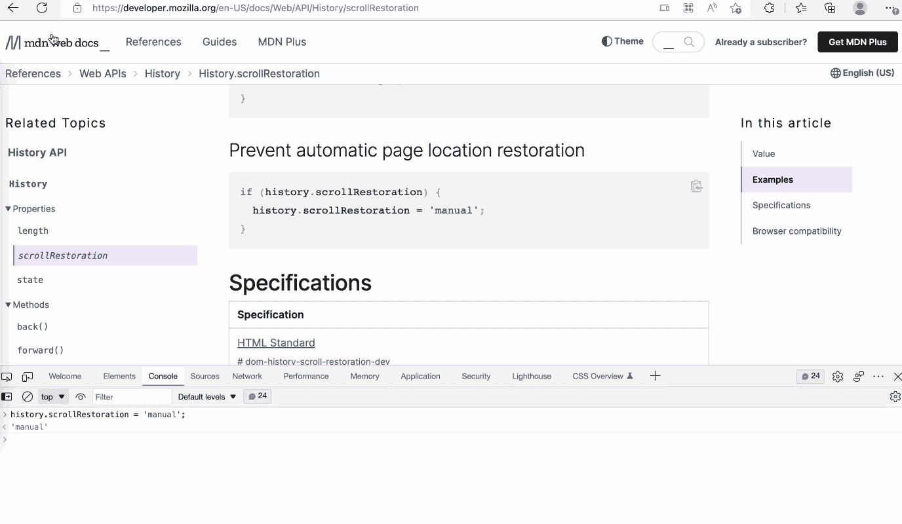

# 改善页面体验的两个历史技巧

> 原文：<https://javascript.plainenglish.io/two-tips-of-history-to-improve-page-experience-947223666f71?source=collection_archive---------10----------------------->

## 使用历史记录的 scroll restore 属性和 pushState/replaceState 的状态参数来恢复滚动位置。


Photo by [Alex Bachor](https://unsplash.com/@alxbcr?utm_source=medium&utm_medium=referral) on [Unsplash](https://unsplash.com?utm_source=medium&utm_medium=referral)

## 前言

当我们使用 chrome 前往浏览器页面时，当我们返回时，页面无法恢复到原来的浏览位置，这让我们非常恼火。有时候 chrome 手动刷新页面后会自动恢复到之前的位置，这也是不尽如人意的。

## 刷新页面时滚动到页面顶部

在现代浏览器中，当我们刷新页面时，它会自动滚动到页面的上一个浏览位置。



在某些情况下，我们希望在不自动滚动的情况下刷新页面，例如表单页面、需要显示实时数据的列表页面等。

众所周知，我们可以用 scrollTo API 滚动到页面顶部:

```
window.scrollTo({top: 0})
```

如果你不知道[history . scroll restore API](https://developer.mozilla.org/en-US/docs/Web/API/History/scrollRestoration)，这可能是实现滚动到页面顶部的一个实用方法。加载页面时，使用 scrollTo API 重置滚动位置。有时它可能不会像预期的那样工作，它可能会导致页面滚动两次。现在你可以试试这个:

```
[history.scrollRestoration](https://developer.mozilla.org/en-US/docs/Web/API/History/scrollRestoration) = 'manual'; 
```



有了这个 API，你再也不用担心页面滚动的问题了。

## 恢复单页应用程序中的滚动位置

单页应用让用户不用加载整页就可以使用网站，可能会有更好的体验。在单页应用程序中，异步加载页面数据会导致浏览器无法恢复到以前的位置。在某些情况下，部分元素滚动而不是整页滚动。我们必须自己处理滚动，不能依赖于浏览器的行为。

有很多方法可以解决这个问题，比如使用 localStorage，或者 JavaScript 全局变量。当然还有更便捷的方式，借助历史的国家属性。

当使用 history.pushState/history.replaceState,时，它接受三个参数。

```
replaceState(stateObj, unused, url);
pushState(state, unused, url);
```

**状态**参数是一个 JavaScript 对象，它与 pushState 或 replaceState 创建的新历史条目相关联。可以通过 history.state 来访问，所以我们可以在参数中存储页面滚动位置。

离开页面时，存储位置:

```
// save the position
const positionState = {
  scrollX: window.scrollX, 
  scrollY: window.scrollY,
}
window.history.replaceState(Object.assign({}, window.history.state, positionState);
// go to next page
window.history.pushState({}, '', nextPageUrl);
```

加载页面数据后，恢复位置:

```
// when data loaded and rendered
const positionState = window.history.state;
window.scrollTo(positionState.scrollX, positionState.scrollY)
```

与 Javascript 全局变量存储位置相比，这种方法的一个优点是当一个页面被重复访问时，可以正确地恢复滚动位置。比如从 A 页到 B 页，再转到 A 页，历史中会有三条记录，每条都有对应的状态。但是如果使用 JavaScript 全局变量，就很难区分页面 a 上的滚动位置记录。

## 结论

不同的 web app 页面可能存在不同的问题，但是合理使用 history . scroll restore 和 history.state 可以大大改善页面体验。您可以使用 history . scroll restore 关闭浏览器的默认还原行为，或者使用 history.state 自定义还原滚动位置的行为。

*更多内容请看*[***plain English . io***](https://plainenglish.io/)*。报名参加我们的* [***免费周报***](http://newsletter.plainenglish.io/) *。关注我们关于*[***Twitter***](https://twitter.com/inPlainEngHQ)*和*[***LinkedIn***](https://www.linkedin.com/company/inplainenglish/)*。查看我们的* [***社区不和谐***](https://discord.gg/GtDtUAvyhW) *加入我们的* [***人才集体***](https://inplainenglish.pallet.com/talent/welcome) *。*