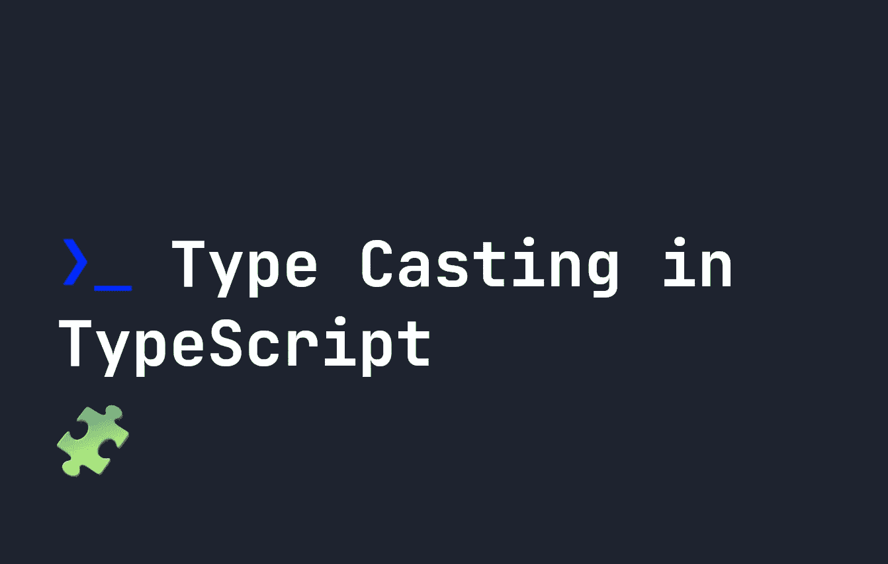

# 打字稿中的类型转换

> 原文：<https://javascript.plainenglish.io/type-casting-in-typescript-c2d95bb96582?source=collection_archive---------11----------------------->

## 当类型未知时，强制转换用于分配类型。让我们看看它是如何工作的。



有时，在 TypeScript 中，某些东西会有一个`unknown`类型，而 TypeScript 不能辨别某些东西应该是什么类型。在最基本的情况下，当一个变量被简单地赋予类型`unknown`时，就会发生这种情况。例如:

```
let text:unknown = "String Goes Here";
```

虽然我们可以看到上面内容的类型是一个`string`，但是它已经被赋予了类型`unknown`，所以 TypeScript 不知道它是什么类型。因此，当我们试图运行特定于字符串的方法时，它们将不起作用。假设我们想得到这个字符串的长度，例如:

```
let text:unknown = "string";
let value = text.length;
```

# 类型转换在 TypeScript 中如何工作

上面的代码实际上会抛出一个错误，这个错误就是`Object is of type 'unknown'.`。为了解决这个问题，我们需要使用 TypeScript 强制转换。为了在 TypeScript 中进行转换，我们使用了`as`关键字。对于这个例子，我们需要将`text`变量转换成一个字符串，因此 TypeScript 将允许我们使用`length`:

```
let text:unknown = "string";
let value = (text as string).length;
```

现在 TypeScript 会将类型大小写为`string`，我们可以使用`length`。这种编写代码的方式不太可能在现实世界中发生，但是如果您接收到未知类型的 API 响应，并且必须使其符合某个类型，则可能会发生这种情况。

另一个经常发生这种情况的地方是使用**选择器**。例如，选择一个输入并期望能够通过`value`属性找到值是很常见的:

```
let input = document.querySelector('input');
let inputValue = input.value;
```

在 TypeScript 中，这将抛出一个错误，因为`Object is possibly 'null'.`。TypeScript 为查询选择器输出提供了许多预定义的类型，但是我们也不能编写`let input:HTMLInputElement = ...`，因为输入可能是`null`。因此，我们必须将输入转换为`HTMLInputElement`以获得值:

```
let input = document.querySelector('input') as HTMLInputElement;
let inputValue = input.value;
```

# 结论

我希望你喜欢这个教程。在某些情况下，尤其是使用`querySelector`时，需要进行类型转换。这是一种对来自 API 的输出或具有`unknown`类型的变量实施特定类型限制的有用方法。

*更多内容请看*[***plain English . io***](https://plainenglish.io/)*。报名参加我们的* [***免费周报***](http://newsletter.plainenglish.io/) *。关注我们关于*[***Twitter***](https://twitter.com/inPlainEngHQ)**和*[***LinkedIn***](https://www.linkedin.com/company/inplainenglish/)*。查看我们的* [***社区不和谐***](https://discord.gg/GtDtUAvyhW) *加入我们的* [***人才集体***](https://inplainenglish.pallet.com/talent/welcome) *。**