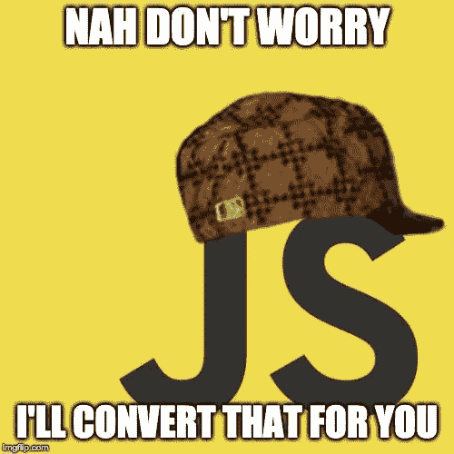
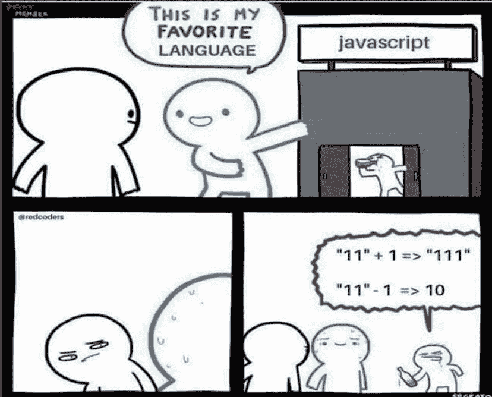
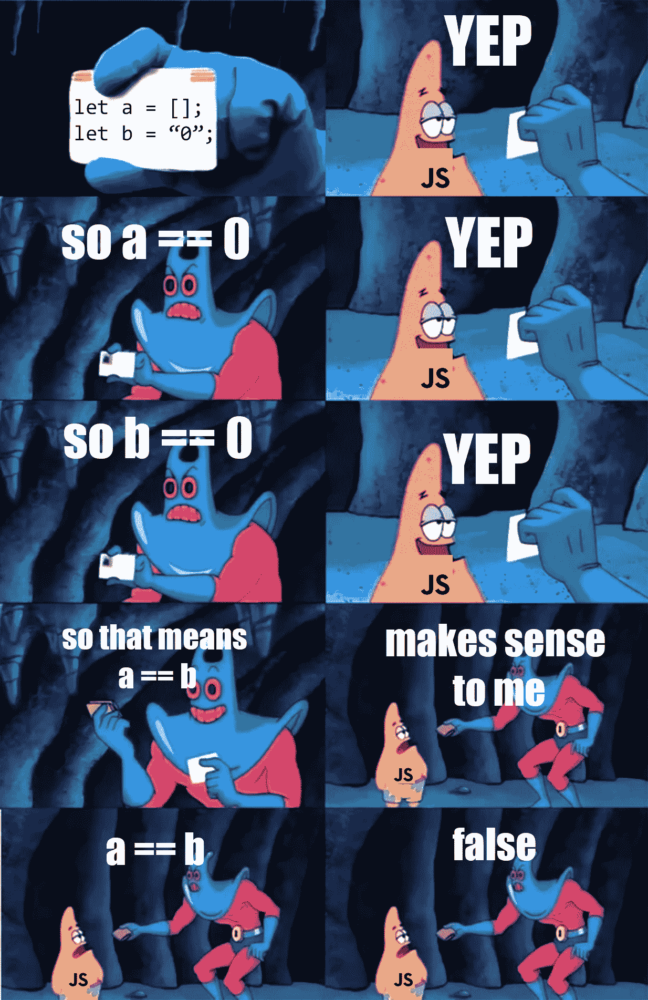

# JavaScript 中的类型强制

> 原文：<https://javascript.plainenglish.io/type-coercion-in-javascript-ef5e390d2318?source=collection_archive---------11----------------------->


虽然 JavaScript 被认为是初学者最简单的编程语言之一，但当开发人员希望 JavaScript 做一件事，而它却返回另一件事时，它也会变得令人沮丧。

如果我对数据类型不小心，我总是发现一些自动类型转换非常棘手。JavaScript 中的类型强制是一个例子，说明当我们不知道它到底是如何工作的时候，这种语言会产生意想不到的结果。希望这篇文章能对这种神秘的行为有所启发。



# JavaScript 中的类型

JavaScript 有七种基本类型:

*   `string`
*   `number`
*   `Boolean`
*   `undefined`
*   `null`
*   `Symbol`
*   `BigInt`

JavaScript 中的变量没有类型，然而，每当我们用一个值初始化一个变量时，它的类型就根据这个值来设置。

# 类型强制

JavaScript 中的类型强制只强制到`string`、`number`和`Boolean`原始类型。JavaScript 中没有办法将值类型强制为`object`或`function`。

JavaScript 有两种典型的强制形式:**隐式强制**和**显式强制**。

**隐式强制**发生在 JavaScript 将值类型强制为幕后预期类型的时候。这种类型的强制在开发人员没有注意到的情况下发生。这些是我们需要小心的。

当我们想要将值类型强制为特定类型时，就会发生显式强制。大多数时候，JavaScript 中的显式强制使用内置函数，如`String()`、`Number()`和`Boolean()`。

> **编号**

让我们看几个使用`Number()`函数的**显式强制**的例子:

```
Number("42");           // 42
Number("");             // 0
Number(true);           // 1
Number(false);          // 0
Number(null);           // 0
Number(undefined);      // NaN
```

> **字符串**

要在 JavaScript 中将一个值显式地强制为一个字符串，我们可以使用`String()`函数。为了隐式地将一个值强制转换为一个字符串，我们可以对任何字符串操作数使用`+`操作符。

当**显式地**转换它们时，原始类型按预期转换成字符串:

```
String("42");           // "42"
String(true);           // "true"
String(false);          // "false"
String(null);           // "null"
String(undefined);      // "undefined"
```

但是当涉及到**隐式**转换时，事情就变得棘手了。！！

```
10 + "10"         // "1010"
20 + "200"        // "20200"
0.212 + "1"       // "0.2121"
null + ""         // "null"
undefined + ""    // "undefined"
NaN + ""          // "NaN"
```

> **布尔型**

**显式**转换:

```
Boolean('')           // false
Boolean(0)            // false     
Boolean(-0)           // false
Boolean(NaN)          // false
Boolean(null)         // false
Boolean(undefined)    // false
Boolean(false)        // false
```

**隐式**转换:

```
true && false      // false
true && true       // true
true || false      // true
true || !false     // true
"name" || 0        // "name"
"name" || []       // "name"
"" || [1, 2, 3]    // [1, 2, 3]
```

# 基于操作员的强制

现在是棘手的时候了。你有很多操作符，它们也做很多隐式类型转换。让我们详细看看这些



# "+"运算符类型强制

对于不同的变量类型，这是一个非常棘手的操作。下面是几个例子，可能会告诉你，如果你不小心，事情会变得多么棘手。

```
true + false         // 1
true + true          // 2
false + false        // 0
"1" + 1              // "11"
{} + {}              // '[object Object][object Object]'
{} + []              // 0
[] + []              // ''
[1] + []             // '1'
[1,2]+[]             // '1,2'
!([1]+[])            // false
"foo" + + "bar"      // 'fooNaN'
[] + null + 1        // 'null1'
{}+[]+{}+[1]         // '0[object Object]1'
!+[]+[]+![]          // 'truefalse'
"number" + 15 + 3    // 'number153'
15 + 3 + "number"    // '18number'
null + ''            // 'null'
null + undefined     // NaN
```

***说明*** —用+运算符将两个操作数相加时，如果两个值都是整数类型，JS 引擎将尝试将它们相加。但是，如果任何一个值是字符串类型，JS 将尝试自动将其他值转换为字符串，以便可以追加它们。

# “/”运算符类型强制

```
12 / 6             // 2
12 / "6"           // 2
"12" / "6"         // 2
NaN / NaN          // NaN
```

# “-”运算符类型强制

使用—运算符，JS 引擎减去这些值，并尝试隐式地将这些值转换为整数。

```
'10' - 10                // 0
10 - '10'                // 0
null - undefined         // NaN
'2' - 1                  // 1
```

# " == "运算符类型强制

在 JS 中， **==** 运算符是非常常见的比较值的方法。它根据值来比较这些值，而忽略它们的类型。

```
'true' == true           // false
false == 'false'         // false
null == ''               // false
!!"false" == !!"true"    // true
['x'] == 'x'             // true
NaN == NaN               // false 
undefined == undefined   // true
null == null             // true
null == undefined        // true
10 == '10'               // true
[10] == 10               // true
[10] == '10'             // true
```

# " === "运算符类型强制

在 JS 中，推荐使用 **===** 运算符来比较值。它根据值和类型对值进行比较。

```
10 === '10'              // false
[10] === 10              // false
[10] === '10'            // false
null == undefined        // false
```

# ">"运算符类型强制

```
6 > '5'               // false
'6' > '45'            // true
'6' > '75'            // false
```

# 结论



希望这有助于您理解隐式转换可能非常棘手，当数据类型可以混合时应该尽可能避免。

# 阅读更多关于

[](/hoisting-in-javascript-a0320bb42921) [## 深度提升 JavaScript

### 深入探究 JavaScript 中的提升。

javascript.plainenglish.io](/hoisting-in-javascript-a0320bb42921) [](/let-vs-var-what-is-the-actual-difference-5acdb1f1c83) [## let' vs 'var ':实际区别是什么？

### 这里有一个关于 JavaScript 中 let 和 var 之间的区别的快速阅读，可能会派上用场。很高兴…

javascript.plainenglish.io](/let-vs-var-what-is-the-actual-difference-5acdb1f1c83) [](/what-is-webpack-ed18b68bd5d3) [## JavaScript 中的 Webpack 是什么？

### 我们大多数人在构建 JavaScript 应用程序时都听说过术语“Webpack”。这是什么？它是如何工作的…

javascript.plainenglish.io](/what-is-webpack-ed18b68bd5d3) 

*更多内容看* [***说白了。报名参加我们的***](http://plainenglish.io/) **[***免费周报***](http://newsletter.plainenglish.io/) *。在我们的* [***社区不和谐***](https://discord.gg/GtDtUAvyhW) *获得独家获取写作机会和建议。***