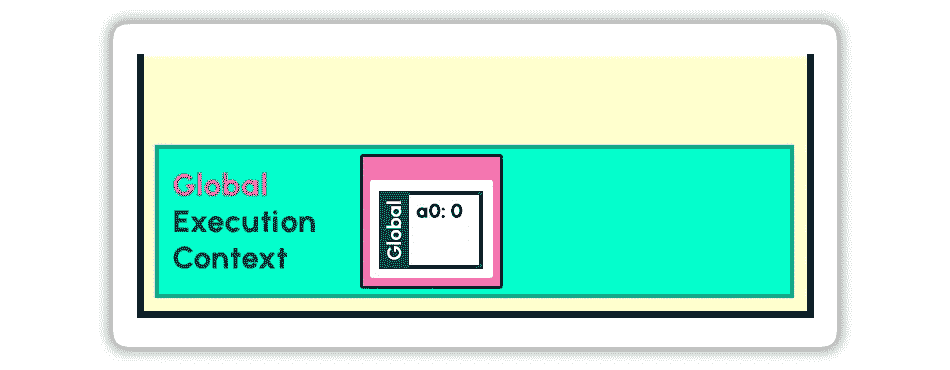
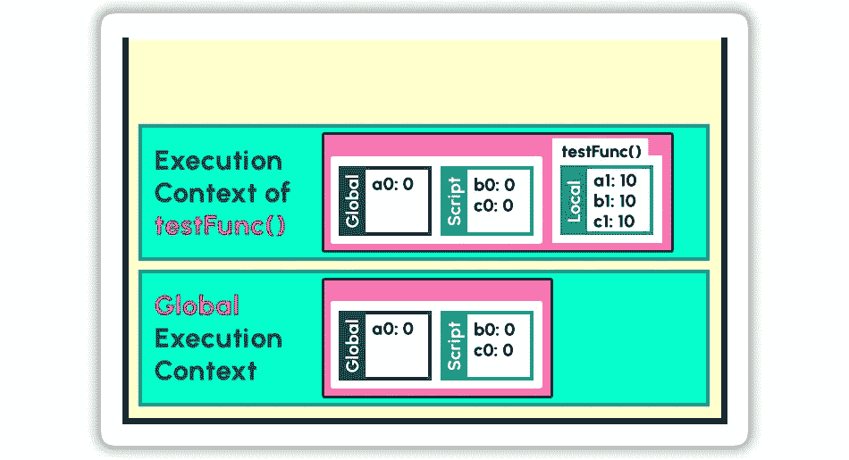

# JavaScript 中的作用域类型

> 原文：<https://javascript.plainenglish.io/type-of-scopes-in-javascript-e717571721a2?source=collection_archive---------12----------------------->


这篇文章是为那些试图更深入研究这种语言的 JavaScript 开发人员准备的。在开始阅读之前，了解以下主题将是有益的。

*   [JavaScript 引擎](https://en.wikipedia.org/wiki/JavaScript_engine)
*   [执行上下文(EC)](https://hellocode.dev/execution-context-in-javascript/)
*   [调用堆栈](https://www.javascripttutorial.net/javascript-call-stack/)
*   一般范围和变量


JavaScript 代码在**执行上下文(EC)中运行。**代码执行时，**执行上下文**被推送到调用堆栈上。每个 JavaScript 程序都有一个**全局执行上下文**,当它开始执行时就会被推送。每当遇到函数调用时，都会为该特定函数创建一个新的执行上下文，并将其推送到调用堆栈上。

该图显示了执行下面代码的**行 7** 时调用栈的快照。

```
1  var a0 = 0;
2  function testFunc() {
3      var a1 = 10;
4      testFunc1();
5      function testFunc1(){
6          var a2 = 20;
**7          console.log(a0,a1,a2);**
8      }
9  }
10 testFunc();
11 console.lob(a0);
```

它在底部显示了**全局执行上下文(GEC)** 和它上面两个嵌套函数的执行上下文。

# **词汇环境**

一个**词汇环境(LE)** 作为每个执行上下文的一部分被创建。它由该执行上下文的本地内存及其直接父上下文的词法环境组成。


在 JavaScript 代码的执行过程中，调用堆栈可能有几个上下堆叠的执行上下文，全局执行上下文(GEC)位于堆栈的底部。

> 最顶层**执行上下文**的**词法环境**引用了其**父**的**EC**(EC 就在它的下面)。

这对于它下面的所有 EC 都是一样的，除了指向空值的 GEC。这个词法环境链被称为**范围链**。

# **瞄准镜的类型**

执行上下文的词法环境或范围可能包含以下不同类型的范围。

**1。全球:**🌏

在 JavaScript 文件的所有函数之外使用`var`关键字声明的变量成为**全局作用域**的一部分。它成为 JavaScript 作用域链的根。存储在这里的变量在文件的任何地方都可以访问。默认情况下，这是浏览器中的`window`对象和 NodeJS 中的`global`对象。

可以将变量添加到全局范围，如下所示:

```
var a0 = 0;
```


Status of Call Stack

**2。脚本:**📜

在 JavaScript 文件的所有块和函数之外使用`let`或`const`关键字声明的变量成为**脚本范围**的一部分。它类似于全局范围，但是没有任何声明为`var`的变量。它出现在作用域链中的全局作用域之后。存储在这里的变量也可以在文件的任何地方访问。

可以将变量添加到全局范围，如下所示:

```
let b0 = 0;
```


**3。区块:** 🧱

在 JavaScript 块`**{}**`中使用`let`或`const`关键字声明的变量成为该**块范围**的一部分。(注意:JavaScript 引擎将块中使用`var`关键字声明的任何变量移动到其父作用域(全局/函数/闭包))。块可以出现在 JavaScript 文件中的任何地方。它可以在函数内部或外部声明。它也可以嵌套在其他块中。因此，只要在代码中遇到它，它就会被添加到范围链中。存储在这里的变量只能在那个特定的块中访问。

可以将变量添加到块范围，如下所示:

```
{
    var a1 = 10;
    let b1 = 10;
}
```

请注意`a1`被移到了全局范围，即使它是在块中声明的。


**4。本地(功能):**🏡

函数内部声明的变量成为其**局部函数作用域**的一部分。使用任何变量类型(`var/let/const`)声明的变量可以出现在这里。一旦该函数被推送到调用堆栈上，它就会被添加到该函数的执行上下文中。存储在这里的变量只能在那个函数中访问。

可以将变量添加到局部范围，如下所示:

```
function testFunc(){
    var a2 = 20;
    let b2 = 20;
}
testFunc();
```


**5。关闭:**📦

当一个函数在另一个函数中定义时，存在于父函数局部环境中的变量成为新函数的**闭包**。


当父函数成为新函数的一部分时，父函数的局部环境中标记为**‘local’**的变量现在标记为**‘closure’**。

使用`var`、`let`和`const`声明的变量可以出现在这里。就在该函数的局部作用域被附加之前，它被附加到作用域链的顶端。

```
function testFunc() {
    var a2 = 20;
    let b2 = 20;
    function testFunc1() {
        var a3 = 30;
        let b3 = 30;
    }
    testFunc1();
}
testFunc();
```

# **形成作用域链:**

默认情况下，全局范围被添加到**全局执行上下文**的词法环境中。即使 JavaScript 文件完全为空，它也会被添加。

```
1 var a0 = 0;
```

考虑上面的代码。`a0`被添加到全局范围，因为它是一个被全局声明的`var`类型的变量。



GEC 的 LE 也可以包含脚本和块作用域。如果有任何全局声明的`let`或`const`变量，就会添加**脚本**作用域，如下所示。

```
1 var a0 = 0;
2 let b0 = 0;
3 const c0 = 0;
```


如果有任何块被全局声明，那么**块**范围被添加到 GEC。

```
1 var a0 = 0;
2 let b0 = 0;
3 const c0 = 0;
4 {
5    var a1 = 10;
6    let b1 = 10;
7    const c1 = 10;
8 }
9
```

只有在执行过程中遇到块范围时，才会将其添加到词法环境中。在上面的例子中，块范围是在执行第 5 到 7 行时添加的。一旦执行从该块中出来，它就会从作用域中移除。


上图显示了执行**行 3** 、**行 7** 和**行 9** 时调用栈的快照。请注意，`a1`成为全局范围的一部分，即使是在一个块中声明。另外，`a1`从一开始就存在于全局范围内。

# **功能和范围**

## **全局功能**

如果一个函数是全局声明的，它的词法环境由 GEC 的**词法环境**和它的**局部环境**组成。

```
1 var a0 = 0;
2 let b0 = 0;
3 const c0 = 0;
4 function testFunc() {
5    var a1 = 10;
6    let b1 = 10;
7    const c1 = 10;
8 }
```



## 嵌套函数

如果函数嵌套在其他函数中，那么它的词法环境包含

*   祖父母的词汇环境
*   作为闭包的父元素的本地环境
*   自身的局部环境


下面的代码演示了函数如何嵌套在其他函数中。

```
1 var a0 = 0;
2 let b0 = 0;
3 function testFunc() {
4    var a1 = 10;
5    let b1 = 10;
6    function testFunc1() {
7        var a2 = 20;
8        let b2 = 20;
9    }
10}
```


函数闭包中的变量与它捆绑在一起。即使其父函数的执行上下文不再存在于调用堆栈中，这些值也将被保留。考虑下面的例子。

```
1  function testFunc() {
2    var a2 = 20;
3    let b2 = 20;
4    console.log(a2, b2);
5    function testFunc1() {
6        var a3 = 30;
7        let b3 = 30;
8        console.log(a2, a3, b2, b3);
9    }
10    return testFunc1;
11 }
12 var testFunc1 = testFunc();
13 testFunc1();
```

这里，`testFunc()`中定义的`testFunc1()`不是在函数中调用，而是从函数中返回。我们在**行 12** 得到从`testFunc()`返回的`testFunc1()`，它在**行 13** 被调用。此时，调用栈只包含 GEC 和`testFunc1()`的 EC。但是`testFunc1()`的词法环境将有`a2`和`b2`，它们是`testFunc()`的一部分，定义在其闭包内。


## 包含块的函数

函数中也可能包含块。如果是这样，函数的局部环境可能包含块。如果当前函数存在于其父函数的块(嵌套块)中，那么将有一个块作用域附加到其闭包上。

```
var a0 = 0;
let b0 = 0;
function testFunc() {
    var a1 = 10;
    let b1 = 10;
    {
        var a2 = 20;
        let b2 = 20;
        function testFunc1() {
            var a3 = 30;
            let b3 = 30;
        }
    }
}
```


## 函数嵌套在多个级别中

如果函数嵌套在多个层次中，它的闭包会形成其父函数的闭包链。下面的代码包含了到目前为止讨论的所有不同类型的作用域的几种不同的可能性。

```
1 var a0 = 0;
2 let b0 = 0;
3 function testFunc() {
4    var a1 = 10;
5    let b1 = 10;
6    console.log(a0, a1, b0, b1);
7    {
8        var a2 = 20;
9        let b2 = 20;
10       console.log(a0, a1, a2, b0, b1, b2);
11       function testFunc1() {
12          var a3 = 30;
13          let b3 = 30;
14          console.log(a0, a1, a2, a3, b0, b1, b2, b3);
15          function testFunc2() {
16              var a4 = 40;
17              let b4 = 40;
18              console.log(a0, a1, a2, a3, a4, b0, b1, b2, b3, b4);
19              {
20                  var a5 = 50;
21                  let b5 = 50;
22                  console.log(a0, a1, a2, a3, a4, a5, 
23                              b0, b1, b2, b3, b4, b5);
24              }
25          }
26          testFunc2();
27      }
28      testFunc1();
29   }
30}
31testFunc();
```

下面给出了执行上述代码的**行 22** 时调用堆栈的快照


当在浏览器中执行上述代码时，执行**行 22** 时的范围选项卡如下所示。


# **结论**

这篇文章是关于 JavaScript 中的词法环境、作用域链和不同类型的作用域。我们还讨论了作用域的行为，以及在各种代码场景中作用域链是如何形成的。

*更多内容看* [*说白了就是*](http://plainenglish.io/) *。报名参加我们的* [*免费每周简讯*](http://newsletter.plainenglish.io/) *。在我们的* [*社区不和谐*](https://discord.gg/GtDtUAvyhW) *获得独家访问写作机会和建议。*