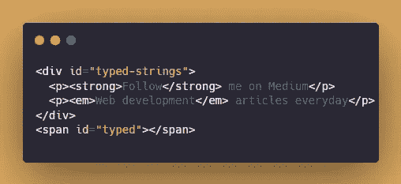
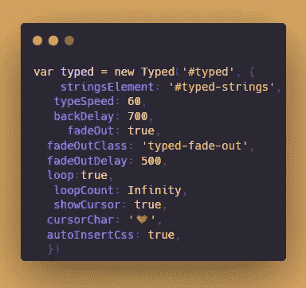

# Meet Typed.js —一个 JavaScript 类型动画库

> 原文：<https://javascript.plainenglish.io/typed-js-a-javascript-typing-animation-library-6ccd70909100?source=collection_archive---------13----------------------->

## 将这个很酷的动画库用于您的下一个 JavaScript 项目。


Typed.js 是一个 JavaScript 动画库。任何字符串都可以输入客户的内容、速度等。据我所知，最常见的用途是让登陆页面看起来更现代。

**官方网站:**

 [## Typed.js

### 马特·博尔特用爱做的另一个小样。#用 NPM npm 安装 typed.js #用纱纱添加 typed.js #用包尔…

mattboldt.com](https://mattboldt.com/demos/typed-js/) 

**第一步:**

使用 npm、yarn、bower 或 CDN 导入 js 库

```
npm install typed.js
yarn add typed.js
bower install typed.js
```

或者

```
<script src="https://cdn.jsdelivr.net/npm/typed.js@2.0.12"></script>
```

**第二步:**

超文本标记语言



内容包含在

中

所输入的内容其实是

**第三步:**

射流研究…



用`new Typed('id',options)`启动图书馆

**定制:**

stringsElement:要显示的内容

打字速度:打字速度

backDelay:退格前的 backDelay 时间，以毫秒为单位

淡出:淡出动画而不是退格

fadeOutClass:可以在 CSS 中设置唯一的类

fadeOutDelay:动画延迟时间

循环:循环动画，默认为假

循环计数:选定的数字或无穷大

显示光标:光标显示或不显示

cursorChar:自定义光标默认为|

对于一些事件

## **文档中的所有定制:**

```
var typed = new Typed('.element', {
  /**
   * @property {array} strings strings to be typed
   * @property {string} stringsElement ID of element containing string children
   */
  strings: [
    'These are the default values...',
    'You know what you should do?',
    'Use your own!',
    'Have a great day!'
  ],
  stringsElement: null,

  /**
   * @property {number} typeSpeed type speed in milliseconds
   */
  typeSpeed: 0,

  /**
   * @property {number} startDelay time before typing starts in milliseconds
   */
  startDelay: 0,

  /**
   * @property {number} backSpeed backspacing speed in milliseconds
   */
  backSpeed: 0,

  /**
   * @property {boolean} smartBackspace only backspace what doesn't match the previous string
   */
  smartBackspace: true,

  /**
   * @property {boolean} shuffle shuffle the strings
   */
  shuffle: false,

  /**
   * @property {number} backDelay time before backspacing in milliseconds
   */
  backDelay: 700,

  /**
   * @property {boolean} fadeOut Fade out instead of backspace
   * @property {string} fadeOutClass css class for fade animation
   * @property {boolean} fadeOutDelay Fade out delay in milliseconds
   */
  fadeOut: false,
  fadeOutClass: 'typed-fade-out',
  fadeOutDelay: 500,

  /**
   * @property {boolean} loop loop strings
   * @property {number} loopCount amount of loops
   */
  loop: false,
  loopCount: Infinity,

  /**
   * @property {boolean} showCursor show cursor
   * @property {string} cursorChar character for cursor
   * @property {boolean} autoInsertCss insert CSS for cursor and fadeOut into HTML <head>
   */
  showCursor: true,
  cursorChar: '|',
  autoInsertCss: true,

  /**
   * @property {string} attr attribute for typing
   * Ex: input placeholder, value, or just HTML text
   */
  attr: null,

  /**
   * @property {boolean} bindInputFocusEvents bind to focus and blur if el is text input
   */
  bindInputFocusEvents: false,

  /**
   * @property {string} contentType 'html' or 'null' for plaintext
   */
  contentType: 'html',

  /**
   * Before it begins typing
   * @param {Typed} self
   */
  onBegin: (self) => {},

  /**
   * All typing is complete
   * @param {Typed} self
   */
  onComplete: (self) => {},

  /**
   * Before each string is typed
   * @param {number} arrayPos
   * @param {Typed} self
   */
  preStringTyped: (arrayPos, self) => {},

  /**
   * After each string is typed
   * @param {number} arrayPos
   * @param {Typed} self
   */
  onStringTyped: (arrayPos, self) => {},

  /**
   * During looping, after last string is typed
   * @param {Typed} self
   */
  onLastStringBackspaced: (self) => {},

  /**
   * Typing has been stopped
   * @param {number} arrayPos
   * @param {Typed} self
   */
  onTypingPaused: (arrayPos, self) => {},

  /**
   * Typing has been started after being stopped
   * @param {number} arrayPos
   * @param {Typed} self
   */
  onTypingResumed: (arrayPos, self) => {},

  /**
   * After reset
   * @param {Typed} self
   */
  onReset: (self) => {},

  /**
   * After stop
   * @param {number} arrayPos
   * @param {Typed} self
   */
  onStop: (arrayPos, self) => {},

  /**
   * After start
   * @param {number} arrayPos
   * @param {Typed} self
   */
  onStart: (arrayPos, self) => {},

  /**
   * After destroy
   * @param {Typed} self
   */
  onDestroy: (self) => {}
});
```

我的演示如下:

👉关注我，了解更多有用的 web 开发内容！爱 sharing🥰

*更多内容看* [***说白了就是***](https://plainenglish.io/) *。报名参加我们的* [***免费每周简讯***](http://newsletter.plainenglish.io/) *。关注我们* [***推特***](https://twitter.com/inPlainEngHQ) *和**[***LinkedIn***](https://www.linkedin.com/company/inplainenglish/)*。加入我们的* [***社区不和谐***](https://discord.gg/GtDtUAvyhW) *。**