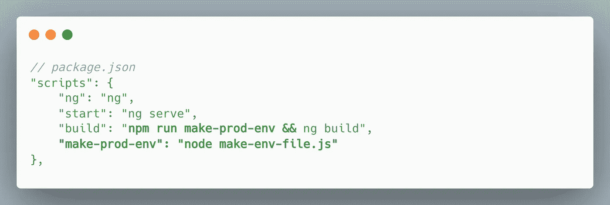

# Angular 中的类型安全环境配置

> 原文：<https://javascript.plainenglish.io/typesafe-environment-config-in-angular-df1c02af65df?source=collection_archive---------7----------------------->

## 如何在 Angular 中配置类型安全环境

Photo by [Markus Spiske](https://unsplash.com/@markusspiske?utm_source=medium&utm_medium=referral) on [Unsplash](https://unsplash.com?utm_source=medium&utm_medium=referral)

Angular 是关于好的实践，Angular 是关于打字稿。自然，开发者喜欢大部分输入的东西。一个例外是`environment.ts`文件。但是为什么它应该保持非类型化呢？让它变得可预测。

# 步骤 1:界面

为环境配置创建接口。为了演示，我们有一个非常简单的界面。但是根据您的需要，您可以随意添加其他项目。

app-config.ts

转到您的环境文件并使用界面:

environment.ts

# 步骤 2:注入令牌

为了注入`AppConfig`值，我们需要创建一个令牌，Angular 将利用它进行查找。您可以将此视为唯一标识符。这个令牌将告诉 Angular 提供什么。

app-config.ts

# 第三步:供应商

由于环境配置保证在非常初始的阶段注入，我们将在`AppModule` 提供值，它通常是应用程序的根模块。

app.module.ts

# 步骤 4:用法

现在，您可以在任何需要的地方使用环境值。例如在休息服务中:

asset.service.ts

如果您在任何时候拼错了一个配置，或者从环境对象中删除了一个属性，您将得到 IDE 警告和其他预防性警告。酷！

# 额外收获:在 Angular 中使用环境变量

您的前端应用程序可能包含许多秘密，如 API 端点 URL、公钥、令牌等。在 Angular 中，你可以在环境文件中管理它们。这些配置可能因构建阶段而异，例如开发、测试和生产。Angular 用相应阶段的特定文件替换它。相当直接！然而，您可能会发现自己不希望通过硬编码暴露这些秘密，而是从`ENV_VARS.`中选择它们。另一种情况可能是您不喜欢将包含敏感信息的环境文件提交给版本控制(git)。

在这种情况下，您可以使用一个小的 Node.js 脚本在构建时创建环境文件。

在项目的根目录下创建一个 JavaScript 文件`make-env-file.js`:

make-env-file.js

*   确保文件名正确，并且路径指向您想要的环境配置文件。
*   修改`getContent()`方法以包含所有配置。
*   在构建生产角度工件之前，更新`package.json`命令以利用创建的脚本。

package.json

您必须确保环境变量对 Node.js 可用。通常您会通过 docker 设置或托管提供商的接口来提供它们。

感谢阅读！

## 完整代码:

*更多内容请看*[***plain English . io***](https://plainenglish.io/)*。报名参加我们的* [***免费周报***](http://newsletter.plainenglish.io/) *。关注我们关于*[***Twitter***](https://twitter.com/inPlainEngHQ)*和*[***LinkedIn***](https://www.linkedin.com/company/inplainenglish/)*。加入我们的* [***社区不和谐***](https://discord.gg/GtDtUAvyhW) *。*