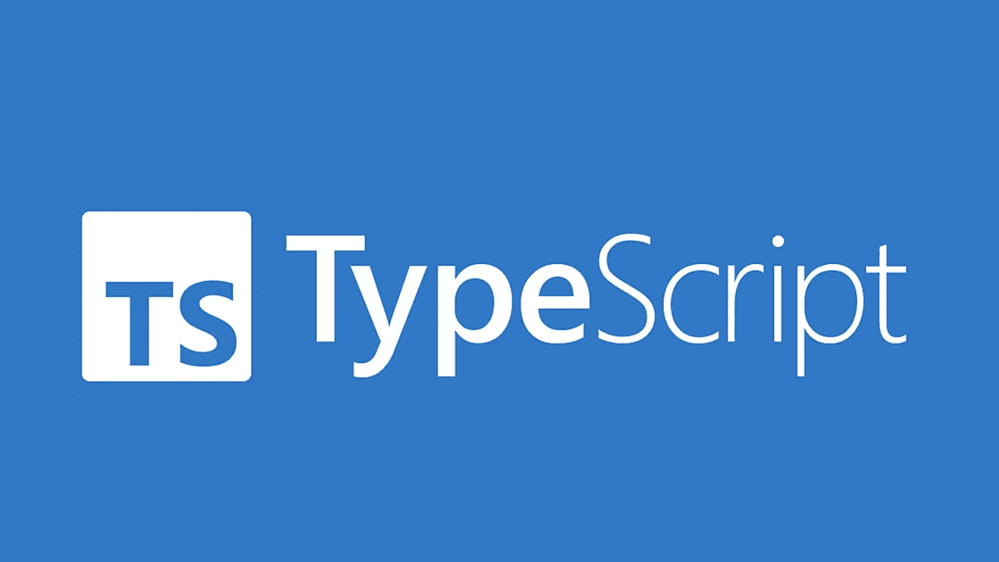

# TypeScript 4.9 是巨大的！

> 原文：<https://javascript.plainenglish.io/typescript-4-9-is-huge-ff94046e0ee5?source=collection_archive---------0----------------------->



# 介绍

如果你不知道，TypeScript 是一种基于 JavaScript 的语言，用于类型安全编程。TypeScript 在业界已经非常有名了，微软上周刚刚公布了 TypeScript 4.9。

# 有什么新鲜事？

## `satisfies`操作员

`satisfies`操作符的目的是在不改变变量类型的情况下对变量施加条件。

例如，你想说一种颜色是一个字符串，或一种 RGB 颜色，看起来像这样:

```
type RGB = [red: number, green: number, blue: number];
type Color = RGB | string;

const myColor: Color = 'blue';
```

我们不知道`myColor`是字符串还是 RGB 颜色。所以我们不能做类似于`myColor.toLowerCase()`的事情，即使它是一个字符串。

但是现在，有了 TS 4.9，`satisfies`操作符使这成为可能:

```
type RGB = [red: number, green: number, blue: number];
type Color = RGB | string;

const myColor = 'blue' satisfies Color; // works
const myIncorrectColor = 420 satisfies Color; // error

myColor.toUpperCase(); // valid because myColor is a string
```

## 类中的自动访问器

TS 4.9 支持 ECMAScript 中即将推出的一个特性，称为自动访问器。自动访问器就像类的属性一样被声明，除了它们是用`accessor`关键字声明的。

```
class Person {
    accessor name: string;

    constructor(name: string) {
        this.name = name;
    }
}
```

引擎盖下是什么样子:

```
class Person {
    #__name: string;

    get name() {
        return this.#__name;
    }
    set name(value: string) {
        this.#__name = name;
    }

    constructor(name: string) {
        this.name = name;
    }
}
```

## 在`NaN`检查相等性

`NaN`是一个特殊的数值，代表“不是数字”。什么都不等于`NaN`。

TypeScript 现在在与`NaN`的直接比较中出错，并将建议使用`Number.isNaN`的一些变体。

## “移除未使用的导入”和“排序导入”命令

过去，TypeScript 在 TS 4.3 上只支持两个管理导入的编辑器命令:“组织导入”和“排序导入”

TypeScript 4.9 增加了更多，现在提供了“移除未使用的导入”。TypeScript 现在将移除未使用的导入名称和语句，但会保留相对顺序。

## 使用`in`运算符缩小未列出的属性

作为开发人员，我们经常需要处理运行时不完全知道的值。事实上，我们经常不知道属性是否存在，不管我们是从服务器获得响应还是读取配置文件。JavaScript 的`in`操作符可以检查对象上是否存在属性。

当缩小*根本不*列出属性的类型时，TypeScript 4.9 使`in`操作符变得更加强大。这种语言不会让它们保持原样，而是将它们的类型与`Record<"property-key-being-checked", unknown>`相交。

TypeScript 4.9 还加强了对如何使用`in`的一些检查，确保左侧可赋给类型`string | number | symbol`，右侧可赋给`object`。这有助于检查我们是否使用了有效的属性键，而不是意外地检查原语。

# 结论

本文只是对 TypeScript 4.9 补丁说明的一个总结。希望你能赶上你的堆栈的最新信息。

参考:[https://dev blogs . Microsoft . com/typescript/announcing-typescript-4-9/](https://devblogs.microsoft.com/typescript/announcing-typescript-4-9/)

# 遗言

虽然我的内容对每个人都是免费的，但是如果你觉得这篇文章有帮助，[你可以在这里给我买杯咖啡](https://www.buymeacoffee.com/kylele19)

*更多内容看* [***说白了。***](https://plainenglish.io/)

*报名参加我们的* [***免费周报***](http://newsletter.plainenglish.io/) *。关注我们关于* [***推特***](https://twitter.com/inPlainEngHQ) ，[***LinkedIn***](https://www.linkedin.com/company/inplainenglish/)*，*[***YouTube***](https://www.youtube.com/channel/UCtipWUghju290NWcn8jhyAw)*，以及* [***不和***](https://discord.gg/GtDtUAvyhW) ***。***

***有兴趣缩放你的软件启动*** *？检查出* [***电路***](https://circuit.ooo?utm=publication-post-cta) *。*

# 进一步阅读

[](/typescript-made-easy-a-guide-to-your-first-type-safe-app-with-next-js-wundergraph-and-prisma-e197a59e2b30) [## 轻松编写类型脚本:使用 Next.js、WunderGraph 和 Prisma 编写第一个类型安全应用程序的指南

### 是时候抛开恐惧，学习 TypeScript 了。让我们给你第一次“发现！”瞬间通过建立一个完整的…

javascript.plainenglish.io](/typescript-made-easy-a-guide-to-your-first-type-safe-app-with-next-js-wundergraph-and-prisma-e197a59e2b30)