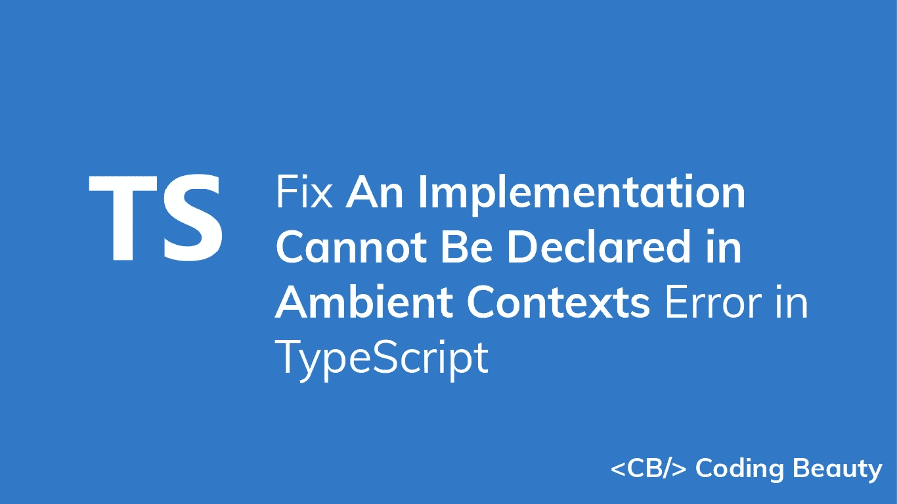

# 修复 TypeScript 中的“不能在环境上下文中声明实现”错误

> 原文：<https://javascript.plainenglish.io/typescript-an-implementation-cannot-be-declared-in-ambient-contexts-900db595a1b5?source=collection_archive---------6----------------------->

## 关于如何修复 TypeScript 中“不能在环境上下文中声明实现”错误的指南。



您是否遇到过 TypeScript 中的“实现不能在环境上下文中声明”错误？当您试图在声明文件中包含逻辑时，可能会出现此错误，例如:

**car.d.ts**

```
declare module 'car' {
  export class Car {
    color: string;
    maxSpeed: number;
    started: boolean; // Error: An implementation cannot be declared in ambient contexts
    start() {
      this.started = true;
    }
  }
}
```

环境声明只存在于类型系统中，并在运行时被擦除，因此它们不包含实现。上例中的`car`模块声明仅仅是为了指定在其他地方实现的`car`模块的类型信息。

若要修复此错误，请删除实现:

**car.d.ts**

```
declare module 'car' {
  export class Car {
    color: string;
    maxSpeed: number;
    started: boolean; start(); // implementation removed
  }
}
```

*更新于:*[*codingbeautydev.com*](https://codingbeautydev.com/blog/typescript-an-implementation-cannot-be-declared-in-ambient-contexts/)

每周获取新的 web 开发技巧和教程。


[**订阅**](https://codingbeautydev.com/newsletter)