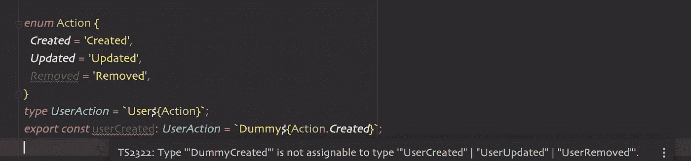
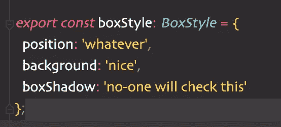
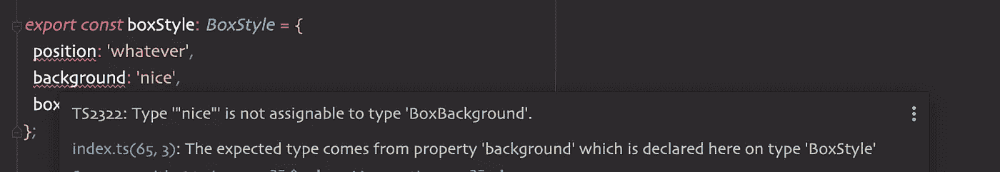
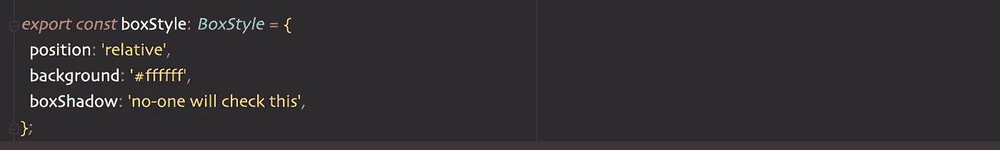
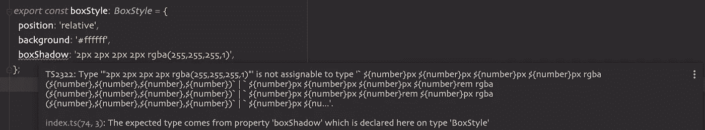
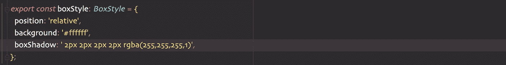
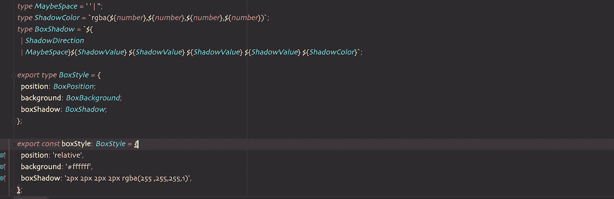
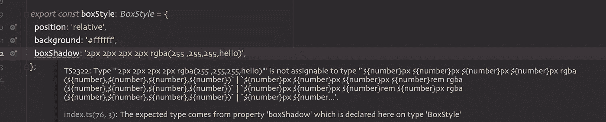

# 类型脚本和严格类型字符串

> 原文：<https://javascript.plainenglish.io/typescript-and-strictly-typed-strings-786923b07bd0?source=collection_archive---------3----------------------->

字符串插值是我们每天都在使用的东西，但我们很少使用 [***模板文字类型***](https://www.typescriptlang.org/docs/handbook/2/template-literal-types.html) ***的全部功能。***



是的，这是可能的。如果您为字符串插值定义了正确的类型，Typescript 将对其进行类型检查。让我们更深入地探讨一下这种语言特性的真正好处。

**速赢(键入 CSS** 😱 **)**

对我来说，CSS 一直是有点痛苦的，因为它很难知道所有的类型、单位等等，所以我一直在想，我们是否可以使它更加用户友好。让我们试着定义一个盒子组件 css 样式对象。

```
*export type BoxStyle* = {
  position: *string*;
  background: *string*;
  boxShadow: *string*;
}
```

好像还行吧？



嗯，不尽然。但是我们可以通过添加一些类型来快速改善这一点。

```
*type BoxPosition* = 'absolute' | 'relative' | 'fixed';
*type BoxBackground* = '#000000' | '#ffffff';
*export type BoxStyle* = {
  position: *BoxPosition*;
  background: *BoxBackground*;
  boxShadow: *string*;
};
```



好的，我们正在接近那里，但是仍然，盒子阴影是有点时髦的，但是没有它的精确类型。我们可以试着彻底检查所有的组合，但是这太难了，不可能。

引入**模板文字类型**的最佳时机！

```
*type ShadowDirection* = 'inset' | '';
*type ShadowUnit* = 'px' | 'rem';
*type ShadowUnitValue* = *number*;
*type ShadowValue* = `${*ShadowUnitValue*}${*ShadowUnit*}`;
*type ShadowColor* = `rgba(${*number*},${*number*},${*number*},${*number*})`;

*type BoxShadow* = `${*ShadowDirection*} ${*ShadowValue*} ${*ShadowValue*} ${*ShadowValue*} ${*ShadowValue*} ${*ShadowColor*}`;

*export type BoxStyle* = {
  position: *BoxPosition*;
  background: *BoxBackground*;
  boxShadow: *BoxShadow*;
```

箱形阴影看起来不错。我们去看看。



出错:(
如果我们仔细观察我们的*盒影*类型，我们可以看到*阴影方向*和第一个*阴影值之间的空间。*



我们的值类型错误现在看起来不错，但看起来仍然很奇怪。



让我们对我们的类型做最后一次健全性检查。



呜哇！🎉🎉🎉我们有类型安全的 CSS。老实说，这是一个穷人的版本。但是我们有拥有它的所有工具。

我发现这种模式在我试图从代码中调用的外部 CLI 应用程序的命令中使用得最多。这些东西有类型安全是很好的。有时候 ***式串*** 不够！

*更多内容请看*[***plain English . io***](https://plainenglish.io/)*。报名参加我们的* [***免费周报***](http://newsletter.plainenglish.io/) *。关注我们关于*[***Twitter***](https://twitter.com/inPlainEngHQ)[***LinkedIn***](https://www.linkedin.com/company/inplainenglish/)*[***YouTube***](https://www.youtube.com/channel/UCtipWUghju290NWcn8jhyAw)*[***不和***](https://discord.gg/GtDtUAvyhW) ***。*****

*****对缩放您的软件启动感兴趣*** *？检查* [***电路***](https://circuit.ooo/?utm=publication-post-cta) *。***