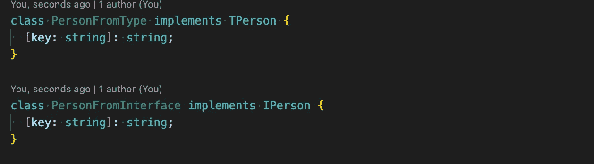

# TypeScript 基础:接口与类型

> 原文：<https://javascript.plainenglish.io/typescript-basics-interfaces-vs-types-4ab9f9c49fa9?source=collection_archive---------2----------------------->

Photo by [Arnold Francisca](https://unsplash.com/@clark_fransa?utm_source=medium&utm_medium=referral) on [Unsplash](https://unsplash.com?utm_source=medium&utm_medium=referral)

当您开始在 TypeScript 中编码时，您会意识到有两种方法来定义结构、函数等的“类型”。你可以创建一个“类型”或者一个“接口”,一个常见的问题是什么时候使用哪一个。在这里，我们将回顾每一个，看看他们的例子，相似之处和不同之处。

# **基本例子**

让我们为每一个定义一个例子，看看我们如何使用它们来创造价值。

***免责声明*** *:使用 Txx(用于类型)或 Ixx(用于接口)适用于其他语言，如 C、Java，但现在被认为是一种不好的实践，在标准库中没有遵循。我们将在这里的例子中使用它，只是为了注意我们引用的是接口还是类型。*

# 类似

**如果我们添加未定义的属性，两者都会显示错误。**

**两者都可以使用索引签名。**

这让我们可以创建类似地图的东西。

**两者都可以用来定义函数。**

对于这种情况，类型应该更准确，但是当我们也想添加属性时，它们更相似。

**两者都可以使用泛型。**

**两者都可以扩展。**

接口可以扩展类型，类型可以扩展接口。

**一个类可以实现这两者。**

# 差异

**联盟**

只能对类型进行联合。

我们可以创建某种利用联合类型的接口。

**接口允许“增广”。**

也称为“合并声明”，允许您向接口添加定义。

例如，这是 TypeScript 用来扩展数组 API 定义的特性。数组接口在“lib.es5.d.ts”中定义，但它也包含在下一个版本中，如“lib.es2015.d.ts”。这有助于获得新方法的定义。

试图对类型这样做将会抛出“重复标识符”错误。

# 什么时候使用每一个？

*   对于复杂类型，最好使用“类型”。
*   想想“增强”。你打算为一个 API 发布类型声明吗？然后使用“接口”，定义将在内部使用？，也许用“类型”。
*   考虑项目中的一致性，并保持使用相同的。

**部分链接:**

*   [https://www . typescriptlang . org/docs/handbook/2/daily-types . html](https://www.typescriptlang.org/docs/handbook/2/everyday-types.html)
*   [https://www . typescriptlang . org/docs/handbook/2/types-from-types . html](https://www.typescriptlang.org/docs/handbook/2/types-from-types.html)

希望这对某人有所帮助，欢迎发表评论。

*更多内容请看*[***plain English . io***](https://plainenglish.io/)*。报名参加我们的* [***免费周报***](http://newsletter.plainenglish.io/) *。关注我们关于*[***Twitter***](https://twitter.com/inPlainEngHQ)*和*[***LinkedIn***](https://www.linkedin.com/company/inplainenglish/)*。查看我们的* [***社区不和谐***](https://discord.gg/GtDtUAvyhW) *加入我们的* [***人才集体***](https://inplainenglish.pallet.com/talent/welcome) *。*