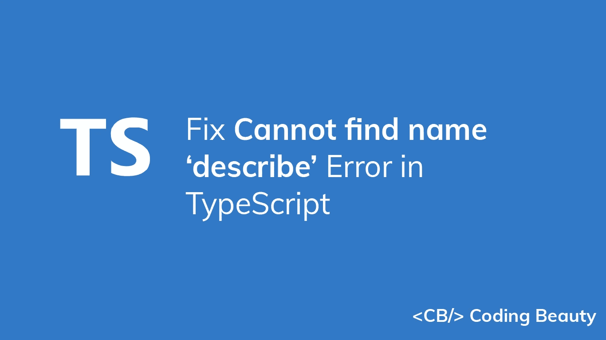
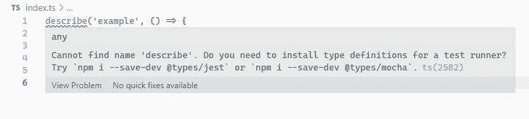

# 如何修复 TypeScript 中的“找不到名称' describe '”错误

> 原文：<https://javascript.plainenglish.io/typescript-cannot-find-name-describe-b72f3009ea86?source=collection_archive---------10----------------------->

## 了解如何轻松修复 TypeScript 中的“找不到 name 'describe '错误”。



要修复“找不到 name 'describe '”错误，请为您的测试框架安装类型定义，然后将定义添加到您的`tsconfig.json`文件中的`types`数组。

当您尝试在 TypeScript 文件中使用`describe()`函数，但 TypeScript 找不到包的类型定义时，会出现此错误。



`index.ts`

```
/* Cannot find name 'it'. Do you need to install type
 definitions for a test runner? Try
 `npm i --save-dev @types/jest` or
 `npm i --save-dev @types/mocha`. ts(2582) */describe('example', () => {
  it('adds two numbers together', () => {
    expect(2 + 2).toBe(4);
  });
});
```

通过在项目目录的根目录下运行以下命令之一，为您正在使用的测试框架安装类型定义。

```
# 👇 Jest
npm i -D @types/jest jest# 👇 Mocha
npm i -D @types/mocha mocha# Yarn
# 👇 Jest
yarn add --dev @types/jest jest# 👇 Mocha
yarn add --dev @types/mocha mocha
```

# 向`tsconfig.json`中的`types`数组添加类型

在某些情况下，这就是修复错误所需的全部内容。但是如果它持续存在，您可能需要将新安装的类型添加到您的`tsconfig.json`文件的`types`数组中。

因此，如果您正在使用 Jest，您将向`types`数组添加一个`jest`字符串，然后您的`tsconfig.json`文件将如下所示:

`tsconfig.json`

```
{
  "compilerOptions": {
    "types": [
      // ... other types
      "jest"
    ]
    // ..other settings
  }
}
```

类似地，如果您正在使用 Mocha，您将向`types`数组添加一个`mocha`字符串。

`tsconfig.json`

```
{
  "compilerOptions": {
    "types": [
      // ... other types
      "mocha"
    ]
    // ..other settings
  }
}
```

# 包括测试文件

如果这样做后错误仍然没有消失，请确保 TypeScript 没有忽略包含测试文件的目录。如果您已经在您的`tsconfig.json`文件中设置了`include`数组，请确保该数组中指定的模式与您的测试文件所在的目录相匹配。

例如，如果您的测试文件位于一个`src`目录中，TypeScript 将使用如下配置来检测它们:

`tsconfig.json`

```
{
  "compilerOptions": {},
  "include": ["src/**/*"],
}
```

但是如果它们位于一个`tests`目录中，我们将需要添加一个额外的 glob 模式来让 TypeScript 检测它们:

`tsconfig.json`

```
{
  "compilerOptions": {},
  "include": [
    "src/**/*",
    "tests/**/*"
  ],
}
```

我们还可以包含 glob 模式来匹配具有特定结尾或扩展名的文件。例如，我们可以用以下配置包含所有以`.spec.ts`和`.test.ts`结尾的文件:

`tsconfig.json`

```
{
  "compilerOptions": {},
  "include": [
    "src/**/*",
    "**/*.spec.ts",
    "**/*.test.ts"
  ],
}
```

如果您已经在您的`tsconfig.json`文件中设置了`exclude`数组，请确保数组中没有任何模式与包含测试文件的目录相匹配，因为这将防止 TypeScript 检测到它们。

例如，在下面的`tsconfig.json`文件中，以`.spec.ts`结尾的文件已被排除，因此 TypeScript 将忽略它们，当您试图在其中使用`describe()`时，将出现错误。

`tsconfig.json`

```
{
  "compilerOptions": {},
  "include": [
    "src/**/*"
  ],
  "exclude": [
    "**/*.test.ts"
  ],
}
```

我们将通过简单地将模式字符串从`exclude`移动到`include`来解决这个问题:

`tsconfig.json`

```
{
  "compilerOptions": {},
  "include": [
    "src/**/*",
    "**/*.test.ts"
  ],
}
```

# 在文件中导入模块

除了将类型添加到`types`数组，您还可以在使用`describe()`的文件顶部导入它们。

因此，如果我们使用 Jest，我们将在文件的开头添加一个`import 'jest'`行。

`index.ts`

```
// 👇
import 'jest';// ✅ No error
describe('example', () => {
  it('adds two numbers together', () => {
    expect(2 + 2).toBe(4);
  });
});
```

类似地，如果我们使用 Mocha，我们将添加一行`import 'mocha'`:

`index.ts`

```
// 👇
import 'mocha';// ✅ No error
describe('example', () => {
  it('adds two numbers together', () => {
    expect(2 + 2).toBe(4);
  });
});
```

# 重新启动 IDE

如果完成所有这些操作后错误仍然存在，重新启动 IDE 可能会有所帮助。

*原载于*[*codingbeautydev.com*](https://cbdev.link/2d96dc)

# ES13 中 11 个惊人的新 JavaScript 特性

本指南将带您快速了解 ECMAScript 13 中添加的所有最新功能。这些强大的新特性将会用更短、更富于表现力的代码来更新您的 JavaScript。


[**报名**](https://cbdev.link/900477) 立即免费领取一份。