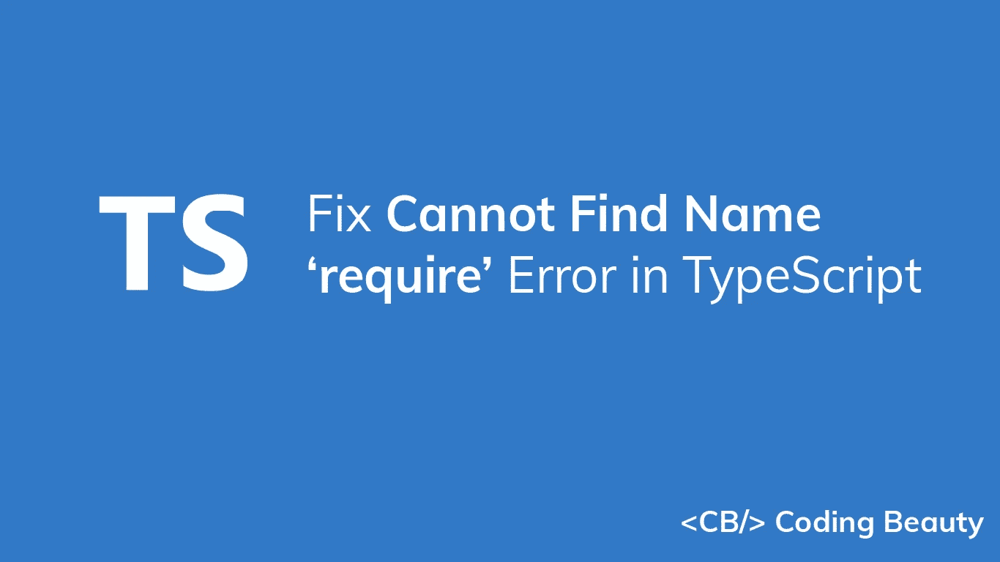
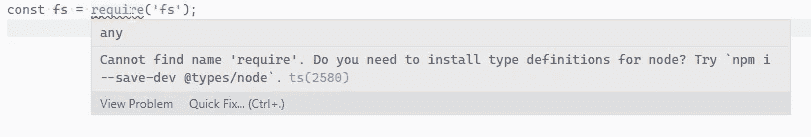

# 修复 TypeScript 中找不到名称“require”的错误

> 原文：<https://javascript.plainenglish.io/typescript-cannot-find-name-require-8e327dde6363?source=collection_archive---------5----------------------->

## 了解如何快速修复 TypeScript 中的“找不到 name 'require '”错误。



要修复 TypeScript 中的“无法找到 name 'require '”错误，请通过运行`npm i -D @types/node`将`@types/node`包安装到您的项目中。

当您尝试在 TypeScript 文件中使用 Node.js `require()`函数时，会出现此错误。



您可以通过在项目根目录下的终端窗口中运行以下命令来修复它:

```
npm i -D @types/node
```

如果错误仍然存在，尝试将`"node"`添加到`tsconfig.json`文件中的`types`数组:

**tsconfig.json**

```
{
  "compilerOptions": {
    "types": [
      // ... other types
      "node"
    ],
  },
}
```

## 小费

如果您只是进行简单的测试，您可以通过在 TypeScript 文件的顶部定义一个`require`变量来快速解决这个错误:

```
declare var require: any;
```

*更新于:*[*codingbeautydev.com*](https://cbdev.link/8f1c22)

每周获取新的 web 开发技巧和教程。


[**订阅**](https://codingbeautydev.com/newsletter)