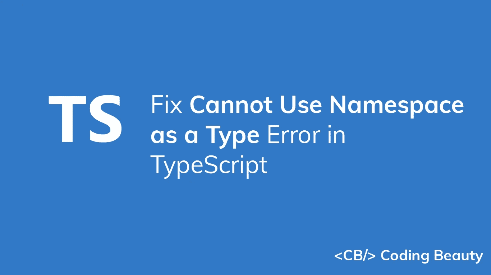

# 修复了 TypeScript 中的“不能将命名空间用作类型”错误

> 原文：<https://javascript.plainenglish.io/typescript-cannot-use-namespace-as-a-type-4c71999b5b65?source=collection_archive---------0----------------------->

## 了解如何快速修复 TypeScript 中的“不能将命名空间用作类型”错误。



您在 TypeScript 中遇到过“不能将命名空间用作类型”错误吗？

当您尝试导入声明为模块的类型时，可能会发生此错误。例如:

**car.d.ts**

```
declare module 'car' {
  class Car {
    color: string;
    age: number;
    maxSpeed: number;
  }
}
```

**索引. ts**

```
import Car from 'car';// Cannot use namespace 'Car' as a type.
const user: Car = {
  color: 'red',
  age: 2,
  maxSpeed: 120,
};
```

要修复此错误，请使用导出分配来指定命名空间的默认导出，如下所示:

**car.d.ts**

```
declare module 'car' {
  class Car {
    color: string;
    age: number;
    maxSpeed: number;
  }
  export = Car;
}
```

*更新于:*[*codingbeautydev.com*](https://codingbeautydev.com/blog/typescript-cannot-use-namespace-as-a-type/)

每周获取新的 web 开发技巧和教程。


[**订阅**](https://codingbeautydev.com/newsletter)