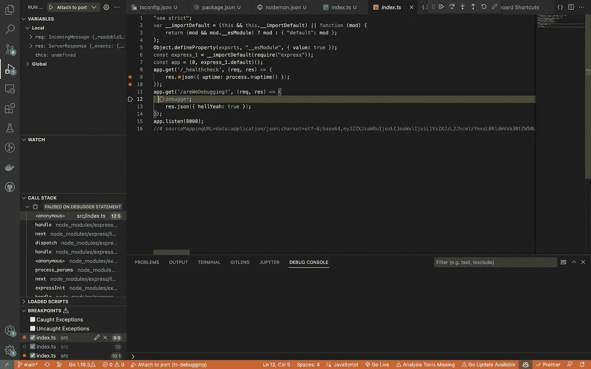

# VSCode 内部的 TypeScript 调试

> 原文：<https://javascript.plainenglish.io/typescript-debugging-inside-vs-code-b26a67eb91e9?source=collection_archive---------1----------------------->

## TypeScript 调试:使用 VSCode 调试器调试&在 Chrome 内部调试。


Photo by [Christian Erfurt](https://unsplash.com/@christnerfurt?utm_source=unsplash&utm_medium=referral&utm_content=creditCopyText) on [Unsplash](https://unsplash.com/s/photos/annoyed?utm_source=unsplash&utm_medium=referral&utm_content=creditCopyText)

在过去的几天里，我一直试图为我用 typescript 编写的 express 应用程序设置一个调试器。让我总结一下这个过程:

*   我浏览了所有相关的堆栈溢出问题
*   我看了所有相关的 YouTube 教程
*   我检查了 GitHub 上所有相关的 VSCode 调试问题。

我终于学会了如何在 TypeScript 中设置调试器！

为了让你不那么痛苦，我写了这篇文章，好好享受吧！

# 我们为什么要调试？

我们，开发人员，总是首先尝试使用惰性选项，为什么我们要用“配置文件”和调试选项来麻烦自己，仅仅是为了查看一个对象的内容？

如果我们简单地使用几个`console.log`不是更好吗？

我希望我能同意你的观点，当你的项目增长，你最喜欢的日志库中的日志填充了所有的控制台消息，你会明白调试实际上是一个简单的选择。

但是不用担心！看完这篇文章，你就能像专业人士一样调试了！😎

# 为什么在 Typescript 中使用 Debug 如此困难？

好吧，好吧，你酷到可以用打字稿了？但这有什么大不了的？

问题是，我们不能执行 TypeScript(是的，我知道 ts-node，但它也能立即编译成 JavaScript)，我们必须将它们转换成 JavaScript 文件。

为了做到这一点，我们需要有映射器，将我们的 TS 文件映射到 JS 文件，使用这些映射器，我们需要向我们的 TypeScript 文件添加断点，这有希望命中断点，然后我们开始调试。

如您所见，这是一组进程，这使得 TypeScript 调试成为一项挑战。

# 设置初始项目

如果您想看到最终版本，而不是单独移动，只需克隆存储库。

```
git clone [https://github.com/barisbll/ts-debug.git](https://github.com/barisbll/ts-debug.git)
```

如果不是，就跟我来:

```
tsc --init
```

这将创建 TypeScript 配置。取消注释并更改一些属性，如:

*   `outDir`，
*   `rootDir`等。

这是全部文件

让我们`init`我们的`npm`打包并下载依赖项:

```
npm init -ynpm install expressnpm i -D [@types/express](http://twitter.com/types/express) [@types/node](http://twitter.com/types/node) nodemon ts-node typescript
```

创建我们的 package.json 后，我将创建 2 个脚本:

*   `start:dev`
*   `start:debug`

我们基本上完成了最初的工作，然而，我们的工作还没有完成。

你知道我们不能像运行 JavaScript 文件一样运行类型脚本文件，我们需要使用 ts-node 对 JavaScript 进行实时编译。

然而，我们的图书馆对我们的计划一无所知😂为了让`nodemon`加入我们的秘密计划，我们创建了一个`nodemon`配置文件。

由于这个`execMap`规则，我们强制`nodemon`在监视 ts 文件时使用 ts-node。

到目前为止，一切顺利！现在我们已经准备好编写我们的小型虚拟应用程序了。

# 编写虚拟应用程序

我只是写了一个超级简约的应用程序:

当我们使用浏览器(或邮递员)发送 get 请求时:


呜哇！它正在工作。

好了，闲话已经说得够多了，现在让我们来谈正经事吧。

# 两种调试类型

在我的搜索中，我看到了许多不同的调试方式，但最终，我们可以将它们归类为 VSCode 调试和 Chrome 调试。

VSCode 调试既困难又复杂。永远不要离开 IDE 是件好事，但是它也有自己的注意事项(在下一节🕵️‍♀️).

另一方面，Chrome 比我想象的要简单得多，但是对于大型项目来说，它可能不是最好的选择。

## 方法 1 使用 VSCode 调试器进行调试

VSCode 有自己的调试器！你可能没用过，它在左边的菜单上。


当你去那里的时候，你会看到一堆不起作用的按钮。

为了让它们工作，我们需要创建一个配置文件，并单击`create a launch.json file`链接。

当您第一次点击时，它将要求您选择一个环境，我们将删除它，但选择`Node`。

让我告诉你一些不同调试选项之间的区别。

默认情况下，它为您创建了一个启动调试，有 3 个现代调试选项:

*   发射(看起来像遗产一样，艰难而痛苦)。
*   Attach(微软推荐，但如果有多个节点 app 就很难用了)。
*   连接端口(我的最爱😊，您使用特定端口运行 node 应用程序，它会完成剩下的工作)。

您可以使用左右`Add Configuration`按钮创建许多配置。

但是没有具体的配置，这是没有意义的。


在本教程中，我们将使用带端口的 attach。让我们看看完成的配置文件:

**request:attach** 这意味着我们的调试器不会启动新的 node.js 应用程序，它只会附加到现有的应用程序。

**port:9229** 设置调试器将要连接的进程的端口号。

但是巴里斯，这款 9229 有什么特别之处呢？你为什么选择它呢？

朋友，这是一个令人惊讶的问题，我选择这个问题是因为 Node.js 已经为我们提供了一个节点应用程序，它可以在 inspect 模式下在端口 9229 上运行。

还记得我们的调试脚本吗，我们有一个特殊的标志:

```
"start:debug" : "nodemon --inspect src/index.ts",
```

我们还必须定义`localRoot`和`outFiles`，没有它们，我们的调试器不知道去哪里找。

配置完成后，让我们运行引擎:

```
npm run start:debug
```


正如我们所料，我们的调试器已经开始监听了。

现在转到 debug 选项卡，使用我们已经创建的配置文件运行调试:


哇，我们的 VSCode 变成了橙色，弹出了一个带符号的标签页！


别担心，这意味着我们处于调试模式，让我们添加几个断点，测试这个坏男孩。

不幸的是，我们来到了我在本节之前提到的警告。尽管我们可以在发出的 JS 文件中添加断点，但是我们当前的设置不允许我们在 ts 文件中设置断点。

看起来我们可以:


但是当我们单击它时，它变得不可见，这意味着它在映射的 JS 文件中添加了断点，我们可以在左侧菜单中看到它。


或者我们可以简单地写`debugger`，它将像一个断点。


现在让我们转到浏览器，发送另一个 get 请求:



哇，停在了我们预想的地方！

太好了！现在我们可以检查所有局部变量的细节，并对它们进行检查。

# 方法 2 在 Chrome 内部调试

前面的方法是可行的，但是不在 ts 文件中添加断点可能是一个障碍。

Chrome 也有自己的解决方案，大家来看看吧。

对于这个解决方案，我们不需要对 VSCode 进行任何 launch.json 配置，Chrome 会自己处理这些事情。

在**调试模式下运行您的应用程序后:**

```
npm run start:debug
```

在浏览器中，转到链接`chrome://inspect/#devices`。

这看起来像是一个秘密书呆子俱乐部的链接😂，至少我第一次进去的时候是那样的感觉(它开头没有 HTTP 等。😂)


它有一个检查选项，点击它。

它将在此页面的新选项卡中打开:


不要让这个页面吓到你，这是最简单的选择。

只需向我们的 API 端点发送另一个请求，看看神奇之处:


如果我们仔细观察，我们甚至可以看到它使用的是 TypeScript 文件，所以不要再使用那些难看的发射文件了！


对于这个我们不需要任何配置，我的朋友，我们只需要用`--inspect`和 bazoom 启动一个服务器！它完成了任务，⚡️

# 结果

在本文中，我们进入了 TypeScript 的黑暗洞穴，并找到了一些我们将在接下来的冒险中使用的宝石。

如果你到了这一步，我祝贺你致力于学习关于美丽的 TypeScript 世界的新东西。我知道阅读技术博客有多难。

**注意:**如果你在我使用的设置中找到了在 VSCode 中使用断点的方法，请在评论中分享，我仍在寻找它😂。

# 激励我！

这篇文章花了我 3 天多的时间来研究，花了我 4 个小时来写。

如果你从这篇文章中获得了一些价值，请考虑鼓掌👏👏👏和评论😊。

如果你觉得**大方，**甚至可以在社交媒体上分享一些？？

请在 Medium 和 Twitter 上关注我，这样你可以收到更多那些甜蜜的内容🍦🍪🍩

在推特上: [@barisbll_dev](https://twitter.com/barisbll_dev) 🔥

下次冒险再见！

*更多内容请看*[***plain English . io***](https://plainenglish.io/)*。报名参加我们的* [***免费周报***](http://newsletter.plainenglish.io/) *。关注我们关于*[***Twitter***](https://twitter.com/inPlainEngHQ)[***LinkedIn***](https://www.linkedin.com/company/inplainenglish/)*[***YouTube***](https://www.youtube.com/channel/UCtipWUghju290NWcn8jhyAw)*[***不和***](https://discord.gg/GtDtUAvyhW) *。***