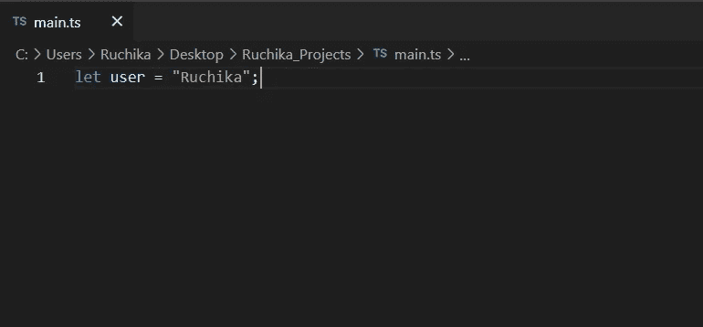

# 初学者打字指南

> 原文：<https://javascript.plainenglish.io/typescript-for-beginners-introduction-setup-and-running-your-first-typescript-code-7407a9050152?source=collection_archive---------9----------------------->

## 介绍、设置和运行您的第一个 TypeScript 代码

TypeScript 是 JavaScript 的超集，由**微软开发和维护。**


Photo by [Christopher Gower](https://unsplash.com/@cgower?utm_source=medium&utm_medium=referral) on [Unsplash](https://unsplash.com?utm_source=medium&utm_medium=referral)

它为 JavaScript 增加了额外的特性。在 JavaScript 中，问题只能在运行时检测到，这可能会导致问题被发送给最终用户。TypeScript 通过在编译时检查任何问题来消除这个问题。这叫做**严格打字**。

以下脚本在使用 JavaScript 时不会引发任何错误，但是如果使用 TypeScript，编译器会显示错误。


与运行时相反，Typescript 在编译时提供类型检查。这是使用 TypeScript 的主要好处。

除了严格的类型化，TypeScript 还引入了许多其他特性，如 ***接口*、 *Mixin 类*、*枚举*** 等等。我们将在另一篇文章中讨论它们。

**浏览器** **不直接支持 TypeScript，所以需要用 JavaScript 转换**。在您的 tsconfig 配置文件中，您可以指定要将它转换成哪种目标语言。

**TypeScript 和 JavaScript 可以在单个项目中**一起**运行**，万一你有一个项目，想一个文件一个文件的从 JS 迁移到 TS，可以顺利完成。

现在让我们在您的系统中设置 typescript，以便您可以编写和运行一些代码。

**设置打字工具**

1.  **安装 Node.js(高于版本 10):** 详情请访问下面的链接。

[](https://nodejs.org/en/download/) [## 下载| Node.js

### Node.js 是基于 Chrome 的 V8 JavaScript 引擎构建的 JavaScript 运行时。

nodejs.org](https://nodejs.org/en/download/) 

要检查它是否已安装，请在控制台中键入`node -v`。它会向您显示已安装的版本。

**2。安装类型脚本**

使用 npm:

```
npm install -g typescript
```

要检查它是否已安装，请在控制台中键入`tsc-v`。它会向您显示已安装的版本。

点击此链接查看其他选项[https://www.typescriptlang.org/download](https://www.typescriptlang.org/download)。

 [## 如何设置类型脚本

### 将 TypeScript 添加到项目中，或者全局安装 TypeScript

www.typescriptlang.org](https://www.typescriptlang.org/download) 

3.使用创建您的文件。ts 扩展名，例如 main.ts、app.ts 等。


4.现在让我们在**里面写一些代码**。



5.**将类型脚本文件转换为 JavaScript。**

转到控制台并运行您的文件，它将为 TS 文件创建一个相应的 JavaScript 文件。


现在，您可以在项目文件夹中看到 main.ts 和 main.js 文件，其中 main.js 是 main.ts 文件的转换版本。

现在我们已经到了 TypeScript 基本介绍和设置部分的末尾。在本文中，我们了解了 TypeScript 的优点、它在幕后如何工作、如何在您的系统中设置它，以及如何编写和运行您的第一个 TypeScript 代码。

我希望这有所帮助。一定要评论和分享，让我知道你是否喜欢它，你的小小努力鼓励我写更多。

*更多内容请看*[***plain English . io***](https://plainenglish.io/)*。报名参加我们的* [***免费周报***](http://newsletter.plainenglish.io/) *。关注我们关于*[***Twitter***](https://twitter.com/inPlainEngHQ)*和*[***LinkedIn***](https://www.linkedin.com/company/inplainenglish/)*。加入我们的* [***社区不和谐***](https://discord.gg/GtDtUAvyhW) *。*