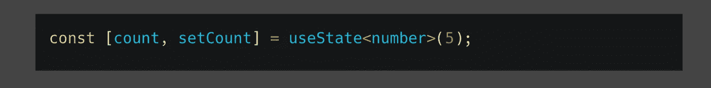

# 类型脚本泛型:用实例解释

> 原文：<https://javascript.plainenglish.io/typescript-generics-explained-with-practical-examples-ff9865bc8f4a?source=collection_archive---------6----------------------->

## 面向初学者的 TypeScript 泛型——通过实例探索泛型的用法。

Photo by [Christopher Robin Ebbinghaus](https://unsplash.com/@cebbinghaus?utm_source=medium&utm_medium=referral) on [Unsplash](https://unsplash.com?utm_source=medium&utm_medium=referral)

我知道，有时阅读带有虚构示例的原始文档并不有趣，因此在本文中，我提供了一些基于我在实践中遇到的真实示例的泛型用法。很可能，它对你来说更有意义，也更容易理解。

此外，我试图将泛型的用法分成对我个人有意义的几个类别。

# **仿制药**

什么是通用的？它允许我们编写一个类型安全的代码，该代码将与各种各样的原语和对象一起工作。泛型可以在新类型、接口、函数和类的声明中使用。事不宜迟，让我们看看泛型的一些用例。

## 1.为了消除代码中的重复

让我们假设我们的服务器应该为两个不同的资源返回以下响应:

如果没有泛型，我们需要分别描述每个响应的类型:

使用 Generic，我们只需立即定义响应形状并重用它:

## 2.表达自变量和函数返回值之间的关系

让我们假设我们有以下函数实现:

通过分析这个函数，我们了解到，我们根据第二个和第三个参数中传递的属性和值来过滤任何项目的数组。显然，所有函数参数和返回值都是耦合在一起的。

让我们揭示第一个参数`items`和返回值之间的简单关系。应该是相同类型的数组:

这里我们说这个函数接受一个包含类型为`T`的数组，并返回一个相同类型的数组。到目前为止一切顺利。

你可能注意到了，我们用字符串类型定义了`propertyName`参数，这没问题。但是这里的问题是，我们可能会意外地传递一个在类型为`T`的项目中不存在的属性名，例如:

当然，在这种情况下，它不会破坏应用程序，只是返回一个空数组，但这是一个我们需要尽快揭示的问题。让我们定义第二个泛型，它将描述`T`类型的所有允许属性:

一旦我们这样做了，我们就发现了在运行时阶段之前传递错误属性的问题:

最后一部分，我们将第三个参数`value`定义为一个字符串，直到`T`的所有属性都只有`string`类型。让我们假设类型`User`包括类型`number`的`age`属性。正如您所料，当我们尝试按此字段过滤项目时，会遇到一个问题:

这很容易解决，我们只需要以这种方式表达第三个参数的最后一个关系:

这个问题已经过去了:

此外，现在我们不能将类型不是`number`的值作为`age`属性的第三个参数传递，因为`User`类型只允许该属性有`number`:

如果你是一名 Rect 开发人员，我很确定你已经遇到过这种情况:

如你所见，我们有地方改进了函数`setUserField`的`field`和`value`参数的类型。花些时间解决它，直到你看到下面的解决方案。

以下是解决方案:

**3。既灵活又严格(关键字“用泛型扩展”)**

有时我们需要开发一个 API，它应该与一组特定的类型一起工作，我们对它的能力有一些了解。

最近，我需要扩展 React 本机组件的样式功能，并增加根据屏幕断点应用不同样式的可能性。它应该是一个高阶组件，其目的是将此功能 ***仅*** 添加到具有`style`属性的组件中。Typescript 允许我们使用下面的泛型语法来表达这种必要性:`T extends K`这意味着假设类型`T`的值也属于类型`K`是安全的。对于我们的例子，它看起来像这样:

这里我们需要注意，一旦我们定义了那个`Props extend { style?: StyleProp }`，Typescript 就允许我们在 HOC 内部使用这个属性(见第 6 行)。另一方面，如果您试图对没有`style`属性的组件使用这个特设，Typescript 会引发一个问题:

我们总结一下:一方面，我们只对具有`style`属性的组件限制使用 HOC，另一方面，这个组件可以具有任何其他属性，没有任何限制。此外，由于 Typescript 知道我们可以对具有`style`属性的组件使用我们的 HOC——我们可以安全地从组件 props 中提取它，并在 HOC 中操纵它。

如果你有兴趣了解关于这个 HOC 的更多细节，我写了一篇文章，可以在这里找到:[如何扩展 React Native Paper 组件来开发响应式 UX](https://betterprogramming.pub/how-to-extend-react-native-paper-component-for-developing-responsive-ux-4874c127e12) 。

# 一些额外的笔记

Typescript 有一个惊人的特性——它试图从可能的上下文中推断类型。当我在代码中看到这样的内容时:

意思是一个开发者不知道这件事。Typescript 从值中知道`a`是一个数字。

让我们假设，我们用泛型来定义这个函数:

如果你是初学者，你可能会这样使用它:

但是 Typescript 可能会从作为第一个参数传递的值中推断出泛型类型，最好这样使用它:

如果您是 React 开发人员，您可能会看到许多这样的时间片段:

但是同样，在这里显式定义泛型的类型是多余的，它将从您作为第一个参数传递的值中推断出来，如果您是一个有经验的开发人员，您的代码将如下所示:

另外，我遇到过一个案例，一个开发人员害怕对 React 组件属性使用泛型。是的，我们在 JSX 中使用我们的组件，他们不知道这个语法是有效的:

是的，这看起来很奇怪，但是这里我们可以依靠 Typescript 功能，根据传递给组件的属性类型来推断泛型类型:

同意代码更好，你看起来像一个有经验的开发人员。

我希望你喜欢阅读这篇文章。很高兴看到任何评论或任何项目，应该已经涵盖。感谢任何有助于改进文章的帮助。谢谢你。

*更多内容请看*[***plain English . io***](https://plainenglish.io/)*。报名参加我们的* [***免费周报***](http://newsletter.plainenglish.io/) *。关注我们关于*[***Twitter***](https://twitter.com/inPlainEngHQ)*和*[***LinkedIn***](https://www.linkedin.com/company/inplainenglish/)*。查看我们的* [***社区不和谐***](https://discord.gg/GtDtUAvyhW) *加入我们的* [***人才集体***](https://inplainenglish.pallet.com/talent/welcome) *。*