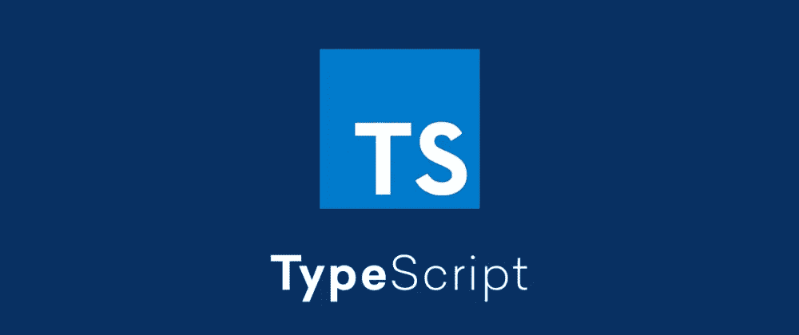

# 两分钟解释的类型脚本接口

> 原文：<https://javascript.plainenglish.io/typescript-interfaces-explained-in-2-minutes-af1637b88bd4?source=collection_archive---------11----------------------->



在这篇小文章中，您将学习什么是接口，以及如何在您自己的项目中创建和使用接口。

正如您可能已经知道的，从定义上来说，JavaScript 不是一种类型安全的语言。要获得这种很酷的类型安全，您需要使用类似 TypeScript 的工具来帮助您。

TypeScript 是 JavaScript 的超集，它为 JavaScript 语言引入了新的特性和有益的改进。通过在代码库中使用 TypeScript，您可以很容易地在早期发现或避免错误，并在编译时消除错误，这非常棒。乍一看，TypeScript 似乎很难，很可怕，但是一旦你花了一些时间使用它，我敢打赌你会真的爱上它。

# 接口

TypeScript 中的接口或多或少类似于对象的蓝图。它定义了关于对象中属性名及其值的信息。这可以帮助 TypeScript 编译器验证您的对象，这样您就不会以错误的格式定义对象。

你可以在一个类型脚本文件中使用 ***接口*** 关键字来定义一个接口。ts)。看一下下面的例子:

```
interface Course {
  title: string;
  description: string;
  createdAt: Date;
  updatedAt: Date;
  price: number;
  currency: string;
  isActive: boolean;
}
```

这样，您就定义了一个可以充当对象蓝图的接口:

```
const webCourse: Course = {
  title: 'Typescript Basics',
  description: 'A course about Typescript',
  createdAt: new ***Date***(),
  updatedAt: new ***Date***(),
  price: 10,
  currency: 'USD',
  isActive: true
}
```

在界面中，您还可以使用 ***将任意属性指定为可选属性？*** 或通过添加 ***未定义的*** 作为值。

```
interface Course {
  title: string;
  description: string;
  createdAt: Date;
  updatedAt: Date;
  price?: number; //Optional
  currency: string | undefined; //Optional
  isActive: boolean;
}
```

这意味着您现在可以创建一个没有 ***价格*** 和 ***货币*** 的对象，在本例中:

```
const webCourse: Course = {
  title: 'Typescript Basics',
  description: 'A course about Typescript',
  createdAt: new ***Date***(),
  updatedAt: new ***Date***(),
  isActive: true
};
```

你也可以拥有扩展其他接口的接口，这些接口有时会非常有用。

```
interface BaseCourse {
  title: string;
  description: string;
  createdAt: Date;
  updatedAt: Date;
  price?: number; //Optional
  currency: string | undefined; //Optional
  isActive: boolean;
}

interface FootballCourse extends BaseCourse {
  coach: string;
}
```

正如你在这里看到的，我们已经定义了基础课程和足球课程。FootballCourse 从 BaseCourse 扩展而来，允许我们使用 BaseCourse 接口，然后用我们需要的任何属性来扩展它

另一件很酷的事情是，您可以将属性定义为 readonly，这意味着如果您创建了一个对象，然后试图覆盖该属性，typescript 编译器将抛出一个错误，因为您已经将其定义为 readonly:

```
interface BaseCourse {
  readonly title: string; //Read only
  description: string;
  createdAt: Date;
  updatedAt: Date;
  price?: number; //Optional
  currency: string | undefined; //Optional
  isActive: boolean;
}

interface FootballCourse extends BaseCourse {
  coach: string;
}
```

这将引发一个错误:

```
const webCourse: FootballCourse = {
  title: 'Typescript Basics',
  description: 'A course about Typescript',
  createdAt: new ***Date***(),
  updatedAt: new ***Date***(),
  isActive: true,
  coach: 'Nicky Christensen'
};

webCourse.title = 'A new title'; //ERROR
```

感谢阅读，我希望你喜欢这篇文章，如果是的话，请点击按钮或订阅来支持我。

如果你还不是中等会员，考虑成为一名吧！你可以接触到很棒的内容，并有机会与他人分享你自己的知识。 [**在这里注册每月只需 5 美元。**](https://nickychristensen.medium.com/membership)

[](https://medium.com/js-dojo/vuejs-tips-best-practices-39d9962bb255) [## VueJS —技巧和最佳实践

### 在构建 Vue 应用时，你应该做什么，应该避免什么，通常只是一些简单的好建议

medium.com](https://medium.com/js-dojo/vuejs-tips-best-practices-39d9962bb255) [](https://medium.com/js-dojo/build-a-website-using-nuxt-contentful-a-step-by-step-guide-b75217ccdfa) [## 使用 Nuxt & Contentful 建立网站——一步一步的指南

### 了解如何使用 Vue/NuxtJS 构建一个简单的网站 Contentful——还包括一个 Vuex 示例。

medium.com](https://medium.com/js-dojo/build-a-website-using-nuxt-contentful-a-step-by-step-guide-b75217ccdfa) [](https://medium.com/front-end-weekly/a-closer-look-on-array-reduce-with-useful-examples-34f222664e66) [## 通过有用的示例进一步了解 array.reduce()

### 提高您的 javascript 技能，并通过一些有用的示例学习如何使用 Array.prototype.reduce()

medium.com](https://medium.com/front-end-weekly/a-closer-look-on-array-reduce-with-useful-examples-34f222664e66) [](/typescript-interfaces-explained-in-2-minutes-af1637b88bd4) [## 两分钟解释的类型脚本接口

### 在这篇小文章中，您将学习什么是接口，以及如何在您自己的项目中创建和使用接口。

javascript.plainenglish.io](/typescript-interfaces-explained-in-2-minutes-af1637b88bd4) 

***如果你想找个时间和我聊聊，请关注我的***[***Twitter***](https://twitter.com/nickycdk)***|***[***LinkedIn***](https://www.linkedin.com/in/dknickychristensen/)***或者直接访问我的*** [***网站***](https://nickychristensen.dk/) ***(丹麦文)***

**更多内容请看*[***plain English . io***](http://plainenglish.io/)*。报名参加我们的* [***免费每周简讯***](http://newsletter.plainenglish.io/) *。在我们的* [***社区不和谐***](https://discord.gg/GtDtUAvyhW) *中获得独家写作机会和建议。**