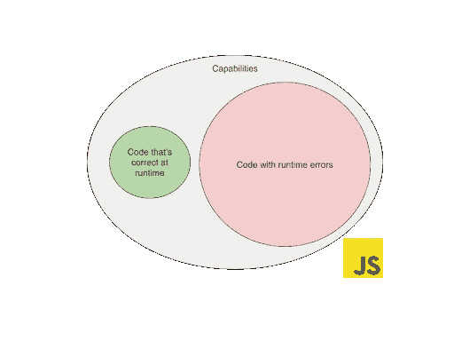
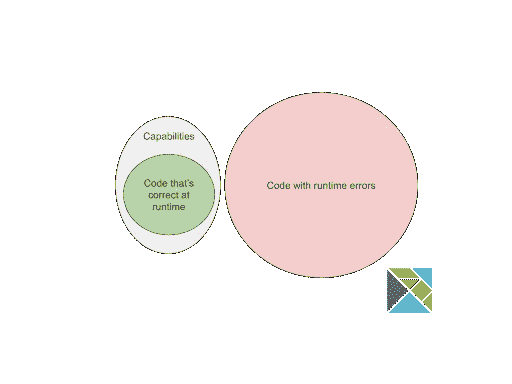
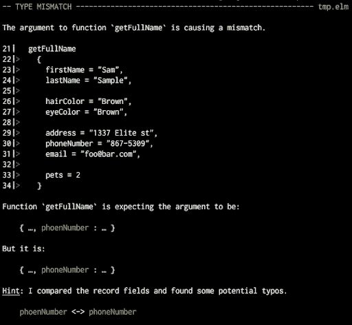
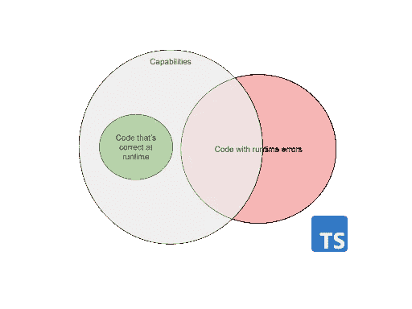
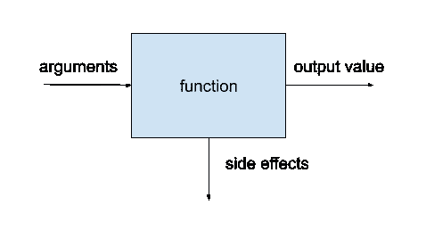
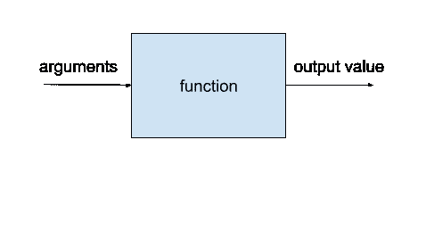
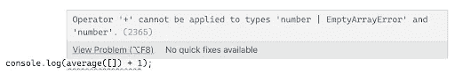
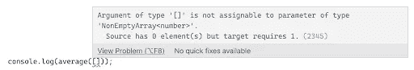
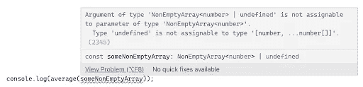

# TypeScript 不是 JavaScript 丑陋的表亲

> 原文：<https://javascript.plainenglish.io/typescript-is-not-javascripts-ugly-cousin-41a7fe7dec1d?source=collection_archive---------7----------------------->

## 了解 TypeScript 如何改善开发人员的体验


Photo by [Mael BALLAND](https://unsplash.com/@mael_balland?utm_source=medium&utm_medium=referral) on [Unsplash](https://unsplash.com?utm_source=medium&utm_medium=referral)

开发人员体验是一个简单明了的概念，它让软件开发人员的日常工作变得更好、更容易。在本文中，我将更深入地探讨技术细节，并重点关注像 TypeScript 这样的编程语言如何改善开发人员的体验。

# JavaScript 和开发人员体验

JavaScript 是一种功能强大的编程语言，但是您可以轻松地开始使用它。例如，如今每台电脑都有一个内置开发工具的网络浏览器，让你可以立即体验 JavaScript 引擎。此外，你得到的即时(可见)反馈可能会鼓励你更深入。

但有一个问题，随着用户对应用程序的要求比以往任何时候都高，这些应用程序变得越来越复杂。JavaScript 不再只是你网页上的装饰品；你可以用它来构建非常高级的应用程序。这也意味着这些应用程序可能有大量的可能状态，很难被测试完全覆盖。这就是 JavaScript 的动态特性破坏开发人员体验的地方，因为开发人员收到的即时反馈不再相同。一些运行时错误只出现在特定的应用程序状态组合中。

为什么会这样？JavaScript 是一种非常宽容的语言。一旦 JS 代码语法正确，它就会运行。然而，这种“无压力的成长”并不能保护开发人员避免编写在运行时失败的代码。此外，代码行数越多，代码触发运行时错误的几率就越大。换句话说，当您查看 JS 的功能时，有更多的方法可以编写包含运行时错误的代码，而不是不包含运行时错误的代码。



从长远来看，这显然破坏了 JS 开发人员的体验——制造 bug 比编写代码优雅地处理所有有问题的情况更容易。

# 榆树方法

Elm 是一种特定于领域的利基编程语言。也就是说，它的目标是前端领域，几十年来 JS 一直是这个领域的主要选择。

Elm 实现了函数式编程范式。多年来，开发人员发现，从长远来看，像不变性(函数式编程世界中的一个常见特性)这样的东西使我们的代码更易于维护。

# 为什么还要为 Elm 这样的小众编程语言费心呢？

如果你问 Elm 程序员他们用这种语言开发的体验如何，大多数人会向你保证这比用 JavaScript 好得多。那么 Elm 是如何实现的呢？如果您看一下它的功能，它们会受到更多的限制:



> 在 Elm 社区中有一个非常流行的短语:“如果它能编译，它就能工作”。

Elm 编译器不允许您编写运行时失败的代码。让 Elm 脱颖而出的特性之一是它对开发人员友好的编译器反馈。



您可能会看到 Elm 编译器并没有对开发人员大喊大叫，说他们做错了什么。Elm 可以让你自己解决这个问题。相反，它通过提供尽可能多的上下文和提示如何解决问题来提供帮助。换句话说，Elm 编译器充当了开发人员的助手。

Elm 如何在技术层面上实现伟大的 DX？

> 函数式编程范式是在 Elm 中编写应用程序的唯一方法。但是有一个额外的好处值得一提——Elm 也是一种静态类型的编程语言。

我不想就动态和静态打字孰优孰劣展开一场激烈的争论。这两个世界各有利弊。话虽如此，我相信静态类型语言会降低软件开发人员的速度，这是有充分理由的:


# 为什么打字稿？


Photo by [Gioele Fazzeri](https://unsplash.com/@gioele_fazzeri_89?utm_source=medium&utm_medium=referral) on [Unsplash](https://unsplash.com?utm_source=medium&utm_medium=referral)

那么“Typescript 改进的开发者体验”是怎么回事呢？如果您再看一下功能图，事情会变得非常有趣:



TypeScript 是一种编程语言，是 JavaScript 的超集，所以当然，仍然有可能编写出在运行时正确的代码。然而，就运行时错误而言，JS 和 Elm 之间有一些中间地带。

> TypeScript 允许您在不可预测的动态 JS 世界和静态类型代码之间取得平衡。

这是一个很好的妥协，因为它创造了一个机会来警告开发人员，如果编译器确定在运行时有什么东西坏了。与此同时，如果你不想要太多的严格性，比如说，已经存在的 JS 代码库，你想不用进一步的努力就可以使用，那么总有一个出口。这取决于作为开发人员的您，您愿意投入多少时间来告诉 TypeScript 编译器有关代码的信息。因此，作为奖励，你可以从编译器那里得到一些保护，它会在你运行应用程序之前告诉你什么可能出错。

如果从库和框架创建者的角度来看，善用 TypeScript 特性是创建开发人员不会讨厌的 API 的机会。因此，在本文中，我将通过使用一些真实的例子和案例研究来证明 TypeScript 有可能将 JavaScript 带到优秀开发人员体验的高度。所以让我们深入研究代码吧！

# 案例研究 1。“平均”函数

# 问题是

考虑下面这个简单的函数，它计算一组数字的平均值:

```
function average(numbers: number[]) { 
 const sum = numbers.reduce((a, b) => a + b, 0); 
 return sum / numbers.length;
}
```

对于像 5、10、15 这样的值，它按预期工作:

```
console.log(average([5, 10, 15])) // 10
```

但是，假设您是一名“平均计算领域专家”，您知道一些边缘情况:

```
console.log(average([])) // NaN
```

因为数组是空的，所以你要用零除零。

你可以很容易地想象，一些使用这个库函数的 React 应用程序在被渲染成“NaN”时会感到困惑。

# 运行时错误方法

你脑海中首先想到的可能是解决这个问题。您可以使用错误抛出机制向开发人员传达边缘情况问题:

```
class EmptyArrayError extends Error {  
constructor() {    
super("Cannot calculate the average of an empty array");  
}} 
function average(numbers: number[]) {  
if (numbers.length === 0) {    
throw new EmptyArrayError();  
}   
const sum = numbers.reduce((a, b) => a + b, 0);   
return sum / numbers.length;
}
```

然而，这个解决方案有一个问题。TypeScript 没有强制开发人员处理原生 JavaScript 错误的机制。更重要的是，TypeScript 根本没有本机类型错误支持。例如，如果你看一个“Promise ”,成功的路径可以很容易地被键入，但是错误的路径被键入为“any”。这意味着上述解决方案可能会使事情变得更糟。

让我们暂停一会儿，考虑一下在 React 应用程序上下文中使用我们的函数。通过抛出一个异常来破坏程序员正在开发的应用程序，会是一种很好的开发体验吗？因为(在一些组件中，从一些表中总结一些数据)你错过了平均函数的数字？

图书馆中良好的开发者体验实践之一是“做一个好公民”。这意味着你的库代码不应该破坏使用它的上下文。抛出一个让你的 React 应用崩溃的错误显然就是一个打破这个规则的案例。因此，我们将不得不考虑替代方法。

# 函数式编程与错误

让我们考虑一下典型的 JavaScript 函数是如何工作的:



JavaScript 中的函数可以:

*   接收和处理参数，
*   返回输出值，
*   表演副作用。

最后一个，副作用，很容易使你的代码失控。在上一节中，我们有一个很好的副作用的例子，可以破坏整个应用程序，也就是说，抛出错误是一个副作用，如果错误没有被捕获，它可以使整个应用程序崩溃。

为了比较，让我们看看一些函数式编程语言是如何处理错误的。在函数式编程语言中，我们倾向于使用更接近函数的数学定义的纯函数:



也就是说，一个纯粹的功能不可能有副作用。就像在数学中，你可以把它想成一个黑盒，把参数值映射到其他值，仅此而已。但是问题出现了:如果没有副作用，如何处理错误？

当你实现纯函数时，只有两种可能会出现错误。如果输出的唯一方式是输出值，那么为什么不简单地将错误作为输出值返回呢？当你重新审视你的代码时，你可以做一个简单而强大的改变:

```
function average(numbers: number[]) {  
if (numbers.length === 0) {    
return new EmptyArrayError();  
}   
const sum = numbers.reduce((a, b) => a + b, 0);   
return sum / numbers.length;
}
```

您是否注意到“throw”关键字已经被替换为“return”关键字了？

现在，TypeScript 足够聪明地推断出函数可能不会在所有情况下都返回数值。此外，它还可以警告开发人员哪些地方可能会混淆数字和错误:



因此，在这种情况下，开发人员被迫以下列方式处理错误:

```
const avgResult = average([1,2,3]);
console.log(avgResult instanceof EmptyArrayError ? "N/A" : (avg + 1))
```

然而，这个技巧不能保护你避免在用户界面中出现明显不是数字的东西的问题。因为 React 不会保护你渲染“EmptyArrayError”，所以，在那种情况下，你只要把“NaN”换成“[Object object]”。在这种情况下,“NaN”替换看起来更糟。

我们需要尝试一些别的东西…

# 狭窄型方法


Photo by [Liam Simpson](https://unsplash.com/@liamsimpson?utm_source=medium&utm_medium=referral) on [Unsplash](https://unsplash.com?utm_source=medium&utm_medium=referral)

在上一节中，您已经看到纯函数只有两种传递错误的方式。我们试了“产值”法，那还剩下什么？我们别无选择，只能从“论据”方面尝试。

如果你不想在运行时抛出或返回一个错误，定义你的函数，这样就不可能用引入错误的参数来调用。在数学中，你可以定义一个函数的定义域。这意味着一些函数对不属于定义域的值没有感觉。TypeScript 也有机会利用这个概念。例如，您可以这样定义类型:

```
export type NonEmptyArray<T> = [T, ...T[]];
```

这类似于内置的“数组<t>”类型。但是，不同之处在于，它确保 T 类型的数组至少有一个元素。您可以在函数定义中使用这样的类型:</t>

```
function average(numbers: NonEmptyArray<number>) {  
const sum = numbers.reduce((a, b) => a + b, 0);   
return sum / numbers.length;
}
```

当你测试它时，快乐之路像以前一样工作:

```
console.log(average([5, 10, 15])) // 10
```

但是，当您尝试边缘案例时:

```
console.log(average([]));
```

…您可以清楚地看到，TypeScript 防止您编写没有意义的代码:



但是仍然有一个问题，在实际项目中，这些数字可能来自应用程序的外部(用户输入、后端响应等)。).所以编译器无法预知你要使用的数组是否为空。但是解决这个问题的方法是为我们的“NonEmptyArray”类型定义一个构造函数:

```
export const nonEmptyArray = <T>(array: T[]): NonEmptyArray<T> | undefined => {  
if (array.length === 0) {    
return undefined;  
}   
return array as NonEmptyArray<T>;
}
```

如您所见，空数组必须以某种方式处理。在这种情况下，您可以决定只返回“未定义”,但这只是您想为这种情况返回什么值的问题。

让我们模拟这样一种状态，其中一组数字来自我们的 TypeScript 应用程序之外的世界:

```
const someArrayFromJSON: number[] = JSON.parse(“[1,2,3]”);
```

然后，您可以使用类型构造函数，如下所示:

```
const someNonEmptyArray = nonEmptyArray(someArrayFromJSON);
```

更酷的是，它警告开发者如果他们想这样做:



这样，您可以指导使用您的库的开发人员尽早实现错误处理:

```
console.log(someNonEmptyArray ? average(someNonEmptyArray) : "N/A");
```

乍一看，这种模式可能看起来很奇怪。但是从长远来看，您保护了使用您的库的开发人员免于在产品上进行不方便的调试会话，因为您对他们坦诚了您的库需要什么才能正常工作。随着时间的推移，你的库的用户会自信地认为它不会破坏他们的应用程序，因为他们从一开始就在他们的 IDE 级别上覆盖了边缘情况。

# 开发人员在 TypeScript 方面的经验


Photo by [Attentie Attentie](https://unsplash.com/@attentieattentie?utm_source=medium&utm_medium=referral) on [Unsplash](https://unsplash.com?utm_source=medium&utm_medium=referral)

# 摘要

> ***优秀的开发人员最需要的特征之一就是良好的文档。但是，更好的是交互式的文档和指导开发者正确使用(API/库/代码)的设计。***

与大量教授如何使用你的产品的降价书相比，你可以做一些额外的事情，为开发者提供一个指导者，自动指导他们完成用例。

TypeScript 是一个可以实现这种方法的强大工具，这要归功于我在本文中介绍的一些好的技术。我希望您已经受到启发，认识到 TypeScript 不仅仅是 JavaScript 的类型系统，并且您将喜欢使用它作为一种工具，可以填补一些开发人员的经验空白。

*更多内容请看*[***plain English . io***](http://plainenglish.io/)*。报名参加我们的* [***免费周报***](http://newsletter.plainenglish.io/) *。在我们的* [***社区***](https://discord.gg/GtDtUAvyhW) *获得独家获得写作机会和建议。*