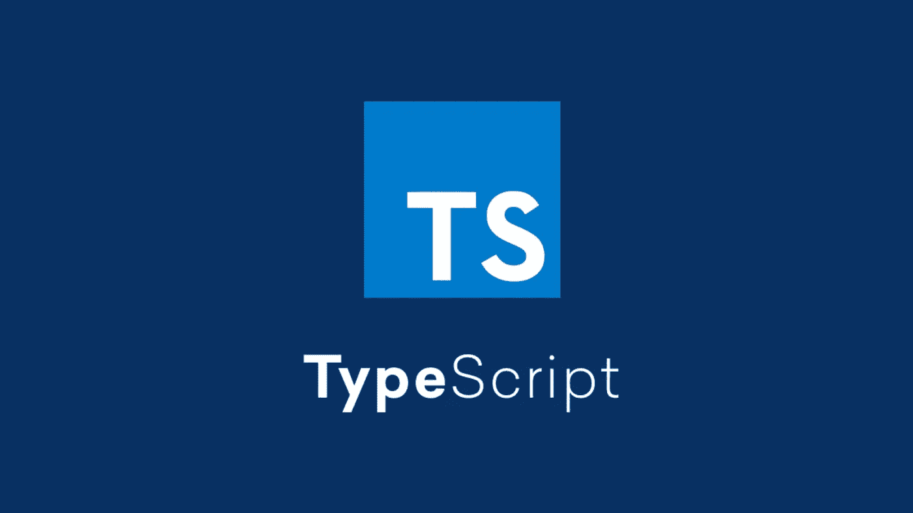
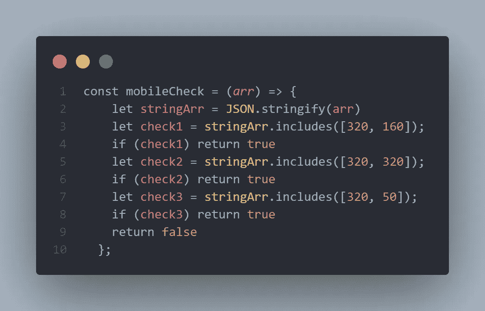
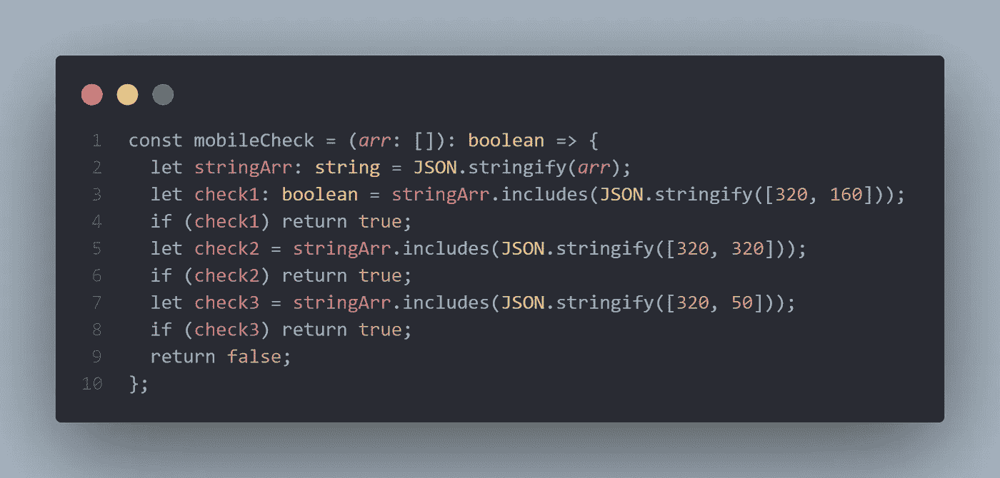
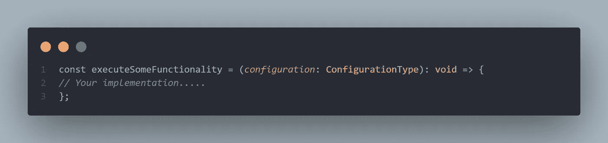
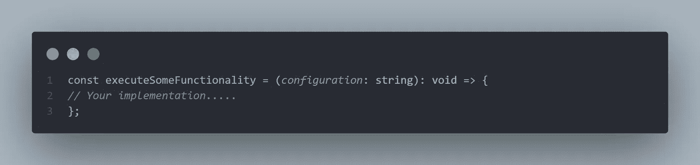
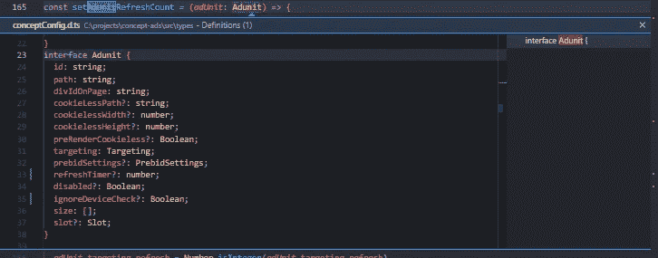

# 打字稿——好吧，我试试。但是我对此感到高兴吗？

> 原文：<https://javascript.plainenglish.io/typescript-ok-ill-try-it-am-i-happy-about-it-902c549beab8?source=collection_archive---------12----------------------->

## TypeScript 现在已经 10 岁了。所以让我试着把我们的“旧”脚本转换成打字稿。我将在下面描述我对此的复杂感受。

Typescript

首先，这里的上下文不是“你应该或不应该使用 Typescript”

## 项目的背景

我试图把这个项目变成一个 Typescript 项目，它是一个在我们的合作伙伴网站上作为第三方脚本实现的脚本。这意味着它应该可以在许多浏览器、设备和环境中执行。因为它必须在浏览器中运行，所以运行时错误会时有发生。
因此，使用 Typescript“重写”的主要动机是避免运行时错误，并使重构和添加新功能更容易。

有了上面的语境，再来看看我发现了什么。

1.  **你得到了打字检查！**
2.  **可以循序渐进！**
3.  **注意安全**
4.  **可读性变差，然后变好**
5.  **你失去了速度——然后你获得了一些速度**
6.  **你的重构游戏变强了**
7.  **你得到了一些免费的文档**
8.  **对项目来说是最好的事情吗？**

## 你得到了类型检查！

这应该是显而易见的，但它的流行是有原因的。甚至在实现 typescript 的开始，系统就发现了类型错误。所以对于代码的正确性来说，Typescript 是绝对的赢家。毫无疑问，类型检查将使代码更加健壮，并捕获一些错误，否则这些错误将会在产品中终止。也就是说，适当的测试可以做很多相同的事情。这是我们的脚本中捕获的第一个运行时错误的一个小片段。

> *打字稿前:*

Normal javascript

该函数的基本思想是，如果我们正在使用移动设置，则基于数组中的一些值返回。虽然上面的代码像预期的那样工作并通过了我们的测试，但事实证明它并不完全正确。

棘手的是，根据`String.includes` 的[规范](https://tc39.es/ecma262/multipage/text-processing.html#sec-string.prototype.includes),`String.includes`的第一个输入参数是字符串类型。在上面的代码中，我实际上是将它解析为一个数组。它工作的原因是该方法自动将输入转换为字符串。在这种情况下，这并没有什么不同，但一般来说，用错误的参数类型调用函数是个坏主意。所以当把文件结尾改成`.ts`的时候，Typescript 捕捉到了这一点，这是错误的，我可以把函数改成下面这样。

> *带打字稿:*

Typescript version

## **可以循序渐进！**

重点是对我来说。转换成 Typescript 不一定是一个巨大的项目。实际上，所需要做的就是从`.js`到`.ts`一次重命名一个文件。那么类型检查将在新文件中抛出错误(如果有的话)。当然，它提供了更多的价值，你定义的类型越多，但 Typescript 并不强迫你定义你的所有类型，所以你可以按照适合你的节奏来做。

然而，我确实相信许多人在开始时会想使用`any`类型，这不会给你带来很多打字稿的好处。

## **注意依赖类型的安全性**

在将我们的项目转换成 Typescript 的过程中，我发现当第三方库支持 Typescript 时，这非常有用。这意味着它们的内部类型是可用的，因此您(开发人员)可以知道预期的输入和输出类型。[这里的](https://github.com/DefinitelyTyped/DefinitelyTyped/blob/master/types/doubleclick-gpt/index.d.ts)是谷歌的一个很好的例子。

这个论点的另一面是很容易忘记一些库不提供类型。许多 HTTP 请求也是如此。因此，测试永远不应该被省略，仅仅因为你很难相信你的整个系统是“类型安全”的。

> 类型检查也不会发现一般逻辑中的错误！

## **可读性变差，然后变好**

一般来说，从 Typescript 开始需要一点时间来适应。因此，在开始时，许多东西看起来很奇怪，无论如何，对于不习惯阅读 Typescript 的人来说，可读性更差。

> 拿这个片段来说:

Dummy snippet

上面是一个非常简单的函数示例，它只接受一个类型为`ConfigurationType`的参数，不返回任何值。让我们假设它做了一个`console.log`。对于这个微不足道的例子，很容易理解发生了什么。但是任何快速阅读以上内容的人都不知道`ConfigurationType`是什么。

如果`ConfigurationType`只是一个数字或一个字符串，我会说上面的内容对直接可读性没有任何好处。在这种情况下，你最好像这样声明它

The input type is here a string

很多时候，输入类型可能比这要复杂一些，这时可读性会变得更好。对于对您的应用程序非常定制的较大类型，我相信拥有类型的额外描述会有很大的帮助。使用大多数 IDE，您可以查找定义，这样就可以更全面地了解某个输入看起来是什么样子。

> Typescript 更高级的部分使得我的观点更难阅读。你得到了非常特殊类型的好处，但这也是一种精神超载，随着时间的推移(随着你变得更好)，这种精神超载会逐渐减少。

## **你失去了速度——然后你获得了一些速度**

这是一个经典的权衡，也是使用更严格类型化的“语言”的一个众所周知的方面。
总的来说，我的经验是说*打字稿需要更长的时间是显而易见的。*

所以在开始的时候，你要花更多的时间来弄清楚类型，并把它们写进去。但是说实话，我们作为开发人员使用的绝大多数时间并没有花在实际编写代码上。大多数时候，我们阅读代码和文档，思考解决方案，或者从涉众那里提取需求。

Typescript 在这里是为了帮助避免运行时错误，因此编写它的额外时间与我们预期的收益相比可以忽略不计。

## **你的重构游戏变得更强大**

促使我尝试 Typescript 的一个重要因素是，我可以看到重构代码变得多么容易。我们当前的代码库增长很快，因此我们必须/想要定期重构一些代码。
知道不同输入和输出的类型使得重构函数的内部变得容易得多。

## **您可以获得一些免费文档**

通过定义重复出现的对象和结构，您可以快速获得系统中预期的对象的概况。Typescript 并没有给你任何关于如何使用系统或任何业务逻辑的提示，但是它会给你系统中较小单元的文档。

> 看看这个

VS Code peek definition

最重要的是，你也可以把你的类型给你的合作伙伴/客户，这样他们就可以更容易更好地与你的软件集成。

## **对项目来说是最好的事情吗？**

我开始相信答案永远是肯定的！

我可以肯定地看到一些缺点，但我仍然在等着看他们是否会变成真正的问题。纯粹的事实告诉我，相比 Typescript，更多的人可以读/写纯 javascript。因此，你最终会使你的软件对一般的开发人员来说更加难以接近。我相信 Typescript 会自动地在大多数公司中获得更多的关注，所以总的来说，我相信采用它是一个好主意，尽管我仍然需要更多地使用它来做出我的最终决定。

> 你是什么类型的？

*更多内容请看*[***plain English . io***](https://plainenglish.io/)*。报名参加我们的* [***免费周报***](http://newsletter.plainenglish.io/) *。关注我们关于*[***Twitter***](https://twitter.com/inPlainEngHQ)[***LinkedIn***](https://www.linkedin.com/company/inplainenglish/)*[***YouTube***](https://www.youtube.com/channel/UCtipWUghju290NWcn8jhyAw)*[***不和***](https://discord.gg/GtDtUAvyhW) *。对增长黑客感兴趣？检查* [***电路***](https://circuit.ooo/) *。***