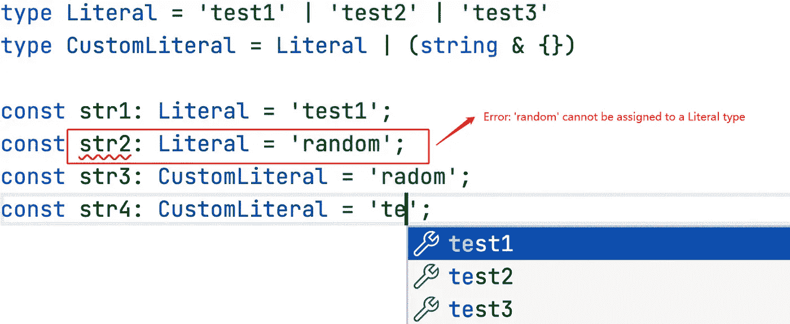
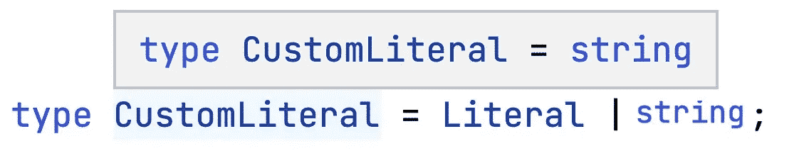
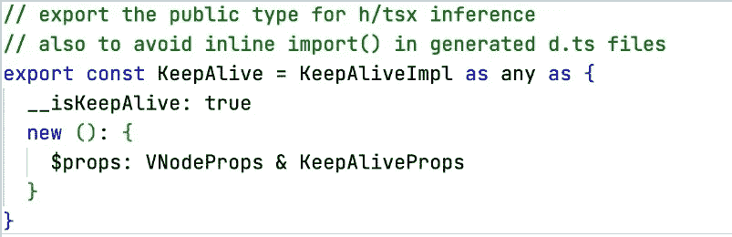
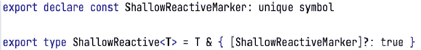

# 打字稿实用技巧:名义打字

> 原文：<https://javascript.plainenglish.io/typescript-practical-tips-nominal-typing-f15ee9723851?source=collection_archive---------2----------------------->

## 名义打字


## 什么是名义类型

名义类型化:将“名义”附加到类型上，以防止结构类型在某些情况下由于类型结构的相似性而被误用。假设以下代码可用:

```
interface Vector2D { x: number, y: number };
interface Vector3D { x: number, y: number, z: number };
function calc(vector: Vector2D): void;

const vector: Vector3D = { x: 1, y: 1, z: 1}

calc(vector) // Does not throw errors
```

看起来`calc()`函数应该只传入`Vector2D` 类型，但是它实际上也可以传入`Vector3D` ，因为`Vector3D` 本质上是`Vector2D`的子集。对于`calc()`函数，只要传入的向量变量同时具有 x 和 y 属性，就可以对其类型进行检查。

这个特性在 TS 中被称为结构化类型，通常有助于编码过程，但在极端情况下，它可能不符合我们的期望。

如果函数被严格限制为`Vector2D` 类型而不是`Vector3D` 类型，那么类型实现可以使用名义类型，通过给它们添加一个唯一的标识符来区分原始类型。

```
interface Vector2D { x: number, y: number, __type: '2d' };
interface Vector3D { x: number, y: number, z: number, __type: '3d' };
function calc(vector: Vector2D): void;
```

对于接口，我们可以直接给它们添加标志属性，但是如何处理基本类型呢？答案是使用交叉类型，例如

```
type Food = string &amp; { _type: 'food' };
type Money = number &amp; { _type: 'money' }
```

你可能对最终类型有所怀疑，但经过这种处理后，它们仍然是原始类型。因为事实上原语类型最终会被解析成它们的 WrapperType 对应物，比如 string → String，number → Number，就像在 JS 中一样。这意味着您可以将它们作为基本类型使用，如下所示。

```
const money = 100 as Money;
const bill = money * 1; // bill is number type
```

虽然这看起来不优雅，甚至很麻烦，但至少在某些情况下是类型安全的。如果您的类型系统中有许多基类型单元，这将非常有用。

## 扩展的应用

这种类型可以用作基元类型，但本质上不是纯粹的基元类型。我们可以利用这个特性来编写一些非常有趣和有用的类型。

例如，在文字枚举的情况下，我们可以限制预定义的值，同时用基于基元类型的名义类型来保证它们，从而允许我们的类型有足够的自由，并且仍然享受 TypeScript 的类型提示，如下所示。



正如您所看到的，CustomLiteral 不仅享受 Literal literals 的类型提示，还可以在枚举的限制之外使用自定义字符串。如果我们直接跨越文字和原始类型字符串。



联合类型的机制本质上是合并，合并得到的最终类型会是更一般的字符串，这反而让我们失去了文字类型的派生。要达到这个效果，我们需要给字符串类型一个“名字”，让它区别于常见的原语类型，不那么“通用”，这样在合并时就不会完全被字符串类型接管。附打字稿游乐场。

## Vue 中的应用

其实在 Vue3 源代码中有很多名词性类型化的例子，比如`VNode`、`Teleport`、`KeepAlive`、`Fragment`等。这些内置组件在它们的定义中有一个标志变量来区分它们。下图显示了`KeepAlive` 组件的声明，更多声明可以在官方知识库中找到。



如果类型声明的位置在一个函数入口上，通常使用一个唯一的符号作为键来构造一个名义类型，以防止与用户定义的属性发生冲突



以上是 TypeScript 实用技巧名义打字的详细讲解。如果你对我的文章感兴趣，请跟我来。

*更多内容看* [***说白了就是 io***](https://plainenglish.io/) *。报名参加我们的* [***免费周报***](http://newsletter.plainenglish.io/) *。关注我们关于*[***Twitter***](https://twitter.com/inPlainEngHQ)，[***LinkedIn***](https://www.linkedin.com/company/inplainenglish/)*，*[***YouTube***](https://www.youtube.com/channel/UCtipWUghju290NWcn8jhyAw)*，以及* [***不和***](https://discord.gg/GtDtUAvyhW) ***。***

***对缩放您的软件启动感兴趣*** *？检查出* [***电路***](https://circuit.ooo?utm=publication-post-cta) *。*