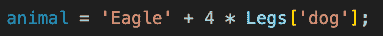
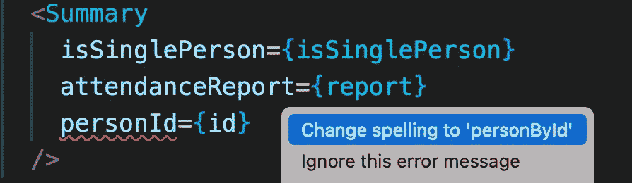

# 带 React 的 TypeScript:回顾(TL；博士——太棒了！)

> 原文：<https://javascript.plainenglish.io/typescript-react-a-retrospective-tl-dr-its-awesome-bffb1c2c448c?source=collection_archive---------12----------------------->

## 我从领导一个由 8 名开发人员组成的团队，将 Angular 应用程序转换为 React 和 TypeScript 中学到了什么。


Photo by [Lautaro Andreani](https://unsplash.com/es/@lautaroandreani?utm_source=medium&utm_medium=referral) on [Unsplash](https://unsplash.com?utm_source=medium&utm_medium=referral)

当我第一次开始写 JavaScript 时，来自 C++，我的头脑被炸了。

当我离开军队重新加入“真实世界”时，我也有同样的感觉—在我在已知的、有纪律的、直截了当的、定义明确的环境中度过了这么长时间之后，我努力去理解这个看似混乱的丛林。

我不是唯一的。有些人失去了理智:

> 戴夫:给我-



> JavaScript:
> 嗯……当然，你是老板！


> C++:


其他人吓坏了，跑回来，再也看不见了。

幸运的是，很快我开始与 Angular 合作，它为我介绍了所有问题的完美解决方案——TypeScript——它给了我渴望的结构和纪律，但又能根据我的需要灵活地使用这些品质。我被卖了。

几年后，我的团队负责用新的设计和新的框架——React——重写我们的整个 Angular UI。一个新的丛林，但这次我有了解决方案！

我的经理思想开放，非常友好，让我在那个项目上尝试使用 TypeScript，尽管他不喜欢 TS(至少可以这么说)，我们的大多数高级开发人员都和他有同样的感受。

让我在这里停下来说明一下——讨厌 TS 的开发人员，或者至少看不到使用它的意义。我见过很多这样的人，我把他们分为四类:

*   真正不需要它的开发人员，因为他们要么是非常优秀和有经验的，要么是更面向后端的开发人员，或者两者都是(是的，我说的是你，前一段的队友和经理)。
*   “快速行动，打破常规”的开发人员，他们更喜欢“把事情做完”，以后再解决。
*   开发人员认为他们不喜欢 TS，因为他们还没有真正使用过它，或者他们受到了某人的创伤，他强迫他们滥用它，并以错误和复杂的方式使用它(是的，它肯定会被误用，成为一场噩梦)。
*   糟糕/懒惰的开发人员，他们只想一个人写他们糟糕的错误代码。(我明显是在开玩笑，没有不好的开发者，我们都很棒！)

因此，经过几个月的紧张工作，带领一个由来自各个层次的 8 名开发人员组成的团队——从经验丰富的顾问到资历很浅的新员工——我认为这个实验非常成功。事实上，我真的无法想象如何(以及为什么？！)你会不会在你的 React 应用中不使用 TS，下面是原因。

# **1。更少的 bug……**

让我们做一个小实验——打开 React 应用程序，向其中添加一个 **tsconfig** 文件，配置为对 JS 文件进行类型检查。

这非常容易做到(有许多文章将带您完成这个简单的过程，我将在本文的结尾添加一些说明),并有效地将 ts 设置为您项目的 linter。

我可以 100%保证，在任何一个适当大小的应用程序中，这将暴露出几十个问题，如果不是几百个的话，从使用第三方包的错误属性开始，通过使用实际上不在你的类对象上的类名，一直到使用你从未初始化的变量，在某些情况下可能是未定义的变量。所有这些都很难调试，但是很容易避免。



Oops, we used the wrong prop name on our own component!

是的，这些 bug 中的一些有可能通过 React 的“PropTypes”解决，但是在运行时发现问题总是不如在开发时发现问题理想，并且考虑到使用 PropTypes 会增加相同数量的样板代码，为什么不使用 TS 并享受许多其他好处呢？

# **2。组件+ API 文档，这是动态的和自我实施的**

在任何大规模的项目中，当编写任何 React 组件时，您必然会使用许多其他组件，项目越大，您很好地了解这些其他组件的机会就越小。

每当我在没有 TS 的情况下编写 React 时，我发现自己在几个不同的组件之间来回切换，要么试图记住每个组件有哪些属性，要么有时将所有属性复制到我当前正在处理的组件的底部，只是为了避免这种切换。

有了 TS，你甚至不需要打开这些组件，它们的接口就在那里。绝大多数第三方组件包都暴露了一个 TS 接口(有人说 Material-UI 吗？).只是让大家的生活简单多了。

如果你的开发组织有自己的共享组件库，而很少团队/产品在使用，这就变得更加重要了。有一个清晰的文档化的契约，每个人都可以不用进入代码就可以使用。这使得沟通更好，维护团队的生活更容易。

当涉及到 API 文档时，它甚至更加重要。正如我提到的，我们正在转换现有的 Angular 应用程序以进行反应，这意味着整个后端已经构建好了，不需要进行更改。团队中有一半人根本不了解应用和后端，但他们需要开始使用的只是 API 响应的 TS 模型，他们可以从 Angular 应用中复制粘贴，并确保这是他们将得到的响应。想象一下，只需将 TS 模型(或其链接)添加到故事/票证，而不是添加 API 的 URL 和描述，这是多么简单，即使这样，开发人员仍然需要进入后端代码来查看响应的结构，或者调用它并在控制台记录结果。

使用 TS 进行文档编制的最大好处是，与我使用过的任何其他文档编制工具不同，如果有人在不更新文档的情况下更改 API/组件，它实际上就变得毫无用处，如果不更新 TS 模型，您就无法更改代码，因此它总是准确和最新的。我们的应用程序的某些部分是在 2 年前编写的，但开发人员仍然可以依靠 ts 模型来准确地表示响应结构。

# **3。** **反应状态结构**

作为我们正在编写的新 React 应用程序的一部分，我们使用了 Redux。这也是我觉得 TS 大放异彩的另一个地方。

Redux 状态很容易变得非常大和复杂，大多数时候，即使查看 reducer 也不会真正帮助您理解完整的结构，因为每个操作只处理该状态片段的一个(或几个)属性。为了完全理解这个结构，你需要在你的头脑中(或在纸上)一点一点地从减速器的所有动作中构建它。

使用状态的 TS 模型将立即揭示状态片的完整结构(或者完整状态，如果您需要的话)，因此您可以很容易地知道作为消费者您可以使用什么。

建立 Redux 商店是我强烈感觉到的一点，对我来说，没有 ts 几乎不可能建立一个 React 应用程序。

# **4。** **发展速度**

这一点有点争议，因为有些人会说 TS 会降低速度，因为它需要额外的代码，但从我的经验来看，它很快就有了回报。

正如以上段落中提到的，TS 通过帮助您避免错误、定义和记录合同、节省您一次又一次钻研现有代码的需要等方式来节省您的时间。

有了 TS 和您最喜欢的 IDE，只需开始输入或悬停在组件、函数、变量或状态片段上，您需要的所有信息就在那里。

最后，关于“滥用”TS 的一个重要注意事项是

在构建应用程序时，我们都有不同的目标、技能和时间表。

没有一种 TS 范式适合所有人。

有些人不使用它，因为他们认为它强迫你使用面向对象编程，并创建了一个继承地狱。

有些人认为学习和掌握的时间太长，因为他们看到了使用泛型和组合类型来覆盖所有可能情况的高级示例。

我曾经认为你永远不应该在你的代码中使用“任何”类型，但是当你有最后期限时，你开始以不同的方式看待事情，并且你开始理解有 99%的代码是类型化的比没有类型要好。

我所能建议的是，从最简单的形式开始使用它——向简单的变量和不复杂的对象(如组件道具)添加类型。一旦掌握了窍门，您就可以决定您希望您的 TS 范型有多严格(或不严格)和复杂(或不复杂)。

**附录——将打字稿设置为短打**

*   在 React 应用程序中，安装这些包和类型:

```
npm install --save-dev typescript @types/node @types/react @types/react-dom @types/jest @tsconfig/create-react-app
```

*   接下来，在项目的根文件夹中创建一个名为“tsconfig.json”的文件，内容如下:

```
{
  "extends": "@tsconfig/create-react-app/tsconfig.json",
  "compilerOptions": {
    "skipLibCheck": true,
    "noImplicitAny": false,
    "noEmit": true,
    "allowJs": true,
    "checkJs": true
  },
  "include": ["src/**/*"],
  "exclude": ["node_modules", "**/*.test.js"]
}
```

*   在您的`package.json`文件中，将这个脚本添加到`scripts`部分:

```
"ts-as-lint": "tsc"
```

*   跑`npm run ts-as-lint`

*更多内容尽在* [***说白了. io***](https://plainenglish.io/) *。报名参加我们的* [***免费周报***](http://newsletter.plainenglish.io/) *。关注我们关于* [***推特***](https://twitter.com/inPlainEngHQ) *和*[***LinkedIn***](https://www.linkedin.com/company/inplainenglish/)*。查看我们的* [***社区不和谐***](https://discord.gg/GtDtUAvyhW) *加入我们的* [***人才集体***](https://inplainenglish.pallet.com/talent/welcome) *。*