# TypeScript，RXJS:使用哪个多播操作符来共享不同时间段内的多个观察器的 HTTP 请求

> 原文：<https://javascript.plainenglish.io/typescript-rxjs-which-multicast-operator-can-be-used-for-sharing-http-request-between-multiple-ac0a349bd9c3?source=collection_archive---------5----------------------->

## RXJS 提供了许多操作符，哪一个操作符将满足您的需求，这肯定需要一些研究和努力。

Photo by [Nubelson Fernandes](https://unsplash.com/@nublson?utm_source=medium&utm_medium=referral) on [Unsplash](https://unsplash.com?utm_source=medium&utm_medium=referral)

在多个观察者之间共享 HTTP 响应对于避免多个 API 调用非常有用，但是 RXJS 提供了许多操作符，哪一个操作符将满足您的需求肯定需要一些研究和努力。

我尝试做的是创建一个 HTTP GET 请求来获取一个用户的数据，然后将它共享给 3 个观察者，他们订阅在不同的时间间隔接收这些数据。我的目标是，无论观察者何时订阅，它都必须接收正确的数据，而不需要额外的 API 调用。只需要一个 API 调用来满足 3 个观察者。

我创建了一个 TypeScript 项目，以避免在 Angular 中创建多个组件。

请注意，整个代码在一个文件中: **index.ts** 。为了避免混淆，我将文件中的逻辑分成了不同的要点。

一.让我从如何创建发出用户数据的**我们的可观察对象开始**。

1.  我们已经使用了 **RXJS ajax 操作符**来创建 HTTP GET 请求。它返回一个类型为 **AjaxResponse** 的可观察对象。
2.  用户数据如下所示。我们只需要数据中的 name 属性。因此，我们使用 **map** 操作符只返回 name 属性的值。

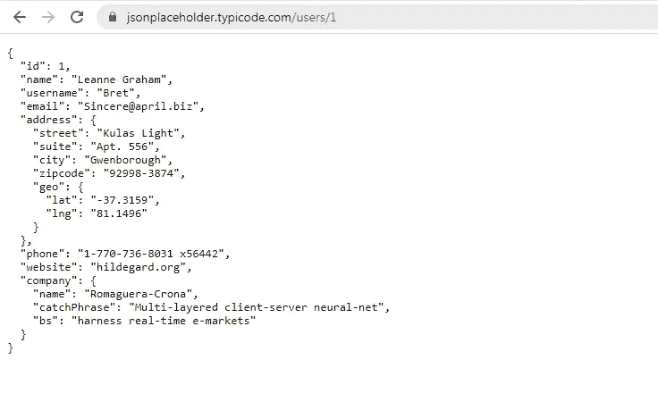

3.我们使用了一个 **tap** 操作符来记录可观察对象发出一个值的时间。

4.请注意，到目前为止，我们还没有使用任何多播操作符。

二。下一步，我们将为这种可观察创造观察者。因为我们创建了 3 个观察者，所以我们创建了一个公共方法 **createObserver()** 来传递观察者索引作为参数。

三。最后，我们通过在不同的时间间隔调用 **createObserver()** 来创建观察器。

1.  我们已经使用 RXJS 操作符的**创建了一个 cold observable，它将发出值 **true** 。它可以释放出任何价值，这真的无关紧要。**
2.  我们首先使用 **delay() RXJS 操作符**创建一个 1 秒的**延迟。接下来，我们添加一个**点击操作符**来执行两个动作:**

= >我们已经记录了观察者将要订阅可观察对象的时间。

= >调用 **createObserver()** 并传递 **1** 作为参数。这里，参数 1 表示它是“第一个观察者”。

3.接下来，我们添加了 2 秒的延迟，并创建了第二个观察点。终于在延迟 5 秒后创造了第三个观察者。

四。现在让我们看看没有任何多播操作符的输出。请注意，已经为 3 个观察者进行了 3 次 API 调用。

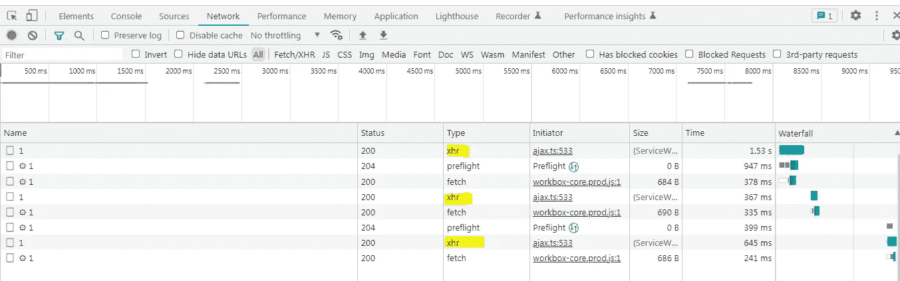

Network Tab

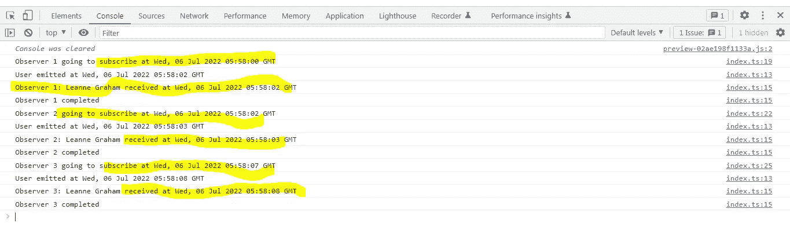

Console Tab

为了理解为什么观察者在某个时间收到了数据，您需要首先下载**。har 文件**如下截图所示。使用 GET 请求 URL 搜索文件，并查找 **startedDateTime** 以检查 HTTP 请求何时开始，并查找 **time** 属性以记录完成请求所用的时间(毫秒)。

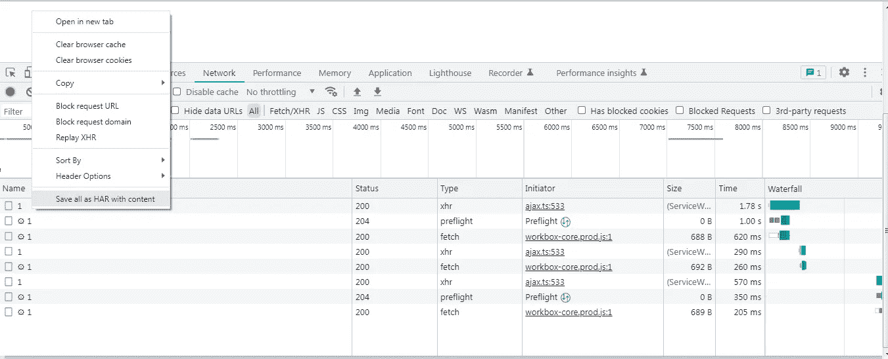

下面是第一个观察者订阅时 HTTP 请求执行的开始时间和持续时间的屏幕截图。

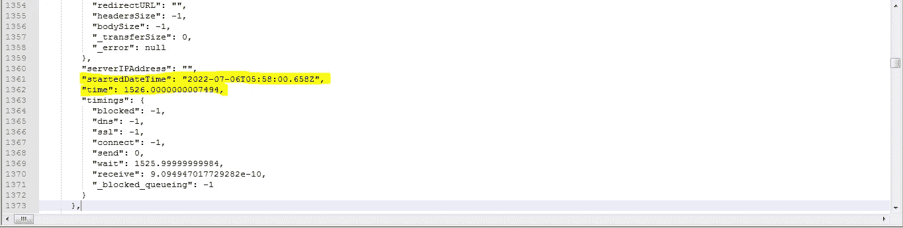

动词 （verb 的缩写）这不是我们想要的结果。我们只需要对所有 3 个观察者进行一次 API 调用。下面是我们现在要测试的多播操作符。

1.  **publish()+refCount()**

我已经更新了“源可观察对象的创建”逻辑来添加这两个操作符，如下所示。其他都没变。

正如您在下面看到的，上面的 2 个操作符只帮助触发了 3 个观察者的 1 个 API 调用。但是所有的观察者都收到数据了吗？

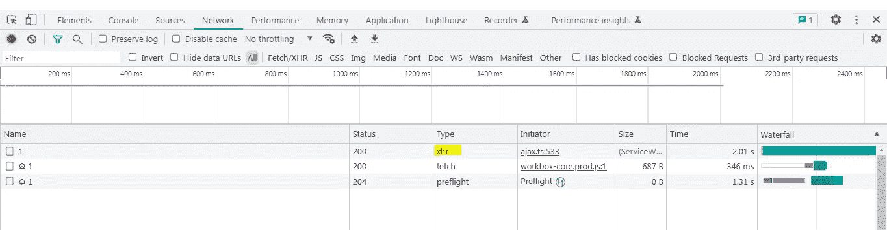

Network Tab

让我们检查控制台以验证这一点。如您所见，只有第一个观察者收到了该值。只有第二个和第三个观察者的 **complete()** 被执行。这意味着在第二个和第三个观察者订阅时，可观察对象已经完成了用户数据的发送。

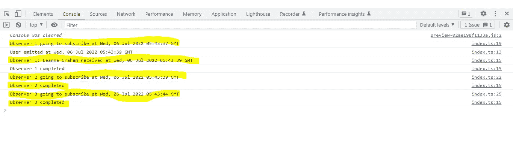

Console Tab

发生了什么事？

=>**ref count()操作符**确保只有当至少有一个观察者订阅时，可观察对象才开始执行。

= >第一个观察者在 **05:43:37，**订阅，这导致可观察对象开始执行并触发 HTTP GET 请求。正如我们在**中看到的。har 文件**下面，GET 请求开始于 **05:43:37** 并持续了 **2 秒。**

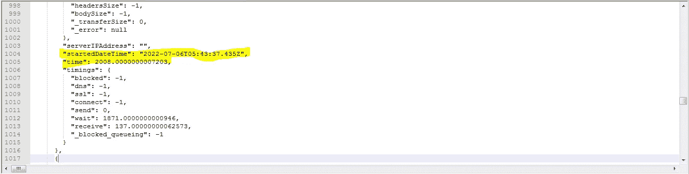

因此，可观测对象在 **05:43:39 完成了所有数据的发射。**

= >第二个观察者在 **05:43:39 订阅，即在第一个观察者订阅后延迟 2 秒。在可观测者发送所有数据和第二个观测者订阅之间肯定有几毫秒的间隔。这就是原因，第二个观察者是一个迟订阅者，并且未能接收到数据。**

只有第二个观察者的 complete()会执行。

= >同样，第三个观察者在 **05:43:44 订阅，即在第二个观察者订阅后 5 秒延迟。**显然，第三个观察者是一个迟到的订阅者，未能接收到数据。

只有第三个观察者的 complete()会执行。

这不符合我们的目标。

2.**分享()**

更新了 index.ts 以添加 share()运算符。

正如您在下面看到的，API 调用又为 3 个观察者进行了三次。为什么 share()没有起作用？

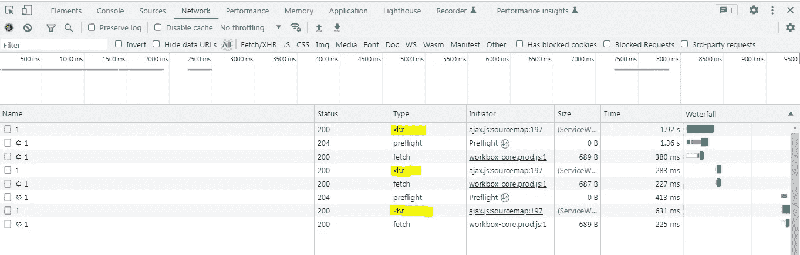

Network Tab

share()操作符将只与在可观察对象发送完所有数据之前订阅的观察对象共享数据。对于后期订户，即第二个和第三个观察者，它将重新执行可观察值，这种情况下将触发新的 API 调用。

请注意，所有 3 个观察者都收到了数据，但代价是额外调用了 2 个 API。

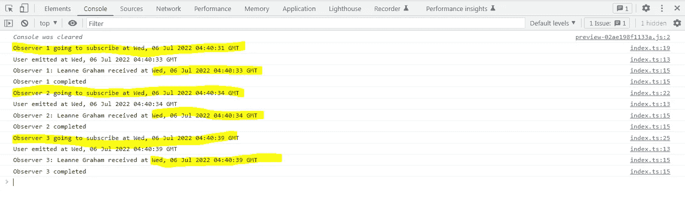

Console tab

让我们看看发生了什么。

= >**share()操作符**在内部使用 **refCount()** 来确保只有当至少有一个观察者订阅时，可观察对象才开始执行。

= >从控制台选项卡日志中，我们可以看到第一个观察者在 **04:40:31 订阅。**因此，我们预计可观察到的执行(即 HTTP 请求)将同时触发。

= >通过检查**。har 文件，**第一个 HTTP GET 请求开始于 **04:40:31** ，持续了 **1.92 秒~ 2 秒**

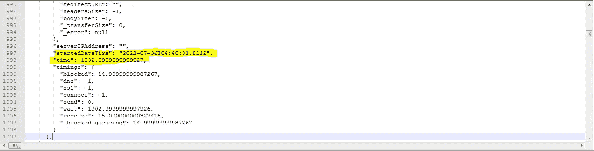

.har file screenshot for first HTTP GET Request

可观测数据在 **4:40:33 完成数据发射。因此第一个观察者也在 **4:40:33 接收到数据。****

4.在第二个观察者订阅之前，我们增加了 2 秒的延迟。从控制台选项卡日志中，我们可以看到第二个观察者在 **04:40:34** 订阅。

由于可观察对象已经在 **4:40:33** 完成了值的发送，第二个观察对象是一个迟订阅者，share()操作符重新执行了可观察对象，这触发了第二个 API 调用

第二个 HTTP 请求，我们可以从**中看到。har 文件**从 **04:40:34** 开始，持续 **295.99 ms** 。

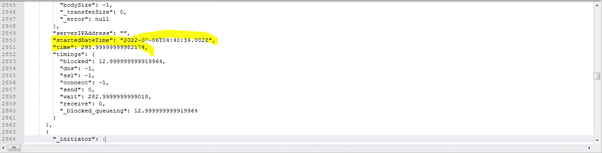

.har file for 2nd HTTP Request

5.在第三个观察者订阅之前，我们增加了 5 秒的延迟。从控制台选项卡日志中，我们可以看到第三个观察者在 **04:40:39** 订阅。从第二个观察者订阅时起，这是预期的 5 秒间隔。

由于可观察对象已经在 **4:40:33** 完成了值的发送，第三个观察对象是一个迟订阅者，share()操作符重新执行了可观察对象，这触发了第三个 API 调用

第三个 HTTP 请求，我们可以从**中看到。har 文件**从 **04:40:39** 开始，持续 **638.99 ms** 。

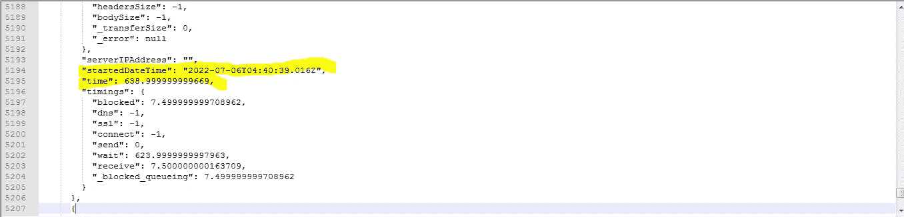

.har file for 3rd HTTP Request

3.**publish last()+ref count()**

更新的 index.ts 如下。

“1 个 API 调用”的目标已经实现，如下所示:

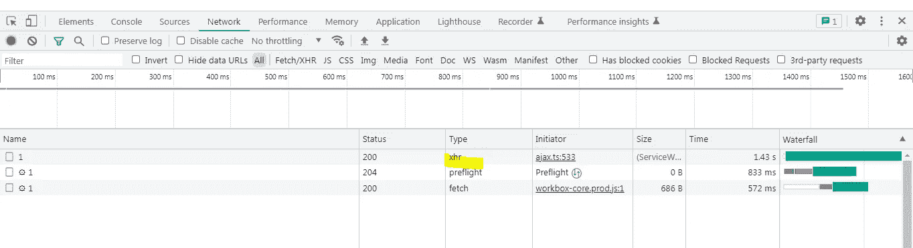

Network Tab

我们还可以从下面的控制台响应中观察到，所有 3 个观察者也都收到了正确的数据。

**publish last()操作符使用 AsyncSubject 将可观察对象的最后一个值发送给它的所有观察者，而不管观察者何时订阅。**

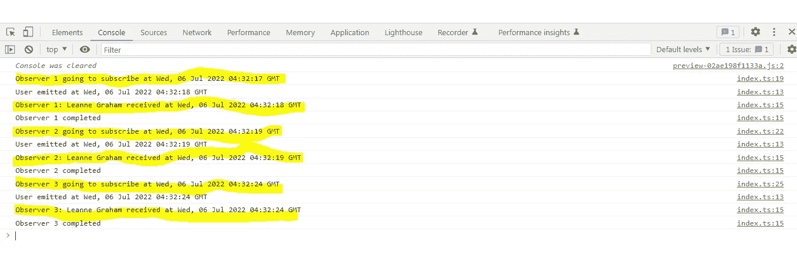

Console Tab

现在让我们看看实际发生了什么。

1.  **refCount()操作符**确保只有当至少有 **1 个观察者**订阅时，可观察对象才会被执行。
2.  查看控制台 tab 日志，第一个观察者订阅于 **04:32:17** 。可观察对象将开始执行，即 HTTP 请求将触发第一个观察者订阅的时刻。
3.  望着。har 文件，请求开始于 **04:32:17** ，持续了 **1.45 秒**。

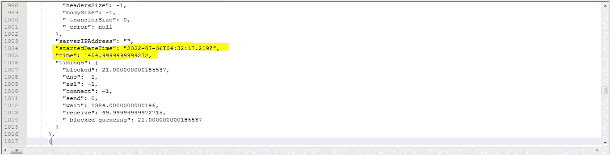

可观测数据在 **4:32:18 完成数据发射。**因此第一个观察者也在 **4:32:18 接收到数据。**

4.在第二个观察者订阅之前，我们增加了 2 秒的延迟。从控制台选项卡日志中，我们可以看到第二个观察者在 **04:32:19** 订阅。从第一个观察者订阅时起，这是预期的 2 秒间隔。

由于被观察对象已经在 **4:32:18** 完成了值的发送，第二个观察对象是一个迟到的订阅者，但是已经收到了正确的数据，因为 **publishLast()操作符**使用的 **AsyncSubject** 已经将被观察对象发送的最后一个数据推送给迟到的订阅者。

5.在第三个观察者订阅之前，我们增加了 5 秒的延迟。从控制台选项卡日志中，我们可以看到第三个观察者在 **04:32:24** 订阅。从第二个观察者订阅时起，这是预期的 5 秒间隔。

由于被观察对象已经在 **4:32:18** 完成了值的发送，第三个观察对象是一个迟到的订阅者，但是已经收到了正确的数据，因为 **publishLast()操作符**使用的 **AsyncSubject** 已经将被观察对象发送的最后一个数据推送给迟到的订阅者。

这就完成了我们的目标。但是，是否有另一个运营商也可以实现这一目标？是啊！

4.**publish replay()+ref count()**

更新的 index.ts 如下。

我们有一个类似于 **publishLast()** 的输出。

**publishReplay()使用 ReplaySubject 将所有以前发出的值发送给它的后期观察者。无论何时订阅，所有观察者都将接收数据。我们可以通过将数字作为参数传递给 publishReplay()来配置后期观察器将收到多少个值。**

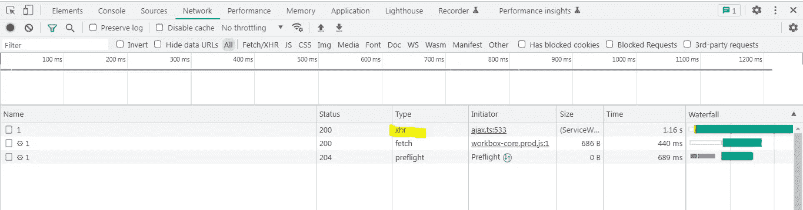

Network Tab

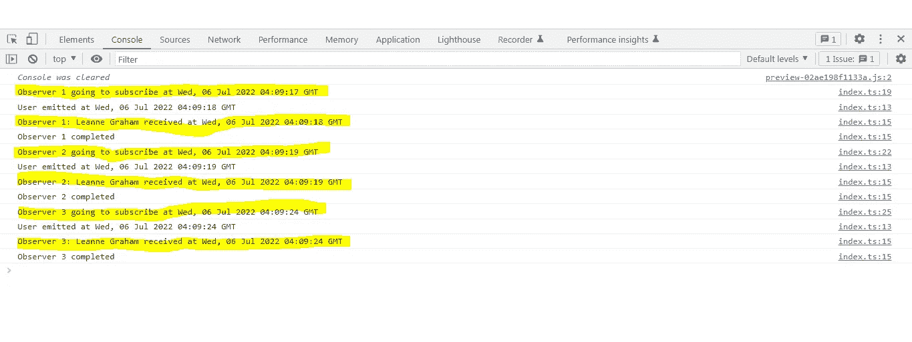

Console Tab

现在让我们看看发生了什么。

1.  **refCount()操作符**确保只有当至少有 **1 个观察者**被订阅时，可观察对象才会被执行。
2.  查看控制台选项卡日志，第一个观察者在 **04:09:17** 订阅。可观察对象将开始执行，即 HTTP 请求将触发第一个观察者订阅的时刻。
3.  望着。har 文件，请求开始于 **04:09:17** ，持续了 **1.21 秒**。

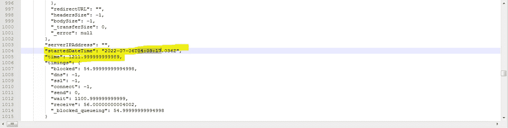

被观测者在 **4:09:18 完成数据发射。**因此，第一个观察者也在 **4:09:18 收到了数据。**

4.在第二个观察者订阅之前，我们增加了 2 秒的延迟。从控制台选项卡日志中，我们可以看到第二个观察者在 **04:09:19** 订阅。从第一个观察者订阅时起，这是预期的 2 秒间隔。

由于可观察对象已经在 **4:09:18** 完成了值的发送，第二个观察对象是一个迟订阅者，但是已经收到了正确的数据，因为 **publishReplay()操作符**使用的 **ReplaySubject** 已经将可观察对象之前发送的所有数据推送到迟订阅者。

5.在第三个观察者订阅之前，我们增加了 5 秒的延迟。从控制台选项卡日志中，我们可以看到第三个观察者在 **04:09:24** 订阅。从第二个观察者订阅时起，这是预期的 5 秒间隔。

由于观察对象已经在 **4:09:18** 完成了值的发送，第三个观察对象是一个迟订阅者，但是已经收到了正确的数据，因为 **publishReplay()操作符**使用的 **ReplaySubject** 已经将观察对象之前发送的所有数据推送给了迟订阅者。

您可以查看下面的完整示例:

这个题目到此为止。感谢您的阅读。

*更多内容请看*[***plain English . io***](https://plainenglish.io/)*。报名参加我们的* [***免费周报***](http://newsletter.plainenglish.io/) *。关注我们关于*[***Twitter***](https://twitter.com/inPlainEngHQ)**和*[***LinkedIn***](https://www.linkedin.com/company/inplainenglish/)*。查看我们的**[***社区不和谐***](https://discord.gg/GtDtUAvyhW) *加入我们的* [***人才集体***](https://inplainenglish.pallet.com/talent/welcome) *。***