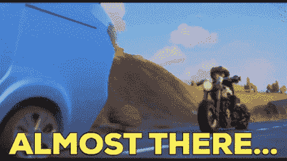

# Typescript Shorts:模块扩充

> 原文：<https://javascript.plainenglish.io/typescript-shorts-module-augmentation-4f139cca9fe7?source=collection_archive---------5----------------------->


大家好，

在这篇博文中，我们将学习 TypeScript 中的一个概念，叫做`module augmentation`。

不要害怕看到这个概念的名字。这只是一个简单解释的别出心裁的名字，我们将在后面的文章中看到。


但是在了解什么是模块增强之前，我们先来看看 TypeScript 的合并原则。

根据 TypeScript，您可以合并:

1.  与接口✅的接口
2.  与✅类的接口
3.  ❌班级

[不允许合并](https://www.typescriptlang.org/docs/handbook/declaration-merging.html#disallowed-merges) —来自类型脚本文档。

**模块扩充**允许我们在不修改类的情况下向类中添加额外的功能，也允许我们向应用程序中使用的第三方库扩展和添加功能。

让我们来看一个代码示例:

```
export class Car{
   constructor(
       public name: string
   ){}
    run(miles: string) {
    console.log(miles);
  }
}
```

我们有带有`name`属性的`Car`类和`run`方法。

如果我想在不修改的情况下向类中添加另一个名为`Make`的方法呢？

让我们看看我们能做些什么。

```
// index.tsimport { Car } from "./Car";declare module './Car' { 
	interface Car {
		year: number
	  getEngineType(value: string):void
	}
}const MuscleCar = new Car('Mustang')
MuscleCar.year = 2008
console.log(MuscleCar.name) // Mustang
console.log(MuscleCar.year) // 2008
console.log(MuscleCar.getEngineType('V8')) // MuscleCar.getEngineType is not a function
```

因此，按照模块扩充，我们必须声明一个模块，我们将声明一个与我们试图扩展的类同名的接口。在接口中，我们将包含我们想要添加到扩展类中的属性和方法。

现在**类型脚本**将合并`Car`的类和接口。如果你试图访问这个方法，我们会得到一个错误，说`getEngineType`不是一个函数。

原因是接口只包含方法声明，不包含实现。我们可以用旧的原型来解决这个问题。

```
Car.prototype.getEngineType = (value: string) => console.log(`Car is of type ${value} engine`)
```

现在，当您尝试访问它时，您将在控制台中得到一个输出，显示`Car is of type V8 engine`

既然我们对模块扩充有了一个基本的概念，让我们看一个实时的例子。

# 模块扩充的用例场景:

我们将使用模块增强在材料 UI 的按钮组件中添加我们自己的颜色变体。

打开您的终端并运行以下命令:

```
# boilerplate app setup using cranpx create-react-app module-augmentation-example --template typescriptcd module-augmentation-example# installing material ui dependencynpm install @mui/material @emotion/react @emotion/styled# starting up the appnpm start
```

当您启动浏览器时，您应该会在屏幕上看到以下内容:


用以下内容替换您的`App.tsx`文件:

```
import "./App.css";
import Button from "@mui/material/Button";
import createTheme from "@mui/material/styles/createTheme";
import { ThemeProvider } from "@mui/material";function App() {
  const { palette } = createTheme();
  const { augmentColor } = palette;
  const createColor = (mainColor: string) =>
    augmentColor({ color: { main: mainColor } });
  const theme = createTheme({
    palette: {
      darkBlue: createColor("#00008b"),
    },
  });
  return (
    <ThemeProvider theme={theme}>
      {/** Extended color */}
      <Button id="basic-button" color="darkBlue" variant="contained">
        Dashboard
      </Button>
      {/** Existing color */}
      <Button id="basic-button" color="primary" variant="contained">
        Dashboard
      </Button>
    </ThemeProvider>
  );
}export default App;
```

我想有一个黑色的背景颜色，并在应用程序的某些部分重复使用。因此，我创造了一个完全正常的新调色板颜色…

…除了**打字稿**开始喊。


您将得到两个错误

**错误 1 :**

```
const createColor: (mainColor: string) => PaletteColor
Type '{ darkBlue: PaletteColor; }' is not assignable to type 'PaletteOptions'.
  Object literal may only specify known properties, and 'darkBlue' does not exist in type 'PaletteOptions'.ts(2322)
```

错误 2:

```
Button.d.ts(34, 5): The expected type comes from property 'color' which is declared here on type 'IntrinsicAttributes & { children?: ReactNode; classes?: Partial<ButtonClasses> | undefined; color?: "primary" | "secondary" | ... 5 more ... | undefined; ... 9 more ...; variant?: "text" | ... 2 more ... | undefined; } & Omit<...> & CommonProps & Omit<...>'
```

从**第一个错误开始，** TypeScript 试图通知我们，您在 Material UI 的 PaletteOptions 下没有`darkblue`。除非你使用现有的调色板选项，否则我不会变回正常的。

**MUI 中的现有调色板选项**

```
export interface PaletteOptions {
  primary?: PaletteColorOptions;
  secondary?: PaletteColorOptions;
  error?: PaletteColorOptions;
  warning?: PaletteColorOptions;
  info?: PaletteColorOptions;
  success?: PaletteColorOptions;
  mode?: PaletteMode;
  tonalOffset?: PaletteTonalOffset;
  contrastThreshold?: number;
  common?: Partial<CommonColors>;
  grey?: ColorPartial;
  text?: Partial<TypeText>;
  divider?: string;
  action?: Partial<TypeAction>;
  background?: Partial<TypeBackground>;
  getContrastText?: (background: string) => string;
}
```

**第二个错误:**

以下是材质用户界面中按钮的可用颜色选项。

```
'primary'
 'secondary'
 'success'
 'error'
 'info'
 'warning'
```

既然我们用了**深蓝**，TypeScript 就是说你不能用。


让我们使用模块增强来解决这些错误。

在 src 文件夹中，创建一个文件`MuiStyles.d.ts`,并添加以下内容:

```
import {
  PaletteColorOptions,
} from "@mui/material";declare module "@mui/material/styles" {
  interface PaletteOptions {
    darkBlue: PaletteColorOptions;
  }
}
```

首先，我们需要添加`darkBlue`颜色到我们的调色板选项中。

为了做到这一点，我们需要扩展`@mui/material/styles`模块并在界面调色板选项下添加颜色。

我们之所以需要将它添加到接口`PaletteOptions`中，是因为我们在组件代码中使用的`theme`的`Palette`属性是一个接口`PaletteOptions`。

正如我们前面看到的，TypeScript 有合并接口的能力，当你检查我们的代码编辑器或你的浏览器(如果你的应用程序正在运行)时，你应该会发现一个错误。



让我们创建另一个名为`MuiButton.d.ts`的类型定义文件，并添加如下内容:

```
import { ButtonPropsColorOverrides } from "@mui/material";declare module "@mui/material/Button" {
  interface ButtonPropsColorOverrides{
    darkBlue: true;
  }
}
```

现在我们已经成功地创建了自定义颜色，我们只需要将它添加到`material ui's interface for button color props.`中，为此，我们声明模块并添加带有`darkBlue`颜色的接口，并将值设置为`true`。

就这样，现在检查你的编辑器和浏览器。你的编辑器应该没有错误，浏览器也应该显示两个按钮。

**浏览器**


**编辑**


# 结论:

差不多就是这样。感谢您花时间阅读博客。我希望每个人都理解模块增强的概念。

如果你觉得这篇文章很有用，给它添加一个❤️，如果我错过了什么，请告诉我——或者如果你对代码有任何疑问，请在评论部分提出来。

非常欢迎对教程的反馈。

# 参考资料:

[打字稿模块扩充——数字海洋](https://www.digitalocean.com/community/tutorials/typescript-module-augmentation)

[申报合并—打印单据](https://www.typescriptlang.org/docs/handbook/declaration-merging.html)

# 社交链接:

[推特](https://twitter.com/karthik_coder)

[展示案例](https://www.showwcase.com/karthik-codes)

*更多内容看* [***说白了就是***](https://plainenglish.io/) *。报名参加我们的* [***免费周报***](http://newsletter.plainenglish.io/) *。关注我们关于*[***Twitter***](https://twitter.com/inPlainEngHQ)*和*[***LinkedIn***](https://www.linkedin.com/company/inplainenglish/)*。加入我们的* [***社区***](https://discord.gg/GtDtUAvyhW) *。*