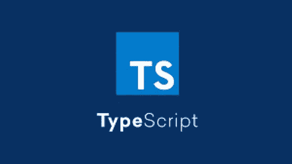

# TypeScript:网络的未来

> 原文：<https://javascript.plainenglish.io/typescript-the-future-of-web-6893ab2cb6bd?source=collection_archive---------3----------------------->

## 了解什么是 TypeScript，它的特性，以及为什么许多开发人员使用它。

微软以创造有时令人难以置信的可爱，有时令人难以忍受的事物和技术而闻名。例如，C#是一种所有开发者和用户都喜欢的语言。另一方面，他们也建立了类似 Windows Vista 或 Internet Explorer 的东西，所以你有了想法。

微软创造并发布的技术之一是 TypeScript，这是一套令人难以置信的技术，受到数百名开发人员的喜爱。但是，什么是 TypeScript？它的故事是什么？它有什么特点？为什么这么多开发者用？是时候理解它了。



TypeScript logos

## **简介和历史**

嗯，TypeScript 是一种开源编程语言，由微软开发。我知道这对你们中的一些人来说可能听起来很奇怪。微软并不热衷于开源，但这一次他们决定尝试这种方式。这种方法效果很好。

更准确地说，TypeScript 是基于 ECMAScript 6 的 JavaScript 的超集。这是什么意思？这意味着用 JavaScript 编写的每个代码也是用 TypeScript 编写的。然后，语法非常相似，甚至在某些特定的用例中是相同的。如果你用 TypeScript 写一些代码，它会被编译成一个 JavaScript 文件，带有一些规范，然后可以从浏览器中被解释为普通的 JavaScript 代码。

主要影响这个项目的开发人员也是微软的项目负责人。他是安德斯·海尔斯伯格，丹麦著名的开发者，也影响了很多 C#，他的创作，以及与之相关的一切。所以，他在编程界是一个非常重要的人物。

此外，TypeScript 扩展是。ts 或者。tsx(代表 React JSX ),它可以在任何操作系统上运行，尽管准确地说，代码的生命是在浏览器上。它拥有 Apache 2.0 许可，并且是多范例的，包括 OOP、脚本和命令。

它于 2012 年 10 月 1 日首次发布，版本为 0.8。在 2014 年 4 月 12 日，1.0 已经发布，目前，我们到了 4.4 版本，它为该语言添加了一些新功能，甚至对它进行了更多的改进。

## **特征和特点**

因此，TypeScript 是 JavaScript 的超集，因此它拥有这种语言的所有特性和功能。他也有同样的执行时间，所以速度并不是这种语言最大的优势。反正 JavaScript 已经有了离散的速度，TypeScript 实现的一切都有着不可思议的价值，几乎是 JavaScript 本身没有的一切。

实现的最重要的特性是强类型，这正是 JavaScript 所需要的。最流行的编程语言的一个最大优点是它的灵活性。但是，当灵活性太大时，有些任务几乎不可能完成，而且非常繁琐。

TypeScript 解决了这个问题，TypeScript 要求开发人员说出变量的类型，因此一些操作更安全、更容易执行，尤其是在 API 响应方面。也有一些情况下 JavaScript 的灵活性是必要的，你也可以在 TypeScript 中使用这个特性。只需要使用 ***类型的*** 就可以了。

TypeScript 实现的另一个有趣的东西是自定义类型。您可以创建能够赋予变量的类型。这可能看起来不那么不可思议，但它非常有用和有价值。您可以像第一个示例那样将类型创建为结构，也可以创建只接受某些值的类型。例如，你希望一个变量只能有“是”或“否”的值，你可以创建类型，这就是第二个例子。

`type Programmer = {
name: string;
favouriteLanguage: string;
};//example 1`

```
type yesOrNo = "YES" | "NO";//example 2
```

这里有一个 TypeScript 中的典型函数，带有强类型变量。

```
function add(first: number, second: number): number {
     return left + right;
}
```

这种特殊性也改善了 JavaScript 的其他特性，比如类、模块和接口。这些特殊的结构可以从安全类型得到令人难以置信的增强，因此您可以确保您创建的所有对象都是有意义的，而不是一组空的或未定义的对象。这就是为什么这个 TypeScript 功能使得 JavaScript 更好、更有利可图。

如前所述，TypeScript 倾向于将自己编译成 JavaScript 代码，在浏览器上运行。为了让你明白 TypeScript 和 JavaScript 代码的区别，这里有原始的 ts 代码，然后是 JavaScript 编译文件。所以，你可以理解他们是相似的，但也确实不同。

简单的类型脚本代码:

```
function multiply(first:number, second: number) :number{return first * second;}console.log(multiply(3,5));
```

简单的 JavaScript 编译代码:

```
"use strict";
function multiply(first, second) {
    return first * second;
}
console.log(multiply(3, 5));
```

显然，输出是相同的。还有许多其他功能和特性使 TypeScript 不同于 JavaScript，这使得这种语言令人难以置信。但是，如果您想阅读本文中的所有内容，您可能需要几个小时以上的时间。因此，我建议您通过以下链接阅读官方文档:

[](https://www.typescriptlang.org/) [## 带有类型语法的 JavaScript。

### TypeScript 通过向语言中添加类型来扩展 JavaScript。TypeScript 通过以下方式加速您的开发体验…

www.typescriptlang.org](https://www.typescriptlang.org/) 

## **调查数据**

像所有重要的编程语言一样，它有一些年度报告，来自 StackOverflow 年度开发者调查。今年，数字很清楚:它是世界上最流行的编程语言之一。更准确地说，它是第七受欢迎的语言，在能用这种特殊语言编码的开发人员中占 30.19%。

但这不是一切。在我看来最有意义的数据。TypeScript 是第三种最受欢迎的语言，72.73%的开发者喜欢用这种特殊的技术编写代码。只有 Rust 和 Clojure 更受人喜爱。这意味着 TypeScript 很乐意用它来编写代码。

JavaScript 代码带来的许多麻烦从主要特性中被删除了，JavaScript 是一项非常可爱的技术。

此外，TypeScript 是一种很多开发人员都喜欢使用的技术，正如调查的最后一部分所建议的那样。所以，话虽如此，数字显然是在打字稿的方向，和他几乎独一无二的可能性。

## **用例**

所以，是的，TypeScript 很神奇，但是我能在哪里使用它呢？是前端还是后端语言？您只需要知道，在任何可以放置 Javascript 代码的地方，都有完美的 TypeScript。

也有更适合它的环境。例如，它通常被放入 React 或 Angular 代码库中，以便更好地管理 API 检索的数据。它在 Node 中很少使用，但是在这个平台上也能很好地工作。在开始一个项目之前，总是寻找更适合您需要的技术，在大多数情况下，您会发现 TypeScript 是一个完美的选择。我这么说是因为我的经历。

## **结论**

有许多令人难以置信的语言和技术，这使得开发世界令人惊叹。这种技术之一，最受欢迎和最有用的技术之一，肯定是 TypeScript，它非常通用、强大和受欢迎。

这些年来，网络是一切重要事情发生的地方，在正确的时间以正确的能力出现在正确的地方是很重要的。对于每一个机会，TypeScript 都是一个不可思议的选择，它是许多公司前进的方向。以 Google 为例，它完全用 TypeScript 开发 Angular。

如果你想学习这项技术，你的选择是正确的，原因有很多。不要错过这个机会。去吧。

感谢阅读。希望你喜欢。如果你有，请拍拍这个帖子来帮助我成长。