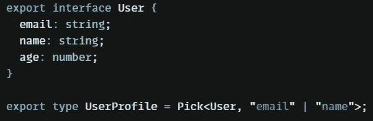

# 您应该知道的类型脚本类型

> 原文：<https://javascript.plainenglish.io/typescript-types-you-probably-dont-know-f803135b279c?source=collection_archive---------14----------------------->

## 类型如何帮助您编写更好的代码。

TypeScript 是开发应用程序的一种非常强大的语言。为了编写更好的代码，我强烈推荐使用实用程序类型。我会告诉你它是如何帮助你的。

[Pixabay](https://pixabay.com/pl/vectors/g%c3%b3ry-panorama-las-g%c3%b3ra-natura-1412683/)

# 🔥介绍

TypeScript 实用工具类型的知识使您能够编写遵循 DRY 规则的更简洁的代码。

# 部分的

如果你想让你的接口的所有字段都是可选的，只需要使用你的类型作为泛型，如下例所示。

Partial utility type

# 需要

要取消之前的操作或定义一个包含所有必需字段的接口，我们可以使用 required 类型。

Required utility type

# 只读

如果你需要用一个指定的接口使你的对象不可变，你可以使用 Readonly 类型。

Readonly utility type

# 挑选

如果您正在编写与其他接口中具有相同字段的类型，则不必再次编写它们。

Pick utility type

# 省略

做一个类似但相反的操作——我们可以从界面中挑选一些字段，而不像这样选择一些字段。

Omit utility type

# 记录

要创建定义类似字典结构的类型，我们可以使用这个实用程序类型。作为第一个泛型，我们需要传递一个左侧类型，作为第二个右侧类型，如下例所示:

Record utility type

# 👌摘要

它有很多实用程序类型。你可以在这里找到他们。TypeScript 的这一特性可以使您的代码更易读、更整洁、更专业。

虽然你仍然可以从头开始定义你的接口，但是这将会更加耗时并且更难重构。

# 😊谢谢大家！

如果你喜欢我的故事和内容，请关注我的简介！

*更多内容看* [***说白了。报名参加我们的***](https://plainenglish.io/) **[***免费周报***](http://newsletter.plainenglish.io/) *。关注我们关于*[***Twitter***](https://twitter.com/inPlainEngHQ)*和*[***LinkedIn***](https://www.linkedin.com/company/inplainenglish/)*。加入我们的* [***社区***](https://discord.gg/GtDtUAvyhW) *。***