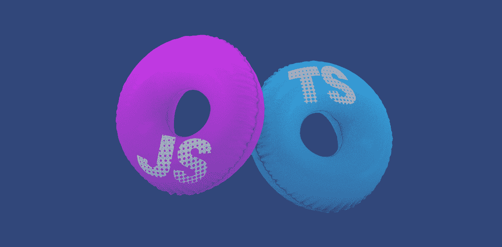
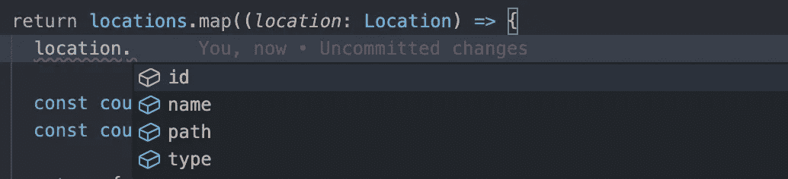
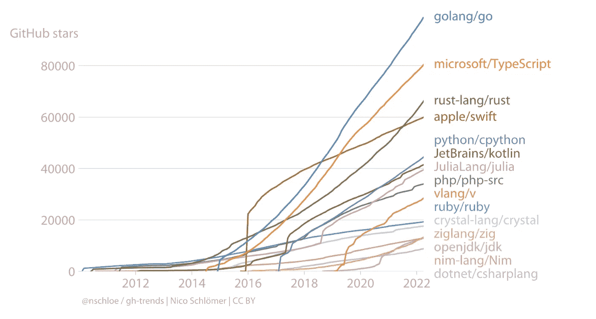
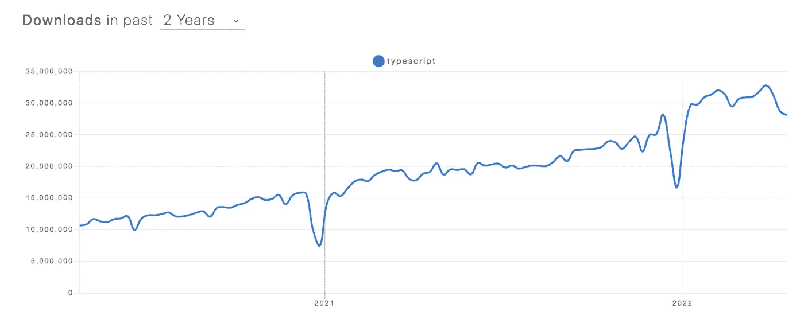
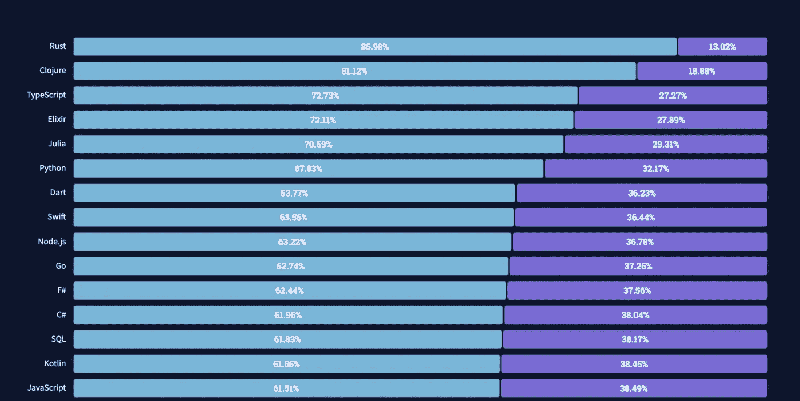
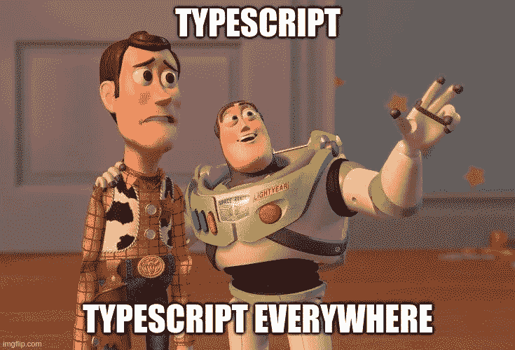

# TypeScript vs JavaScript:你应该选择哪一个？

> 原文：<https://javascript.plainenglish.io/typescript-vs-javascript-which-one-should-you-choose-3acd9a816828?source=collection_archive---------13----------------------->

## 选择 TypeScript 而不是 JavaScript 的 5 个理由，并找出何时使用 JavaScript 更好。

每次听到类似“为什么 TypeScript 比 JavaScript 好？”或者“我们什么时候应该使用 JavaScript 而不是 TypeScript？”我停下来思考——为什么一个比另一个好？一是万能药吗？我们应该在所有情况下都使用它吗？

让我们再深入一点，找出使用 TS vs JS 的五大理由，然后分析什么时候使用纯 JS 更好。

# 选择 TS 而非 JS 的 5 个理由

## 1.JS 的超集

“超集”在这个上下文中是一个花哨的、有点滥用的术语。尽管这是营销活动的一部分，但总的来说，这意味着 TS 是 JS 加上更多的功能。

TypeScript 和 JavaScript 之间最显著的区别在于，TS 包括基本类型、创建自定义类型的机会、映射/条件/模板文字/实用程序类型、抽象类、接口、泛型、枚举等等。这个令人难以置信的长列表还包括一些特定于语言的特性，比如 decorators、mixins 和名称空间。

虽然令人惊讶，但所有这些都大大增加了 TS 学习曲线。初学者，尤其是那些从未接触过强类型语言的人，可能会努力学习它的所有功能。另一方面，使用类型进行设计可以节省大量时间，让你的思维更加开阔，即使是在纯 JS 中。

## 2.更好的开发者体验

这个优势逻辑上来源于上一个。TypeScript 与 ide 高度集成。您可以轻松地浏览代码，找到数据的入口点，并了解任何对象包含哪些属性。

您的团队成员将更有效地理解数据流，这将带来更好的代码质量，以及更容易的重构和设计。

此外，TS 还能防止 bug(不是所有的 bug，因为有些错误，比如逻辑或运行时错误，是无法被发现的),并且具有灵活的配置。

最后，但同样重要的是，TS 与大量 npm 包兼容，你可以很容易地下载打字文件。一切都可以开箱即用，尽管有些包可能没有类型，您必须自己声明它们。

这里的一个潜在问题是 TS 会给你一种错误的安全感，所以你需要使用其他工具来维护代码质量和代码审查。

**有用阅读:** [从类型中创建类型](https://www.typescriptlang.org/docs/handbook/2/types-from-types.html)

## 3.易于开始和采用

要开始使用 TS，您需要安装一个编译器，在 tsconfig 文件中定义配置，并为您的 IDE 安装插件。基础设施方面，就是这样。

在大多数情况下，TS 是开箱即用的，并且带有流行的框架(Angular、Nest 等等)。对于现有的项目，由于 ts 的编译性质，可以逐步引入 TS，因此没有必要重写整个代码。

正如我之前提到的，初学者开始使用 TS 并不总是容易的。但是它与大多数类型化语言相当，所以对于已经有严格类型化语言经验的开发人员来说，学习起来更简单。当然，TS 是面向对象编程爱好者的福音。

**有用阅读:** [什么是 tsconfig.json](https://www.typescriptlang.org/docs/handbook/tsconfig-json.html)

## 4.强大的全球社区

TypeScript 是微软生态系统的一部分，它越来越受欢迎。

来源:https://github.com

它被谷歌、Airbnb、Shopify 和 Adobe 等顶级科技公司广泛使用，因此我们可以假设它在代码库可伸缩性方面满足了他们的要求。

来源:[https://www.npmtrends.com](https://www.npmtrends.com/typescript)

TypeScript 还有许多令人惊叹的开源贡献者、文档和教程。在许多评级中，如堆栈溢出趋势和 TIOBE 指数，它都接近列表的顶部。一系列的自学材料和样板可以在网上找到。

来源:[https://insights.stackoverflow.com](https://insights.stackoverflow.com/survey/2021#technology-most-loved-dreaded-and-wanted)

**有用阅读:** [打字手册](https://www.typescriptlang.org/docs/handbook/intro.html)

## 5.多样的兼容性和编译能力

正如我所说，TypeScript 是 JS 的超集，这意味着它编译成纯 JavaScript，因此可以在任何地方运行。

它可以用在应用程序的前端和后端——任何可以使用 JS 的地方。

此外，TypeScript 相对于 JavaScript 的优势在于它是向后兼容的，可以编译成任何 ES 版本，包括 ES7、ES6、ES5 等等。

# 什么时候用 JavaScript 比较好？

到目前为止，您可能已经确信 TS 是不可思议的，应该在任何地方使用。然而，我不能同意，我会解释原因。

根据我的经验，有几种情况下 TypeScript 是不合适的:

# 当您想使用 TS 时

如果最后期限很紧，或者您正在开发一个应该快速交付然后扔掉的 PoC，您就不应该使用 TS。换句话说，当过度杀戮时。众所周知，这种情况充满了“any”和@ts-ignore 在整个应用程序中的隐式用法。

# 当您处理高度动态的数据时

我的一个朋友正在做一个项目，在这个项目中，几乎不可能弄清楚传入数据的类型，因为它与客户的下游服务有关。TS 在这种情况下并不理想。

# 当你不想编译代码的时候

这种情况很少见，但我还是要提一下。

由于 TS 被编译成 JS，结果的大小可能会更大。此外，在纯 JS 上，开发人员可以更好地控制代码性能。

# 当您的团队没有准备好接受 TS 时

同样，有时学习曲线很重要。当你的团队中没有人有 TS 经验时，最好从 JS 开始，然后再迁移到 TS，以改进交付过程。

**有用阅读:** [从 JavaScript 迁移而来](https://www.typescriptlang.org/docs/handbook/migrating-from-javascript.html)

# TypeScript 还是 JavaScript？做出明智的选择

所以，让我们都同意 TypeScript 不是一个银弹。它只是我们工具箱中的另一个工具，所以让我们明智地使用它。

就我个人而言，我真的很喜欢 TS，但好处取决于何时、何地以及你如何处理它。

例如，我们面临的常见问题是过度键入，当你打喷嚏或我们改变类型时，类型似乎正在被创建，我们需要在整个应用程序中调整它们。

关键是在向您的应用程序添加另一个工具(在本例中是 TS)之前权衡利弊。

*更多内容看* [***说白了就是***](https://plainenglish.io/) *。报名参加我们的* [***免费周报***](http://newsletter.plainenglish.io/) *。关注我们关于*[***Twitter***](https://twitter.com/inPlainEngHQ)*和*[***LinkedIn***](https://www.linkedin.com/company/inplainenglish/)*。查看我们的* [***社区不和谐***](https://discord.gg/GtDtUAvyhW) *加入我们的* [***人才集体***](https://inplainenglish.pallet.com/talent/welcome) *。*