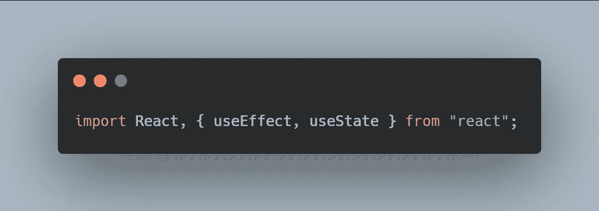
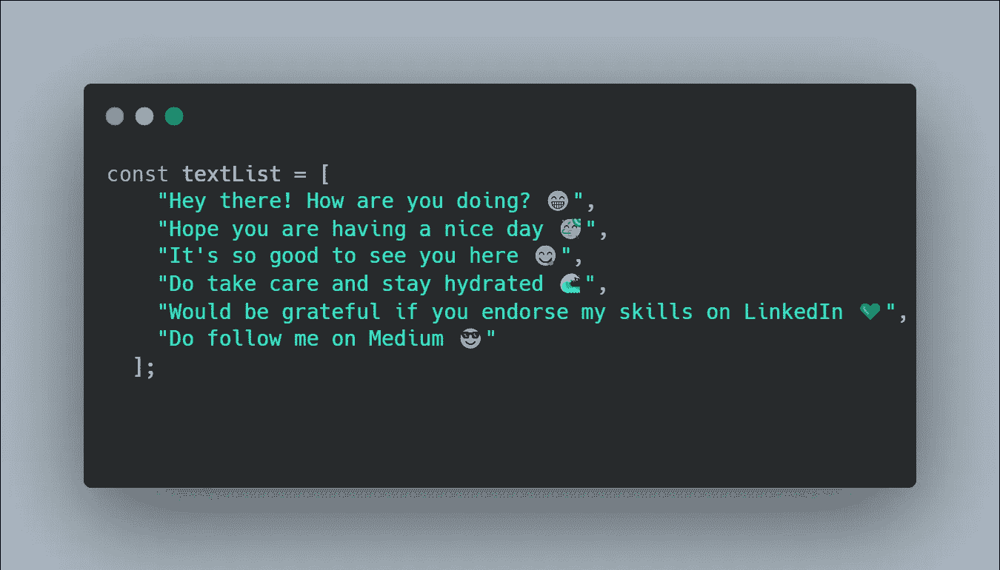
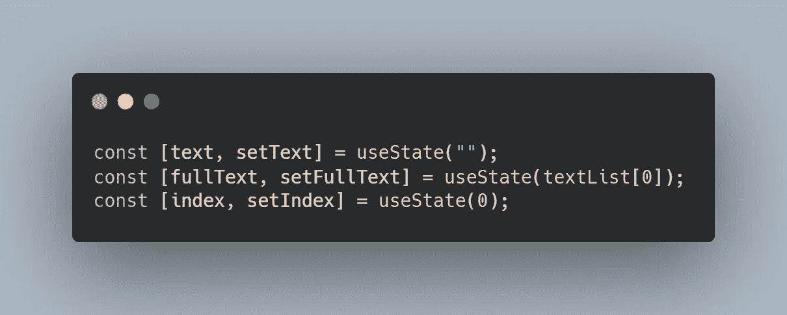
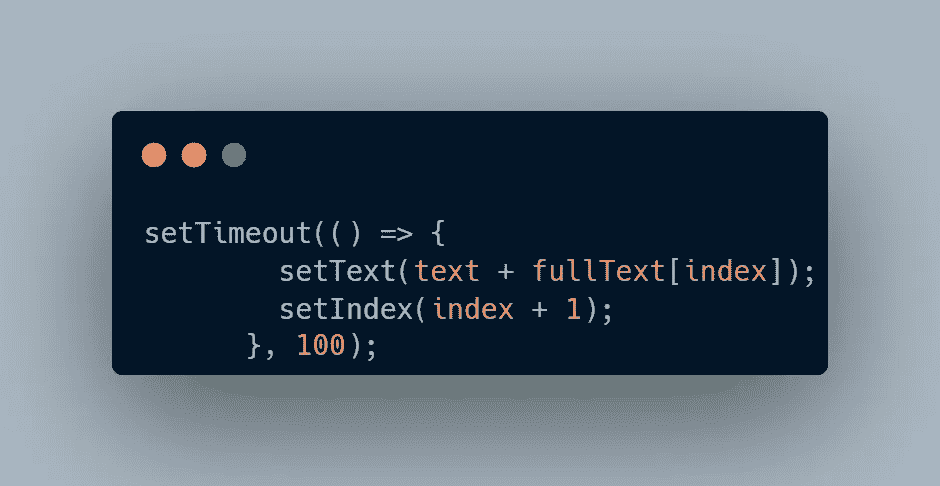
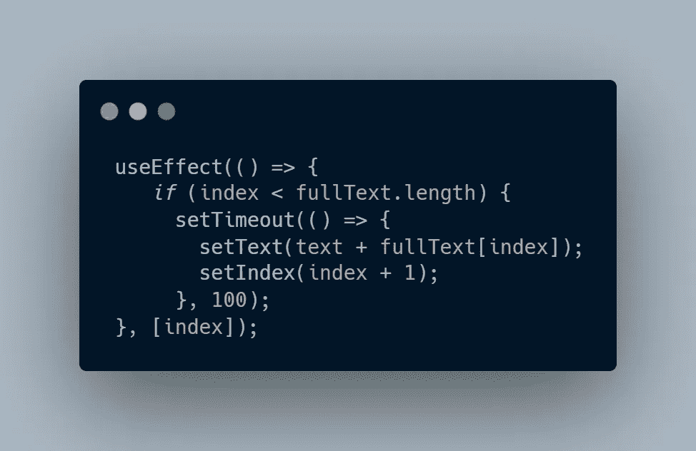
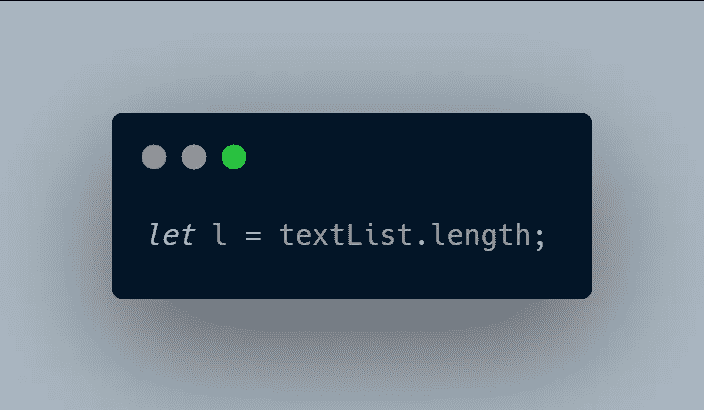
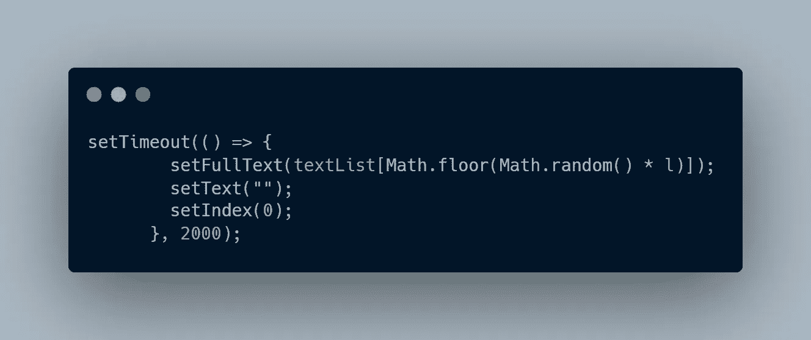
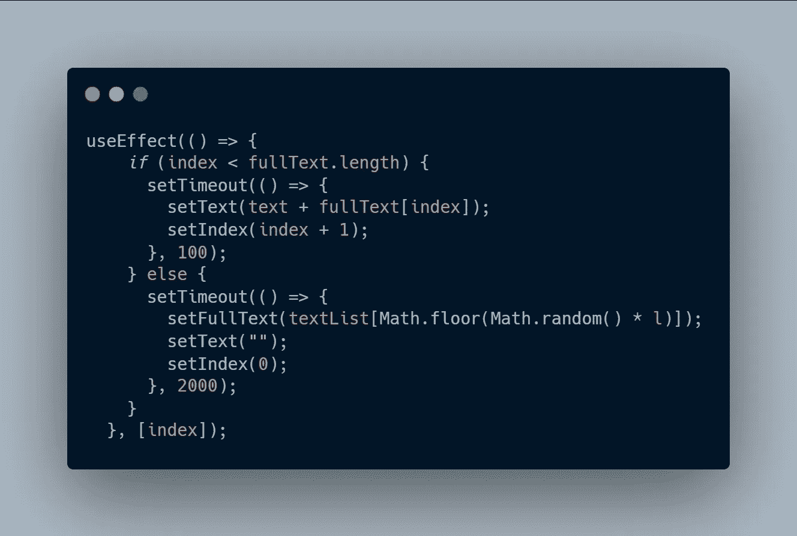
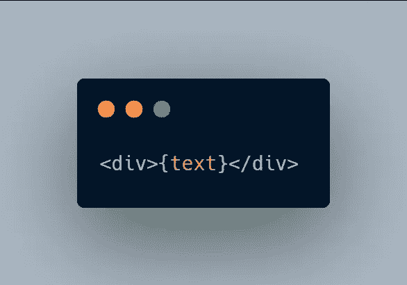
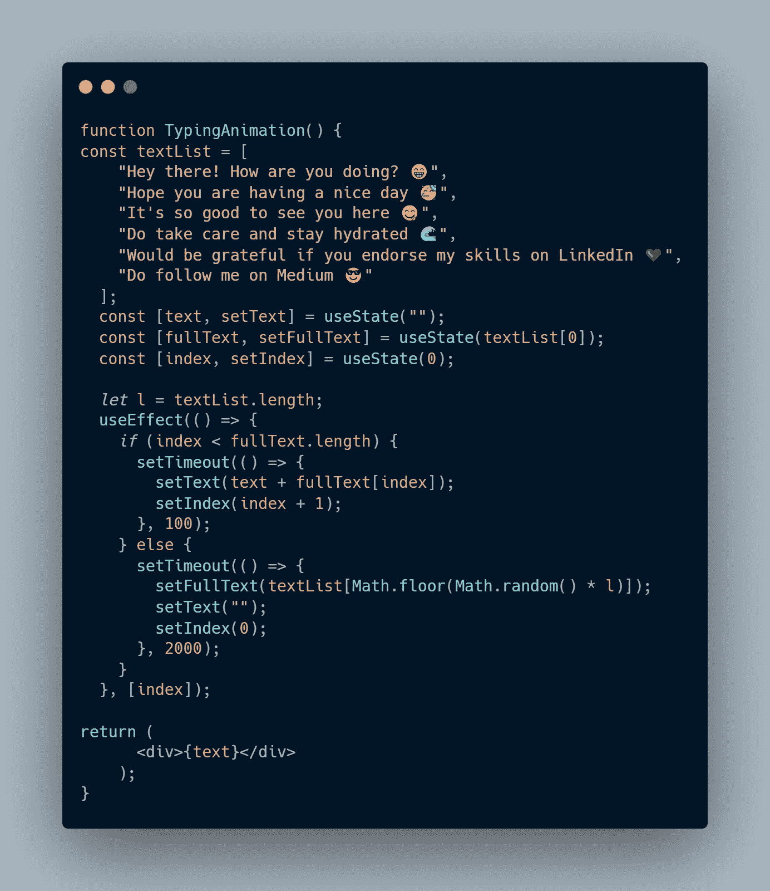

# 从“反应”中的短语列表中键入动画

> 原文：<https://javascript.plainenglish.io/typing-animation-from-a-list-of-phrases-in-react-in-only-6-steps-c969955b0237?source=collection_archive---------15----------------------->

你一定看过那些很酷的动画，文字会自动输入到页面上？🤔有没有想过它是如何在《反应》中完成的？

在这里，我将一步一步地引导你**制作一个带有附加功能的打字动画，它**每 2 秒钟随机选择一个短语**并打字。😋**

****

# **先决条件**

**反应钩子的基本知识，如 useState 和 useEffect。**

# **第一步**

**在组件中您想要动画的地方导入钩子。在这里，我们将使用 **useState** 和 **useEffect** 钩子。**

****

# **第二步**

**我们将需要一个数组来存储我们想要使用的短语，如下所示:**

****

**然后，我们需要几个州，它们是:**

****文本**:页面上显示的当前文本**

****全文**:我们希望看到的最终文本**

****索引**:是当前页面显示的字符的索引。**

****

# **第三步**

**现在我们需要写我们的打字动画逻辑。**

****逻辑**:随着*索引*的增加，我们将*全文*状态的下一个字符添加到*文本*状态，最终显示在我们的页面上。**

**我们想增加索引，比如每 200 毫秒增加一次，所以我们可以使用超时函数(内置于 JS 中)来实现，它将如下实现:**

****

# **第四步**

**需要使用 **useEffect** 钩子，在每次索引的**值改变**时，到**调用超时**函数。**

**因此，在继续制作动画之前，我们检查**索引是否小于全文**的长度。如果索引超过了长度，那么就不需要再动画了，因为我们的全文已经显示出来了😄**

****

# **第五步**

**将全文改为**从我们的文本列表中随机选择一个短语**。**

**只有当索引超过全文的长度时，才会发生这种情况(因为只有那时才会显示前面的全文)。所以这将是另一个条件😋**

**这里，我们需要我们的文本列表的长度，这样我们就可以**为我们的全文选择一个介于 0 和 l 之间的随机索引**。**

****

**现在，需要做什么来随机选择一个新的短语，每 2 秒钟一次？**

1.  **我们需要**将*文本*状态的值改为空**(" ")**
2.  **我们需要将全文的值更改为文本列表的**随机索引位置**。**
3.  **我们需要**将索引设置为 0** ，使其从全文的初始位置开始。**
4.  **我们需要将所有这些**放入每 2 秒触发一次的超时**功能中**

****

**将第 5 步代码**放入您在第 4 步中创建的 useEffect** 钩子的 else 条件中。**

****

# **步骤 6**

****在您想要显示的位置呈现**文本:**

****

# ****最终代码:****

****

**瞧啊。你有你的酷打字动画。🥳**

**一定要跟着我上[媒体](https://medium.com/@subhanu12)！我每周都用 JavaScript 写一些很酷的东西。😋**

****PS:** 如果你喜欢这篇文章，请务必在 [LinkedIn](https://www.linkedin.com/in/subhanu-sankar-roy) 上联系我，认可我的技能。🥰**

**干杯！🥂**

***更多内容看* [***说白了。报名参加我们的***](https://plainenglish.io/) **[***免费周报***](http://newsletter.plainenglish.io/) *。关注我们关于* [***推特***](https://twitter.com/inPlainEngHQ) ，[***LinkedIn***](https://www.linkedin.com/company/inplainenglish/)*，*[***YouTube***](https://www.youtube.com/channel/UCtipWUghju290NWcn8jhyAw)*，以及* [***不和***](https://discord.gg/GtDtUAvyhW) *。*****