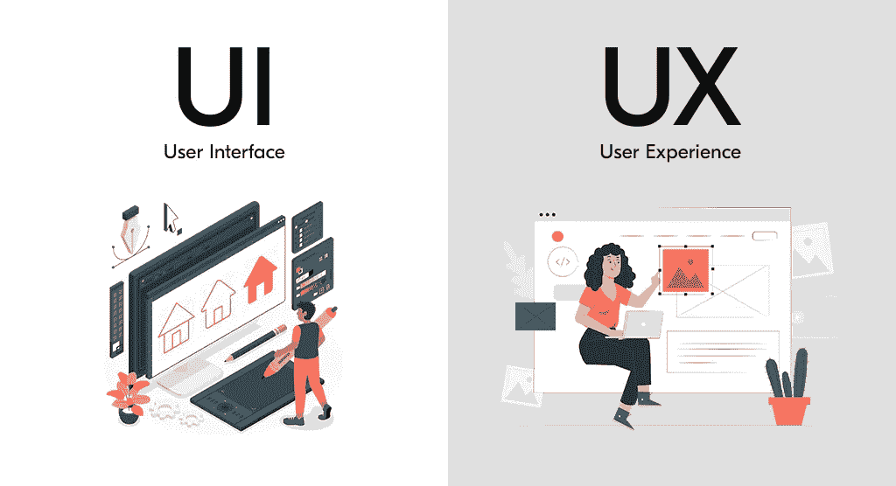
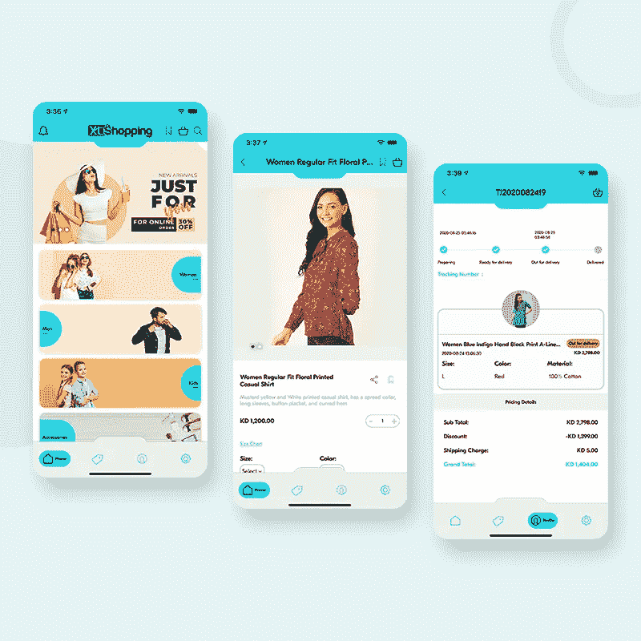
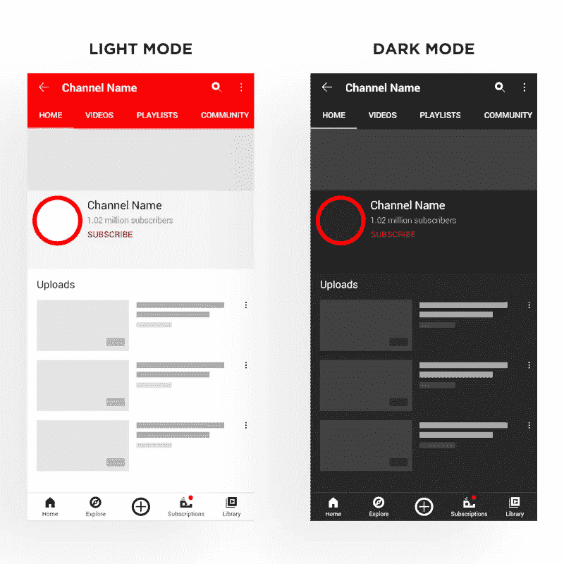

# 7 UI/UX 设计趋势打造黑仔移动应用

> 原文：<https://javascript.plainenglish.io/ui-ux-design-trends-to-build-mobile-app-bba6562b6f04?source=collection_archive---------2----------------------->

## 这种对最新 UI/UX 设计趋势的深刻分析将减少跳出率，增加转化率。

当我们谈论趋势时，它意味着变化。换句话说，它暗示了尝试新事物或独特事物的欲望。

你会惊讶地注意到，有一系列广泛的趋势不仅正在塑造这个行业，而且还将在未来几年继续这样做。这意味着，如果一个特定行业的产品正在被创造，这些趋势将需要被纳入和包括。

其中最具开拓性的趋势之一是移动应用。这些解决方案能够产生的下载量接近 2750 亿次，不言而喻，无论是从知名度还是利润的角度来看，它们确实对企业的成功发挥了巨大的作用。然而，没有一个杀手级的 UI/UX 设计，这是不可能的。

## **为什么？**

这是由于以下原因造成的:

*   抓住最大的用户注意力
*   增加交通流量
*   加快转化的步伐
*   获得竞争优势

看这些原因，就变得很容易破译这个领域的重要性，也就是设计。

在 [**移动应用程序开发**](https://www.xongolab.com/mobile-app-development/) 的过程中，移动应用程序设计师有必要关注 UI/UX 设计的其他一些原因列举如下。

***拥有好的 UI/UX 设计的其他理由***

几乎每一个应用程序用户都会推荐一个视觉上吸引人、用户友好的应用程序。当用户使用你的解决方案时，这有助于给他们一种真实的感觉。同时，它支持他们接收与其中成分相关的信息，从而提高转化率，并帮助您的品牌产生最大价值。

现在有了这个领域对应用程序的成功如此重要的原因的想法，现在重要的是理解 UI，即用户界面，和 UX，即用户体验。

## 关于 UI 你应该知道的

UI 或用户界面主要包括各种元素，如单独的屏幕、页面、子页面和其他各种各样的视觉元素，这些元素可以帮助用户与他们使用的应用程序进行交流。

## 你应该知道的关于 UX 的一切

UX 或用户体验基本上包括用户在使用应用程序时的整体体验。这可以跨移动、桌面等设备。

有了这两个主要概念的基本概念，现在让我们帮助你理解移动应用程序设计者需要记住的标准，以便 [**创建完美的移动应用程序 UI/UX 设计**](https://www.xongolab.com/blog/how-to-create-stunning-mobile-app-design/) 。

***点记打造完美手机 App UI/UX 设计***

> 据 Universal Mind 的高级 UX 设计师专家 Christian Saylor 说，设计创造故事，故事创造难忘的体验，伟大的体验具有改变我们看待世界的方式的先天能力。"

因此，简而言之，通过他的话，你可以洞察到一个完美的设计是一个成功的应用程序的关键，它可以为你的业务带来最大价值。

***按照下面列出的步骤，你就可以着手这件事了。***

## 了解你的用户

这是一个成功的移动应用的先决条件。当你创建一个应用时，你需要非常了解你的用户。换句话说，研究谁是你的目标受众是很重要的，包括他们的年龄、教育背景等等。此外，试着理解他们的需求。这意味着他们的不同需求是什么，如果他们目前有满足他们的解决方案，以及您的解决方案将如何帮助完成任务。

一旦你分析了这一点，继续了解当前是否有应用程序在任务中帮助用户，然后建立用户角色，进行情境调查，包括了解在使用应用程序的过程中最不满意和最满意的体验，最后在不同的组中测试应用程序。在你进入发展阶段之前，所有这些领域将继续帮助你在 UX 内做出改变。完成所有这些步骤后，您可以执行以下步骤，包括:

***—尽可能多地清理***

对于一个成功的移动应用来说，清晰是必须的。一个好的移动应用程序没有太多的设计元素，可能包括多个图像、按钮和文本。这同样会阻碍对应用程序的理解。因此，确保当你在创建完美的 UI/UX 时，除了避免用随机内容填满屏幕之外，你还要在每个屏幕上关注一个或最多两个动作。换句话说，尽量保持标题和文字简洁明了。所有这些都将帮助你的用户获得你的解决方案想要传达的信息。

***—认真遵循 Android 和 iOS 的设计惯例***

除了努力确保您的应用程序能够向您的用户传递与您的企业希望实现的目标相关的信息，遵循 Android 和 iOS 等平台的惯例也同样重要。由于这些平台有不同的导航方法、内容布局等等，保持一致将有助于您交付无缝的用户体验。

除了上面列出的领域，同样重要的是你要尽可能地使元素具有交互性。这将使你的解决方案摆脱任何可能的问题。

因此，简而言之，你可以理解一个好的用户界面/UX 设计是一个成功的移动应用的关键。它可以帮助您的企业从已经在提供您可能正在提供的服务的不同企业中脱颖而出。然而，为了实现这一点，采用新的趋势是很重要的。

下面，我们根据布局、颜色、形式以及风格等类别列出了一些趋势，这些趋势有望帮助你的应用在 2022 年及以后脱颖而出。

***2022 年 7 UI UX 设计趋势你应该记得***

1.  **非标准的沉浸式布局加上滚动提示**

使用静态文本块的琐碎网格布局的日子已经一去不复返了。在非标准沉浸式布局的帮助下，您可以确保通过您的应用程序提供完全交互式的用户体验。这意味着，一旦你的用户访问了你的应用，他们就开始了一场冒险狂欢。换句话说，他们可以接触到非常新的元素，从而确保他们长时间粘在你的解决方案上。

**2。黑暗模式**

这是你应该确保在你的应用程序中拥有的另一个趋势。这是因为它将特别为那些可能有视觉障碍的人提供增强的可视性可行性。它还将同时降低整体功耗，尤其是那些拥有有机发光二极管屏幕的手机。

**3。洛蒂动画**

洛蒂动画是一种动画类型，从 2017 年到 2021 年，它的搜索率接近 2300%。因此，简单地说，这种动画趋势已经在移动应用程序设计者中相当流行。所以 2022 年也值得考虑。作为一个基于 JSON 的开源工具，它可以帮助设计者以极快的速度构建、测试和显示动画，从而保证极高的图像质量。

**4。语音搜索**

由于 Siri、亚马逊 Alexa 等媒介，VOI 见证了稳步增长，因为它在提高速度和确保用户与应用程序交互的便利性方面提供了支持，到 2025 年，语音和语音界面市场将产生约 250 亿美元的收入。因此，简而言之，这是一个值得利用的趋势。

**5。移动优先的方法**

近 10 亿人粘在他们的移动设备上执行不同的任务，从订餐到预订下一次旅行，因此不言而喻，你的应用程序应该兼容并易于在各种设备上使用。这就是我们所说的“移动优先”方法，通过这种方法，您可以确保增强整体客户互动流程。

**6。定制体验**

每个用户都有独特的需求和要求。因此，不言而喻，如果你的应用程序缺乏确保完全个性化体验的基本功能，你的用户不会花太多时间去切换到另一个应用程序。因此，这是一种趋势，你应该在手机应用程序设计中融入这种趋势。

**7。排版**

内容为王。然而，当涉及到你的应用程序时，你的终端用户不会阅读内容。相反，他们会扫描信息，将字体与品牌联系起来。因此，请确保选择合适的字体。这将确保你的应用程序获得全新的感觉。它将同时帮助用户找到他们需要的信息。你可以选择复杂的版式，因为它非常容易以非常简洁的方式向用户传达信息。

除了这些趋势，其他一些有望在 2022 年产生涟漪的趋势包括 UI/UX 写作，这意味着通过最少的内容，如短句，用户可以了解应用程序和品牌的故事，从而帮助它实现获得更多最终用户的预期目标。另一个是身份认证，包括面部解锁或指纹传感器，以防止安全漏洞的发生。

此外，你可以考虑加入像 90 年代复古 UI 这样的趋势，其中包括像素化排版，屏幕撕裂，这实际上有助于为你的应用程序创建格外生动的设计，除了独特和荒谬的 2D 插图，举几个例子，但是建议非常明智地选择趋势，因为你不会希望你的应用程序的加载时间增加。

## 总结

移动应用程序旨在让生活变得更轻松。有了完美的 [**移动应用 UI/UX 设计**](https://www.xongolab.com/ui-ux-design-development/) 您可以放心，您的解决方案将成功留住最大数量的用户。

然而，建议不要让你的手机应用程序与所有的 UI UX 设计趋势复杂化，因为事实上这可能会使它使用起来极其复杂。相反，试着关注用户的需求，然后，也只有这样，你才应该在构建应用程序时，在你的用户界面/UX 设计中包含同样的内容。这将帮助你实现最大的商业价值和最大的利润。

*更多内容请看*[***plain English . io***](https://plainenglish.io/)*。报名参加我们的* [***免费周报***](http://newsletter.plainenglish.io/) *。关注我们关于*[***Twitter***](https://twitter.com/inPlainEngHQ)*和*[***LinkedIn***](https://www.linkedin.com/company/inplainenglish/)*。加入我们的* [***社区不和谐***](https://discord.gg/GtDtUAvyhW) *。*