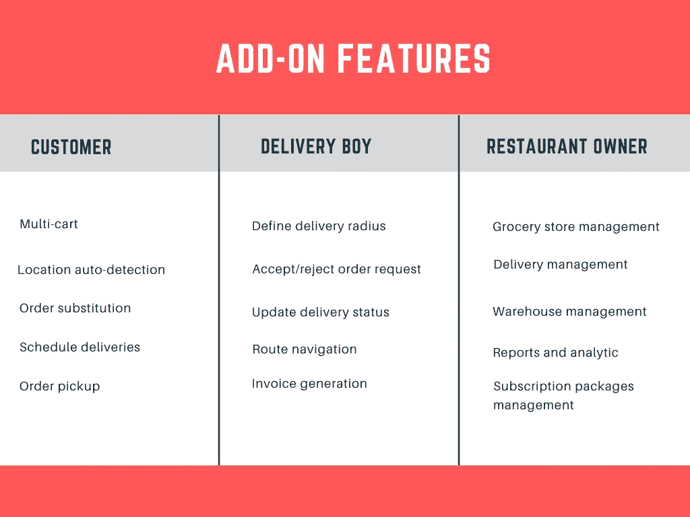
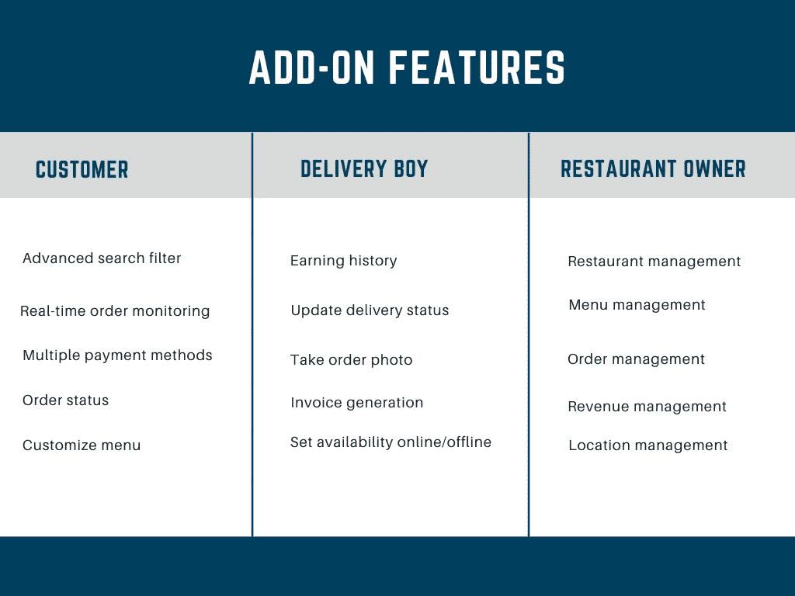

# 增强业务可见性的终极移动应用开发指南

> 原文：<https://javascript.plainenglish.io/ultimate-mobile-app-development-guide-for-enhanced-business-visibility-12d24d964fc0?source=collection_archive---------9----------------------->

移动应用无处不在，它们出现在生活的方方面面，从我们如何点餐到我们如何购买日常用品。这就是为什么每个企业都在利用按需移动应用程序开发优势。

到 2026 年，利润预计将达到 6144 亿美元，可以肯定地说，立即获得应用程序的好处是一个好主意。这将使企业获得应得的知名度，并支持客户在整体上拥有异常便利的生活。

想知道怎么做吗？如果你在食品或杂货交付行业，这份全面的指南将帮助你掌握应用开发过程中应该遵循的步骤，以增加收入。它将向你介绍，特别是克隆应用或现成的应用解决方案，这是通往成功和盈利的商业帝国的必经之路。

## 全球按需应用受欢迎程度的市场统计

要理解采用按需移动应用程序开发的原因，你首先应该知道描述全球流行程度的数字。

*   2022 年应用市场的利润为 4309.0 亿美元。
*   2022 年至 2026 年间，收入将以 9.27%的 CAGR 增长。
*   到 2026 年，应用程序的预计市场规模将达到 6144 亿美元。
*   2022 年，应用程序下载量为 2.352619 亿次。

这一估值足以让人们认为，按需移动应用开发是通往成功和收入的必由之路。

所以你知道应用程序的盈利性质。重要的是要注意，如果你有一个传统的杂货店或食品配送设置，应用程序的优势将创造奇迹。

## 面向食品和杂货行业的按需移动应用程序开发专家

为了让杂货店和餐馆获得应有的知名度，采用按需移动应用程序开发是正确的方法。它还能让顾客方便快捷地将商品送到家门口，或者和他们亲近的人一起享用美味佳肴。

以下是与给这两个设置赋予数字化身相关的一些其他好处。

1.  提高餐馆和杂货店的知名度。
2.  自动化运营和管理相关任务。
3.  为消费者创造便利的食品订购和购物体验。
4.  保持客户对预期交付时间的透明度。

那么，如何着手开发这些解决方案呢？答案是购买现成的克隆应用。

## 什么是克隆应用？

克隆应用是专为初创公司打造的现成且随时可以推出的解决方案。当我们在这里讨论食品和杂货配送部门时，这些解决方案对这两个部门来说是变相的祝福。

它允许他们根据未来的业务和客户需求进行扩展，因此他们可以在没有任何挑战的情况下发展。这是由于其易于修改的特性。

那么现在，让我们来教育自己，如果你正在寻求开发一个食品递送克隆或一个食品杂货应用克隆，该如何执行。

## 如何搭建杂货 App 克隆？

要成为利润高达 2436.7 亿美元的杂货交付市场的一部分，请在不降低成本的情况下利用应用程序的优势。因此，获得克隆应用程序。下面几行解释了如何构建一个杂货应用克隆的方法。

> ***选择合适的商业模式***

研究您的业务需求，并选择一种能让您的杂货店舒适运营的模式。

**这里有四种型号你可以选择-**

*   多供应商杂货模式，其中第三方应用程序或平台向客户提供杂货交付服务。
*   一种全渠道商业模式，通过网站和移动应用程序，客户可以访问不同的商店，选择一个匹配的偏好，订购商品，并完成交付。
*   库存商业模式，其中杂货供应商和买家连接，以便后者获得他们的项目交付。
*   超级本地杂货商业模式，提供上门在线杂货交付给客户。

> ***明智地选择收入渠道***

为了让你的杂货递送业务盈利，明智地选择收入模式。

**这里有一些你可以利用的渠道来实现这一点-**

*   从卖方那里收取每笔交易的佣金。
*   通过从不同的计划中选择一个计划，要求供应商支付象征性的费用作为订阅费。
*   让送货专业人员和客户支付送货费。

## 有 USP

让你的应用脱颖而出。因此，为你的杂货应用克隆一个 USP 是个好主意。这意味着包括一些独特的功能，让用户参与度达到顶峰。

有三个主要部分，顾客、送货司机和商店。因此，对于它们中的每一个，将这些成分添加到它们各自的溶液中。

现在让我们告诉你一些步骤，坚持这些步骤可以让你像专业人员一样开发一个送餐克隆人。

## 如何开发送餐克隆？

到 2027 年，食品配送市场的利润预计将达到 4662 亿美元，成为这个利润丰厚的市场的一部分将创造奇迹。然而，由于成本仍然是初创公司的一个制约因素，最好的办法是开发一个食品配送克隆。

以下是执行此操作的步骤-

> ***了解不同的 App 类型***

开发 food delivery clone 时，了解其不同的应用程序类型至关重要。这里有三种流行的模型-

*   消费者和餐厅连接的订单模式，因此后者提供食品配送。
*   应用程序所有者执行交付管理的订单交付模式；并从餐馆获得佣金。接下来是从客户那里收取送货费。
*   这是一个完全集成的模型，应用程序可以处理从做饭到订单分配到订单交付的所有事情。

> ***保持更新——保持研究***

接下来，了解食品配送行业的最新趋势。因此，尽可能多地研究。这也需要竞争对手分析和目标市场研究。

这里有一些你可以做到的方法-

*   评估竞争对手开发的应用程序，并检查它们包含的功能。
*   查看客户对解决方案的评价，观察他们的总体满意度。
*   确定包含的功能，并尝试找出缺失的功能，了解包含是否对您有价值。

> ***保持 App 唯一***

市面上有几款[送餐 app](https://www.fooddeliveryclone.com/)——Zomato、UberEats 等。他们的 USP 或独特卖点是他们吸引客户的方式。

这是你在开发送餐克隆时需要记住的事情。建议您尽可能使其功能丰富。

以下是您可以包括的一些功能。

> ***选择收入模式***

当你开发食品配送克隆时，有三种方法来利用利润。

*   向客户和送货司机收取送货费。
*   让餐馆为在平台上注册支付服务费。
*   餐厅向应用程序支付费用

> ***选择健壮的技术栈***

为了让应用程序运行完美，没有差异，使用强大的技术栈。

这里有一些将帮助你。

*   用于注册—授权
*   用于添加餐馆详细信息——Google Places API
*   安全可靠的支付——brain tree 和 Stripe SDK
*   用于路线优化—例行 API

既然你已经清楚了开发食品和[杂货应用克隆](https://www.groceryappclone.com/)的应用开发策略，让我们来评估一下成本因素。

## 构建按需 App 需要多少成本？

当你着手进行按需移动应用程序开发时，你需要控制你的财务。

例如，如果你想开发一个食品配送克隆，构建按需应用的成本将在 5000 美元到 50000 美元之间。另一方面，当你为 Android 平台开发一个杂货应用克隆时，你需要支付 38，000 至 51，000 美元，而在 iOS 平台，你需要支付 39，000 至 53，000 美元。

然而，这是一个好主意，你保持一些领域的考虑，以保持财政检查。

1.  保持应用简单
2.  添加有用的功能
3.  让 UX 简单
4.  按需外包移动应用程序开发

## 包扎

到 2026 年，按需移动应用市场的收入将达到 6144.0 亿美元。这描绘了它的整体盈利性质。因此，尽早成为它的一部分是个好主意。尤其是如果你有一个传统的餐馆或超市设置，该解决方案将是一个福音。但是，从零开始到 app 开发；是一件耗费时间和金钱的事情。

为了保持这一点，请联系海外的按需移动应用开发公司。在了解你不同的业务需求和客户需求后，他们会开发食品配送克隆或杂货应用克隆。这将确保您的业务在短时间内启动，您将获得前所未有的利润和回报！

*更多内容请看*[***plain English . io***](https://plainenglish.io/)*。报名参加我们的* [***免费周报***](http://newsletter.plainenglish.io/) *。关注我们关于*[***Twitter***](https://twitter.com/inPlainEngHQ)[***LinkedIn***](https://www.linkedin.com/company/inplainenglish/)*[***YouTube***](https://www.youtube.com/channel/UCtipWUghju290NWcn8jhyAw)*[***不和***](https://discord.gg/GtDtUAvyhW) *。对增长黑客感兴趣？检查* [***电路***](https://circuit.ooo/) *。***