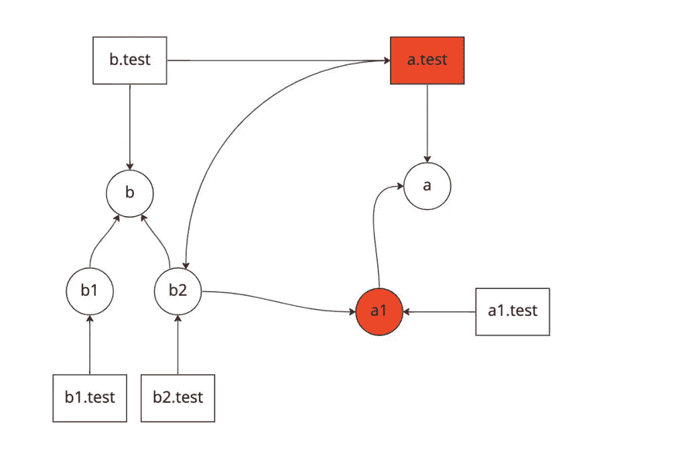
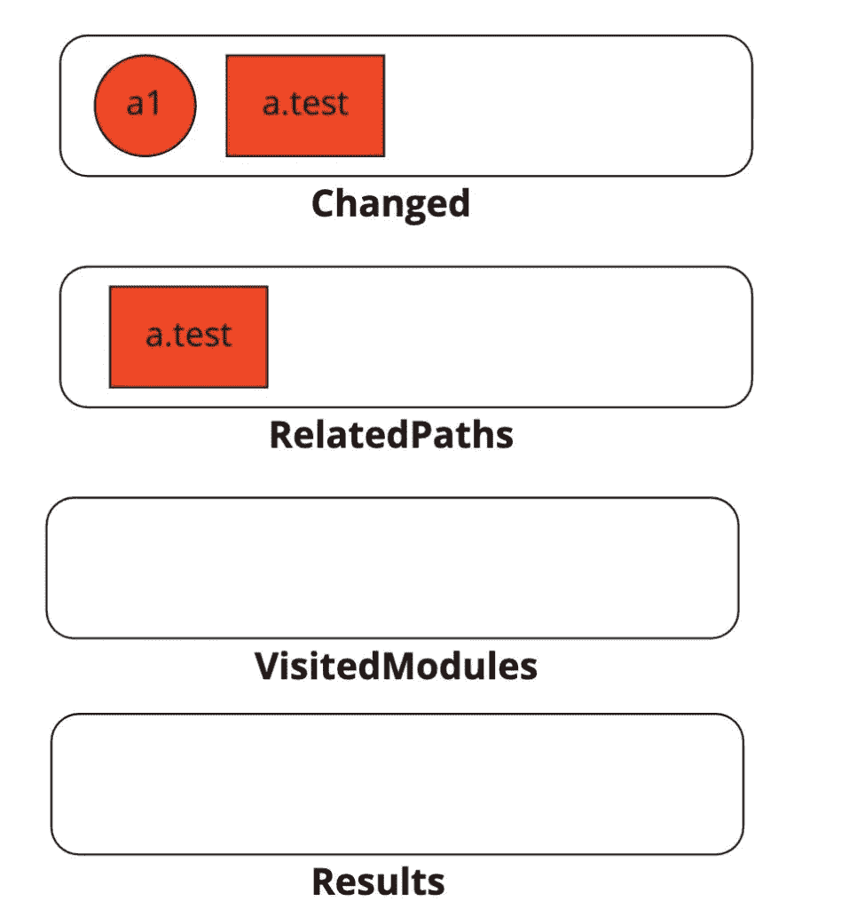
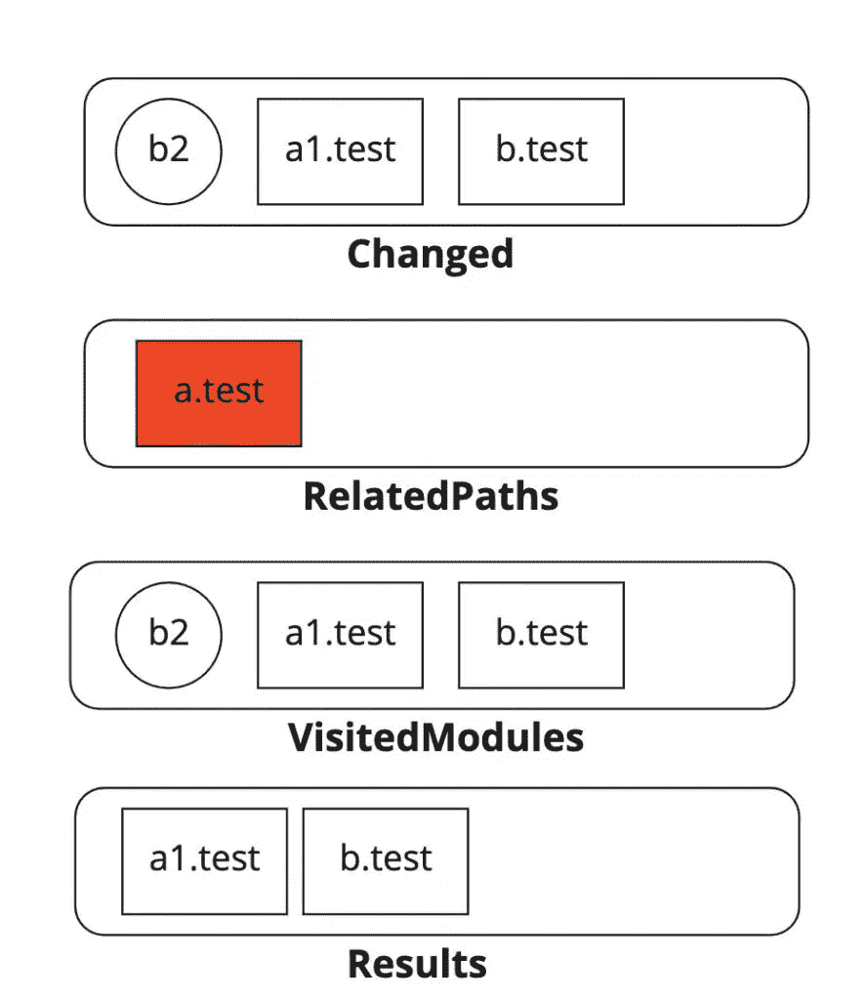
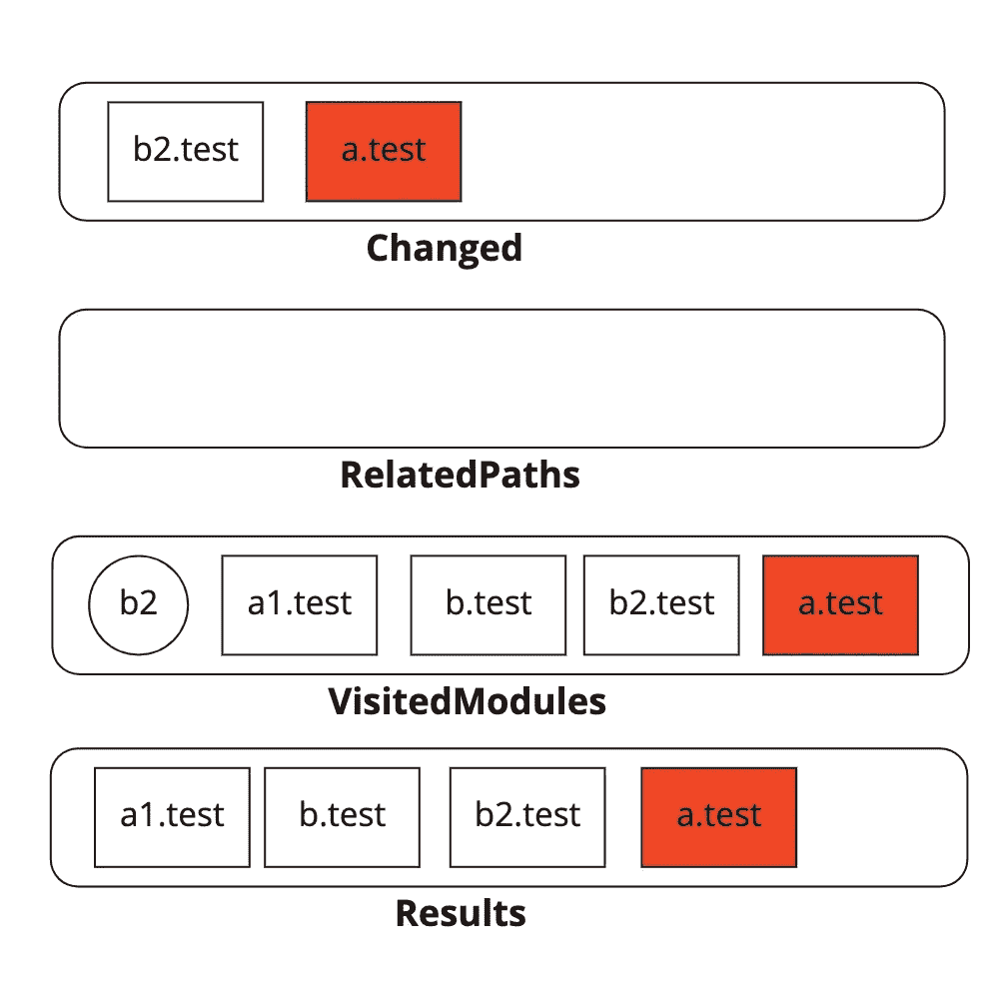
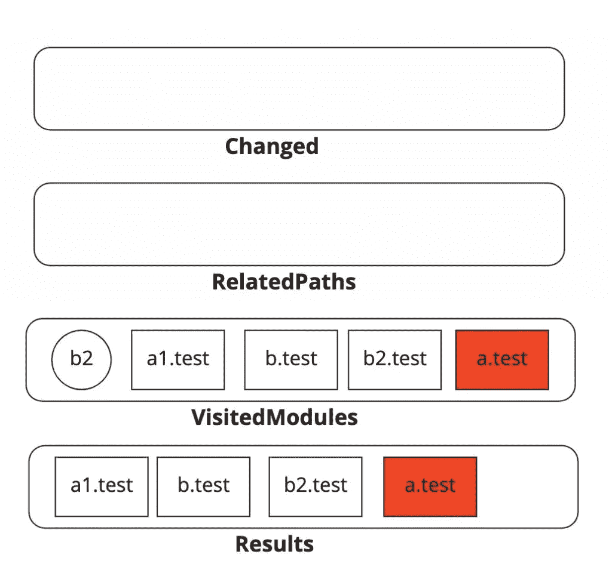

# 引擎盖下:Jest 如何找到相关测试

> 原文：<https://javascript.plainenglish.io/under-the-hood-how-jest-finds-related-tests-the-same-tech-37dc964e1766?source=collection_archive---------18----------------------->


在我之前的一篇[文章](https://medium.com/@i.sharafeev89/algorithms-around-us-binary-search-the-same-tech-111ecfef8686)中，我已经谈到有时我们甚至没有注意到我们周围的算法。当使用一个工具或库时，我们把它当作一个给定的东西来使用，甚至不了解它在幕后是如何工作的。今天我将对 Jest 在运行`jest --findRelatedTests`时用来寻找相关测试的算法进行逆向工程。

# 什么是 Jest，我如何使用它？

Jest 是一个流行的 JavaScript 测试框架，现在几乎每个项目都在使用。您可以简单地通过创建任何扩展名为`test.js`的测试文件并在您的终端中运行`jest`命令来开始。Jest 还提供了广泛的配置选项，开发者可以使用这些选项来定义包含/排除什么测试，以什么格式生成什么覆盖输出，如何传输源文件等。-你可以在[官方文件](https://jestjs.io/docs/configuration)中找到所有这些。最激动人心的选择是用`--findRelatedTests`运行`jest`，并传递您想要测试的文件列表:

```
jest --findRelatedTests /path/to/file1, /path/to/file2
```

这样 Jest 不仅可以运行与这些文件相关的直接测试，还可以运行传递依赖的测试。在优化 git 预提交命令执行时，它变得非常方便。Jest 将只运行一组实际上受相应变更影响的测试，而不是每次提交新变更时都运行一整套测试，从而节省开发人员的大量时间，同时确保结果的准确性。

# Jest 文件系统

Jest 使用一个定制的 [haste 模块系统](https://github.com/facebook/jest/blob/90995dfddbd51d6885d646dece3d37a1e3ad7fef/packages/jest-haste-map/src/index.ts#L138-L215)来以一种优化的方式构建关于文件和它们之间依赖关系的元数据。这个组件绝对值得自己的“引擎盖下”的文章。现在，让我们简化一下，它提供 API 来获取项目中所有文件及其依赖项的集合，如下所示:

```
Array<{ 
// absolute file path 
file: string; 

// list of depedencies (modules imported in current file)
dependencies: Array<string>; 
}>
```

# 在引擎盖下寻找

我们知道什么:

*   在 Git 中添加/修改/删除和暂存的一组文件
*   和整个文件系统元数据

现在，我们需要找到一种算法来检测和运行受这种变化影响的测试文件。

而 Jest 提供了`[resolveInverse](https://github.com/facebook/jest/blob/e865fbd66e3dc4adf9d35a35ce91de1bee48bc93/packages/jest-resolve-dependencies/src/index.ts#L164-L172)` API 来解决这个问题:

```
resolveInverse(
paths: Set<string>, 
filter: (file: string) => boolean, 
options?: ResolveModuleConfig, ): Array<string> { 
   return this.resolveInverseModuleMap(paths, filter, options)
          .map( module => module.file, ); 
}
```

其中:

*   `paths`是一组已更改的文件路径
*   `filter`是一个谓词[函数](https://github.com/facebook/jest/blob/b546fd866819118b41055a9722181150d383ffe8/packages/jest-cli/src/SearchSource.js#L140-L144)来检测当前文件是否是一个测试文件
*   `options`对象(与算法无关，现在忽略)

`resolveInverseModuleMap`使用一种非常简单的方法来解决这个问题，这种方法基于[广度优先搜索](https://en.wikipedia.org/wiki/Breadth-first_search) (BFS)。首先，它初始化以下集合:

*   `changed` -受到影响的文件集。基本上，它是一个临时集合，在 BFS 的每次迭代后都会发生变异，并作为终止指示器——当它为空时，算法就会停止。在第一次迭代中，该集合从作为输入提供的`paths`开始填充。
*   `relatedPaths` -受影响的一组*测试*文件。默认情况下，该设置由`paths`输入填充，但条件是该文件实际上是一个测试文件。在 BFS 的每一次迭代中，每一个匹配的测试文件都会从这个文件中删除。在算法结束时，这个集合中剩余的文件路径与 BFS 执行的结果连接在一起。这是为了处理一个简单的用例，当变更发生在测试文件中，而不是在源代码中。
*   `visitedModules` -已经遍历过的文件，可以跳过进一步处理。

让我们来想象一下我们的算法。首先，让我们定义我们的示例文件系统:



红色的块代表改变的模块(矩形是测试文件，圆形是源文件)。箭头从父开始指向子(表示`a`模块由`a.test`和`a1`导入)。最初，我们的数据结构看起来像这样:



我们改变的集合不是空的。这意味着我们需要遍历文件系统中的所有文件，以获得`changed`集合中每个模块的依赖关系列表。在第一次迭代之后，我们已经发现至少`b.test`和`a1.test`需要分别作为`a.test`和`a1`的依赖来运行:



进行另一次遍历。现在我们看到`b2`被导入到了 a.test 和 b2.test 中，但是在我们最初更改的文件中已经有了一个 a.test。在这种情况下，我们需要将其从`relatedPaths`集合中移除，并将其添加到结果中。如果`a.test`没有任何依赖关系，Jest 在将结果返回给上游调用者时会简单地将其合并到结果中。



最后，我们的`changed`集合中只有 2 个测试模块，我们已经看到`a.test`在我们访问过的集合中，b2.test 没有任何依赖项。基本上，这里没有操作——在这个迭代之后`changed`集合将变空，我们将跳出我们的 BFS 循环。



因此，我们可以将测试范围从 5 个测试文件缩小到 4 个。这并不令人印象深刻，但请记住，为了简单起见，我为这个示例选择了一个非常小的数据集——在现实世界的项目中，会有成千上万个文件，改进可能会非常显著。

*你可以在这里* *找到原来的实现* [*。*](https://github.com/facebook/jest/blob/e865fbd66e3dc4adf9d35a35ce91de1bee48bc93/packages/jest-resolve-dependencies/src/index.ts#L99)

# 最后的想法

你觉得这个算法可以改进吗？如果我们可以将依赖模块的反向链接作为文件元数据的一部分(类似于引用父模块的 DOM 元素)会怎么样？在这种情况下，我们不必遍历整个文件系统，而只关注它的一个子集。

*原载于 2022 年 12 月 22 日 https://thesametech.com**的* [。](https://thesametech.com/under-the-hood-jest-related-tests/)

*你也可以在 Twitter 上* [*关注我*](https://twitter.com/mastershifu89) *和* [*在 LinkedIn 上连接*](https://www.linkedin.com/in/isharafeev/) *获取新帖通知！*

*更多内容请看*[***plain English . io***](https://plainenglish.io/)*。*

*报名参加我们的* [***免费每周简讯***](http://newsletter.plainenglish.io/) *。关注我们关于* [***推特***](https://twitter.com/inPlainEngHQ)[***LinkedIn***](https://www.linkedin.com/company/inplainenglish/)*[***YouTube***](https://www.youtube.com/channel/UCtipWUghju290NWcn8jhyAw)*[***不和***](https://discord.gg/GtDtUAvyhW) ***。*****

*****对缩放您的软件启动感兴趣*** *？检查* [***电路***](https://circuit.ooo?utm=publication-post-cta) *。***